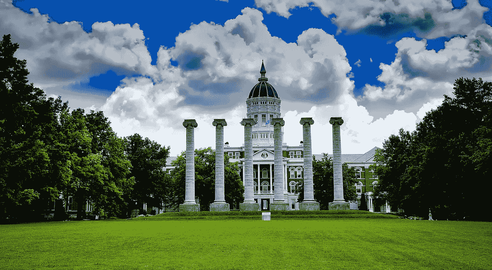

# 哥伦比亚大学支持智能合同 R&D

> 原文：<https://medium.com/hackernoon/columbia-university-to-support-smart-contract-r-d-c595ec815255>

尽管在过去的两年中，区块链有了令人难以置信的发展，但它仍然是一项相对新颖的技术，需要不断的发展和成熟，才能达到许多人期望它在数字时代发挥的突出作用。

开源公共区块链项目 QTUM 将向哥伦比亚大学的学者捐赠 40 万美元，这些学者正在以多种方式推进区块链的研究。哥伦比亚大学计算机科学助理教授·顾也获得了资助，他将负责监督区块链博士后和博士生的研究。

由于其最初的目的是促进加密货币交易，区块链已经取得了令人难以置信的文化进步，激发了数百个代币项目，并促进了数字货币的全球扩张。与此同时，[企业的采用正在加速](https://www.chainbits.com/news/ibm-launches-food-tracking-blockchain/)，因为包括 IBM 和微软在内的公司在该技术上进行了大量投资。

大学圈的区块链扩张

在许多方面，这种增长是由世界各地大学的工作推动的。例如，麻省理工学院的区块链实验室是世界上最古老和最多产的实验室之一，吸引了全球一批区块链开发者。包括康奈尔大学、杜克大学、乔治敦大学、普林斯顿大学和斯坦福大学在内的其他著名大学都建立了致力于区块链技术的学术项目。

此外，正如[比特币杂志](https://bitcoinmagazine.com/articles/beyond-classroom-rise-university-blockchain-labs/)所指出的，“大学领导的区块链研发项目正在增加，教授、区块链开发者和学生团队正努力将该行业从市场投机带入主流应用。”

新程序正在研究 DeepSEA，这是一种编程语言，旨在弥合主流编程倡议中高级形式推理和低级系统编程之间的差距。

也许最重要的是，这项研究旨在将 DeepSEA 的收益与以太坊突出的智能合同相结合，提高去中心化生态系统最基本组件之一的安全性和功能性。

正如 2016 年 DAO 崩溃所表明的那样，智能合同安全是去中心化组织蓬勃发展的必要条件。在 DAO 的案例中，智能合约代码中的缺陷使一个用户在以太网中窃取了 5000 万美元，从功能上结束了迄今为止最雄心勃勃和最着名的加密项目之一。

由于智能合同是用相对低级的代码编写的，而验证方法需要高级开发，因此 DeepSEA 旨在成为保护智能合同的创新下一步。QTUM 正在投资 DeepSEA，相信这将使这些合同变得安全，并使分散的经济充满信心地扩张。

# 广泛采用的巨大收益

当谈到主流区块链采用时，智能合同是该技术最受欢迎的组件之一。作为数字托管服务，智能合同支持数据、支付或其他过渡媒介的自动转移，它们对当今的数字生态系统有着明显的影响。

QTUM 对哥伦比亚大学研究工作的投资让人想起了区块链行业的一个大趋势。像 Ripple 这样的大项目正在大量投资区块链的研究和学术。由于这项技术是如此的新，而专家的数量相对稀缺，投资于这项研究计划既能促进区块链的成熟，又能解决区块链项目无法自行解决的问题。

通过瞄准区块链的可用性和智能合约的采用，QTUM 的投资可以为区块链的技术，特别是他们的平台带来巨大的收益。