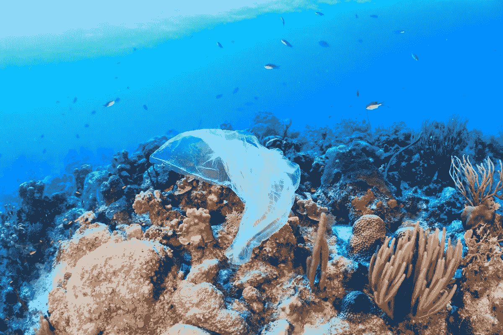

# 利用技术对抗塑料污染

> 原文：<https://medium.com/hackernoon/combating-plastic-pollution-using-technology-8bf367b5764f>

Source: [vox.com](https://www.vox.com/science-and-health/2018/7/3/17514172/how-much-plastic-is-in-the-ocean-2018)

所谓的渐进工业化对我们的星球可能弊大于利。今天，世界发现自己处于废物管理的危机之中，特别是塑料废物管理。

如果我们退后一步，通过数字来看更大的画面，画面比我们想象的要丑陋得多。

Source: [sailorsforthesea.org](https://www.sailorsforthesea.org)

## 他们说钻石是永恒的，但是嘿！塑料也是永恒的。

我们都知道废物管理的问题有多严重，特别是对于缺乏资源的发展中国家。这就是[技术](https://hackernoon.com/tagged/technology)发挥作用的地方。

> 根据最近的一项研究，海洋[中 90%的塑料垃圾来自 10 条河流](https://www.weforum.org/agenda/2018/06/90-of-plastic-polluting-our-oceans-comes-from-just-10-rivers/)，其中八条在亚洲，两条在非洲。

# 先说解决办法。

这个世界上有足够多的塑料，我们可以暂时停止开采石油，用可用的垃圾产生一些能量。是的，用塑料产生能量是可能的。

 [## 我们如何将塑料垃圾转化为绿色能源

### 在冒险经典《回到未来》中，埃米特“博士”布朗利用垃圾产生的能量为他的…

theconversation.com](https://theconversation.com/how-we-can-turn-plastic-waste-into-green-energy-104072) 

从根本上说，塑料是由碳和氢组成的，而碳和氢本质上就是化石燃料的组成成分。

> 根据上面的链接，塑料是最有价值的废料之一——尽管从人们丢弃它们的方式来看，你可能不知道。使用一种叫做**“冷等离子体热解”的过程，有可能将所有塑料直接转化为有用的能源和工业化学品。**

除了上面提到的解决方案，我们都可以为这项事业贡献一点一滴。以下是方法。

 [## 停止海洋塑料

### 塑料银行，点燃社会塑料革命。团结和招募人类参与地方行动，创造…

www.plasticbank.com](https://www.plasticbank.com/) 

再来看**塑料银行**的例子。印度尼西亚的一家区块链公司，其目标是减少塑料流入海洋。任何普通人都可以从他们周围收集塑料垃圾(例如，从他们自己的房子，或附近的一些工厂)，并将塑料存放在塑料银行。作为交换，他们可以得到金钱或能源或互联网或一些商品。

下面的视频把一切都解释的很漂亮！

大约有 100 多家创业公司努力实现同样的结果。今天，为崇高的事业做贡献一点也不困难。事实上，现在必须解决这个问题，否则人类在技术领域取得的所有进步都将是徒劳的，因为根本就没有星球可以居住。有些人可能会认为火星已经为我们做好了准备，但要消除这些疑虑；我们还得再等几个世纪才能再次摧毁火星。

昨晚我看了一部由 NatGeo 制作的美丽纪录片。它描述了我们离火星家园有多远或多近。链接如下: