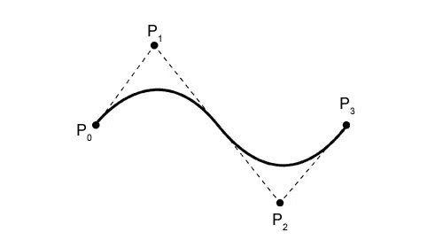

# 结合贝塞尔曲线和 jQuery 坐标。

> 原文：<https://medium.com/hackernoon/combining-bezier-curves-and-jquery-coordinates-264e63669e2e>



我最近在做一个新的投资组合网站。我脑子里有这个想法，我希望它看起来像什么，为了让它工作，我必须尝试一些我不熟悉的东西。这是网站，如果你想尝试类似的东西，我会解释我是如何让它工作的想法:[https://ethansportfolio.herokuapp.com/](https://ethansportfolio.herokuapp.com/)

如你所见，链接到我的每个网站的按钮在屏幕上浮动。当浮动时，它们在背景中创建一个几何形状，随着浮动按钮的移动而移动和调整。这或多或少是我开始时的想法。

我的思考过程是这样的:

1.  我需要创建 HTML 元素。
2.  我需要动画的 HTML 元素。
3.  我需要创建一个 svg 多边形元素，它的点基于动画元素。

# HTML

```
<div class="linkContainer">
    <a href="/portfolioB">
      <div id="site1" value="Donald Trump Site" class="site1 active">
      </div>
    </a>
    <a href="/portfolioF">
      <div id="site2" value="Simple Piano" class="site2">
      </div>
    </a>
    <a href="/portfolioE">
      <div id="site3" value="Weather App" class="site3">
      </div>
    </a>
    <a href="/portfolioA">
      <div id="site4" value="Search & Play Music" class="site4">
      </div>
    </a>
    <a href="/portfolioD">
      <div id="site5" value="Presentation Maker" class="site5">
      </div>
    </a>
    <a href="/portfolioG">
      <div id="site6" value="DrayNori" class="site6">
      </div>
    </a>
    <a href="/portfolioC">
      <div id="site7" value="Form Tests" class="site7">
      </div>
    </a>
  </div>
```

很简单。现在，我将创建一个空的 Div，它将在背景中保存我的多边形。

```
<div class="polygonContainer">
    <div id="polygon"></div>
  </div>
```

太好了。目前看起来不错。接下来，我需要制作每个链接的动画。为了实现这一目标，我经历了几种可能性。最初，我开始计算屏幕/窗口的大小，然后根据当前的窗口尺寸在 JavaScript 中移动元素。那条路走得并不顺利。最后我看到了一篇关于使用贝塞尔曲线的文章。我以前在做过渡时使用过贝塞尔曲线，但从来没有在 CSS 的关键帧动画中使用过，但它看起来很有前途。在弹出代码后，很容易快速看到一些动画，但对我来说，因为这是我的第一次，所以需要相当多的技巧才能让动画看起来像我想象的那样。因为我希望每个元素的浮动都不同于其他元素，所以我为每个元素创建了不同的关键帧动画，并分别调整了每个元素。以下是我在 CSS 中用于关键帧动画的样板代码:

```
div#site1.site1 {
  z-index: 2;
  position: static;
  transition-timing-function: cubic-bezier(0.64, 0.57, 0.67, 1.53);
transition-duration: 1s;
height: 10%;
display: flex;
align-items: center;
-webkit-animation: xAxis1 80.5s infinite cubic-bezier(40.9, 0.9, 20.1, 50.0);
animation: yAxis1 70.5s infinite cubic-bezier(0.7, 0.27, 0.57, 0.1);
-webkit-animation: yAxis1 50.5s infinite cubic-bezier(40.7, 0.27, 20.57, 50.64);
animation: xAxis1 80.5s infinite cubic-bezier(.002, 0.004, 0.1, 0.1);
}div#site1.site1::after {
  transition-timing-function: cubic-bezier(0.64, 0.57, 0.67, 1.53);
transition-duration: 1s;
font-family: 'Sedgwick Ave Display', cursive;
  background-size: cover;
  object-fit: cover;
  object-position: top;
  cursor: pointer;
  border: solid black;
  border-left-width: 2.2px;
  border-top-width: 1.8px;
  border-right-width: 1.5px;
  border-bottom-width: 1.2px;
  z-index: 2;
  font-size: 20px;
  font-weight: bold;
  padding: 10px;
  width: 250px;
  color: white;
  text-shadow: rgb(11, 16, 18) 2px 0px 0px, rgb(11, 16, 18) 1.75517px 0.958851px 0px, rgb(11, 16, 18) 1.0806px 1.68294px 0px, rgb(11, 16, 18) 0.141474px 1.99499px 0px, rgb(11, 16, 18) -0.832294px 1.81859px 0px, rgb(11, 16, 18) -1.60229px 1.19694px 0px, rgb(11, 16, 18) -1.97998px 0.28224px 0px, rgb(11, 16, 18) -1.87291px -0.701566px 0px, rgb(11, 16, 18) -1.30729px -1.5136px 0px, rgb(11, 16, 18) -0.421592px -1.95506px 0px, rgb(11, 16, 18) 0.567324px -1.91785px 0px, rgb(11, 16, 18) 1.41734px -1.41108px 0px, rgb(11, 16, 18) 1.92034px -0.558831px 0px;
  background-color: white;
  display: flex;
  justify-content: center;
  align-items: center;
  content: attr(value);
  display: block;
  -webkit-animation: xAxis1 80.5s infinite cubic-bezier(40.9, 0.9, 20.1, 50.0);
  animation: xAxis1 80.5s infinite cubic-bezier(.002, 0.004, 0.1, 0.1);
  animation: yAxis1 70.5s infinite cubic-bezier(0.7, 0.27, 0.57, 0.1);
  -webkit-animation: yAxis1 50.5s infinite cubic-bezier(40.7, 0.27, 20.57, 50.64);
}div#site1.site1:hover::after {
  background-image:url('trump.png');
  z-index: 2;
  transition-timing-function: cubic-bezier(0.64, 0.57, 0.67, 1.53);
transition-duration: 1s;
  transform: scale(1.2);
  filter: contrast(150%) brightness(140%);
}div#site1.site1:hover{
  flex-basis:0;
  flex-grow: 2;
}@-webkit-keyframes yAxis1 {
  50% {
    z-index: 2;
    -webkit-animation-timing-function: cubic-bezier(200.02, 200.01, 200.21, 400);
    animation-timing-function: cubic-bezier(200.02, 200.01, 200.21, 400);
    -webkit-transform: translateY(80vh);
    transform: translateY(80vh);
  }
}
@-webkit-keyframes xAxis1 {
  50% {
    z-index: 2;
    -webkit-animation-timing-function: cubic-bezier(200.3, 100.27, 400.07, 0.01);
    animation-timing-function: cubic-bezier(200.3, 100.27, 400.07, 0.01);
    -webkit-transform: translateX(80vw);
    transform: translateX(80vw);
  }
}
```

现在，如果你在屏幕上有两个或三个元素，你想以某种随机的方式制作动画，就像我做的那样，编辑这个样板代码很容易做到。x 轴和 y 轴都有“变换:平移”选项。我已经将我的每个元素设置为 vh 或 vw 设置。这基本上意味着它们将在回到另一个方向之前在视口中动画到那个点，有点像那些用球在屏幕上反弹的老式屏幕保护程序。每个动画也有时间，以秒为单位。因此，由于这个元素被设置为大约 50 秒和 80vw，这意味着它将在 50 秒内动画显示大约 80%的视口。如果你创建第二个元素，你可以将它调整到 90vw 和 20s，虽然它非常相似，但当相互比较时，动画看起来会非常不同，因为它们以不同的速度移动，并采取稍微不同的路径。请记住，这是我第一次这样做，所以我还在熟悉这一切。以此为起点，您可以添加几个元素，并简单地调整平移和动画计时，以获得动画的几个路径。

# 协调

自然地，现在我已经在屏幕上显示了我的元素，我的下一个目标是跟踪它们的坐标。我想用这些坐标作为 svg 多边形元素的点。在 jquery 中偶然发现这个绝对的黄金功能之前，我在 JavaScript 中找到了几种方法。

```
getBoundingClientRect();
```

使用它不仅可以得到屏幕上任何元素的 x 和 y 坐标，还可以得到顶部和左侧，以及任何元素的高度和宽度。超级好用！所以我想做的是追踪我的七个元素。可能有更好的方法，但是我想，因为它们一直在运动，我想每隔几毫秒检查一次新的坐标。我发现，如果我将 setinterval 函数设置为 50 毫秒，那就有点太不稳定了……任何高于 50 毫秒的值也是如此。任何低于 5 的都太强烈了。大约 20 毫秒对我来说似乎是一个神奇的数字。所以我首先创建了一个 setinterval 函数，并在其中使用了 getBoundingClientRect()；函数，这将每隔 20 毫秒给我每个元素的坐标。这是它的样子:

```
setInterval(function(){let element1 = site1.getBoundingClientRect();let element2 = site2.getBoundingClientRect();let element3 = site3.getBoundingClientRect();let element4 = site4.getBoundingClientRect();let element5 = site5.getBoundingClientRect();let element6 = site6.getBoundingClientRect();let element7 = site7.getBoundingClientRect();
```

现在，我可以控制台日志每个元素，以确保我得到了坐标。接下来的部分会看起来有点疯狂，但请听我说。所以我动态地创建了一个 svg 元素，每个多边形都在其中，我使用反勾号获取元素坐标，并将它们用作每个多边形的点。通常情况下，应该是这样的:

```
points=”${ element1.x,element1.y element2.x,element2.y......
```

诸如此类。但是因为我想在多边形中有一点随机性，所以我改变了它，使得每个坐标对的坐标并不完全匹配。我可能会使用 element1.x 和 element7.y 作为坐标对，而不是 element1.x 和 element1.y。

```
let polygon1 = `
      <svg class="polygonContainer" >
<polygon style="stroke:black;stroke-width:${stroke1}" points="${element1.x},${element7.y} ${element2.x},${element6.y} ${element3.x},${element5.y} ${element1.x},${element4.y} ${element2.x},${element5.y} ${element3.x},${element6.y} ${element4.x},${element7.y}" class="white"  id="c"/><polygon style="stroke:lightgray;stroke-width:${stroke2}" points="${element1.x+5},${element3.y+15} ${element6.x+5},${element3.y+15} ${element7.x+5},${element3.y+15} ${element1.x+5},${element4.y+15} ${element6.x+5},${element5.y+15} ${element5.x+5},${element2.y+15} ${element1.x+5},${element4.y+15}" class="white4"  id="f"/><polygon style="stroke:gray;stroke-width:${stroke3}" points="${element7.x},${element7.y+10} ${element1.x},${element1.y+10} ${element4.x},${element4.y+10} ${element5.x},${element5.y+10} ${element6.x},${element6.y+10} ${element3.x},${element3.y+10} ${element1.x},${element1.y+10}" class="white2"  id="d"/><polygon style="stroke:darkgray;stroke-width:${stroke4}" points="${element3.x},${element1.y+20} ${element3.x},${element4.y+20} ${element7.x},${element2.y+20} ${element3.x},${element6.y+20} ${element4.x},${element5.y+20} ${element4.x},${element1.y+20} ${element2.x},${element5.y+20}" class="white3"  id="e"/>
                  </svg>
      `
```

你可以从这里看到，我还使用了 y+15，y+10 和 y+20 以及 x+5 作为一些坐标对。这是因为我不想让每个多边形精确地排成一行。让每个坐标偏离 10、15 或 20，给它更多一点随机性，这就是我想要的。您还会注意到，我添加了另一个模板表达式来以内联样式定义笔画。如果你回到这个网站，你会注意到每个多边形的笔画不断变化的厚度。这是因为我把笔画定义为每个元素 x 坐标的百分比。下面是我如何定义它以在我的多边形内联样式中使用:

```
let stroke1 = element2.x / 75;let stroke2 = element4.x / 75;let stroke3 = element7.x / 75;let stroke4 = element3.x / 75;
```

出于我的目的，元素坐标除以 75 给出了我想要的厚度。厚度永远不会变得太厚，也永远不会完全消失。但必要时可以调整。我还为每个 stroke 变量使用了不同的元素，因此每个多边形的 stroke 变化会稍有不同。

然后，我包装我的 setinterval 函数，并写入我的多边形 div 的 innerHTML。这样做的目的是每 20 毫秒刷新和更新一次 DOM，使用基于新坐标的新多边形。这似乎有些过分。但不管怎样。真的只是一个闪屏，所以我不太担心。下面是整段代码的样子:

```
setInterval(function(){let element1 = site1.getBoundingClientRect();let element2 = site2.getBoundingClientRect();let element3 = site3.getBoundingClientRect();let element4 = site4.getBoundingClientRect();let element5 = site5.getBoundingClientRect();let element6 = site6.getBoundingClientRect();let element7 = site7.getBoundingClientRect();let stroke1 = element2.x / 75;let stroke2 = element4.x / 75;let stroke3 = element7.x / 75;let stroke4 = element3.x / 75;let polygon1 = `
      <svg class="polygonContainer" >
<polygon style="stroke:black;stroke-width:${stroke1}" points="${element1.x},${element7.y} ${element2.x},${element6.y} ${element3.x},${element5.y} ${element1.x},${element4.y} ${element2.x},${element5.y} ${element3.x},${element6.y} ${element4.x},${element7.y}" class="white"  id="c"/><polygon style="stroke:lightgray;stroke-width:${stroke2}" points="${element1.x+5},${element3.y+15} ${element6.x+5},${element3.y+15} ${element7.x+5},${element3.y+15} ${element1.x+5},${element4.y+15} ${element6.x+5},${element5.y+15} ${element5.x+5},${element2.y+15} ${element1.x+5},${element4.y+15}" class="white4"  id="f"/><polygon style="stroke:gray;stroke-width:${stroke3}" points="${element7.x},${element7.y+10} ${element1.x},${element1.y+10} ${element4.x},${element4.y+10} ${element5.x},${element5.y+10} ${element6.x},${element6.y+10} ${element3.x},${element3.y+10} ${element1.x},${element1.y+10}" class="white2"  id="d"/><polygon style="stroke:darkgray;stroke-width:${stroke4}" points="${element3.x},${element1.y+20} ${element3.x},${element4.y+20} ${element7.x},${element2.y+20} ${element3.x},${element6.y+20} ${element4.x},${element5.y+20} ${element4.x},${element1.y+20} ${element2.x},${element5.y+20}" class="white3"  id="e"/>
                  </svg>
      `
      document.getElementById('polygon').innerHTML = polygon1;
    }, 20);
```

最后一步是返回 CSS，为每个多边形定义一些我不想在内联样式中做的样式。最初，我对每个多边形进行了轻微的填充，这是一个很酷的效果，但由于浏览器试图每 20 毫秒刷新一次，因此大大降低了浏览器的速度。

```
polygon#c.white {
  width: 100vw;
  height: 100vh;
  fill: transparent;
  overflow: visible;
  background-color: transparent;
}polygon#d.white2 {
  width: 100vw;
  height: 100vh;
  fill: transparent;
  overflow: visible;
  background-color: transparent;
}polygon#e.white3 {
  width: 100vw;
  height: 100vh;
  fill: transparent;
  overflow: visible;
  background-color: transparent;
}polygon#f.white4 {
  width: 100vw;
  height: 100vh;
  fill: transparent;
  overflow: visible;
  background-color: transparent;
}
```

每个链接都是可点击的，并转到每个项目的简介，以及每个项目的 github，等等。这只是我在 Node.js 中设置的后端数据库，用来加载 onclick 中的每个文件。但那部分远没那么有趣，我就不深究了。如果你有任何问题或建议，我很乐意倾听。谢谢！