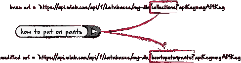

# 组合 MongoDB 集合

> 原文：<https://medium.com/hackernoon/combining-mongodb-collections-928f187333b5>


最近，我一直在使用几个月前创建的数据库。对于那个特定的项目，我为每组项目创建了一个单独的数据库集合。当时，我有一个书籍和文章的收藏，按主题分类，出于某种原因，我把所有的书籍和文章放在基于主题的单独收藏中。然后，我为每个主题创建了端点。这样，我可以切换出用户搜索的主题的 url 集合，如下所示:



在这种情况下，用户搜索“如何穿上裤子”。但是有了一个主题为“如何穿上裤子”的集合，我现在可以只获取这 4 个结果，而不是获取整个库。我用来完成这项工作的另一个组件是 word map 对象。我不会在这里深入讨论，但是如果你感兴趣，你可以在这里查看:[https://hacker noon . com/creating-more-accurate-search-results-for-small-sites-436 e 64 da 79 b 6](https://hackernoon.com/creating-more-accurate-search-results-for-small-sites-436e64da79b6)

虽然这很棒，但我最近想能够一次搜索所有的收藏，这对于这么多单独的收藏来说并不容易。基本上，我想把所有的收藏组合成一个单一的收藏。

我首先做了一个 fetch，它列出了数据库中的所有集合。我正在使用 mlab，如果您正在使用 mlab，方法如下:

```
To get the collections in the specified database:GET /databases/{database}/collections

Example:
https://api.mlab.com/api/1/databases/my-db/collections?apiKey=myAPIKey
```

因此，您在实现中的代码将如下所示:

```
fetch('https://api.mlab.com/api/1/databases/my-db/collections?apiKey=myAPIKey[').then(function(response)](https://api.mlab.com/api/1/databases/presentation-maker/collections?&l=41994&apiKey=T_4ma8aw6AyAhVzAcfzCpxEKDJqxffrn').then(function(response)) {
if (response.status != 200) {
window.alert("Oopsie daisy");
return ;
}
response.json().then(function(data) {
let api = data;
```

如果您在此时 console.log 您的 api，您将得到一个数组，其中包含您的每一个集合名称，作为字符串。完美。现在我要做一个 for 循环，遍历这些集合名称，做基本上和我在顶部做的一样的事情，在每个循环迭代中获取，并用当前 api 数组项替换获取集合名称。

```
let arr = [];
for (var i = 0; i < api.length; i++) {
  fetch('https://api.mlab.com/api/1/databases/my-db/collections/api[i]?apiKey=myAPIKey[').then(function(response)](https://api.mlab.com/api/1/databases/presentation-maker/collections/'+urlArr[i]+'?&l=41994&apiKey=T_4ma8aw6AyAhVzAcfzCpxEKDJqxffrn').then(function(response)) {
  if (response.status != 200) {
  window.alert("dag nabbit");
  return ;
  }
  response.json().then(function(data) {
  let test = data;
  for (var k = 0; k < test.length; k++) {
    arr.push(test[k])
  }
});
});
}
```

这里，我们在获取 url (my-db)中有我们的数据库名称，并且在每个循环中，我们的集合名称会发生变化(api[i])。我们从那里获取数据，并将数据保存为“test”。然后，我们有一个嵌套循环，在这里我们循环通过 test，并将每个数组项推入我们的数组 arr。

现在，如果我们 console . log“arr ”,我们应该在一个地方有一个集合的整合数组，而不是在多个集合中。

接下来，我们需要将所有数据重新格式化为一个新的 JSON 对象数组。

```
setTimeout(function(){
for (var i = 0; i < arr.length; i++) {
    let text = arr[i].article_text;
    let text2 = text.replace(/"/g, "");
    let text3 = text2.replace(/'/g, "");
  arr[i] = `
  <p>{"articleAuthor": "${arr[i].article_author}",
  "articleAuthorTitle": "${arr[i].article_author_title}",
  "articleName": "${arr[i].article_name}",
  "articleDate": "${arr[i].article_date}",
  "articleText": "${text3}"}</p>
  `;
  document.getElementById('verseText').innerHTML += arr[i];
}
}, 50000);
```

我在这里使用了一个 set timeout 函数，允许前面步骤中的所有获取操作完成。否则，我可能会在获取完成之前就开始构建 JSON 数据。我遍历数组“arr”中包含的数据，用花括号将 key:value 对放在一个段落中，然后在 DOM 中呈现每个对象。然后，我将输出复制并粘贴到一个 json 文件中。只要没有错误，我就可以走了。此时，我可以使用 mlabs 保存文件，然后使用命令行提示符将其导出到 mlabs 集合:

```
mongoexport -h ds#####.mlab.com:#### -d <database name> -c <collection name> -u <user> -p <password> -o filename.json
```

我们结束了。现在，我可以从一个单独的数据库中访问我的所有数据，但我没有用单独的集合改变原始结构，以防我以后还想使用那种格式。

现在，在你评论说这个方法有多蠢之前，别担心，我知道。但是，如果你像我一样，更喜欢前端，这是一个可行的方法。我不是说这是最好的，但这是一种方法，而且很有效。