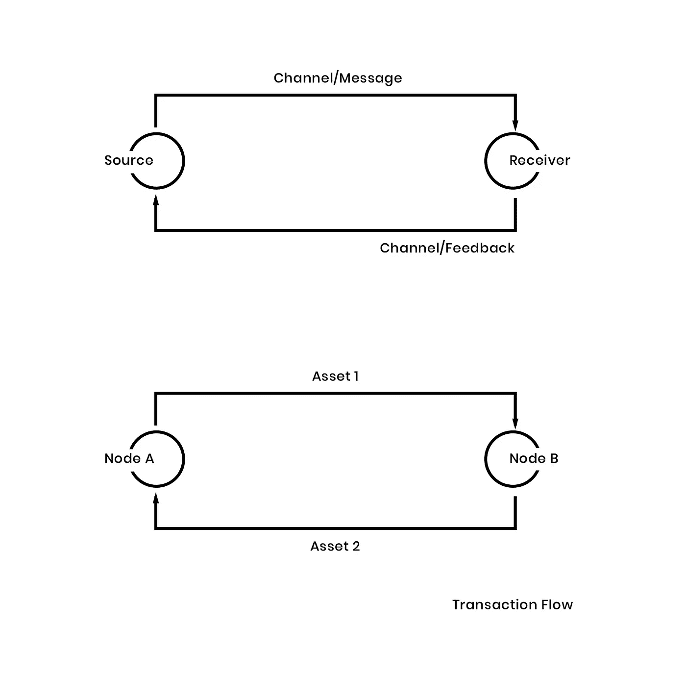

# 环路通信模型

> 原文：<https://medium.com/hackernoon/comm-model-blockchain-8a21c49b2d5d>

## 不浪费时间。没有误解

[*The Tower of Babel*](https://en.wikipedia.org/wiki/The_Tower_of_Babel_(Bruegel)) by [Pieter Bruegel the Elder](https://en.wikipedia.org/wiki/Pieter_Bruegel_the_Elder) (1563)

*更新:从现在开始，我愿意称之为* ***回路沟通模型*** *(LCM)作为反馈回路是整个理论的基本单位及其核心要素。*

我们使用多少工具并不重要。在职业环境中，总会有一些误解和噪音。这来自相互矛盾的陈述，并导致对协议的否定。

让我们把手弄脏。工作环境中有许多典型的故障。但是这些失败中的大多数都有与利益相关者的沟通作为问题的种子。

通过遵循不同的沟通模型，就可以很容易地看出这一层的含义、它是如何建立的以及需要做些什么来改进它。但是，一旦我们开始交谈，我们会采用任何沟通模式吗？是的，我们有。*本能地*。这就是为什么在任何环境下都很难实现适当水平的干净沟通。

任何沟通的基础都是使用相互理解的符号和符号规则(参见 [*沟通*](https://en.wikipedia.org/wiki/Communication) )。在专业环境中，作为一个专门的交互环境，不同部分之间的通信必须遵循相同的规则。

这是问题开始滋生的时候。

产品开发进步的主要现代支柱(例如)是透明度。它作为知行之间的桥梁被多次提及。听起来不错吧？老实说，几乎完美。但是透明度确实*极难掌握*。

我们以产品管理为例。产品开发环境中知识的定义直接指的是关于我们客户的知识(我们确实有几种类型的客户)。但是在产品和客户的互动上有一个共同点。从概念上讲，可能会有一个消息，也可能会有一个反馈。

很明显，单方面的沟通无助于改进任何产品。因此，需要建立反馈回路，让对方对给定的信息做出反应。当系统的输出作为形成电路或回路的因果链的一部分被路由回输入时，反馈就发生了。因此，创建反馈循环是加快工作流程的唯一途径。

让我们用经济学术语来说:你接受服务，你付钱。你收到一个产品，如果你想让它变得更好，你可以给出你的反馈。您将您的反馈提供给服务提供商，他们就有机会改进他们的服务，为您带来更好的体验。这是一个简单的通信事务模型。这个模型的基本前提是个人同时参与发送和接收信息。

如果我们将结构化消息定义为从源发送到接收者的模板，会怎么样？让我们称这些模板为源和接收者之间的*契约*。回到服务提供商:很容易定义服务提供商和客户之间的两种类型的合同。服务是第一份合同。反馈是第二个。他们可以有变化，但合同的结构是相同的。

但是，不同部分之间有合同肯定是不够的。应该有一个共同的无处不在的语言，由源说，由接收者理解，反之亦然。

这个概念已经在 Eric Evans 的“领域驱动设计”(2003)中被创造出来，其中包括努力使用给定业务领域的词汇，不仅在关于软件产品需求的讨论中，而且在关于设计的讨论中，一直到“产品源代码本身”。

> (……)技术词汇往往会从合理的界限中“泄漏”出来，并接管设计对话，以至于业务专家开始感到疏远，并从重要的对话中脱离出来。
> 
> [有意而明确地采用“无处不在的语言”策略减轻了这些困难，因此是敏捷项目的成功因素。”](https://www.agilealliance.org/glossary/ubiquitous-language/#q=~(filters~(postType~(~’page~’post~’aa_book~’aa_event_session~’aa_experience_report~’aa_glossary~’aa_research_paper~’aa_video)~tags~(~’ubiquitous*20language))~searchTerm~’~sort~false~sortDirection~’asc~page~1)

但是如果我们把这个概念提升到一个新的高度呢？

# **共同语言**

每个公司都是按部门、分部、单位等划分的。这些部门中的每一个都讲着一种内在的流动语言，这种语言有时会被错误地解释并来自其他部门的成员，带来误解和不理想的结果，发展的延迟或不良行为。

所有这些都是扭曲的交流的结果。在任何小公司或大公司中，解决这个问题的第一需要是创造一种人人都说的共同语言。没有共同语言，就没有交流的媒介，同样的错误就会重复出现。无限地。

大多数的失败都有一个共同的因素:缺乏沟通。许多沟通问题都是基于不清楚的陈述，冲突的想法，以及对应方之间的不一致。未清除记录。

这听起来可能不多，但记录是在纪念 T2。

# **什么？区块链？是的，B-L-O-C-K-C-H-A-I-N**

随着你们中的许多人最近开始接触区块链概念，也许你们一直在问自己“这个家伙在这篇文章中提到区块链是在想什么？”。嗯，区块链的概念使用的术语(和结构)与一些通信模型非常相似。尤其是交流的交易模式。

我们来接触一下区块链的概念。

> “区块链可以作为一个开放的、分布式的分类账，以可验证和永久的方式有效地记录双方之间的交易。为了用作分布式分类帐，区块链通常由共同遵守用于验证新块的协议的对等网络来管理。从对金融应用的强烈关注开始，区块链技术正在扩展到包括去中心化应用和协作组织在内的活动，从而消除了中间人。”

让我们稍微摆弄一下概念，将区块链背后的抽象结构应用于通信的交易模型，以便创建一种通用语言来促进和简化源和接收者之间的通信。

如前所述，任何公司的任何单位都倾向于说一种内心语言。意思就是，单位越多，内部语言越多，从而为同一个话题创造了大量的解读。顾客说一种语言。销售讲一种语言。开发人员和设计人员使用另一种语言。

现在，在区块链中，每项协议、每项流程、每项任务、每笔交易都有记录和签名，可以被识别、验证、存储和共享。当然，也记得。正如在 InVision 的文章[“区块链的用户体验”](https://www.invisionapp.com/blog/user-experience-blockchain/)中提到的，它可以这样定义:

*网络参与者(节点)*:与区块链交互的不同用户角色。节点可以是不同的实体。

*资产*:用户与之交互的对象。

*交易流程*:交易的输入、逻辑和输出。类似于由特定用户角色执行的单个任务流分析。

*网络*:参与者集合。

*频道*:允许参与者之间进行私人互动的子网络。

智能合约:这是用户同意在区块链中遵循的行为。

请注意，网络中的每个节点都可以看到并知道所有打开的事务。

# **现在我们来谈谈**

通过定义网络参与者、资产、交易流、网络、渠道和智能合约，我们定义了一个可靠、透明的交易通信模型，在该模型中，来源与接收方进行交易。它由事务流定义。交易的对象是资产。智能合约是系统的规则。

就是这样。

*我们正在建立一个共同监管的、透明的交易交流系统。*

可以在公司的不同部门之间定义多个智能合同。这可以由网络中涉及的所有利益相关者来定义。一旦定义了合同，接下来就是事务流。这就是智能合约的生命周期。它将关闭源和接收者之间的事务，加速节点之间的协作并改进通信过程。

因此，区块链的抽象模型可以帮助改善工作流程，并通过创建一种通用语言来影响任何公司的关系行为。*下一步是什么？*一旦这一点得到正确实施，公司就可以在大多数层面以及不同网络(单位)之间达到知识共享的水平。随着知识的共享，集体记忆的发展…

*感谢阅读！如果你喜欢这个故事，请点击**👏 ***按钮*** ***并分享*** *帮助别人找到它！欢迎发表评论*💬*下图。
有反馈吗？在推特上做朋友***。***