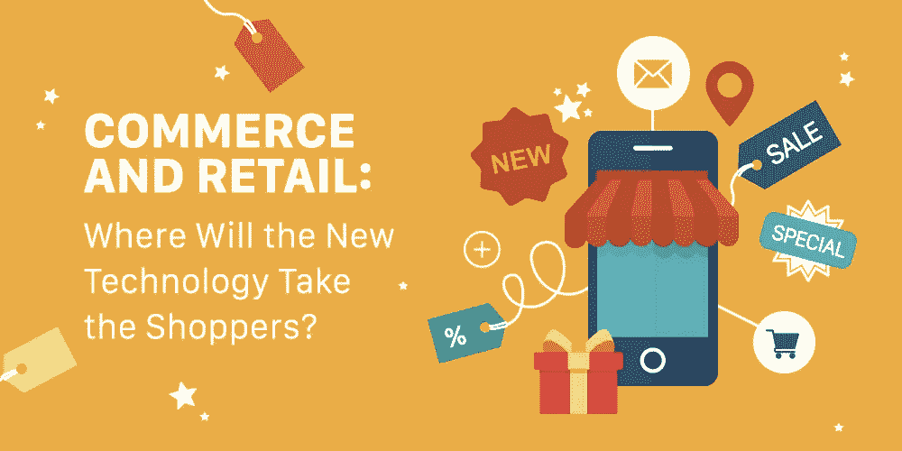
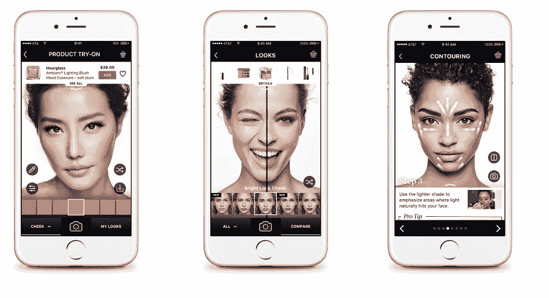

# 商业和零售:新技术将把消费者带向何方？

> 原文：<https://medium.com/hackernoon/commerce-and-retail-where-will-the-new-technology-take-the-shoppers-e032836f8ab6>

电子商务，或者说在线商务，是一件大事。2018 年，全球电子商务销售额[达到](https://www.statista.com/statistics/311336/sales-of-e-commerce-worldwide/)6530 亿美元，这个数字还将继续增长。

电子商务的流行是由这样一个事实证明的，即世界是数字化的，客户习惯于通过互联网进行即时和方便的服务。此外，物联网、AR & VR 和机器学习等技术的快速发展也提高了客户的期望。让用户惊叹变得越来越难，因此所有行业都在适应这种变化，零售业也不例外。

# 顾客过去和现在的需求问题

我们都知道过去是怎样的。电视广告、报纸和杂志广告、广告牌广告和广播广告。就吸引顾客的注意力而言，它们都是成功的。然后，用户不再需要与这些媒体源中的任何一个交互来学习新的东西的时候已经到来。这一切都归结于使用一个单一的设备，允许搜索信息，检查类似的产品，选择产品和订购。如今，顾客处于掌控之中，零售业不得不适应这种局面。

电子商务具有以下优势:

*   点餐的速度和方便性；
*   所有流程集中化:一个电商 app，让你既能联系店铺，又能浏览；
*   节省时间:一旦您输入您的信息，它将被存储在系统中，即付款信息或送货地址；
*   24/7 全天候存在:推送通知使企业能够不断与客户保持联系。

电子商务行业的发展导致今天 96%的美国购物者[在网上购物](https://www.bigcommerce.com/press/releases/bigcommerce-survey-shows-americans-consider-online-shopping-essential/)，80%的顾客[使用](https://www.outerboxdesign.com/web-design-articles/mobile-ecommerce-statistics)他们的移动设备查看产品评论、价格或类似产品。

但是，电子商务不仅仅是一个精心制作的移动应用程序或网站。成功的零售商充分利用最新技术，使他们在竞争中保持领先，并让顾客谈论他们的品牌和产品。

# 今日电子商务:行业中最大的技术趋势

为了赢得顾客的心，最大的国际品牌已经在为他们的顾客提供与产品和品牌性质相适应的独特体验。

## AR 的使用

AR 热潮可能始于 Pokemon Go，从那以后，这项技术在游戏行业广泛传播。然而，零售也利用它，有时，以一种非常聪明和意想不到的方式。

在电子商务中使用 AR 的最好例子之一是 [Ikea](https://www.ikea.com/gb/en/customer-service/ikea-apps/) 的一个应用程序。只需在手机屏幕上将虚拟物品拖过房间，它就能帮助你看到宜家产品在房间里的样子。

这是一个非常明智的策略，极大地提高了宜家的销售额和顾客参与度。家具通常很大，很难把一件东西带回家看看是否合适。宜家的应用程序提供了一个完美的机会，让你在现实生活中“尝试”一件家具，看看它是否适合你的室内环境——所有这些都可以不费吹灰之力、立刻完成。

AR 电子商务应用程序的另一个很好的例子是 Lacoste 的应用程序。该公司为客户提供了一个在增强现实中“试穿”不同鞋子的机会，而不必去实体店。这款应用对年轻观众极具吸引力，对公司来说是一个巨大的成功。

## 聊天机器人

聊天机器人已经成为全世界公司的无价助手，这是有原因的。它们立即为用户提供所需的信息，增加了个性化并大大节省了用户的时间。

一般来说，购物机器人有以下功能:

*   帮助选择产品
*   排序
*   订单确认
*   关于产品的常见问题

如果你还不熟悉机器人，建议你从一个真正简单的机器人开始，它将执行一两个功能。然后，一旦你明白了用户想要什么，你就可以扩展机器人的功能，使它更加复杂和先进。

## 机器学习

机器学习是一个伟大的工具，能够做许多令人敬畏的事情。其中之一是人脸识别，这是美容品牌的宝箱。

[丝芙兰](https://itunes.apple.com/us/app/sephora-beauty-makeup-hair/id393328150?mt=8) app 是一个利用机器学习来提高产品销量和品牌认知度的完美例子。该应用程序可以识别用户的面部，并在其上涂抹选定的化妆品。因此，用户可以“尝试”不同的丝芙兰产品，而不必去商店，并立即从同一个应用程序订购。

ML 也可以用来创建智能虚拟助手。例如，H&M 提供了一个“个人造型师”，它由机器学习驱动，为用户提供最佳服装建议。

这种方法有助于以客户为中心的战略，并为用户创造有趣和深刻的个人体验。

## 计算机视觉

这一个与 ML 有关，我们将描述一个来自[dash bounk 项目](https://dashbouquet.com/)的真实案例研究。

我们目前正在开发的是一组可以通过网络摄像头与用户互动的应用程序。摄像机检测人和身体上的某些部位。例如，它检测眼睛，这样它就会知道把眼镜戴在哪里。算法的第二部分是手势检测。如果有一个手部动作，比如挥手，屏幕上就有事情发生了。具体来说，该程序可以检测像“平面”姿势的伸展手臂。该系统还识别年龄和性别。

作为这种互动的结果，用户可以获得一个促销代码或一张照片与他们的网络分享。

我们的应用程序的技术堆栈包括:Javascript 和 React 代码，Python，OpenCV 和 Tensorflow 用于检测和识别，物理和与对象交互的算法是纯数学。

这种技术解决方案可以用于电子商务，为各种手势创建交互，并根据年龄和性别显示特定内容。

# 2019 年电子商务趋势

## 语音购物

亚马逊 Alexa 于 2014 年首次推出，成为成千上万人的热门虚拟助手，现在亚马逊计划将其用于全新的购物体验。

官方网站表示，购物者将能够通过语音与 Alexa 互动来下单、检查订单和购物车状态以及寻找产品。

语音购物被认为是电子商务行业的下一件大事。虽然还没有多少人使用它，但语音购物市场预计到 2020 年将达到 400 亿美元。

## 新的支付方式

随着手机的日益普及，移动支付将成为电子商务领域的主要支付方式之一，据[估计，到 2021 年，移动支付将达到 1480 亿美元。除了手机，更多的顾客也将使用 Apple Pay 和谷歌钱包，一些电子商务商店开始允许使用加密货币支付。](https://www.forrester.com/report/Forrester+Data+Mobile+Payments+Forecast+2016+To+2021+US+Q4+2016+Update/-/E-RES137043)

## 智能库存

零售商在产品库存上花费大量的时间、金钱和资源，在人工智能的帮助下，他们可以显著改善这一过程。

大数据的处理可以帮助零售商分析并预测客户可能的购买行为，并相应地调整备货流程。即，如果分析显示在某个时间段内对某个产品的经常性高需求，零售商可以相应地调整产品订购，并预先估计产品的数量。

## 社交媒体销售

社交媒体是一个吸引客户、接触新用户和扩大受众的好地方。然而，现代用户不希望在社交媒体会话期间被打断，因此，广告和购物必须尽可能自然。

去年， [Instagram](https://business.instagram.com/a/shopping-on-instagram) 推出了新的购物功能:在照片上标记产品的选项，以及将产品添加到故事中的选项。这些功能成为企业的一个突破，因为它们为严格的目标受众提供了无缝的本地购物体验。

因此，对于电子商务企业来说，如果运用得当，社交媒体平台将成为一种强大的营销和销售工具。

# 一条建议

使用尖端技术并不是一个人期望销售增长和顾客流入的全部。不要忘记基础知识:

*   直观导航
*   吸引人的设计和清晰的信息内容
*   透明且简单的结账流程

[Barriliance](https://www.barilliance.com/cart-abandonment-rate-statistics/) 表示，2017 年，弃车率几乎达到 79%，不良的结账流程是背后的主要原因之一。因此，投资开发高质量的移动应用程序或重新设计网站是有意义的。然后，一旦你有了一个完美的电子商务商店，你可以考虑增加相应的技术创新，使你的商店脱颖而出，并清楚地传达你的品牌信息。

[*作者娜塔莉亚·库库什金娜*](https://www.linkedin.com/in/natalia-kukushkina-b62397132/)