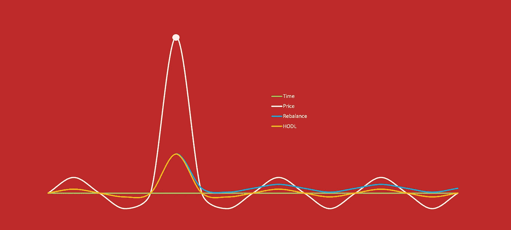
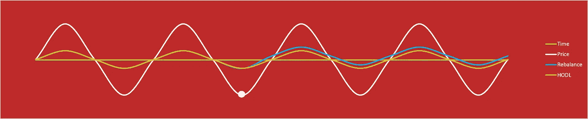
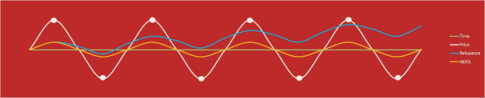
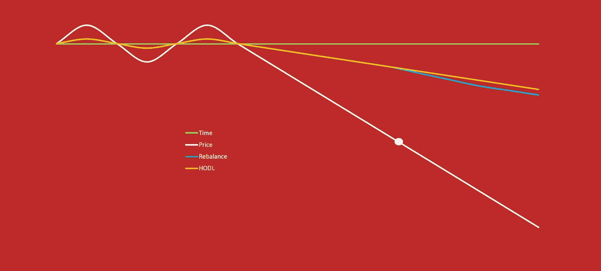
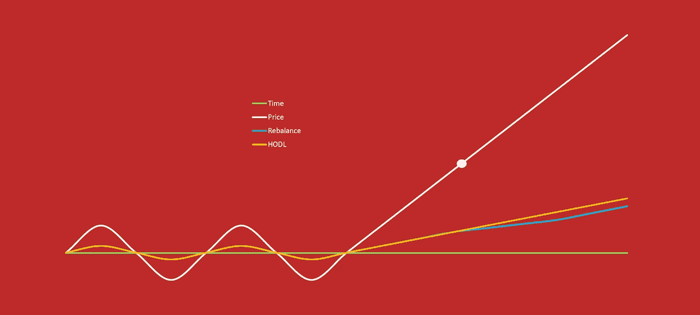
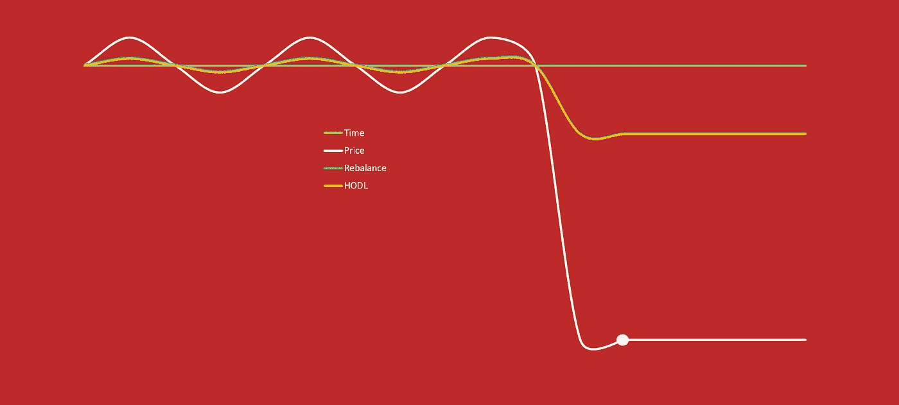
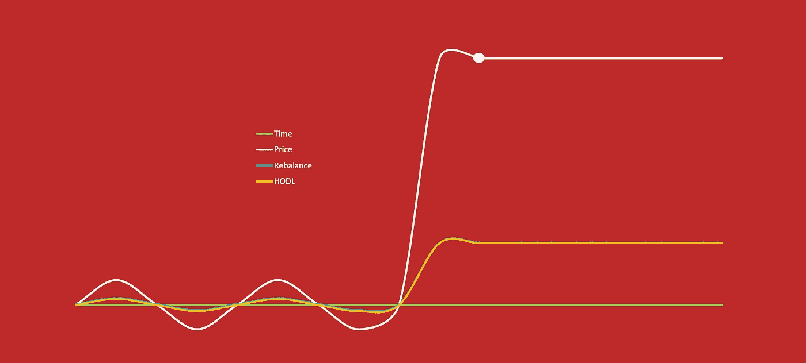

# 加密中常见的重新平衡方案

> 原文：<https://medium.com/hackernoon/common-rebalance-scenarios-in-crypto-3d10530ef661>

本文将讨论您在使用 [Shrimpy 应用程序](https://www.shrimpy.io)时会遇到的一些场景。为了构建一个合理的战略，我们必须首先从概念上理解在重新平衡时不同的市场环境如何影响我们的业绩。

您可以在此了解更多关于重新平衡的信息:

 [## 加密货币的投资组合再平衡

### 投资组合再平衡是投资者使用了几十年的策略。首先，投资者必须确定如何…

hackernoon.com](https://hackernoon.com/portfolio-rebalancing-for-cryptocurrency-7a129a968ff4) 

那天是 2017 年 6 月 21 日星期三。当以太坊开始崩溃时，你已经看了一上午的加密文件。恐慌冲击着你身体的每一根神经。你卖吗？你买吗？出于恐惧，你设置止损在 200 美元时触发。几分钟前，ETH 还在 352 美元，所以你害怕失去所有的资金。你做了正确的决定吗？继续阅读了解！

这篇文章将是一个概念性的讨论，如果你重新平衡你的投资组合，你可能会发现自己身处其中。对于每个场景，我将讨论重新平衡的优势和劣势。这些情况绝不是一个完整的指南，但它应该为思考和调查提供一个基础。

每个场景将以两种方式呈现。首先是如果不进行再平衡，投资组合将如何表现。第二个问题是，如果投资组合得到重新平衡，它将会有怎样的表现。在每种情况下，单一资产的价格都会相对于投资组合发生变化。因此，假设投资组合中所有其他资产的价值保持不变，而单个资产发生波动。这简化了我们的测试，并提供了一种更容易理解每个场景的方法。每个场景都标有一个或多个点，表示重新平衡事件。

# 哄抬股价

让我们从密码市场的标志开始讨论；泵和倾卸。这是指一项资产的价值急剧上升，随后是资产的急剧下降。结果是回到原来的价格。

This graph illustrates a pump and dump. The white line is the price of a single asset in a portfolio. The orange line is the value of the portfolio if the HODL strategy is used from beginning the end. The blue line is the value of the portfolio if a rebalance was performed at the white dot. **Result: rebalancing results in greater returns than HODL for this type of pump and dump.**

## HODL

HODL 对于这种情况的结果很简单。由于开始和结束价格都是相同的价值，HODL 将不会导致投资组合的价值发生变化。

## 为…修复平衡

泵和转储提供了一个重新平衡的机会，以获取投资组合的回报。在重新平衡时，我们剔除了波动性资产产生的一些价值，并将回报分散到其他资产中。由于不稳定资产的价格回到了原始价值，沿着泵或转储曲线的任何地方的再平衡的净结果是投资组合的正回报。

## 结论

泵和转储提供了一个重新平衡的机会，以增加你的总持有量。这些同样的机会对于简单地通过抽水和倾倒 HODL 的投资组合来说是不存在的。

# 快速崩溃和恢复

在 crypto 中，出现过几次著名的闪崩，随后是快速恢复。本文开头讨论的一个是 [ETH flash 崩溃到 10 美分](https://www.cnbc.com/2017/06/22/ethereum-price-crash-10-cents-gdax-exchange-after-multimillion-dollar-trade.html)的时候。这可能不是每周一次的事件，但是我们可以检查在这次快速崩溃和恢复期间，重新平衡会如何影响您的性能。

This graph illustrates a flash crash and recovery. The white line is the price of a single asset in a portfolio. The orange line is the value of the portfolio if the HODL strategy is used from beginning the end. The blue line is the value of the portfolio if a rebalance was performed at the white dot. **Result: rebalancing results in greater returns than HODL for this type of flash crash and recovery.**

## HODL

这种情况下的 HODL 结果与泵送和倾卸场景相同。由于开始和结束价格都是相同的价值，HODL 将不会导致投资组合的价值发生变化。

## 为…修复平衡

再平衡可以利用这些闪电崩盘带来投资组合价值的净正增长。在进行再平衡时，我们会趁价格便宜时买入更多不稳定资产。由于资产价格回归到原始价值，再平衡的净结果沿着泵或转储曲线的任何地方都是投资组合的正回报。

## 结论

通过再平衡捕捉闪电崩盘可以增加投资组合的价值。为了强调这在 ETH 闪电崩盘中的重要性，抓住这次闪电崩盘会给你的投资组合带来高达 1595 倍的回报。虽然这种情况可能永远不会再次发生，但随着恢复，较小的闪存崩溃也不是不可能发生，重新平衡可以利用这一点。这说明了在密码领域预测未来是不可能的。建立一个止损点，并像本文开头所描述的那样卖出 ETH，将会导致巨大的损失。然而，在危机期间继续进行再平衡可能会带来难以置信的收益。

# 侧向运动

我们的下一个情况是一个简单的横向运动，它会持续很长一段时间。在此期间，尽管投资组合的总价值保持相对平稳，但通常会出现小幅波动。虽然这种情况基本上是平静的，但我们需要评估它是否为再平衡提供了任何机会，或者它是否只会对 HODL 更好。

Figure 1: This graph illustrates prolonged sideways movement in the market. The white oscillating line is the price of a single asset in a portfolio. The orange line is the value of the portfolio if the HODL strategy is used from beginning the end. The blue line is the value of the portfolio if a rebalance was performed at the white dot. **Result: rebalancing results in greater returns than HODL for this type of sideways movement.**

Figure 2: This graph illustrates prolonged sideways movement in the market. The white oscillating line is the price of a single asset in a portfolio. The orange line is the value of the portfolio if the HODL strategy is used from beginning the end. The blue line is the value of the portfolio if a rebalance was performed at each white dot. **Result: rebalancing results in greater returns than HODL for this type of sideways movement.**

## HODL

当研究这个案例时，使用 HODL 策略的投资组合的结果是很容易想象的。投资组合价值应该没有净变化。这意味着从这些微观波动的开始到结束，我们不会观察到资产持有量的任何增加或减少。

## 为…修复平衡

> 图 1:

在图 1 中，我们看到由白线描绘的投资组合中的一项资产的价值朝着白点方向减少。此时，投资组合重新平衡，资产经历积累。然后，当资产价值回到基线时，我们最终看到的是投资组合价值的增加。无论再平衡发生在这些波动的低谷还是高峰，这种情况都会出现。当一项资产的价值恢复到以前的价值时，它会导致价值的净增加，以进行再平衡。

> 图 2:

在图 2 中，我们研究了当我们在长时间的横向运动中继续重新平衡时会发生什么。我们在这里看到的是，在这些微小波动中的再平衡实际上会导致复合效应。随着我们不断从高峰跳到低谷，投资组合的价值也在不断攀升。

## 结论

横向运动提供了一种重新平衡的可能性，以利用资产价值的小幅波动。长时间的横向波动实际上会导致投资组合价值的增加。此外，频繁的重新平衡实际上会产生复合效应，从而进一步提升性能。

# 缓慢死亡

慢性死亡是指单一资产的价值持续下降。一周又一周，它慢慢地继续贬值。

This graph illustrates a slow death. The white line is the price of a single asset in a portfolio. The orange line is the value of the portfolio if the HODL strategy is used from beginning the end. The blue line is the value of the portfolio if a rebalance was performed at the white dot. **Result: HODL beats rebalancing. The innovative investor should watch their portfolio to detect this type of slow decline.**

## HODL

持有一项缓慢死亡的资产会导致投资组合总价值的净减少。然而，这种缓慢的死亡并不影响任何其他持股的价值。所以当投资组合的总价值下降时，投资组合的子集，不包括缓慢死亡的资产，没有任何价值下降。

## 为…修复平衡

重新平衡到一种正在慢慢消亡的资产会降低投资组合的价值。除了单个资产的价值下降，投资组合中其他资产的价值也在下降。因此，这意味着这种单个资产以及投资组合的其他部分都在流失。

## 结论

当重新平衡时，这是一个不理想的情况。不断地重新平衡一项濒临死亡的资产，将会拖累整个投资组合。如果你使用定期再平衡策略，监控你的资产以确保你的投资组合不会出现这种情况是很重要的。拥有多样化的投资组合也将减轻这些风险，因为单一资产持有的投资组合总价值的比例较小。

# 缓慢起飞

现在让我们看看，如果我们的投资组合中有一项持续增值的资产，会发生什么。从长期来看，它将继续保持总体增长趋势。

This graph illustrates a slow climb. The white line is the price of a single asset in a portfolio. The orange line is the value of the portfolio if the HODL strategy is used from beginning the end. The blue line is the value of the portfolio if a rebalance was performed at the white dot. **Result: HODL beats rebalancing. However, rebalancing offers an opportunity to reduce risk by shaving off some of your returns into other assets.**

## HODL

持有价值缓慢增长的资产会导致投资组合的净增长。这种缓慢的倾斜对投资组合的其他部分没有影响，因此这项资产的价值增长与其自身的价值增长成正比。

## 为…修复平衡

重新平衡一项不断增长的资产，会导致利润减少，并把利润转移到投资组合的其他部分。由于这个实例讨论的是单个资产的行为，这将对这个单个资产的价值增长产生抑制作用。

## 结论

稳步提升资产价值对经济再平衡和 HODL 都有利。如果投资组合价值的其余部分停滞不前，HODL 会产生更大的回报。这样做的原因是利润不会从后继资产中提取。在另一种情况下，再平衡有一个优势，因为在加密市场上，总是获胜的稳定增长的资产比许多投资者认为的要难得多。这意味着更典型的情况是一项资产增值，但下一次是另一项资产大幅增长。在这种情况下，最好从一种资产中剔除一些利润，因为下一个时间段可能会看到不同资产的上涨。

# 急剧下降

急剧下跌是指投资组合中某项资产的价值迅速下跌，然后稳定在一个新的基线值。

This graph illustrates a sharp decline and then stabalization. The white line is the price of a single asset in a portfolio. The orange line is the value of the portfolio if the HODL strategy is used from beginning the end. The blue line is the value of the portfolio if a rebalance was performed at the white dot. **Result: rebalancing and HODL produce similar results for this type of sharp decline.**

## HODL

随着时间的推移，急剧下跌的资产的 HODL 只会导致投资组合价值与其自身价值成正比的减少。

## 为…修复平衡

这种情况的结果与 HODL 的结果相同。虽然单一资产崩溃导致投资组合净减少，但 dot 的再平衡不会带来任何额外的资金损失。在点之前沿递减线的任何地方重新平衡将导致额外的损失(见“缓慢死亡”)。

## 结论

在这种情况下，当查看完整的投资组合价值时，再平衡和 HODL 表现相同。在点重新平衡将积累更多的资产急剧下降，然而，稳定的价格之后意味着没有额外的投资组合价值的损失。

# 急剧跳跃

大幅上涨是指你投资组合中的一项资产迅速增值，直至达到新的基准价值。

This graph illustrates a pump and then stabalization. The white line is the price of a single asset in a portfolio. The orange line is the value of the portfolio if the HODL strategy is used from beginning the end. The blue line is the value of the portfolio if a rebalance was performed at the white dot. **Result: rebalancing and HODL produce similar results for this type of sharp jump.**

## HODL

随着时间的推移，急剧上涨的资产的 HODL 只会导致投资组合价值的增加与其自身价值的增加成正比。

## 为…修复平衡

这种情况的结果与 HODL 的结果相同。虽然单一资产注入导致了投资组合的净增长，但 dot 的再平衡不会带来任何额外的资金收益。与 HODL 相比，在点之前沿着增长线的任何地方进行再平衡都会导致表现不佳(见“缓慢起飞”)。

## 结论

在这种情况下，当查看完整的投资组合价值时，再平衡和 HODL 表现相同。在点上的再平衡将重新分配在急剧倾斜期间观察到的一些收益，然而，之后稳定的价格意味着没有观察到投资组合价值的额外收益。

# 包裹

这里总结了一些你可能在加密市场上观察到的常见情况。由于市场的不稳定性和不可预测性，预测未来是不可能的。然而，了解一些常见的情况并尽早发现它们可能有助于你决定是否应该重新平衡你的投资组合。

同样，我们知道这不是市场上可能遇到的所有情况的完整列表。这篇文章的目的是强调一些案例，这将鼓励我们的用户开始思考可能的情况以及它们如何影响他们的投资组合表现。

如果您有任何问题，以及您希望我们查看哪些其他场景或真实世界的示例，请告诉我们！

# 附加阅读

 [## 再平衡与 HODL:技术分析

### 这项研究的目的是描绘一幅公平的画面，说明再平衡作为一种策略如何符合霍德林。为了…

hackernoon.com](https://hackernoon.com/rebalance-vs-hodl-a-technical-analysis-6f341b0db9cd)  [## 多样化的加密用户表现更好[新研究]

### 这是你投资组合的一小步，回报的一大步。

hackernoon.com](https://hackernoon.com/crypto-users-who-diversify-perform-better-new-research-ebf775d348dd) 

别忘了查看一下 [Shrimpy 网站](https://www.shrimpy.io/)，在 [Twitter](https://twitter.com/ShrimpyApp) 和[脸书](https://www.facebook.com/ShrimpyApp)上关注我们的更新，并在[Telegram](https://t.me/ShrimpyGroup)&[Discord](https://discord.gg/gXyy95y)上向我们令人惊叹的活跃社区提问。

*捕虾队*