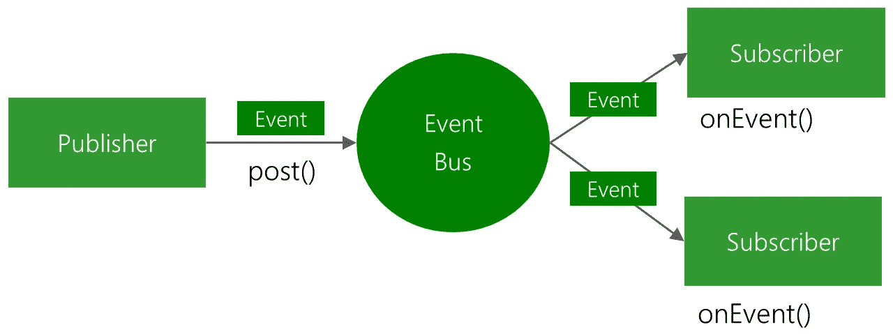
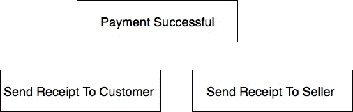
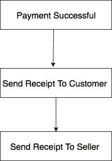
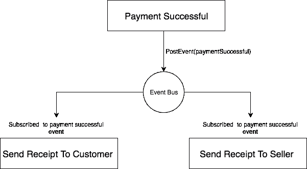

# 使用 Guava 事件总线在 Java 组件间通信

> 原文：<https://medium.com/hackernoon/communicating-between-components-in-java-using-guava-event-bus-2f8a1e4e18dd>



[https://raw.githubusercontent.com/greenrobot/EventBus/master/EventBus-Publish-Subscribe.png](https://raw.githubusercontent.com/greenrobot/EventBus/master/EventBus-Publish-Subscribe.png)

在构建企业应用程序时，一个常见的情况是在一个流程[成功](https://hackernoon.com/tagged/successful)后[实现](https://hackernoon.com/tagged/implementing)一系列业务流程，例如，如果您正在构建一个购物网站，您可能希望在产品付款成功后执行以下操作

1.  购买后减少商店中可用的商品数量。
2.  给店主寄一张购物收据。
3.  向买家发送购物收据。

在某些情况下，您可能希望这些过程是与产品购买相关的**原子**，即**在产品购买发生后，商品数量必须减少，如果减少可用商品数量**出现问题，则恢复产品购买。您通常会希望在 [**事务**](https://en.wikipedia.org/wiki/Transaction_processing) 中这样做，以使流程原子化。

在其他一些情况下，第二个过程可能不够重要，不足以在第一个阶段失败时恢复第一个阶段的执行，例如，您可能不希望向客户或卖方发送收据的过程影响付款过程。在这种情况下，您会希望尽可能地分离处理两个流程的组件，以便它们可以独立地执行它们的操作，这就是**事件总线**可以帮助我们的地方。

**什么是事件总线？**

> Eventbus 是一种机制，它允许不同的组件在不了解彼此的情况下相互通信。一个组件可以将一个事件发送到 Eventbus，而不知道谁将获得它或者有多少其他人将获得它。组件也可以监听 Eventbus 上的事件，而不知道是谁发送了事件。这样，组件就可以相互通信而不依赖对方。此外，替换一个组件非常容易。只要新组件理解正在发送和接收的事件，其他组件就永远不会知道。
> 
> [http://www.rribbit.org/eventbus.html](http://www.rribbit.org/eventbus.html)

在本教程中，我们将使用 [**谷歌番石榴事件总线**](https://github.com/google/guava/wiki/EventBusExplained) 实现来展示我们如何在 java 应用程序中分离组件

注意:这个库的文档是这样描述事件总线的

> `EventBus`允许组件之间发布-订阅式的通信，而不需要组件彼此显式注册(从而知道彼此)。它专门设计用来取代使用显式注册的传统 Java 进程内事件分发。它不是一个通用的发布-订阅系统，也不是用于进程间通信。

在我们的例子中，我们将通过模拟本文开头提到的支付过程来演示如何使用事件总线。

这是我们的应用程序中涉及的组件



*   第一个组件应该处理与成功支付直接相关的流程，比如减少商店中剩余的商品数量。
*   第二个组件处理向客户发送收据。
*   第三个组件处理发送、接收给卖方。

我们可以通过用不同的方法实现这些过程来将它们链接在一起，并按顺序调用它们



我们可以这样实现它

但是这种方法的问题是组件没有正确地解耦，并且当一个过程中出现错误时，它可能会影响另一个过程。此外，如果我们必须在成功支付后添加更多要执行的流程，我们将不得不手动转到 onPaymentRecievedMethod()并添加方法调用，这并不好，我们将使用事件总线 **Google Guava 事件总线**来解决这个问题。

这是我们实现的样子



支付组件和收据发送组件完全不知道对方，事件总线负责将信息从发布者传送到所有订阅者。

## 番石榴事件总线是如何工作的？

让我们有一些快速提示。

*   Guava 事件总线中的一些重要概念是

i. **事件总线**:这是一个对象，它被委托负责将事件数据从一个组件传送到另一个组件，您通常希望有一个事件总线的实例，以便生产者和订户可以使用相同的事件总线，这是事件总线正常工作所必需的。您可以使用 singleton 模式来确保只创建该类的一个实例，并在需要事件总线实例时使用 IOC 容器来提供该实例。

*注意:*如果您想要不同的事件总线来处理不同的组件集，您可以有多个事件实例，但是只需知道如果发布者和订阅者必须相互通信，它们必须使用相同的事件总线。

二。**生产者**:生产者负责发出事件，然后这些事件被传递给事件总线，并被发送给订阅该事件的所有侦听器。

三。**侦听器**:侦听器订阅一个事件，当事件从生产者处发布时它被触发，您可以根据您所使用的事件总线的类型同步或异步运行一个侦听器方法。为了让监听器方法同步运行，您可以使用同步事件总线，这是默认的**事件总线**类，为了让它异步运行，您必须使用**异步事件总线**类，它是**事件总线**的子类，它的构造函数需要一个 [**执行器**](https://docs.oracle.com/javase/7/docs/api/java/util/concurrent/Executor.html) ，用于在一个单独的线程上执行该方法。在我们的例子中，我们将使用异步事件总线。

四。**事件**:在 Guava event bus 中，事件只是一个使用类名唯一标识的对象。因此，要创建一个支付成功事件，我们只需要创建一个 PaymentSuccessfulEvent.java 类，并在支付成功时发布该类的一个实例。

## **如何使用事件总线库**

1.  **将谷歌番石榴库添加到您的项目中**

你可以使用你最喜欢的依赖管理工具来实现，让我们使用 maven:

```
<dependency><groupId>com.google.guava</groupId><artifactId>guava</artifactId><version>26.0-jre</version></dependency>
```

2.**创建工厂方法来提供我们的事件总线实例。**

我们将只使用一个静态类成员来保存事件总线的实例，并忘记在这个演示中添加 IOC 容器的复杂性。

EventBusFactory 类有一个 getEventBus()方法，该方法返回异步事件总线的单个实例。

3.**创建支付成功事件。**

就像我们前面说过的，事件只是一个简单的类，每个事件都由类名来标识。因此，让我们创建一个**成功支付**事件。

因此，当支付成功时，该事件将被发布。

4.**为支付成功事件创建监听器。**

在 Guava Event Bus 中，侦听器是一个用@Subscribe 注释修饰的方法，只要其参数中的事件被发布，它就会被触发。让我们创建一个支付成功事件监听器

5.**注册事件列表器。**

在应用程序启动时，我们必须将 Receipt sender 类注册为事件侦听器，告诉 guava event bus 它包含用@Subscribe 注释修饰的方法。这是通过将 RecieptSender 类的实例传递给 eventBus.register()方法来实现的。

```
EventBusFactory.*getEventBus*().register(new RecieptSender());
```

6.**发布事件。**

现在，只要付款成功，我们就会发布事件。

这将触发所有将支付事件作为参数并具有@Subscribe 注释的方法。

欢迎在评论中分享你的想法，我想听听你实施这种模式的经验。