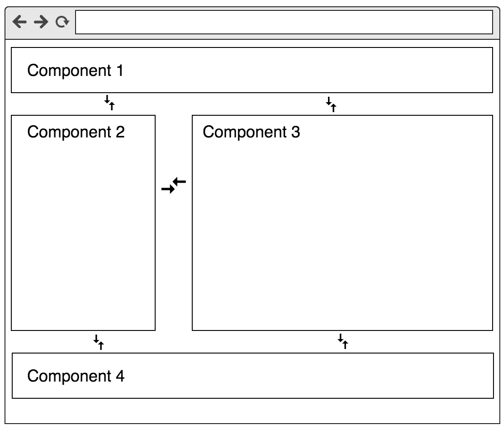
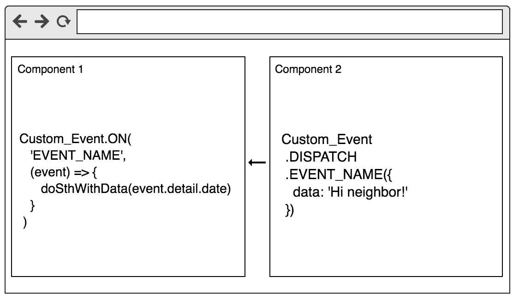
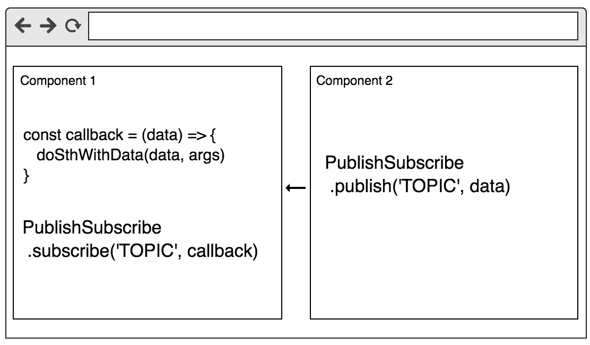

# 组件之间的通信(通用)

> 原文：<https://medium.com/hackernoon/communication-between-components-7898467ce15b>

Photo by [Colwyn](https://www.flickr.com/photos/colwynboy/) on [Flickr](https://www.flickr.com/)

交流很重要，尤其是邻里交流😎让我们收集组件之间的通信方法。

我记得有一次我跳到 Angular，在开发过程中，我必须找到组件之间通信的最佳方式。在 Angular 中我们可以调度事件($emit，$broadcast)，在 React 中使用 Redux 等。每个框架都有自己的方法，但是不管是框架还是 web 组件，我们都有通用的解决方案。所以，我们来收集它们吧。

我们将谈论邻里交流😎

## [风俗事件](https://github.com/shystruk/custom-event-js)

自定义事件是调度事件和监听的好方法。你应该监听来自目标`[Element](https://developer.mozilla.org/en-US/docs/Web/API/Element)`、`[Document](https://developer.mozilla.org/en-US/docs/Web/API/Document)`和`[Window](https://developer.mozilla.org/en-US/docs/Web/API/Window)`的事件，但是目标可以是任何支持事件的对象(比如`[XMLHttpRequest](https://developer.mozilla.org/en-US/docs/DOM/XMLHttpRequest)`)。它在 IE 中不起作用，但我们有一个多填充解决方案。

因此，自定义事件服务看起来应该是这样的:

沟通阶段:

## [发布/订阅](https://github.com/shystruk/publish-subscribe-js)

> 发布/订阅模式鼓励我们认真思考应用程序不同部分之间的关系。

发布/订阅模式保存主题名和对回调的引用。当您发布主题时，它会调用回调。

## 👯自定义事件和发布/订阅之间的区别

*回调不针对特定事件。每个有效负载都被分派给每个注册的回调。*

## [观看 DOM 树](https://github.com/shystruk/bind-dom)

另一种交流方式是观察 DOM 的变化。您可以观察节点元素的变化(属性、子列表、字符数据)，当 DOM 发生变化时，observer 将调用指定的回调函数。

👏**感谢您的阅读。欢迎提出建议、意见和想法**👍

**如果你喜欢这个，就鼓掌吧，关注我上** [**中**](/@shystruk) **，** [**推特**](https://twitter.com/shystrukk) **，**[**github**](https://github.com/shystruk)**分享给你的朋友**😎