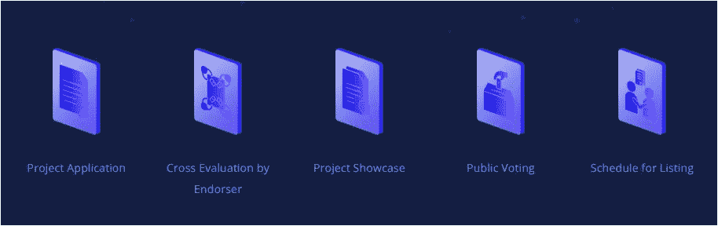
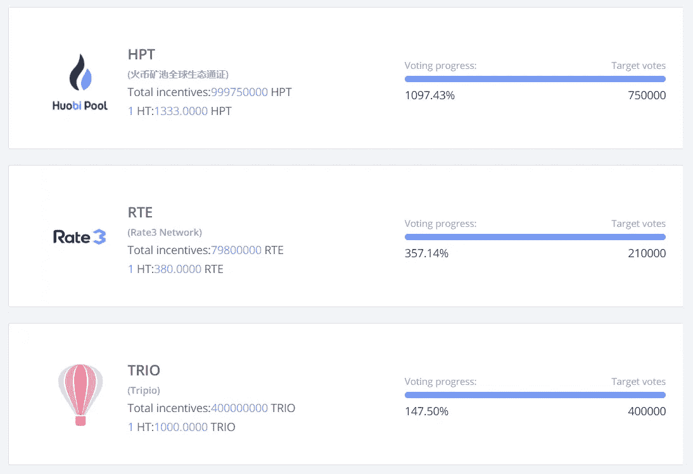

# 专注于社区的数字资产交易所 HADAX 推出新的和改进的 HADAX 2.0

> 原文：<https://medium.com/hackernoon/community-focused-digital-asset-exchange-hadax-launches-new-and-improved-hadax-2-0-5ba7f72b9ff>

***全披露*** *:本文无意作为投资建议。只是我个人对 HADAX 2.0 的看法。你应该总是做自己的研究#DYOR。火币环球激励我写这篇文章，鼓励我发表自己的观点。*

huo bi Autonomous Digital Asset Exchange([HADAX](https://www.hadax.com/))是数字资产金融服务提供商 Huobi Group 的子公司，致力于将其社区纳入其决策流程。HADAX 数字资产交易所由基于以太坊的 ERC20 令牌组成。交易所上市的大多数代币都是通过 Huobi 超级投票节点的推荐上市的，或者是通过获得 Huobi 代币持有人的最多投票而赢得了前一轮代币投票。火币令牌(HT)是火币的原生兑换令牌，可以在[火币全球](https://www.hbg.com/en-us/topic/invited/?invite_code=tfg23)、HADAX、Bibox 交易所交易。

HADAX 有一个非常容易使用的注册[表格](https://www.hbg.com/en-us/application-center/),适用于那些想让自己的 ERC20 令牌在交易所上市的项目。只需要几分钟就可以填写表格并提交给 HADAX 委员会进行审查。在火币自动上市平台上，项目可以查看进度并提交附加信息。想要在 HADAX 上上市的项目，至少要有一个推荐人(往往是加密货币行业的知名投资机构)推荐。在所有的项目信息被接收、审核并由背书者交叉评估后，项目将进入项目展示板块，在该板块中，Huobi 用户可以与项目的团队进行互动，并找到项目的相关信息。公众投票将在项目被列入项目展示区后开始。如果该项目获得最多或第二多的票数，该项目将被安排在 HADAX 2.0 上上市。

如果您想了解更多关于此流程的信息，您可以查看[此](https://www.hadax.com/topic/voting-describe/)页面。

于 8 月 27 日开始的第一阶段公众投票非常成功，得票最多的项目 Huobi Pool Token 获得了超过预计票数 10 倍的选票，亚军获得了 3 倍于预计票数的选票。这些结果表明社区参与度很高，并表明 HADAX 为改善之前的投票系统所采取的措施取得了成效。这种新方法也符合 Huobi 的目标，即创建一个完全去中心化的自治数字资产交易所。

由于火币池 token 项目是火币本身的子 Token，所以排名第三的项目也将被安排在 HADAX 2.0 上市。以下是上一轮投票中获得最多票数的 3 个知名项目的概述:

[**火币池令牌**](https://www.huobipool.com/)

火币池令牌(HPT)是火币令牌(HT)的子令牌。HPT 将分发给 Huobi Pool 客户，并将空投给 Huobi Token 持有者。活壁池是活壁群的一个分支。

火币池旨在为数字资产生产者提供一个安全、稳定、开放和透明的平台，为用户提供工作证明(PoW)挖掘、股权证明挖掘、委托股权证明技术输出服务和其他有趣的功能。Huobi Pool 还为 PoS 矿工提供内置采矿服务的兼容钱包，以获得稳定的采矿收入。

[**Rate3 网络**](https://www.hadax.com/projectcenter/project/?id=15)

Rate3 是区块链的一个项目，重点是通过实施资产的跨链令牌化来连接企业和区块链。此外，Rate3 提供了跨链身份协议，允许管理统一的跨链身份框架。Rate3 与 PayPal 和 IOST 建立了战略合作伙伴关系，并得到了各种知名风投公司的支持，如 FBG 资本和 Matrix Partners China。

[**Tripio**](https://www.hadax.com/projectcenter/project/?id=14)

Tripio 将自己定位为第一家区块链旅游市场。它旨在将全球客户与旅游业服务提供商联系起来。他们的目标是基于透明、防篡改的信任和可操作的奖励系统，创建并推出一个完全去中心化的生态系统。正如他们在关于 Medium 的[文章](/tripio/tripio-completed-20-million-fund-raising-bca1d6330366)中所述，Tripio 总共筹集了 2000 万美元的资金，它们得到了 BlockVC、F2Pool 和 Tron Foundation 的支持。

如果你拥有 Huobi 的原生交换令牌，Huobi Token (HT)，你就可以很容易地用它们来为你最喜欢的项目投票，从而在 HADAX 上上市。在这个过程中，如果项目上市，他们往往会给你空投，分阶段存入你的 Huobi 账户。除了根据您帐户中 HT 的数量和您可以获得的交易费折扣获得空投代币之外，使用 HT 投票还有一个很好的额外好处。

我真的很喜欢平台最近的更新。在我看来，HADAX 的主要好处之一是与社区的互动。用户参与关于项目列表的决策过程，并因分享其关于改进平台的想法而获得奖励。HADAX 项目中心是一个很好的新功能，它提供了在交易所上市或参与投票系统的项目的概述。

我很欣赏 HADAX 不断改进并成为一个更好的交易所，有更多的社区互动，因为我们大多数人都希望看到更分散的交易所，使他们的社区成为他们决策过程的主要参与者。

如果您尚未在 HADAX / Huobi Global 上注册帐户，您可以使用[此](https://www.hbg.com/en-us/topic/invited/?invite_code=tfg23)链接进行注册。请记住，在 HADAX 拥有一个帐户将自动让您进入 Huobi Global，反之亦然。你只需要注册一次就可以在两个交易所交易。

*订阅我的频道:* [*中*](/@cultcrypto) *，* [*推特*](https://twitter.com/CryptoShowdown) *和*[*ste emit*](https://steemit.com/@cryptoshowdown)*如果您喜欢我的文章并希望了解关于区块链、加密货币项目和新闻。也可以看我在*[*LinkedIn*](https://www.linkedin.com/in/donjohanson/)*上的文章。

如果你对本文有任何疑问，请在下方评论区评论。掌声也欢迎，谢谢！*

**秘密对决**