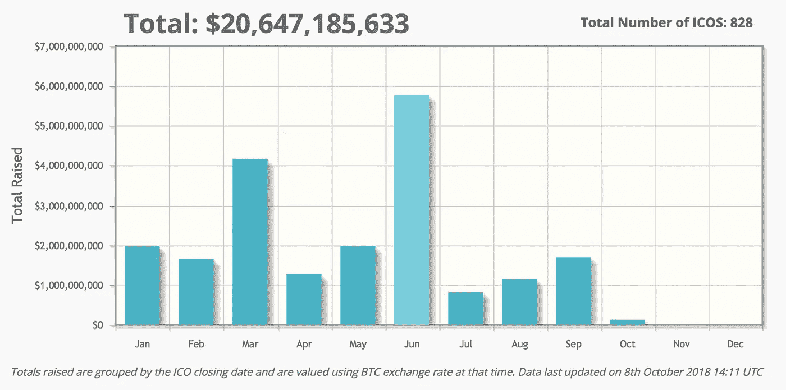
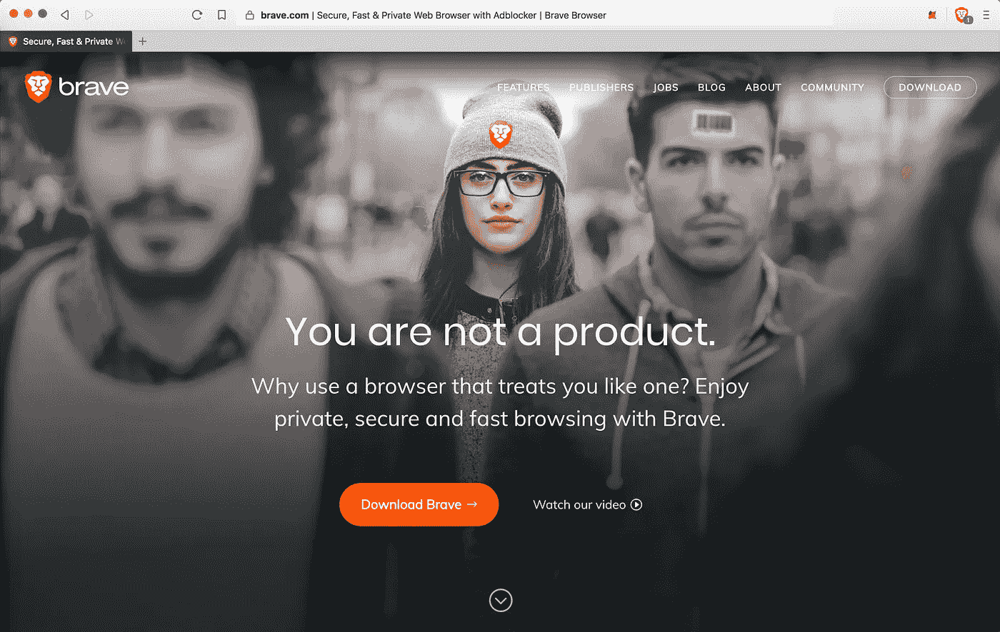
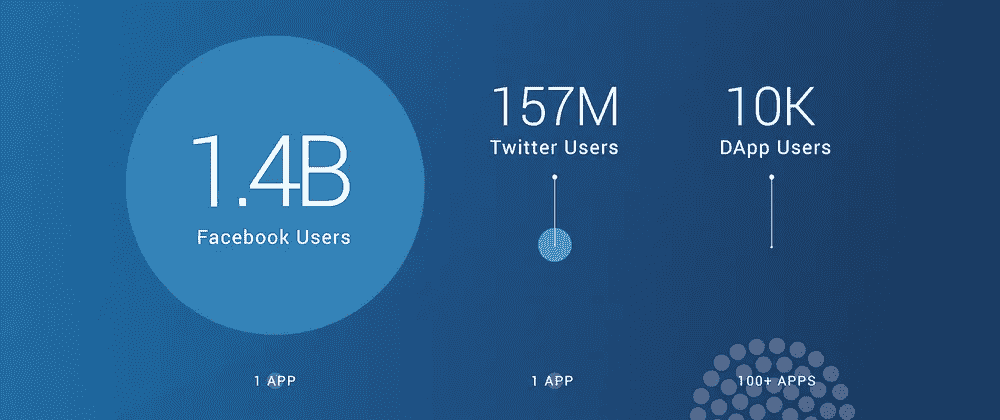

# 社区不是区块链的价值驱动力，好的技术才是

> 原文：<https://medium.com/hackernoon/community-is-not-blockchains-driver-of-value-but-the-tech-is-df0eb8dc3e0c>

成功的科技公司都有三个关键要素:铁杆用户、时尚的客户体验和高性能的技术。对于科技创业公司来说，这些事情的优先顺序是什么？有一句老话——如果你建造了它，他们就会来。如果这个比喻在今天的商业世界中成立，为什么加密空间表现得好像有所不同？

我最近[写了一篇博文，讲述了区块链行业如何需要将重心从*价值储存*心态转移到*价值来源*心态](https://hackernoon.com/the-next-stage-of-crypto-source-of-value-689dea43fb7d)。我列出了 crypto 的历史时间表，从“基础设施时代”开始，我们看到我们的“第一层”项目(如比特币基地)开始规模化。它继续讨论“应用时代”，在这个时代，以太坊的第一个大应用，最初的硬币发行(ICO)获得了主流的关注，随之而来的是消费者的兴趣。

[Coinschedule.com/stats](https://www.coinschedule.com/stats.html)

根据 [Coinschedule](https://www.coinschedule.com/stats.html?year=2018?utm_source=blockfi) 的数据，ICOs 在 2018 年筹集了超过 206 亿美元。但是据《CCN》报道，这些项目中有近 70%的价值低于其发行价。因此，据《福布斯》报道，加密投资者正在回避风险越来越大的硬币发行。这些惊人的数字应该会让任何关注区块链生态系统的人吃惊。

有许多 ICO 项目已经成功推出了他们的技术，尤其是在以太坊生态系统中。例如，Brave (BAT)推出了他们广受欢迎的网络浏览器[,强调隐私和无广告的网络体验。据报道，8 月份《勇敢者》的下载量突破了 1000 万次。](https://brave.com/)

Brave’s browser recently passed 10 million downloads. Is there a non-exchange project with more?

以太坊 dApps 是该领域另一个有前途的技术领域。然而，这个细分市场一直在努力利用他们在 ICO 热潮中收获的巨大社区。织机公司的詹姆斯非常清楚地解释了这一点:

> “如果你把 dapp.review 上所有 100 多个活跃 dapp 加在一起，在某一天与以太坊 DApp 互动的用户总数仍然不到 1 万人。”
> 
> “作为背景和对比，脸书有大约 14 亿 DAU，Twitter 有 1.57 亿。PUBG Mobile，只是几千个手游中的一个，就有 1000 万 DAU。”

这些项目的主要营销活动完全集中在不断增长的虚荣心指标上，以吸引投机性的 ICO 投资者。对于许多项目来说，如果你能获得 10，000 名 Telegram 成员的观众，并为推广项目创造激励，你就有可能从炒作中筹集数百万美元。对他们来说，社区是价值的驱动力，是增加市值的一种手段。2017 年第四季度的 ICO 市场是一场淘金热，但那些日子已经过去了。

dApp 社区一直在努力将他们的代币投资者转化为用户。正如我之前所讨论的，[密码产业的未来将集中在使用和设计的简单性上](https://blog.blockfi.com/the-future-of-crypto-is-in-simplicity/)。这个领域的大多数项目对于普通人来说仍然过于复杂。对于一般的科技公司来说，让一款应用的日活跃用户达到 100 万都是一件难事。对于一个处于起步阶段的行业，crypto 需要专注于改进现有的基础设施，以达到临界质量。

随着投机不再驱动加密市场，专注于不断增长的社区不可能是区块链创业公司的主要焦点。社区不推动价值。但是，看起来不错、有效、而且比现有技术更有效的技术。

这个领域中更成功的加密公司需要通过他们的技术创造价值来引领潮流，然后利用他们的社区将这种价值传播到我们的加密泡沫之外。在当前的市场条件下，通过发展社区来增加市值已经变得无关紧要了。然而，成功的加密公司处于独特的位置，可以通过构建易于使用、外观精美的产品，并将区块链无缝集成到用户的日常生活中，为行业的其他公司铺平道路。