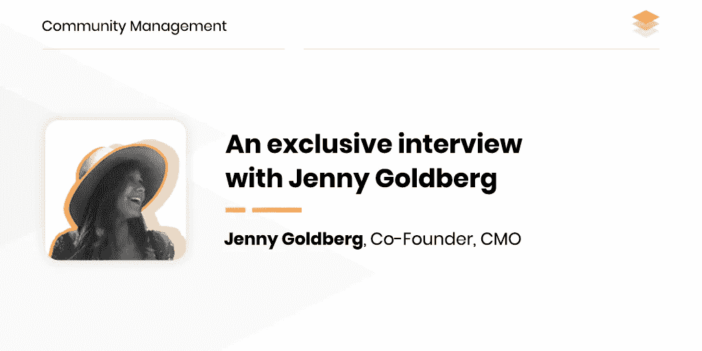

# 社区管理:珍妮·戈德堡专访

> 原文：<https://medium.com/hackernoon/community-management-an-exclusive-interview-with-jenny-goldberg-f04e52b94b82>

如果 ico 创建了一个大型且活跃的在线社区，他们会获得什么好处？

每个项目都有 3 个主要组成部分:团队、白皮书和社区。拥有一个强大的团队和白皮书是必然的，所以让我们来谈谈社区。一个大而活跃的社区是每个加密项目非常重要的一部分。这是投资者/基金在考虑过程中首先考虑的标准之一。社区越大，吸引更多注意力到你的加密项目的机会就越大。由于我们与主要交易所合作，我们比任何人都更了解他们的一个非官方要求是一个强大的开发团队和一个活跃的社区。让真正相信你的项目的人聚在一起并不容易，尤其是在一个每天都有大量 ico 被创建的领域。然而，如果你能建立一个强大的社区，无论你的项目处于什么状态，它都会一直支持你。这就是为什么尊重、关心和热爱你的社区是非常重要的。从那一刻起，你的项目和社区就是一个整体。

**根据你的经验，参与网络社区的最佳实践是什么？**

哦，我最喜欢的问题。最佳实践是对您的社区保持透明和诚实。这是建立一个可靠的支持基础的唯一方法，它将在项目存在的整个过程中袖手旁观你的项目。每个加密项目中总有好的和坏的日子，可能会有未满足的期限和失败。但是如果你对你周围的人诚实，他们会永远支持你。

我的经验告诉我，你甚至不应该试图对你的社区隐瞒什么。这样做会带来失去你辛辛苦苦建立起来的所有支持和热情的严重风险。如果你的社区看到你不是一个可靠的人，他们的情感会立即消失，他们的财务也会很快消失。很遗憾，我花了几个月才意识到这一点，但经验往往是苦涩的。

第二个建议是让人们成为你项目的一部分。区块链的主要思想是去中心化，如果你允许你的社区在你的项目上与你一起工作，他们将永远不会离开你。允许他们帮助你开发你的项目生态系统，允许他们参与决策过程的某些部分。核心团队是为了编写代码，但是社区是为了项目的其他部分的开发和寿命。

我必须提供的第三个建议是拥有高质量的支持。不要忘记，首先你的项目是基于技术的。这就是为什么在你的团队中有几个人能够全天候与用户交流是非常重要的。任何技术故障或坏消息都可能在一天中的任何时间出现(通常发生在晚上)。总应该有一个人能够处理好这件事，并为你的社区履行快速反应的职责，因为这群人包括你的投资者，更重要的是你的用户。

社区经理的工具箱里有哪些最有用的工具？

要有真正好的 ICO 社区管理，你需要能够使用很多渠道，比如 Telegram、Bitcointalk、Discord 和 Reddit。

对我来说，电报是我最喜欢的一个。可以选择直接与用户沟通(这种沟通方式对每个社区管理者来说都非常重要)，如果你喜欢私下讨论问题，你可以直接发送消息，从而避免任何不必要的信息共享。我们还围绕我们社区的主要渠道创建了许多特定语言的聊天。这非常有用，因为您可以在一个简单且易于访问的地方访问整个多语言社区。帮助你进行调节和通知的机器人也是一个令人愉快的奖励。如果你有一个赌博或游戏项目，你可以用不和谐来吸引成员到你的社区。它在美国被广泛使用，是 Slack 的一个很好的替代品。

第二个是 Bitcointalk。我为每个项目推荐的最不可或缺的出口是 Bitcointalk 上的一个专用线程。就好像你的项目不是从一个想法开始，而是从 Bitcointalk 上的讨论开始。这对你的声誉至关重要，许多交易所会在申请表中要求提供你的 Bitcointalk 主题链接。这是用来吸引新鲜血液的主要工具之一，更不用说投资者了，所以应该有积极的交流。

最近听说 Reddit 人气下降；我不认为这是真的。您所在 subreddit 的加密货币社区是世界上最强大的社区之一，尤其是对北美、欧洲和南美国家而言。这是一个传播思想和信息的好地方。很多新闻来源于 Reddit 帖子。拥有自己的分会场，给你的社区一个公开发言的机会，这是非常必要的。此外，Reddit 是许多美国用户的主要目的地。他们更有可能在 Reddit 上而不是 Telegram 上加入你。

**区块链项目社区管理的主要挑战是什么，你如何克服它们？**

我想最大和最持久的挑战是仇恨者。你的项目周围总会有很多讨厌的人，关键是要学会爱他们。这对我的一个项目的成功至关重要。记住仇恨者是你的项目中最感兴趣的用户。他们会研究任何和所有关于你的信息，并跟踪你的每一步，通知你(和你周围的所有社区)你的失败。所以，他们是帮助你保持“身材”的人。

社区经理的工作要求很高。你是如何应对压力的，你是如何避免精疲力尽的？

我不是世界上最好的压力管理者。我总是认真对待我的社区发生的事情，是的，有时我会感到压力，有时甚至沮丧，特别是当我们错过任何截止日期或出现一些技术问题时。我总是担心一些新闻来源会如何看待我的社区。但是当我处理这种压力时，我可以建议一些让我放松的普通事情，比如带着我的狗散步和瑜伽课。