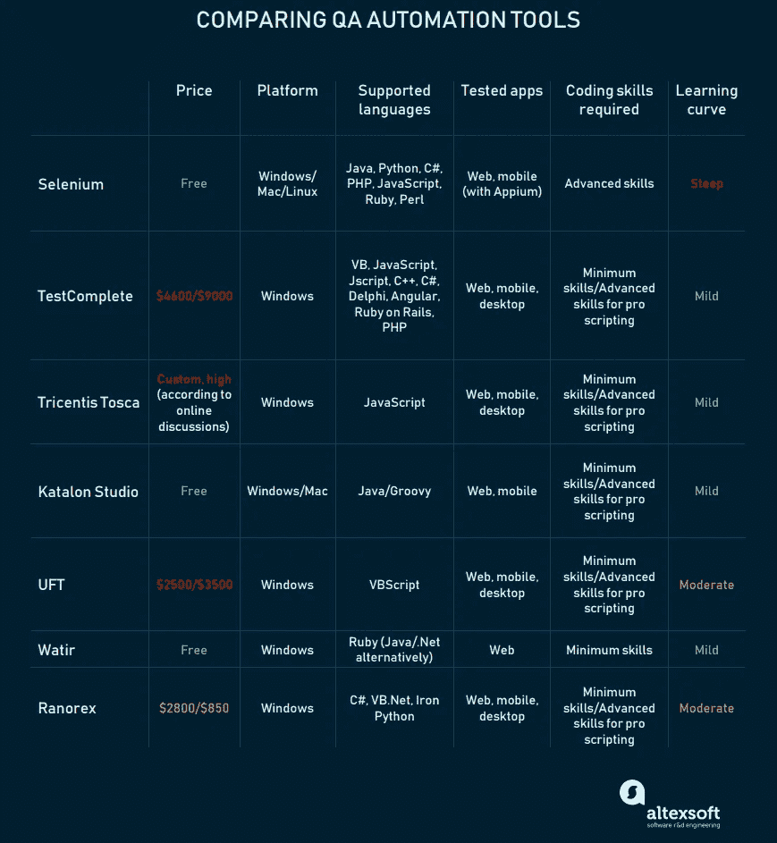

# 比较自动化测试工具:Selenium、TestComplete、Ranorex 等等

> 原文：<https://medium.com/hackernoon/comparing-automated-testing-tools-selenium-testcomplete-ranorex-and-more-a15f8c69e794>

根据凯捷最近的一项调查，[48%的 QA 团队承认严重依赖人工测试。虽然技术还不允许我们完全停止手工测试，但这仍然是一个有趣的统计数据。测试自动化的存在是为了减少人类不可能完成的大项目测试过程。它会注意到人类可能忽略的细节，尤其是在重复测试中。是的，软件中有一些元素，尤其是它的界面，机器还不能正确评估，但是当涉及到 bug 检测和结果记录时，自动化掌握了所有的王牌。](https://www.capgemini.com/wp-content/uploads/2017/09/world-quality-report-2017-2018-e28094-overview-infographic.jpg)

任何长期的工程都需要使用自动化测试。说到性能和反复测试，离不开自动化。但是为什么那么多开发公司仍然依赖手工测试呢？

**成本**。如果您不使用开源工具，很难证明测试自动化的好处。许多组织缺乏预算来购买新软件、培训员工或雇佣更多员工，以及更新硬件以实现成功的自动化。当你致力于短期目标时，很难衡量投资回报率。

**时间**。使用自动化测试基本上就是编写代码来测试其他代码。除此之外，建立和维护框架、开发新技能所花费的时间，以及通往自动化之路的高昂代价。有时，这将导致不得不编写比实际测试更多的代码。

**缺乏专业知识**。许多较小的组织没有或者认为他们没有足够的专业知识来释放测试工具的所有可能性。这还没有考虑到那些不关心全面测试，更喜欢专注于发布产品的人。即使是这种情况，您也将从探索解决方案中受益，这些解决方案是专门为帮助您快速、轻松地进行免费测试而设计的。

要全面了解这两种方法以及何时应用它们，请查看我们关于[手工测试与自动化测试](https://www.altexsoft.com/blog/engineering/striking-a-balance-between-manual-and-automated-testing-when-two-is-better-than-one/#utm_source=MediumCom&utm_medium=referral)的文章。如果您已经考虑了所有的缺点，并且决定投资自动化测试工具来获得所有的好处，那么在深入研究每个框架之前，请看一下我们的快速比较表。

人工测试人员的工作方式是像普通用户一样浏览程序，单调乏味地探索所有屏幕，尝试不同的输入和动作，最终检测故障并记录观察结果。虽然你仍然需要人类来检测可用性问题，但机器可以通过点击一个按钮来取代许多长时间的重复任务。但是首先，开发人员必须编写测试用例。

虽然手动测试人员不需要精通编码，但是自动化测试传统上假设**测试脚本是由开发人员**编写的。这种方法要求测试人员在某种程度上知道如何编码。在敏捷环境中，测试人员和开发人员不会在不同的部门中分离，他们的技能组合是混合的。

然而，今天**无代码测试软件**正在崛起。市场上的一些工具提供了不需要编码的测试解决方案，允许团队的任何成员执行测试。这之所以成为可能，是因为工具能够将书面文本翻译成编程语言，将代码隐藏在用户友好的 UI 层之下。虽然对于开发人员数量有限的组织来说，这可能是一个很好的解决方案，但它仍然是一个非常有限的选择。如果无法访问代码，您将失去保留在核心中的定制和详细反馈。这是每个公司自己的决定:选择简单易用的解决方案，或者让他们的员工学习一些简单语言的基础知识，比如 Python。

既然我们已经定义了自动化测试是什么，让我们来看看可用的解决方案。

# Selenium WebDriver

我们甚至不会尝试创新，我们将从最经典的自动化测试选择开始— [Selenium WebDriver](https://www.seleniumhq.org/) 。它是开源的(意思是免费的)，支持多种编程语言，包括 Java、Python、C#、PHP、JavaScript、Ruby 和 Perl，并且可以在所有三种主要的桌面平台上运行:Windows、Mac 和 Linux。这是一个强大的测试工具，可以直接与浏览器通信以实现自动化。该工具的团队还提供了一个有限但有用的原型插件——Selenium IDE，它记录您的操作，并在未来使用它们进行相应的测试。

## 优点:Selenium WebDriver 的优点

**大型社区。**自 2004 年创建以来，该工具获得了广泛的支持。这个社区非常活跃，有大量的博客、论坛和讨论板来帮助你找到问题的解决方案。

**同时测试。Selenium 允许您同时使用不同的机器在不同的浏览器上运行测试。因此，您大大减少了测试时间，这对于大型项目尤其有价值。**

**移动支援。**使用 [Appium](http://appium.io/) ，一个与 Selenium WebDriver 具有相同 API 的开源工具，您可以利用您的 Selenium 技能来测试移动 web、混合或原生应用。

## 问题在哪里:Selenium WebDriver 的缺点

**不适合初学者。**在 Selenium WebDriver 上编写脚本需要一个技术能力强的工程师，这意味着你不能将自动化测试委托给团队中技术水平较低的人。

**无图像验证。**无法检查图像显示或加载是否正确。你必须使用另一个库或者手动操作。

## 硒什么时候成功？

不管市场上有多少竞争对手，Selenium 仍然被认为是任何测试项目的标准和可靠选择。另外，如果您正在寻找一个只需要最少编程知识的原型工具，您可以使用 Selenium IDE。

# 测试完成

TestComplete 是我们之前提到的无代码工具之一。这是一个专有软件，可以自动测试 web、桌面和移动应用程序。TestComplete 用于数据驱动、关键字、单元、功能测试等等，使其成为日常测试的综合软件。它支持广泛的语言和框架，包括 VB、JavaScript、JScript、C++、C#、Delphi、Angular、Ruby on Rails、PHP 等。

根据所需的模块(移动、web 或桌面)，您可以通过选择仅桌面或仅移动测试功能来定制您的价格。许可证是一次性购买的，但你必须每年支付维护费用。它的零售价格比许多其他工具都要便宜，但对于创业来说仍然很贵。如果你想在购买前试用，可以免费试用 30 天。也可以购买认证或者在线培训。

## 优点:TestComplete 的优点

**使用方便。**内置编辑器允许任何编程知识的用户添加和删除测试、修改参数和改变测试顺序。

**定制。**除了使用可视化界面，如果您发现编辑器工具不够用，您还可以手动编写或编辑脚本。

**及时更新。由于这是一个商业产品，您可以期待高水平的维护、客户支持，当然还有更新。文档也很完整，您不必浏览论坛来寻找技巧或解决方案。**

**支持桌面应用。**虽然 Selenium 只能在浏览器中执行测试(以及使用 Appium 的移动应用程序)，但 TestComplete 支持 Windows 应用程序。

## 问题在哪里:测试完成的缺点

**不支持 Mac。** TestComplete 不支持 Mac 应用程序测试。如果你想在 Mac 电脑上测试 iOS 应用，准备获取一些虚拟化软件。尽管你仍然可以在 Windows 上测试 iOS 和 Android 应用，这适用于我们今天描述的所有框架。

## TestComplete 什么时候成功？

如果预算允许，TestComplete 可以成为不太熟练的开发人员团队的一个很好的工具。通过按需购买模块，您可以定制价格并利用出色的技术支持。您可以花大约 4600 美元购买单个许可证，花 9000 美元购买并行许可证。为了定制您的订单，您可以以每个 2600 美元的价格购买每个模块。

# 特里森蒂斯托斯卡

[Tosca](https://www.tricentis.com/software-testing-tools/) 由 Tricentis 科技公司设计，以敏捷和 DevOps 为理念。众所周知，它是满足所有测试需求的详尽工具，但它仍然很容易与公司已经在使用的任何测试软件一起使用。就像 TestComplete 一样，Tosca 支持移动、web、桌面(仅限 Windows 带有虚拟化工具的 Mac 和 Linux)，不需要编写脚本，但手动编写代码仍然是可能的。

销售团队会帮你定制价格，尽管评论说价格偏高。考虑到 Tosca 能力的广度，成本可能是合理的，但你总是可以从试用开始以确保安全。

## 为什么好:特里森蒂斯托斯卡的优点

**非常适合持续集成**。Tosca 非常适合[持续集成工作流程](https://www.altexsoft.com/blog/business/continuous-delivery-and-integration-rapid-updates-by-automating-quality-assurance/#utm_source=MediumCom&utm_medium=referral)。这是一种现代的方法，能够显著减少开发时间，并且每天运行大量测试。使用调度工具，Tosca 可以直接从中运行测试用例，然后将结果作为 xml 文件传输回来。

**平滑的学习曲线。由于该工具是专门为非开发人员设计的，所以很容易安装和学习，允许您立即开始自动化测试。**

## 问题在哪里:特里森蒂斯托斯卡的弊端

**知识库有限。**你不会找到很多社区支持，因为 Tricentis 自己的[知识库](https://support.tricentis.com/community/articles.do)和论坛是唯一可以留下你的信息的活跃地方。虽然文档很容易浏览，但是在处理了像 Selenium 这样更流行的解决方案之后，您可能会发现自己受到了限制。

## 托斯卡什么时候成功？

Tosca 非常适合于[敏捷开发](https://www.altexsoft.com/whitepapers/agile-project-management-best-practices-and-methodologies/#utm_source=MediumCom&utm_medium=referral)，集成了各种可用的 CI 技术。这是一个综合性的测试工具，起点很低，被埃森哲、凯捷、德意志银行和许多其他公司使用。

# 卡塔隆工作室

[Katalon](https://www.katalon.com/) ，建立在 Selenium WebDriver 之上，被认为是 Selenium 的逻辑和改进的后续产品。它为关键字驱动的测试提供了模板和通用操作，可以与多种工具集成以实现持续集成，并且有一个丰富的、充满分析的仪表板。

乍一看，Katalon Studio 拥有其他工具所缺乏的一切。它完全免费，支持网络和移动测试，可以在 Windows 和 Mac OS 上运行，有一个活跃的社区和一个初学者友好的用户界面。让我们来解开这个备受喜爱的软件。

## 为什么好:卡塔隆的优点

**对专业人士和非技术人员都有好处。Katalon 隐藏了其接口背后的所有复杂性，但仍然允许熟练的程序员进入脚本模式。**

**统一捆绑。设置非常容易，因为如果你在移动设备上测试，你只需要下载额外的软件(Appium + XCode/Node.js)。**

**丰富的教程。Katalon 有一个组织良好的教程库，里面有图像和视频可以帮助你。除了官方的帮助，你还会在网上找到很多免费课程和其他测试者的 YouTube 课程。**

**可视化报表。** Katalon 自动将您的测试结果转换成方便的图表，让您清楚地看到执行情况。

## 重点在哪里:卡塔隆的缺点

**语言支持差。**目前，你只能用 Java 和 Groovy 编写供 Katalon 使用的脚本。

**小型(虽然正在增长)社区。**尽管它的知识库很广泛，但在用户数量上它无法与 Selenium 竞争。这意味着你将很难找到更新的文章和评论。

## 卡塔龙工作室什么时候成功？

Katalon 被技术能力有限的创业公司、中小型团队积极使用。即使是专业测试人员也会发现这个工具非常有用，它有一长串的特性和一个高级的脚本模式。然而，如果你不使用它的付费专用支持，Katalon 不适合大公司。大项目需要更好、更强的支持以及更成熟的社区，这是 Katalon 还不能提供的。

## 统一功能测试(UFT)

UFT 最初叫做 QuickTest Professional，是 MicroFocus 的一款商业工具，于 2006 年被惠普收购。在其 2017 年软件测试自动化[魔力象限报告中，Gartner 将其评为市场领导者之一，其次是 Tricentis Tosca。这个协作且易于集成的工具允许您使用关键字和手动脚本来执行测试。它支持 CI 工具，提供 web、移动和 API 测试，并具有智能对象识别功能。](https://software.microfocus.com/en-us/assets/application-delivery-management/gartner-magic-quadrant-software-test-automation)

## 为什么好:UFT 的优点

**从手工测试到自动化测试。** UFT 通过允许开发人员记录先前的手工测试并将其导出为自动化测试，使得手工测试变得更加容易。通过它的 Sprinter 软件，您可以将执行报告转换成自动化测试用例。

**协作能力。UFT 有一个共享的存储库，团队成员可以在那里存储工件、函数和电子表格。**

## 重点在哪里:UFT 的弊端

**仅支持一种语言。UFT 使用 VBScript 作为它的脚本语言。然而，作为最容易使用和编码的语言之一，它可能不是一个大问题，特别是对专业人士来说。**

**价格。考虑到它不允许像 TestComplete 那样测试桌面应用，该工具是列表中最贵的工具之一。尽管不太合理，但对于许多开发者来说，这可能是一个巨大的垫脚石。一年的基于座位的许可费用为 2500 美元，一年的同时许可费用为 3500 美元。UFT 不提供任何团体折扣，尽管他们可能在其定制企业套餐中提供一个。**

**仅 Windows 支持。**就像我们介绍的其他几个测试工具一样，如果没有额外的软件，UFT 无法在 Mac 上使用。

## UFT 何时成功？

大型团队在处理大型项目时，可以利用它的协作和 web/mobile/API 测试特性。为了从 UFT 中获益并证明其价格合理，您需要一个已建立的测试框架，或者必须准备好建立一个测试框架。

# 瓦特尔

尽管 Watir(Ruby 中的 Web 应用程序测试)是开源的和基本的，但它还是被 Slack、Yahoo！，和 HomeAway。Watir 仅限于 web 应用程序，只在 Windows 上工作，目标是执行简单且易于维护的测试。

## 优点:水的优点

语言的选择。Watir 是少数允许用 Ruby 编程语言编写脚本的工具之一。Ruby 在测试中非常受欢迎，因为它用户友好，易于学习，编码速度快。这就是为什么它可能是 Ruby 开发人员的一大优势。但是如果 Ruby 不是您的首选语言，也有一种使用 Watir 的方法。用 Java 或者。并且仍然利用 Watir 的简单性和它的姐妹软件:Watij 和 WatiN。

## 问题在哪里:水的缺点

**可能太简单了。** Watir 并不试图做更多的事情，对那些相信它的人来说，它似乎很好。但是，它只能与其他工具结合使用。

**小社区。**网上对该软件的抱怨不多，但总体来说写得还不够。不仅很难找到开发伙伴，文档和贡献内容也仅限于 Watir 网站上列出的内容。

## Watir 什么时候成功？

Ruby 开发者会发现 Watir 使用起来非常愉快(除非我们说的是 Watij 或者 Watin)。正如您从[的用户列表](http://watir.com/users/)中看到的，任何规模的公司都可以在他们的测试工作中成功实现它。如果您想要灵活性并且正在构建您的测试工具包，Watir 可能值得一试。

# 雷诺克斯

[Ranorex](https://www.ranorex.com/) 是我们今天讨论的最昂贵、最全面的工具之一。它支持 web、桌面(仅 Windows)和移动测试，一个[很长的技术和语言选择列表](https://www.ranorex.com/supported-technologies/)，为没有经验的用户和高级测试人员提供自动化，以及使用第三方框架进行定制。

## 优点:Ranorex 的优点

**Selenium WebDriver 集成。**您可以在 Ranorex 环境中开发 Selenium WebDriver，并利用最大的自动化测试框架的功能。如此紧密的集成使得 Ranorex 能够解决 Selenium 仍然存在的所有问题。

**与 CI 工具无缝集成。**要在 CI 开发中成功使用 Ranorex，您可以轻松地将其与吉拉、詹金斯、竹子或 TeamCity 等最常见的持续集成服务进行集成。

**复杂的 GUI 测试。视觉界面测试是一项复杂的任务，通常委托给人工测试人员。Ranorex 通过使用对象识别和遵循不同的用户场景来实现自动化，同时将测试人员从重复性任务中解放出来。**

**价格。就其提供的功能数量而言，这是一个相当便宜的工具。你可以花 2800 美元获得一个用户许可，再花 850 美元就可以添加额外的机器和用户。**

## 重点在哪里:雷诺克斯的弊端

**不支持 Mac。Ranorex 是另一个不能在 Mac OS 上运行的框架，并且不允许测试 Mac 应用。**

## Ranorex 什么时候成功？

像西门子、汉莎、思科、戴尔和 IBM 这样的品牌信任 Ranorex 来自动测试。有了这个工具，您可以拥有一个一体化的环境，可以轻松地用更流行的技术进行扩展。它可能不是小型开发团队的首选，但是拥有大量预算的公司可以安全地投资 Ranorex。

# 最终外卖

选择测试软件时有很多要考虑的，因为大多数软件都很昂贵或者需要额外的学习。使用我们的指南来筛选不同的选项，并找到您的团队喜欢使用的选项。确保你请求专利工具的免费试用，以允许你的测试人员在正式测试开始前轻松进入工作流程。

让我们快速回顾一下您和您的团队在选择自动化工具时应该考虑的要点:

**平台和语言。**如您所见，并非所有选项都提供了广泛的脚本语言可供选择，因此您可能会很快拒绝不提供您首选技术的工具。这个市场对 Mac 用户来说特别小，所以你可能要考虑购买一个虚拟化程序。

**编码技巧**。当涉及到您的测试人员时，您肯定想要一些灵活性。即使您还没有计划邀请不太熟练的测试人员加入您的团队，当您希望您的专家开发人员从事要求更高的项目时，时间可能会到来。选择一个提供这种自由的解决方案。

**持续整合。CI 正在成为开发和测试领域的一种规范，所以最好关注那些为在敏捷环境中顺利工作而构建的工具。查看他们支持哪些您首选的日程安排工具，以及您的团队可以利用哪些其他功能。**

**喜欢这个故事吗？为我们鼓掌，让更多人发现它！**👏
最初发表在 AltexSoft 的博客上:*[*比较自动化测试工具:Selenium、TestComplete、Ranorex 等等*](https://www.altexsoft.com/blog/engineering/comparing-automated-testing-tools-selenium-testcomplete-ranorex-and-more/#utm_source=MediumCom&utm_medium=referral)*