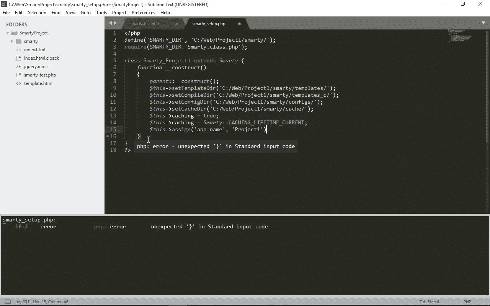
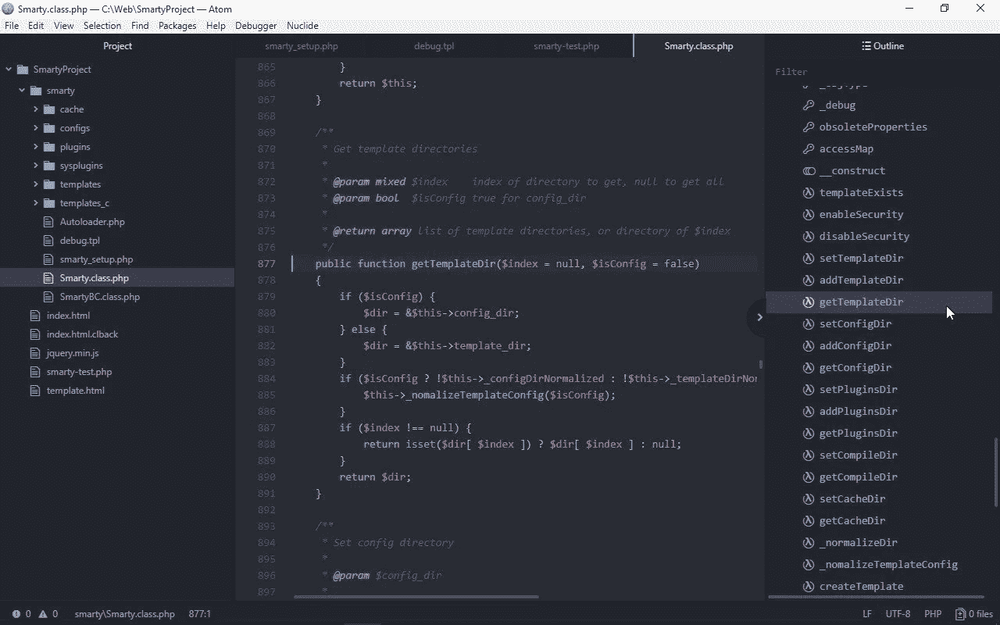

# PHP 开发人员最佳的 4 种代码编辑器比较

> 原文：<https://medium.com/hackernoon/comparing-best-code-editors-for-php-developers-89ba5da16a7>

这是来自 CodeLobster 的 Stanislav Ustimenko 的客座文章。

由于程序员在他们的编辑器和 ide 上花费了大量的时间，他们对软件的选择极其认真。至少，编程环境应该提供语法检查和代码纠正、自动完成和自动添加——所有这些都被称为“代码智能”你应该考虑使用的所有技术——HTML、CSS、JavaScript、PHP，以及任何网络应用程序的分布式本质。

PHP 是一种服务器编程语言，在大多数情况下，脚本在一台计算机上编写，在另一台计算机上运行，在宿主操作系统的环境中。任何站点的服务器部分也可能包括大量的 SQL 查询和与数据库的密集交互。

如果您决定超越业余爱好水平的项目而进行专业编程，那么除了高级编辑功能之外，您的程序支持 FTP 协议、理解 SQL 的语法并提供连接数据库的接口是至关重要的。

让我们看看流行的代码编辑器和 ide 是如何为 PHP 开发人员函数实现如此重要的功能的。

# 崇高的文本

[Sublime Text](https://www.sublimetext.com/) 展示了功能性和速度之间的平衡，以及系统资源的经济使用。最新版本的工作效率和速度，并减少了内存使用量。它可以在 Windows、Linux 和 Mac OS 上运行。此外，还有一个适用于 Windows 的便携版本。

使用 JSON 格式的配置文件，有一个灵活的界面和各种功能设置系统。该编辑器提供了一组 API，因此可以使用 Python 对其进行编程和扩展。甚至还有一个内置的 Python 解释器。

启动程序后，立即进入主菜单**工具- >安装包控制**。包控制是一个允许您管理其他包的工具。

要扩展功能，您必须安装软件包。启动软件包控制，进入主菜单**首选项- >软件包控制**，从键盘输入命令**安装包**。

## 使用代码

如果打开带有代码的文件夹，编辑器会将其视为一个项目。

要在保存文件时检查 PHP 的语法，请安装 PHP 语法检查器扩展。如果有错误，将会出现一个警告对话框。

为了突出显示语法错误，安装插件 SublimeLinter 和 SublimeLinter-php。为了让它们正常工作，还要安装 PHP 7.0。

*Now the editor will check the file and highlight the problem line of code. You can also get information about the error in the tooltip and on the bottom panel of the editor*

要获得包括带有函数声明的文件及其用例的链接列表，只需将指针悬停在函数名上。

您也可以通过右击它并从上下文菜单中选择**转到定义**来立即转到函数声明或类定义。

对于那些使用框架和 OOP 的人来说，PHPCompanion 是一个特殊的插件，它可以立即为程序添加一整套有用的工具。这个模块有助于使用命名空间和导入类。

## 调试能力

使用插件 Xdebug 客户端以最少的设置执行完整的调试。要使用这个包，请在您的服务器上启用 Xdebug PHP 扩展。

## SQL 和数据库

对此有两个扩展— SQLExec 和 SQLTools。它们共享相似的功能和设置。您还可以连接到 PostgreSQL、MySQL、Oracle、MSSQL、SQLite、Vertica 和 Firebird。您还必须安装 DB 的二进制发行版，以便与它进行交互。

## 使用 FTP

您会发现使用 FTP、FTPS 和带有 SFTP 扩展的 SFTP 来处理远程文件系统非常方便。它为查看文件夹结构和操作文件提供了一个非常简单的界面。

*Viewing files structure on Sublime Text*

文件保存后会自动上传到服务器，并且支持输出连接、下载和上传文件的过程信息。这个插件中的所有设置和操作都可以在菜单**文件- > SFTP/FTP** 中找到。

## 框架支持

对 MVC 框架只有基本的支持，主要表现为各种代码片段集合和对在线文档的快速访问。

# 原子

[Atom](https://atom.io/) 是 PHP 社区想了解更多的编辑器。许多体验过它的开发人员都很满意——编辑器的配置非常灵活，但是默认设置也很好。

Atom 是一个使用网络技术创建的开源编辑器。Atom 的扩展是使用简单的 JavaScript 和一个 [Node.js 框架](https://www.altexsoft.com/blog/engineering/node-js-frameworks-comparison-for-your-back-end-solution-express-js-meteor-js-sails-js-and-more/?utm_source=Medium&utm_medium=referral)创建的。

它是一个跨平台的软件，有 Mac OS、Windows 和 Linux 版本。还有一个适用于 Windows 系统的便携版本。

可移植版本不仅允许您在不安装的情况下使用程序，还允许您同时使用几个版本的编辑器来完成各种编程任务。

## 使用代码

Atom 允许您将单个文件和整个目录作为项目打开。最初，有对 PHP 语法的基本支持。

这个编辑器很容易变成 PHP IDE。为此，需要安装 Atom-ide-ui 插件和特定的插件 IDE-PHP。此外，必须安装 PHP 7.0 运行时。

*After applying these actions, Atom gets a more functional appearance*

这些附加组件提供了错误检测、警告显示、自动完成和自动添加，以及改进的代码导航。

## 调试能力

您可以通过扩展来添加它。例如，可以通过安装 PHP-debug 和 Atom-debug-ui 模块来支持 Xdebug。

## SQL 和数据库

Data-Atom 包用于支持 MySQL、PostgreSQL 和 Microsoft SQL Server。它允许您创建连接，然后查看数据库和表的结构，并执行任何查询。

*SQL support in Atom*

您将在主菜单**包- >数据原子**中找到设置和适当的功能。要正确安装这个插件，还应该安装 Git。

## 使用 FTP

使用 FTP-Remote-Edit 包可以在没有外部 FTP 客户端的情况下连接到远程计算机。

首先，建立联系。然后可以查看远程目录的内容，文件保存后会自动上传到服务器。

## 框架支持

如你所知，当你需要使用很多框架时，编辑器并不是最好的选择。但是，可以通过安装一个或多个附加软件包来配置对它们的支持。

实际上，editor 有各种 PHP 框架的扩展，但是对于这个软件，JavaScript 库支持实现得更好。

# 快速 PHP

[Rapid PHP](https://www.rapidphpeditor.com/) 是一个拥有良好声誉和先进功能的 PHP 编辑器，所以你可以称之为轻量级 IDE。

它包括用 PHP 和 JavaScript 编写脚本以及使用 HTML 和 CSS 的整套组件。

有几个有用的功能可以让新手程序员更容易开始编码，例如，熟悉的用户界面，没有不必要的控件和内置的 PHP 解释器。

启动程序后，你会看到一个最小的用户界面。然后，在操作过程中，您可以通过按下 F4 键隐藏和显示所有打开的面板。还有一个升级的编辑器，具有 PHP 语法检查、片段插入、高亮搜索条目，以及打开大文件时的高性能。

有一个方便的功能，go to any，允许您通过按 Ctrl + G 键转到项目中代码或文件的任何部分来快速开始搜索。

通过安装额外的插件，可以将许多有用的特性添加到编辑器中。要查看可用扩展列表，从主菜单中选择**插件- >管理插件**选项。

## 使用代码

Rapid PHP 具有编辑 PHP 文件的高级特性，包括集成的文档和函数工具提示。

*For example, to get a hint on the parameters of a function, just enter its name and press Ctrl + Shift + Space*

## 调试能力

PHP 调试器与 Xdebug 协同工作，并提供所有用于查找脚本错误的标准函数。您可以跟踪用户定义的变量和全局变量的状态，查看调用堆栈，逐步执行文件或使用检查点。

## SQL 和数据库

Rapid PHP 有一个内置的 SQL 数据库浏览器，能够连接到 MySQL、PostgreSQL、Firebird 和 SQLite。它允许您执行查询和查看数据库的结构。

## 使用 FTP

方便的文件浏览器和内置的 FTP 客户端允许您使用简单的 FTP 和使用 TLS、SSL 和 SSH 的安全连接来处理远程文件。

## 框架支持

默认情况下支持 Smarty。要使用其他库的语法，进入主菜单**选项- >框架**。

*The following components are available: CakePHP, CodeIgniter, Laravel, Nette, Prado, Symfony, Yii and Zend Framework. From content management systems only, WordPress is supported*

# 代码龙虾

[CodeLobster](http://codelobsteride.com/) 是由我们的团队开发的，它是一个著名的 IDE，支持所有的网络技术。是用 C++写的。因此，它有一个反应灵敏的界面和显著的快速编辑——在输入代码时没有延迟。

在这里，你会找到 PHP 程序员可能需要的所有工具。通过代码和文件的简单导航、对项目结构的理解、即时搜索和语法错误的识别来提供项目工作。

## 使用代码

这是一个多语言编辑器，可以理解混合代码的文件，并以不同的颜色提供适当的高亮显示。当处理大型源代码时，使用本地书签和折叠代码块的能力。

CodeLobster 中的大多数操作都是通过键盘快捷键复制的。例如，按 Alt + C，您可以立即对当前行或所选内容进行注释。然后按 Alt + Ctrl + U 取消对该片段的注释。有一个集成的帮助系统——当鼠标悬停在感兴趣的项目上时，你可以看到工具提示，所有 PHP 函数的自动完成，以及附加的库。

*Dynamic help works depending on the context. The IDE automatically selects a list of links to relevant documentation for the current element in the code. To use this function, go to the* ***Dynamic Help*** *tab on the right panel of the editor*

要查看光标所在元素的联机帮助，请按 F1 键在浏览器中打开官方文档。

## 调试能力

Xdebug 扩展用于搜索和消除 PHP 脚本中的错误。但是，您应该首先在服务器上启用并配置它。

## SQL 和数据库

与数据库交互的系统包含一个内置的 SQL 客户端；您可以创建几个连接，并将它们链接到设置中的项目。语法突出显示、自动完成和自动替换是根据当前数据库的结构实现的。创建的查询保存在带有 sql 扩展名的文件中，以便您以后可以编辑它们并查看结果。

## 使用 FTP

CodeLobster 启用了 FTP 连接管理器，可以针对任何类型的服务器灵活配置，并且可以很好地处理下载和上传大量文件。文件以二进制或 ASCII 模式传输；您可以通过使用 SSL/TLS 或 SSH 的加密连接来使用服务器。

## 框架支持

CodeLobster 附带了一整套插件，用于处理最流行的 PHP 库和 CMS，其中包括 CakePHP、CodeIgniter、Laravel、Phalcon、Smarty、Symfony、Twig、Yii 等框架。

您可以直接从程序环境中下载、安装和添加任何列出的框架到项目中。

*You can start creating your online store on the basis of Magento, the famous eCommerce platform — just select the type of project you need and configure access to the database*

CMS 的最新版本将以自动模式下载和安装，甚至不使用网络界面。

Drupal、Joomla 和 WordPress 也提供了相同的功能。使用这些系统的所有功能将大大加快开发和启动任何规模的互联网项目的进程。

# PHPStorm

PHPStorm 是一个流行的 IDE，拥有大量不同的功能和特性。它对项目进行了深入的分析，并且非常了解它的结构和依赖关系。

它是基于 IntelliJ IDEA——一个开源平台——用 [Java 编程语言](https://www.altexsoft.com/blog/engineering/pros-and-cons-of-java-programming/?utm_source=Medium%D0%A1om&utm_medium=referral)开发的，这意味着 PHPStorm 继承了其父平台的所有优点。

每个细节都可以定制。用户界面有许多热键、各种高亮样式和主题。

## 使用代码

如果放置新项目的文件夹已经包含文件，将基于现有的源创建项目。

要使用自动完成，请开始键入方法或类的名称，然后按 Ctrl + Space —所有可用的选项将显示为一个列表。之后，你可以得到一个关于参数的提示，按 Ctrl + Shift + Space。

对于任何函数的即时参考信息，只需将光标放在它的名称上，然后按 Ctrl + Q。

*Click on the link in the window that appears to go to documentation on the official website for more detailed analysis*

## 调试能力

有一个完整的可视化调试器，建议与 Xdebug 扩展结合使用，但也可以与 Zend Debugger 集成。

## SQL 和数据库

要显示 SQL-tools 并查看连接列表，从主菜单中选择**视图- >工具窗口- >数据库**。您可以连接到许多不同的数据库:DB2、Derby、HSQLDB、MySQL、Oracle、PostgreSQL、Microsoft SQL Server、SQLite 和 Sybase。

完成所有必要的设置后，连接就建立了，这些选项就可用了:数据库结构概述、表的编辑、字段和新记录的删除和添加、各种 SQL 查询的执行等等。

## 使用 FTP

使用任何类型的连接(FTP、SFTP 或 FTPS)通过 FTP 下载和上传文件。要使用此功能，进入主菜单**文件- >从现有文件新建项目**并选择选项**网络服务器在远程主机上文件可通过 FTP/SFTP/FTPS 访问**。

接下来，命名项目，建立 FTP 连接，并下载远程文件进行编辑。

## 框架支持

模板引擎 Blade 和 Smarty，特别支持 MVC 框架，如 Laravel，CakePHP，Symfony，Zend Framework，Yii。

基于内容管理系统(如 Drupal、Joomla 和 WordPress)创建项目的能力得到了很好的实现。IDE 支持 WordPress 动作和过滤器。它提供了对现有参数的自动完成和动态提示。

*The IDE is able to index the code of any PHP library and then use this data to display documentation or function hints*

# 让我们总结一下

开发人员在创建本文讨论的工具时做了大量的工作。

一般来说，ide 提供了很多不能被选择和禁用的功能。但是，正是由于这些高级功能，PHP 程序员在创建他们的应用程序和网站时，可以充分利用编程环境。

但是为什么 IDE 会随着功能的扩展而降低性能呢？在其生命周期的哪个阶段，开发环境可能会变得“运行缓慢”并给用户带来不便？

我们， [CodeLobster](http://codelobsteride.com/) 团队，试图找到这个问题的有效解决方案。因此，我们选择了低级 C++语言和 Qt 库来保留原生应用程序的所有优点。

因此，该计划正经历着强劲的增长，我们不断增加对新的和最新的网络框架的支持。尽管这种方法很复杂，低级代码的维护困难重重，但用户体验还是得到了极大的改善。

因为最近发布了一个完全跨平台的版本，所以您现在可以在任何操作系统上独立测试这个应用程序。

但是任何编辑器还是一个构造集。安装后，我们只获得最必要的通用功能。有必要安装额外的扩展来将任何编辑器变成一个全功能的 IDE。但它们几乎是瞬间启动，工作速度快，对计算机资源要求不高。

哪个节目最好？每个人都应该自己决定。

使用简单快速的编辑器还是采用成熟的 IDE——这取决于开发人员自己，取决于他们目前在寻找什么解决方案，以及他们在什么条件下工作。

*Stanislav 是 Codelobster 软件公司的项目经理，拥有 10 年的 PHP 编码经验。*

***想为我们的博客写篇文章？阅读我们的要求和指南*** [***成为***](https://www.altexsoft.com/become-a-contributor/?utm_source=MediumCom&utm_medium=referral) ***的投稿人。***

*最初发表于 AltexSoft Tech 博客**[***比较 PHP 开发人员最佳代码编辑器***](https://www.altexsoft.com/blog/engineering/comparing-best-code-editors-for-php-developers/?utm_source=MediumCom&utm_medium=referral)*