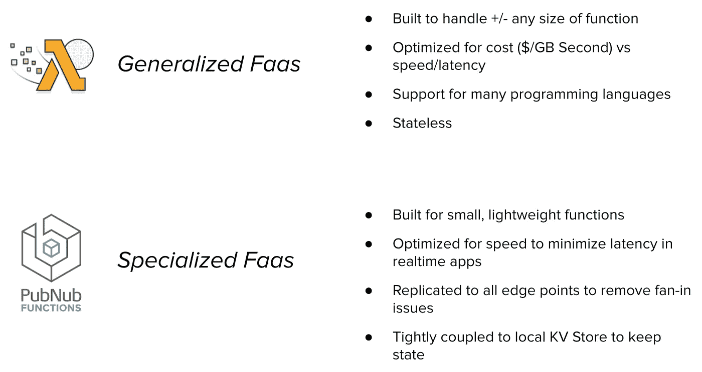

# PubNub 函数与 AWS Lambda 函数的比较

> 原文：<https://medium.com/hackernoon/comparing-pubnub-functions-vs-aws-lambda-functions-daf974061c3f>

以这样或那样的方式，我经常被问到，**“pub nub 函数和 AWS Lambda 是一样的吗？”**

虽然函数和 Lambda 都是事件驱动的服务，并且在两种服务都支持的优雅解决方案方面有所重叠，但这就是相似之处的终点。区别在于每种技术解决的场景和用例，在这篇文章中，我将分析每种技术的最佳用途。

Lambda 允许事件触发器调用代码，和/或亚马逊众多服务中的另一个。例如，当社交媒体流加载到 Kinesis 时，可能会触发 Lambda 函数，该函数会生成趋势数据并写入 DynamoDB。这一切都在 [AWS](https://hackernoon.com/tagged/aws) 生态系统中运行，用户计费的标准是计算时间。

[PubNub](https://hackernoon.com/tagged/pubnub) 函数由 PubNub 实时消息或通过传统的 HTTP 请求来调用。NoSQL 数据存储的 PubNub Functions 解决方案是通过一个全球复制的 KV 存储实现的。PubNub 不会根据用户的计算时间或数据库的读/写吞吐量向用户收费。用户按事务付费，这意味着每次函数事件处理程序执行一次。因此，在存储大量实时数据的场景中，可以使用 PubNub 函数和 KV Store 实现 Lambda 的类似解决方案，但成本更低。

# PubNub 函数和 AWS Lambda 的关键区别是什么？

## 祈祷

每当通过发布订阅网络发送发布订阅实时消息时，都会调用发布订阅函数。这可以设置为在用户订阅密钥内的一个或多个频道上触发。这种模式的目的是在传输中的实时消息到达每个订户之前，用附加数据丰富它。PubNub 函数也可以通过传统的 REST API 调用来调用。处理范围应该是狭窄且单一的，就像微服务一样。

任何 Amazon 服务都可以使用 AWS SDK 以事件驱动的方式调用 Lambda 函数。该模式旨在触发其他服务，并在数据提交时对其进行计算。亚马逊的其他服务可以立即访问这些数据。

这里的区别在于，PubNub 函数主要用于传输中的数据丰富，而 Lambda 函数应该以事件驱动的方式执行特定的计算。

## 许可

Lambda 函数要求将权限授予开发人员希望使用 IAM 调用它的任何其他 Amazon 服务。

相比之下，PubNub 函数是在开发人员选择的特定通道和订阅键上调用的。任何具有互联网连接且知道该功能的订阅密钥和通道的设备都可以调用该功能(除非 [PubNub 访问管理器](https://www.pubnub.com/docs/tutorials/pubnub-access-manager?utm_source=Syndication&utm_medium=Medium&utm_campaign=SYN-CY18-Q2-Medium-June-3)处于活动状态且未设置供应)。

# 有哪些传输中消息丰富化的例子？

私有消息验证服务可以在 PubNub 函数中实现。有了这个，客户端就可以使用 PubNub 向服务器发送消息，当消息从发送方传输到接收方时，该函数可以验证发送方或消息负载的完整性。可以存储秘密加密密钥，并且可以在 PubNub 功能生态系统中简单地实现加密算法。

另一个例子是，一个聊天应用程序消息可以从一个用户用英语发送，并在传输过程中使用 PubNub 功能和语言翻译 API 翻译成法语，如[微软翻译器](https://www.pubnub.com/docs/blocks-catalog/microsoft-translator-v3?utm_source=Syndication&utm_medium=Medium&utm_campaign=SYN-CY18-Q2-Medium-June-3)或[亚马逊翻译](https://www.pubnub.com/docs/blocks-catalog/amazon-translate?utm_source=Syndication&utm_medium=Medium&utm_campaign=SYN-CY18-Q2-Medium-June-3)。

# PubNub 函数和 Lambda 函数有什么相似之处？

这两种服务都提供了一个一次性部署代码库的地方，并且无服务器后端会自动在全球范围内分发程序实例。这是 [FaaS](https://www.pubnub.com/blog/what-is-functions-as-a-service-faas/?utm_source=Syndication&utm_medium=Medium&utm_campaign=SYN-CY18-Q2-Medium-June-3) (功能即服务)的行业标准特性。每次对代码进行修改时，开发人员不需要考虑构建容器、负载平衡器，或者在世界各地的数据中心执行多次部署。

开发团队部署的代码由指向函数触发器的事件自动调用。函数执行可以触发 AWS 或 PubNub 环境中的其他服务，或者任何其他第三方 API。

两个平台都提供存储。PubNub Functions 拥有 KV Store，这是一个读写时间不到 3 毫秒的 NoSQL 数据库。AWS 具有用于 NoSQL 存储的 DynamoDB，它可以连接到 Lambda 函数。

Lambda 和 PubNub 都有能力在自己的生态系统中调用其他服务。PubNub 可以使用一个函数发布到其他通道，也可以在 PubNub 访问管理器中进行授权。Lambda 当然能够触发读/写红移、简单电子邮件服务等。

# 什么时候该用 PubNub，什么时候该用 Lambda？

Lambda 非常适合需要处理能力的情况，PubNub 非常适合需要实时速度和状态读/写的情况。

# PubNub 函数

*   **使用第三方 API 在聊天应用程序中将文本消息从一个用户翻译到另一个用户:**将消息从发送者使用的一种语言翻译成接收者理解的另一种语言。
*   **会话令牌验证**当用户与 web 或移动应用程序交互时，实时验证用户身份。
*   **实时流消息的过滤:**使用编组逻辑功能将某些消息转发给不同的接收者或阻止它们到达任何接收者。封送处理还可以用于停止一个流或开始另一个流的流动。
*   **聚合消息:**在物联网设备一次发送几条消息的情况下，函数可以聚合这些消息，将几条消息变成一条。
*   **消息扩充:** PubNub 函数可以是一个可信的中间人，用于从安全的服务器上用时间戳、附加用户数据(如姓名或头像)来扩充消息。

# 希腊字母的第 11 个

*   每当用户将全尺寸图像上传到 S3 桶时生成缩略图。
*   社交媒体流被加载到 Kinesis。Lambda 生成 hashtag 数据并存储在 DynamoDB 中，供业务用户查询。
*   发货订单被放置并存储在 DynamoDB 中。Lambda 运行以生成分析数据，并将其转发到红移存储仓库。
*   自动制作的 Amazon Elastic Block 商店的每日备份。
*   来自 Cloudwatch 的即时和自动化日志文件分析，监视要满足的特定标准，并调用另一个服务。

# 开源第三方供应商集成

PubNub 有一个已经编写好的函数的开源目录，可以将第三方服务快速集成到无服务器执行流中。

假设您需要在聊天应用程序中进行实时文本翻译。[块目录](https://www.pubnub.com/docs/blocks-catalog?utm_source=Syndication&utm_medium=Medium&utm_campaign=SYN-CY18-Q2-Medium-June-3)已经有一个 Watson 翻译和 AWS 翻译的模块，可以用来翻译传输中的文本，或者以 REST API 的形式。这个特性允许一个聊天应用程序，其中用户用英语发送文本，而他们的伙伴实时接收同样的普通话消息。

任何 API 都可以连接到 PubNub 函数，无论它是自定义的、私有的还是公共的。GitHub 上提供了 Lambda 函数示例，但是，解决方案没有 PubNub BLOCKS 目录中引用的 API 合作伙伴那么多，也没有那么容易集成。PubNub 函数可以在几秒钟内导入并进行全局部署。

*最初发表于*[*【www.pubnub.com】*](https://www.pubnub.com/blog/comparing-pubnub-functions-vs-aws-lambda-functions/?utm_source=Syndication&utm_medium=Medium&utm_campaign=SYN-CY18-Q2-Medium-June-3)*。*