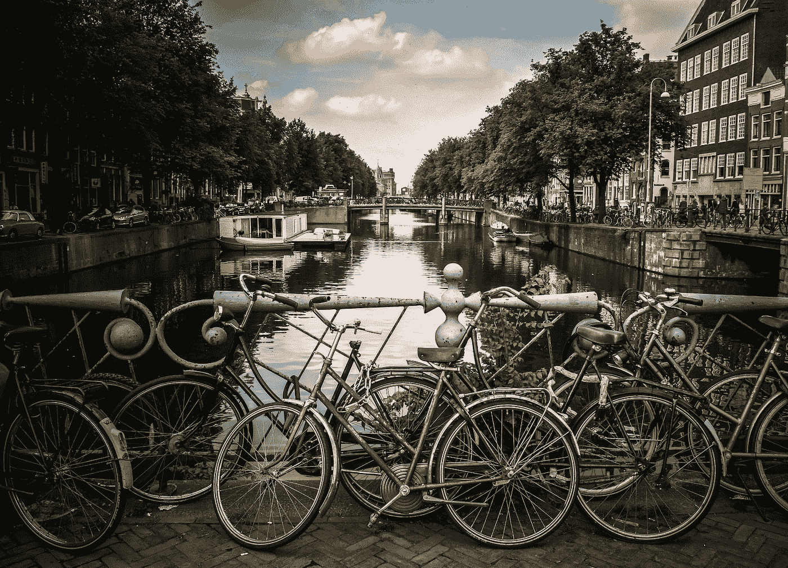

# 比较阿姆斯特丹和博尔德的创业场景

> 原文：<https://medium.com/hackernoon/comparing-the-amsterdam-and-boulder-startup-scenes-81ccb182ef24>

## 创始人访谈

> 披露: [Stream](https://goo.gl/LxzcfX) ，可扩展提要的 API，之前赞助过 Hacker Noon。

*今天，我们将采访他们的首席执行官 Thierry Schellenbach，对比一下阿姆斯特丹& Boulder(他在那里有办公室)的创业场景。*

关于本次采访的前几部分，请访问:

*   [“Stream 如何开始构建新闻订阅源”](/@DavidSmooke/how-stream-started-building-newsfeeds-bfd064ddf054)
*   [“从脸书的新闻订阅挣扎中可以学到什么，谁将为未来的新闻订阅提供动力？”](/@DavidSmooke/what-to-learn-from-facebooks-newsfeed-struggles-and-who-will-power-the-newsfeed-of-the-future-fd32f31e6321)
*   [“基于您的 API 进行营销”](/@DavidSmooke/market-by-building-on-your-api-ea4385bd7148)

[**大卫**](https://medium.com/u/7f91547ce9c9) **:你在博尔德工作，从阿姆斯特丹开始。居住的好地方。你能告诉我一些关于博尔德和阿姆斯特丹的创业场景的好和坏的方面吗？**

蒂埃里·谢伦巴赫:这两个地方都有非常开放的创业生态系统。

> 无论你是在阿姆斯特丹还是在博尔德，如果你想和一家大公司的创始人交谈，只需要一封电子邮件。

我认为这是一个很大的区别——至少从我从硅谷的朋友那里听到的——有时更难与那里的人联系，而不是在博尔德和阿姆斯特丹都很简单。例如，当我们刚刚开始与 [Stream](https://getstream.io/) 合作时，我给 [Elastic](https://www.elastic.co/) 的首席执行官发了电子邮件，最后和他一起喝了咖啡。这就是阿姆斯特丹的创业生态系统。人们往往开放、友好，并愿意在被问及时给出建议。

博尔德和阿姆斯特丹的一大区别是风险投资业。许多美国的风险资本家仍然对投资阿姆斯特丹和欧洲的公司犹豫不决。住在博尔德让我们有机会接触到当地的风投以及美国各地的风投。

虽然阿姆斯特丹很小，但它正在成为一个科技中心。许多欧洲其他国家的人想搬到那里去。我们发现这是一个招聘优秀工程人才的好地方，这极大地促进了 Stream 的成功。

> *荷兰也有* [*高技能移民项目*](https://ind.nl/en/work/Pages/Highly-skilled-migrant.aspx) *。这使得从欧盟以外雇佣人才变得容易，这是一个很大的优势。*

在咖啡文化方面，你觉得阿姆斯特丹和博尔德有什么不同吗？

阿姆斯特丹的咖啡馆和博尔德很不一样。但是撇开所有的笑话不谈，真的有很多重叠。博尔德和阿姆斯特丹都酷爱咖啡、精酿啤酒和骑自行车。

然而，一个很大的不同是文化的多样性。来自世界各地的人们生活在阿姆斯特丹——这是博尔德所缺乏的。

**巨石创业场景有哪些不好的地方？**

博尔德的不利因素是成本——工资、办公空间和房价都在飙升。虽然与帕洛阿尔托和旧金山不在一个水平上，但与美国其他地方相比，博尔德变得越来越昂贵。

你认为这个泡沫会破裂还是会越来越成为一个科技中心？

这里的生态系统和风险投资行业非常强大。人们喜欢住在山里，对吗？所以，如果你想创建一家创业公司，享受在山里的生活，并想靠近滑雪板、滑雪和徒步旅行，博尔德是一个好地方。我不确定它的价格是否会达到硅谷的高度，但我认为它会继续增长。谷歌还将许多员工转移到博尔德，这推动了生态系统的发展。

**阿姆斯特丹和整个欧盟怎么样，你认为创业公司和风投生态系统会改善吗？**

如果你看看 2017 年荷兰的风险投资，你会发现情况已经有所改善。这与美国的风险投资行业相去甚远，但肯定比几年前要好。

这是一个棘手的话题，很难预测。请记住，许多风险投资公司只在公司生命周期的特定阶段进行投资。有的专注于种子轮，有的投资 A 轮甚至后期。正因为如此，一家公司很难决定是否要在欧洲投资。一家决定在欧洲投资的风险投资公司在投资时可能会非常挑剔，并以低估值进行投资。另一方面，缺乏后期投资者增加了早期投资者赔钱的几率。

阿姆斯特丹和欧盟有很多创业人才，但从种子期到 IPO/收购的生态系统还有很长的路要走——这个循环很难打破。

你看到荷兰公司从美国投资者那里筹集资金了吗？

在 Techstars，他们教你的第一件事就是，当你不在美国时，从美国投资者那里融资真的很难。大多数试图从美国投资者那里筹集资金的欧盟创始人都失败了。我认为部分原因是因为风险投资公司中很少的合伙人专注于某个地区。另一部分原因是，筹款是通过网络进行的。当你在一个不同的国家时，很难建立一个关系网。但是，在我看来，最主要的原因是合伙人不愿意在国外投资。老实说，我不确定为什么会这样。

有几家荷兰公司成功地从荷兰投资者那里筹集了资金。来自 Wercker 的 Micha 在美国筹集资金。MessageBird 参与了 YC，并从美国投资者那里筹集了资金。然而，他们在筹集美国资本之前就已经非常成功了。对于后期交易，我认为投资者更愿意考虑其他国家，因为几乎没有可行的公司可以投资。

因此，尽管作为一名欧洲创始人，在美国筹集资金是可能的，但情况确实对你不利。

有意思，阿姆斯特丹的创业生态系统是如何变化的？

最近的一个变化是，一些美国公司开始在阿姆斯特丹招聘人才。优步和 Atlassian 在那里都有大型团队。这推高了工资，也让创业公司更难实现收支平衡。另一方面，我确实认为这有助于建立创业生态系统迫切需要的人才库。

**在两个国家组建团队，你遇到过文化问题吗？**

我们实际上有 8 个不同的国籍。和背景如此不同的人一起工作很有趣。当我和我的共同创始人弄乱美国发音时，它偶尔也会给人带来笑声。