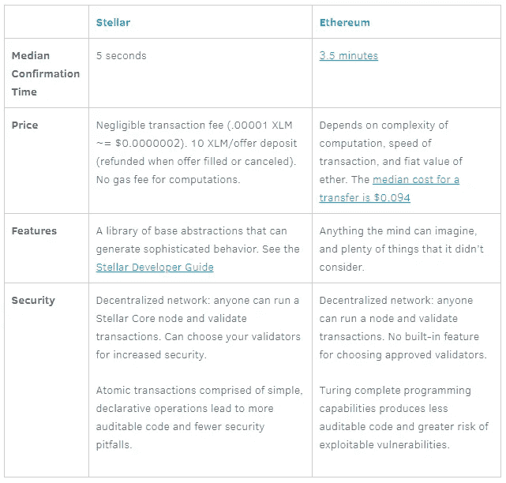
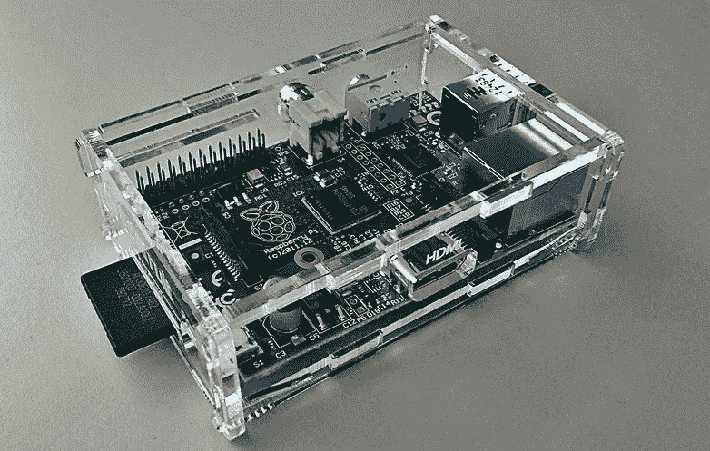
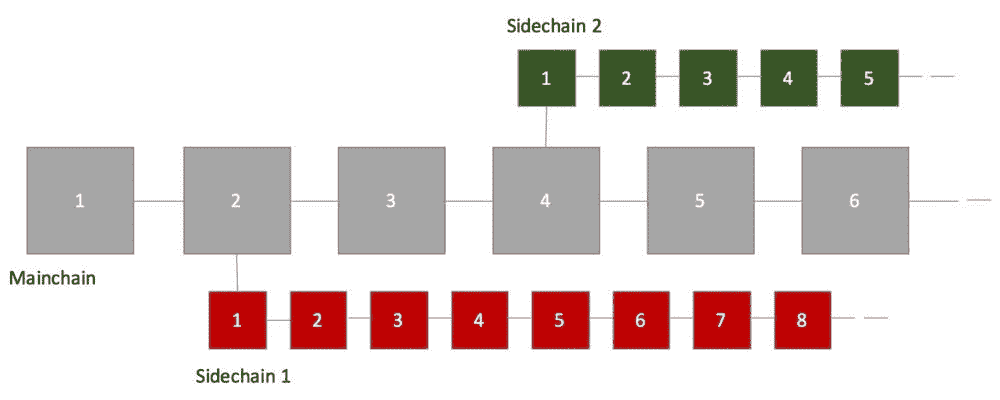

# 智能合约平台比较

> 原文：<https://medium.com/hackernoon/comparison-of-smart-contract-platforms-2796e34673b7>

> 艾维-朗，普路托斯，坚实，斯克里普托，迈克尔逊，胡恩，拉斯特，…

你说真的？？

我应该什么时候抽出时间来探索所有这些语言呢？它们中的大多数很少被使用，这使得采用它们变得非常困难。稳健是领先的，尽管这不是一门容易上手的语言。本文将对以下平台进行批评并给出新的见解:以太坊、Hyperledger Fabric、NEM、Stellar、iOlite、Neblio 和 Lisk。

Source: [www.tenor.com](https://tenor.com/view/michaelscott-notime-gif-5104988)

向您概述所有不同的现有智能合约平台:

Source: [www.github.com](https://github.com/Overtorment/awesome-smart-contracts)

# 寻找合适的智能合约平台

我将重点介绍一些现有的智能合约平台和一些即将推出的平台。我选择这些是基于它们的成熟度、灵活性以及它们为我们的生态系统带来的创新。

## 以太坊——古老而金色

以太坊总是一个安全的赌注。以太坊是智能合约领域的黄金标准，也是其他平台中资本化程度最高的。大多数代币销售发生在以太坊平台上，使用 ERC-20 代币标准。

然而，这个标准有一些严重的缺陷，已经导致了行业的重大损失。我来解释一下。

ERC-20 假设执行令牌交易的两种方式:
1 .向某人的地址发送代币。
2。a*pprove()+transfer from()*:向智能合约存放令牌。

但是如果你不小心使用 *transfer()* 向智能合约发送令牌呢？交易将成功，但此交易不会被接收方合同识别。

“例如，如果您将代币发送给分散式交换合同，则交换合同将接收您的代币，但不会将这些代币记入您的交换代币余额。此外，如果分散兑换契约**没有实现紧急代币提取**功能，那么**无论如何都不可能取回您的代币**，从而导致代币永久丢失。由于这个错误，以太坊生态系统已经损失了数百万美元。”

My all-time favorite GIF — [Source](http://www.reactiongifs.com/throwing-money-away/).

该信息由 ERC223 标准的创建者 Reddit 用户 [u/Dexaran](https://www.reddit.com/r/ethereum/comments/6uckdx/reminder_about_problems_of_most_erc20_tokens/) (来源[文章](https://www.cointelligence.com/content/comparison-erc20-erc223-new-ethereum-erc777-token-standard/))提供。Dexaran 是第一个通知以太坊社区关于前述 bug 的开发者。针对这一点，他创建了 [ERC223](https://github.com/Dexaran/ERC223-token-standard) 标准。

大多数开发人员并不了解 ERC223 和 ERC77 标准。简单比较一下这两种标准:

*   ERC223:这个改进的标准通过使 *transfer()* 函数在无效转账时抛出一个错误并取消交易，从而避免资金损失，从而解决了 ERC20 的严重缺陷。→关注**安全**。
*   ERC777:解决了 ERC20 的问题，比如缺乏事务处理机制。→关注**主流采用**。

如您所见，在采用更安全/更好的令牌标准方面，社区仍需发展。

## 能母

可伸缩性是 NEM 的分散式应用程序最关键的东西。虽然 ETH 每秒最多处理 15 个事务，但据报道，NEM 每秒处理数百个事务。NEM 基金会把安全性和可用性放在首位，因此企业家们处理其他问题，而不是技术难题。

虽然 NEM 据说是更快、更安全和更容易的技术，但以太坊为定制 DApps 的创建提供了更广泛的基础。[主要区别](http://blockxchain.org/2017/05/30/cryptocurrency-comparison/)是 ETH 将其智能合约应用于区块链，而 **NEM 使用区块链的代码**。虽然这可能会使它不那么分散，但这种方法确实有它的好处，比如更好的安全性，更容易的更新，更快的执行时间和更轻的代码。

Reddit 用户 Nemario 告诉我，合同代码可以随时更新，这一切都不需要与外链进行任何交互。不可能执行反向交易。这在某种程度上降低了 NEM 的分散性，但像多重签名和智能资产这样的链上安全功能缓解了这个“问题”。

NEM 定制了名为[智能资产](https://nem.io/technology/)的数据管理应用，通过它你只需点击几下鼠标就可以创建代币、数据记录、投票系统和其他硬币。以太坊的目标是那些打算在未来 5 到 10 年内重建内部网络的公司，而 NEM 的目标是那些寻找快速、安全、随时可以使用和处理当前解决方案的公司。看看哪些公司采用 NEM 而不是以太坊将会很有趣。*来源:【www.cashtechnews.com】*

*NEM 提供了几个 SDK，下面你可以找到一个转会交易的 NodeJS 片段。*

## *超分类帐结构*

*Hyperledger Fabric (HLF)喜欢将其智能合约称为“链码”。HLF 是一个企业许可的区块链，具有很大的灵活性，这使得它对于业务规则在大约 7 年后发生变化的企业非常有用。其他大多数区块链都没有考虑到灵活性。*

*Hyperledger Fabric 本身是用 Go 语言编写的，所以它的智能合约也支持这种语言。好处？Golang 是一种非常高效的语言，编译速度很快。*

*在我看来，编写 chaincode 很简单。三个最重要的功能是:*

*   *PutState:创建新资产或更新现有资产。*
*   *GetState:检索资产。*
*   *GetHistoryForKey:检索更改的历史记录。*
*   *DelState:“删除”资产。*

*关于 *DelState* 的说明:HLF 使用一个状态数据库来存储键及其值。这不同于构成区块链的块体序列。可以使用 *DelState* 函数从状态数据库中删除一个键及其相关值。然而，这并不意味着区块链的区块发生了变化。*

*键和值的删除将作为事务存储在区块链上，就像先前的添加和任何修改作为事务存储在区块链上一样。*

*删除按键后 **可以恢复按键**的历史。有一个 *GetHistoryForKey* ()函数来检索历史记录，它的部分响应是一个 *IsDeleted* 标志，该标志指示键是否被删除。有可能创建一个密钥，删除该密钥，然后再次创建该密钥；GetHistoryForKey ()函数将跟踪这种情况。*****

*示例链码:*

## *一流的智能合同*

*恒星智能合约(SSC)与以太坊智能合约有很大不同。它们不是完全的，而是作为多方之间的协议来实现，并通过事务来强制执行。下面你看到的是恒星和以太坊的对比。请注意费用和确认时间的巨大差异。Stellar network 上的单笔交易仅需约 0.0000002 美元！*

**

*Source: [https://www.stellar.org/blog/using-stellar-for-ico/](https://www.stellar.org/blog/using-stellar-for-ico/)*

*SSC 可以用 Stellar 社区提供的任何 API 语言编写(JavaScript、Python、Golang、PHP 等等)。你可以在这里找到一个 PHP 智能合同的例子。*

*一个 **SSC 被表示为使用各种约束**连接和执行的事务的组合。以下是创建 SSC 时可以考虑和实施的约束条件示例(来自 Stellar [文档](https://www.stellar.org/developers/guides/walkthroughs/stellar-smart-contracts.html)):*

*   **多重签名* —授权某项操作需要哪些密钥？为了执行这些步骤，各方需要就某一情况达成一致？*

*多重签名的概念是需要多方签名来签署来自一个账户的交易。通过签名权重和阈值，创建签名中的权力表示。*

*   **批处理/原子性* —什么操作必须一起发生或者失败？为了迫使这个失败或通过，必须发生什么？*

*批处理的概念是在一个事务中包含多个操作。原子性是给定一系列操作的保证，在提交给网络时，如果一个操作失败，则事务中的所有操作都失败。*

*   **顺序*——一系列交易应该按照什么顺序处理？有哪些限制和依赖？*

*序列的概念在恒星网络上是通过序列号来表示的。在事务处理中使用序列号，可以保证在提交替代事务时特定事务不会成功。*

*   **时限* —什么时候可以处理交易？*

*时间限制是对交易有效时间的限制。使用时间界限可以在 SSC 中表示时间段。*

# *建造中的平台*

*我们不能忘记正在开发有前途的智能合约产品的平台。让我们看看我们未来的选择。*

*

Source: www.mentalfloss.com* 

## *iOlite —用自然语言创建智能合同*

*[iOlite](https://iolite.io/) 是一款专注于大规模采用智能合同技术的产品，它提供了一个易于使用的引擎，能够理解自然语言并编译为智能合同代码。如果你不想花时间学习，而是开始创建智能合同，iOlite 是理想的解决方案。*

*堇青石是基于斯坦福大学的研究。他们发明了 FAE ( *快速适配引擎*)，能够将自然语言或任何其他所需的编程语言转换成智能合同代码。FAE 不仅仅是直接把你的输入翻译成代码。FAE 依赖于能够定义包含语言表达式的结构的贡献者(智能合约专家)。此外，这些结构与他们编写的智能合约代码相关联。这允许引擎浏览结构以找到正确的表达式，从而可以编译所需的智能合约。每当一个建筑被使用，贡献者都会得到 iOlite 令牌作为奖励。*

*如你所见，iOlite 依靠他们的社区使 FAE 成功。FAE 通过应用机器学习技术来帮助他们，帮助他们更容易地学习和采用新的结构。*

*iOlite Labs 目前正专注于以太坊智能合同，因为有大量的需求。*

*[来自 iOlite 团队的 Travis Byrne](https://www.linkedin.com/in/travis-byrne-b6723015a/) 解释了哪些语言可以用来创建智能合同。“这意味着不仅程序员可以(用 Python、C、JavaScript 等正式语言。)立即使用他们现有的技能来编写智能合同，而且**没有任何编程知识的普通人**也可以很容易地开始使用**自然语言如*英语*进行开发。** iOlite 正在消除现有的技术学习界限，以创建智能合同。”*

**

*Source: [https://baseberry.com/smart-contract/](https://baseberry.com/smart-contract/)*

## *Neb lio——面向商业的区块链*

*Neblio 的目标是通过八种最常用的编程语言中易于使用的 API 将区块链集成到现有的企业中。Neblio 的主要目标是为现有企业提供易于使用的区块链。开发人员应该能够使用内布利欧区块链技术，而不是一个区块链专家。*

*Neblio 提供了一个树莓皮钱包来赌你的硬币。下载源代码后，只需一个命令就可以设置钱包本身。通过下注硬币和运行节点，您可以通过工作共识算法的证明来帮助保护钱包，作为回报，您可以获得 10%的下注硬币。*

**

*Source: [www.flickr.com](https://www.flickr.com/photos/tearstone/8498072730)*

*没有义务日以继夜地运行你的覆盆子 Pi。Neblio 允许您总共有 7 天的停机时间。当你的树莓 Pi 关闭时，你的硬币仍然会增加重量，但是你将无法发现方块(并因此获得赌注奖励)。钱包本身消耗非常少的能量，这使得它成为持有您的 Neblio 硬币的巨大动力，以便有一个更稳定的硬币价格。*来源:*[*Reddit*](https://www.reddit.com/r/Neblio/comments/7fygfe/what_makes_neblio_so_special/dqicf8b/)*。**

*或许你会问自己:既然你可以长时间关闭它，你的树莓派怎么能保持更新呢？如果你用以太坊节点做这件事，你将不得不花几个小时同步下载新数据。*

**

*Source: [gifimage.net](http://gifimage.net/how-gif-4/)*

*这就是为什么 Neblio 推出了这款名为 *QuickSync* 的超酷功能，它能够在不到一分钟的时间内同步您的节点。*但是如何？现在，每晚午夜都会有一份内布利欧·区块链的新版本上传到 [Github](https://github.com/NeblioTeam/neblio-blockchain-data) 。默认情况下，Raspberry Pi 会在第一次安装 Github 时或当您关闭节点几天后从 Github 下载区块链数据，将其提取到您的 Neblio 数据目录，然后在剩下的几个小时内同步。这应该会导致近乎即时的同步。*来源:* [*Reddit*](https://www.reddit.com/r/Neblio/comments/7gy7zi/introducing_quick_sync/) 。**

**快速同步安全性怎么样？*钱包仍会验证所有交易。如果有任何错误的交易，它不会同步到最新的块。因此，通过*快速同步*下载区块链同样安全。*

## *Lisk —侧链*

*Lisk 不从事智能合同业务。Lisk 打算允许通过虚拟机集成与智能合约系统(如以太坊)进行接口。让我把这说清楚。 **Lisk 不是智能合约系统**，它是一个*定制区块链*系统。Lisk 围绕创建一个简化的用户体验和平台来构建他们的业务模型，以便为从个人到小型企业到大型银行的任何人轻松实施定制生成的区块链。*

*Lisk 在一个完全独立的侧链上运行每一个应用程序，对自己负责。如果一个侧链失败了，那么运行侧链的开发人员就要承担全部责任。*

**

*Lisk 的另一大好处是它的一致性算法。他们使用“委托股权证明”，这比股权证明更快，更安全，消耗的能量更少。你可以在这里了解更多。*

*这最后一点是有争议的，可能是个人偏好的问题。Lisk 正试图通过用 JavaScript 构建他们的整个生态系统来进入几十万强大的 JavaScript 开发者社区。这使得传统的 web 应用程序开发人员很容易构建 Lisk 自定义区块链并与之交互。他们不需要学习一门新的语言，JavaScript 已经过彻底的测试，其问题也有据可查(JavaScript 远非完美)。*

**来源:* [*3 种方式 Lisk 不是以太坊为什么是好东西— Mattewdc*](https://steemit.com/lisk/@matthewdc/3-ways-lisk-isn-t-ethereum-and-why-that-s-a-good-thing)*

# *结论*

*很难比较所有平台，因为这取决于您的需求。最好看看每个平台的成熟度，因为这是一个很好的指标:SDK、构建工具、适当的文档？当您希望快速构建智能合约的原型时，iOlite 也是一个不错的选择。在我看来，Stellar 在低成本和快速区块链确认时间方面是一个强大的即将到来的对手。*

***特色图片***

**

*Source: [https://cdn.gratisography.com/photos/435H.jpg](https://cdn.gratisography.com/photos/435H.jpg)*