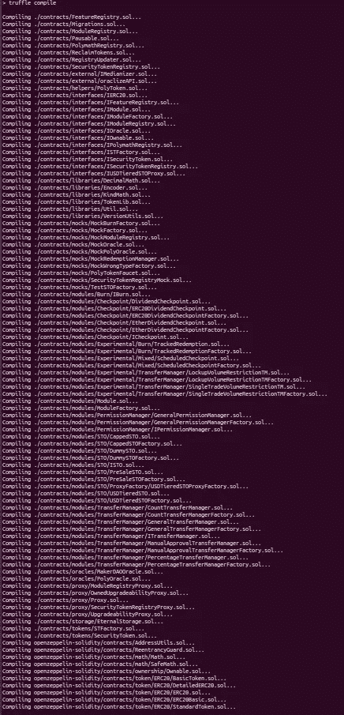

# 在块菌项目中更快地编译 Solidity 智能合同

> 原文：<https://medium.com/hackernoon/compile-solidity-smart-contracts-faster-in-truffle-projects-eb8bebb61ec3>


Truffle 套件是 Solidity 开发中使用最广泛的开发框架，但它并不完美。我们在[的博学者](https://polymath.network/)，处理大量相互关联的智能合约。智能合同的数量之多导致我的日常驱动程序编译时间超过 80 秒。



And adding more contracts everyday :)

幸运的是，我们可以加快编译速度。

Truffle 在默认情况下使用 solc.js，而不是本机二进制文件来编译智能合约。solc.js 提供了更好的可移植性，但是比本地编译的二进制文件要慢得多。

你可能会问，原生二进制文件的速度有多快？我设法将 [Polymath-core 的](https://github.com/PolymathNetwork/polymath-core)编译时间从 80 秒减少到不到 15 秒！


It’s that fast!

为什么大家都还没有使用原生二进制？管理原生二进制文件特别是当你需要在不同的项目中使用不同版本的 Solidity 是很困难的，但是不要担心，我们可以很容易地使用 docker 镜像作为一个很好的替代解决方案。我会指导你完成这个过程。

松露 4。x 不允许我们设置自定义编译器，但是 Truffle 5。x 支持这个特性。然而松露 5。x 使用 Web3 1。x 而松露 4。x 使用 Web3 0。这使得迁移到松露 5。x 更用力。我们实际上不需要完全迁移到松露 5。只是为了获得更快的编译速度。我将展示我们如何继续使用松露 4。x 用于使用 Truffle 5 时的测试和迁移。为了更快的编译。

让我们从设置 Truffle 5.X 开始，稍后，我将解释我们如何使用 Truffle 5。x 连同 4。x 获得两个世界的最佳。

# 设置 Truffle 为 solc 使用 Docker 映像

1.  首先，你需要安装 Docker。最简单的方法是按照[https://docs.docker.com/install/#supported-platforms](https://docs.docker.com/install/#supported-platforms)上的说明
2.  您需要通过使用以下命令来提取想要使用的 docker 映像:

```
docker pull ethereum/solc:0.4.25
```

用您需要的版本替换 solc 版本。

3.前往项目的根目录，安装 truffle 5。x 使用:

```
npm install truffle@next
```

4.编辑您的 truffle 配置(位于项目的根目录中)以指定要使用的 solidity 版本。要使用 docker 图像，您需要添加:

```
compilers: {
  solc: {
    version: "0.4.25",   // Change this to whatever you need
    docker: true,
  }
}
```

您的 truffle 配置文件应该类似于

```
module.exports = {
  networks: {
    development: {
      host: 'localhost',
      port: 8545,
      network_id: '*' 
    },
  },
  compilers: {
    solc: {
      version: "0.4.25",  
      docker: true,
      settings: {
        optimizer: {
          enabled: true, 
          runs: 200    
        }
      }
    }
  },
  mocha: {
    enableTimeouts: false
  }
};
```

5.通过执行以下命令，试用新的快速编译器:

```
./node_modules/.bin/truffle compile
```

**奖励**:为了使命令更短，将其添加到 package.json 中的脚本下，如下所示:

```
"scripts": {
    "compile": "node_modules/.bin/truffle compile"
}
```

然后，您可以通过运行以下命令来直接使用该命令

```
npm run compile
```

**注意**:我们不会直接调用`truffle compile`，因为我们将在全球范围内安装 Truffle 4.x。如果你想使用 Truffle 5.x，那么你可以全局安装，直接使用 Truffle 命令

# 用松露 4 号。x 连同松露 5。X

1.  安装松露 4。x 全局使用

```
npm install truffle -g
```

2.在 truffle 测试/迁移命令之前运行`./node_modules/.bin/truffle compile`或`npm run compile`,这样你可以享受更快的编译。

3.正常使用 truffle 命令。例如，要运行测试，请使用:

```
truffle test
```

上面的命令将使用 Truffle 4 运行测试。因为它是全球安装的。

**注意**:在本文中，我使用的是*nix 系统支持的路径。如果您使用的是 windows，将路径中的`/`替换为`\\`，并根据需要进行其他相关更改。另外，考虑双引导 Linux 系统进行开发:)

# 最后的想法

Solc.js 慢而严肃，而原生二进制快而狂暴！也许结合使用 Truffle stable 和 beta 是确保稳定性、特性和速度的最佳方式。

如果你需要任何帮助，欢迎在这里发表评论或在[松露的 Gitter](https://gitter.im/ConsenSys/truffle) 频道提问。如果你有兴趣加入我在 Polymath 的工作，请通过我们的[网站](https://polymath.bamboohr.com/jobs/)申请。