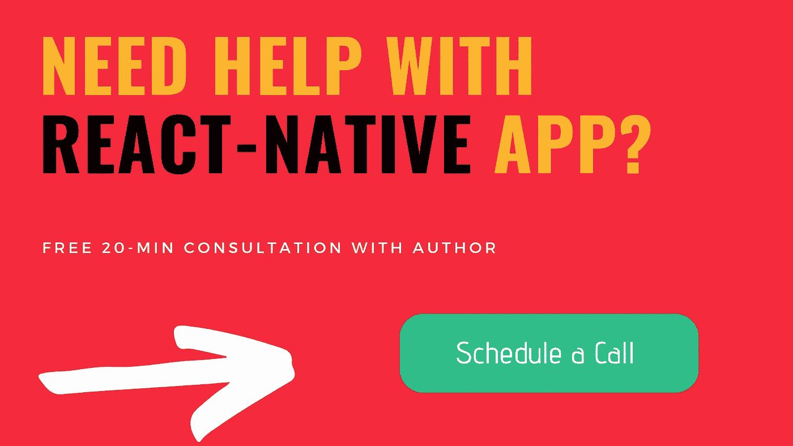
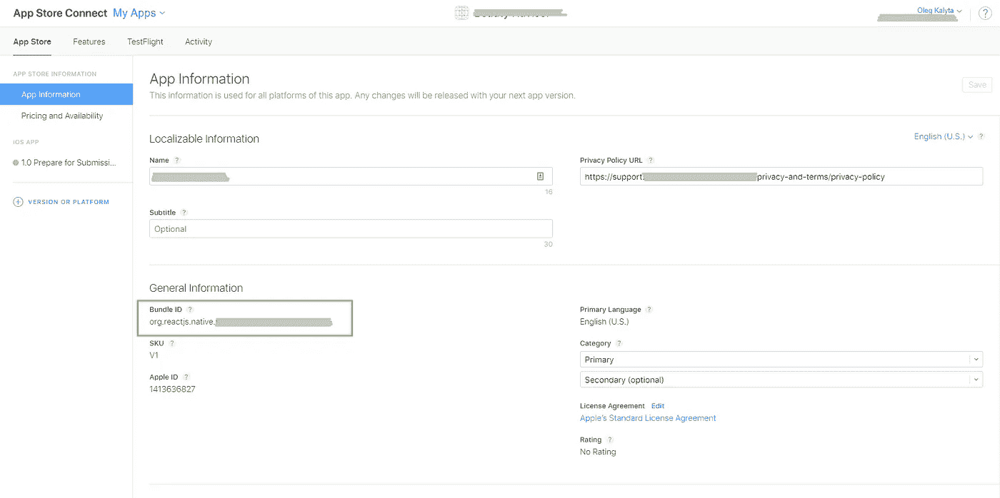

# 完整指南:在 React-Native iOS 应用程序中接收推送通知

> 原文：<https://medium.com/hackernoon/complete-guide-receive-push-notifications-in-react-native-ios-app-38b1ec5b1b15>

Image from [OneSignal](https://onesignal.com/blog/ios-12-and-onesignal/)

> App 发布商可以随时发送推送通知；用户不必在应用程序中或使用他们的设备来接收它们。他们可以做很多事情；例如，它们可以显示最新的体育比分，让用户采取行动，如下载优惠券，或让用户了解某个事件，如闪购。(由城市协会提供)

在你的应用中添加推送通知不仅是改善用户体验的好方法。如果使用得当，它还有助于:

*   刺激用户参与
*   留住用户
*   提高转化率

最近，我们的团队为 React-Native iOS 应用程序实现了推送通知。

> 我们花了几天时间让它完全适用于大多数常见场景。这篇文章的目标是为你节省时间。

> *苹果推送通知服务* (APNs)是远程通知功能的核心。它是应用开发者向 iOS 设备传播信息的服务。

在上面的方案中，应用程序后端开发人员被指定为**提供者**。我们使用 APN 向目标设备传播通知。要实现它，我们需要征得用户的同意。当用户允许权限请求时，手机应用程序会在 APN 上订阅通知。结果，APN 向客户端发送一个*唯一设备令牌*。

现在，这个令牌必须被传输到后端并被存储。当后端决定发送推送通知时，它应该将这个令牌传递给 APN。

在本文中，我们在 React-Native iOS 应用程序(RN 0.57)中实现了推送通知的发送和处理

# 第一部分:移动应用

我们当前的项目是用本机代码构建的，使用的是`react-native init`命令。虽然这些说明可能适用于**推出的** Expo 项目。我们使用来自[官方 RN API](https://facebook.github.io/react-native/docs/pushnotificationios) 的 **PushNotificationIOS** 包。

## 步骤 1:手动链接 PushNoficationIOS 库

关于正式文件，您需要:

1.  找到`node_modules/react-native/Libraries/PushNotificationIOS/RCTPushNotification.xcodeproj`

2.将这个文件拖到 Xcode 上的项目中(通常在 Xcode 上的`Libraries`组下)

3.点击您的主项目文件(代表`.xcodeproj`的文件)，选择`Build Phases`并将静态库从您正在导入的库内的`Products`文件夹拖到`Link Binary With Libraries`

## 步骤 2:扩充 AppDelegate 内容

在你的上方`AppDelegate.m` :
`#import <React/RCTPushNotificationManager.h>`

然后在`AppDelegate.m`实现中添加以下内容:

## 步骤 3:调整 Xcode 项目设置

在设置 Xcode 中打开项目，选择功能设置

## 第四步:最后写点代码:)

**该组件处理应用打开或关闭时收到的所有推送通知。** 现在你可以将`<PushNotificationHandler />`放入你的应用的根组件中，以确保它会在应用启动时被挂载。

# 第二部分:服务器端

要求:你应该有一个有效的[苹果开发者计划会员](https://developer.apple.com/programs/) (100 美元/年)。

## 步骤 1:确保正确的包标识符

检查 XCode/通用项目设置中的捆绑包标识符是否与 Apple Store Connect/App 信息中的标识符相同

## 步骤 2:生成 APNs 授权密钥

要使用 APN，您需要创建并使用应用程序密钥进行授权。
在你的苹果开发者账户中，打开[键](https://developer.apple.com/account/ios/authkey/):

点击`+`图标

在下一页中，输入您的密钥名称，启用 **APNs** 并点击页面底部的**继续**。

Apple 将生成一个包含您的 APNs Auth 密钥的`.p8`密钥文件。

保存**密钥 ID** ，您将在下一步需要它。

现在，点击 Certificates/All，下载带有`.cer`扩展名的证书。将该文件另存为`ios_development.cer`并放入 repo 的根文件夹。

同时找到并保存**团队 ID。要获得它，请登录[developer.apple.com](http://developer.apple.com)。在右上角点击您姓名下的>查看账户。**

## 步骤 3:发送推送通知

在示例回购中，您会发现`pushServer.js`。
用 params:
`node pushServer.js keyId teamId token appId message`启动

文章的免费回购:

 [## product crafters/react-native-IOs-push-notifications-示例

### 在 React-Native 上发送和接收推送通知的示例 iOS 应用程序和服务器脚本

github.com](https://github.com/ProductCrafters/react-native-ios-push-notifications-example) 

用过的文章:
[https://eladnava . com/send-push-notifications-to-IOs-devices-using-xcode-8-and-swift-3/](https://eladnava.com/send-push-notifications-to-ios-devices-using-xcode-8-and-swift-3/)

🚀[我的团队](http://productcrafters.io) **使用 JS 和 React 和 React Native 构建生产应用，历时 3 年**。我们帮助初创公司的创始人将他们的想法付诸实践。如果你需要帮助，发消息给✉️[Oleg @ product crafters . io](mailto:oleg@productcrafters.io)