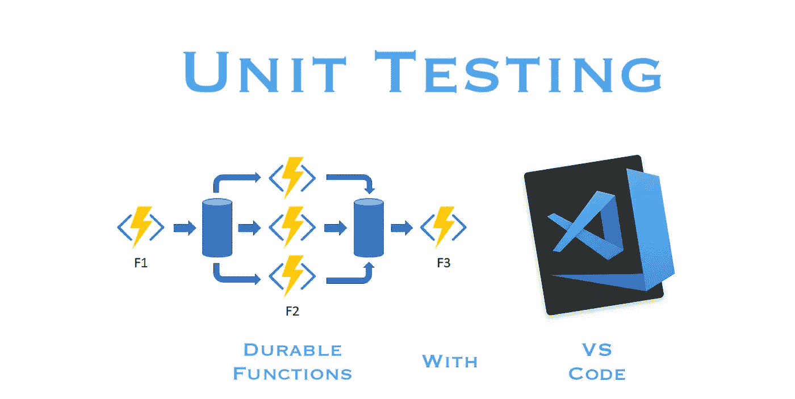
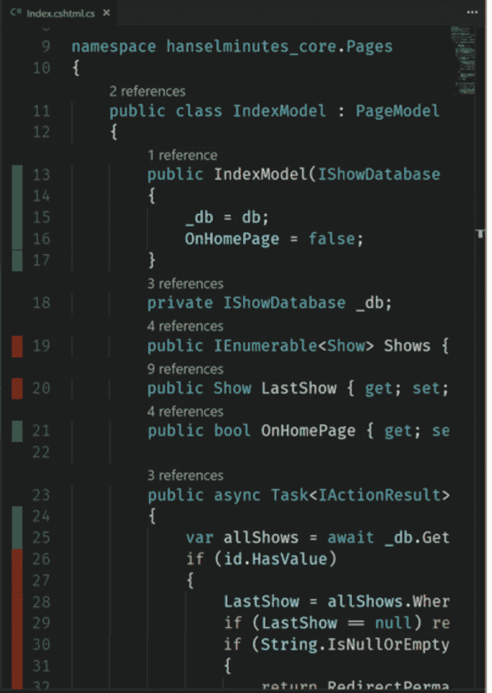
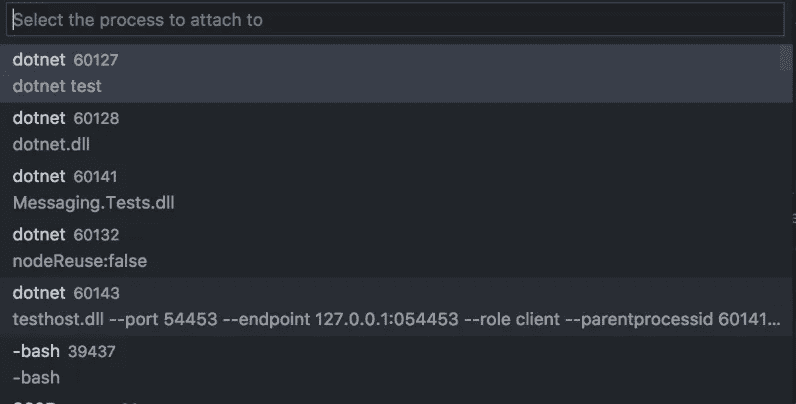
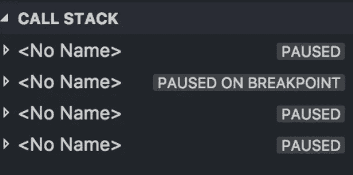

# 用 VS 代码测试持久函数的完整指南

> 原文：<https://medium.com/hackernoon/complete-guide-to-unit-testing-durable-functions-with-vs-code-46d343789c75>

## 依赖注入、代码覆盖、调试等等



我喜欢 VS 代码。我也喜欢 Azure 耐用功能。单元测试是非常美妙的。把它们放在一起，你会得到…一些未知的领域。

大多数。NET Core 2 单元测试原则适用于持久函数，但是还有一些补充。尤其是当您只运行 Visual Studio 代码时。这应该可以让您从以下内容开始:

*   项目设置
*   包和扩展
*   依赖注入和 Azure 函数
*   测试持久功能
*   运行测试
*   代码覆盖率
*   调试单元测试

# 项目设置

。NET 单元测试应该在他们自己的目录下，有他们自己的项目，都是整个解决方案的一部分。假设您已经在`src`目录中测试了一些代码，按照以下步骤设置您的测试目录:

1.  创建一个新目录来存放单元测试。`test`大概是个好名字。
2.  创建一个单元测试项目
    a .移动到测试目录
    b .运行`dotnet new mstest`(使用 MSTest 创建一个新的单元测试项目)你也可以通过`NUnit`或者`xUnit`。
    c .将主项目添加到该测试项目- `dotnet add reference ../src/MyProject.csproj`
3.  移回根目录，并将单元测试项目添加到解决方案中— `dotnet sln add test/MyProject.Tests.csproj`

# 包和扩展

您需要将下面的包安装到**单元测试**项目中。

*   [最小起订量](https://www.nuget.org/packages/moq/) —用于嘲讽和揶揄。
*   [封面](https://www.nuget.org/packages/coverlet.msbuild/) —用于跨平台代码覆盖

还推荐以下 VS 代码扩展:

*   [。NET Core 测试浏览器](https://marketplace.visualstudio.com/items?itemName=formulahendry.dotnet-test-explorer&WT.mc_id=-blog-scottha)——一个运行测试的 UI
*   [Coverage Gutters](https://marketplace.visualstudio.com/items?itemName=ryanluker.vscode-coverage-gutters&WT.mc_id=-blog-scottha) —在 VS 代码中显示被覆盖的代码行。

# 依赖注入和 Azure 函数

由于 Azure 函数的`static`本质，它们目前不支持依赖注入(DI)。这是一个问题，因为 DI 对于 C#中的单元测试是必不可少的。幸运的是，有一些方法可以实现 DI。这是我找到的最简单的。

1.  安装[这个](https://www.nuget.org/packages/Willezone.Azure.WebJobs.Extensions.DependencyInjection)包，它“包含依赖注入的绑定扩展”。
2.  在**主**项目的根目录下创建一个名为`Startup.cs`的文件，内容如下:

3.这与普通的。NET Core 项目，您可以在启动文件中添加单例引用。

4.注意`ConfigureServices`是实例化抽象函数或接口的地方。在上面的例子中，我们创建了一个`ISendGridClient`的实例(用于发送电子邮件)。然后我们将它作为单例添加，现在任何时候`ISendGridClient`被`Inject`调用，这个实例都会被传入。

5.现在，单元测试可以像平常一样通过自己的类模拟:

注意:有一个已知的[问题](https://github.com/Azure/azure-functions-host/issues/3386#issuecomment-419565714)会在 Azure 中抛出错误。根据医生的说法，有一种变通方法对我很有效。放这个[目录。函数应用程序根目录下的 Build.target](https://github.com/BorisWilhelms/azure-function-dependency-injection/blob/master/tools/Directory.Build.targets) 文件。这将复制 Azure 中丢失的文件。

# 测试持久功能

持久函数在 C#世界中是非常独特的。所以应该预料到测试它们也是非常独特的。当然，持久函数项目中的任何普通函数都可以像普通函数一样进行测试。对于那些特定于持久功能的，请遵循以下步骤。更多信息请参见微软的这篇文章。

## 开胃菜

您应该将`Base`添加到`DurableOrchestrationClient`参数中。

这个`DurableOrchestrationClientBase`类现在可以被模仿，然后直接传递给 starter 函数。

**HTTP 启动器**

HTTP 启动器有一个`HttpRequestMessage`参数，这个参数不容易被模仿(一点都不)！参见示例`TestHelper`文件，该文件在[要点](https://gist.github.com/KevinDJones/f9dce0e790ff2784ec3aba4aaf8a8353)中进行了必要的设置。

一旦有了`SetupHttp`函数，就可以在这个完整的例子中如下使用它:

## 管弦乐队

您应该将`Base`追加到`DurableOrchestrationContext`参数中。

这个`DurableOrchestrationContextBase`类现在可以被模仿，然后直接传递给 orchestrator 函数。

## 活动

活动可以像其他任何活动一样进行测试。网络功能。您可以像平常一样传递参数，尽管有`ActivityTrigger`装饰器

你可以像平常一样直接传入`MyClass`模型。如果你正好在用`DurableActivityContext`而不是直接用模型，像这样:

目前没有可以嘲讽的`Base`职业。但这目前在持久函数的[开发分支](https://github.com/Azure/azure-functions-durable-extension/pull/494)中。确保`DurableActivityContext`是必需的，你也许可以直接使用模型。如果没有，很难😃。它来了！

# 运行测试

一旦进入测试目录，`dotnet test`是运行测试最简单的方法。您也可以运行`dotnet watch test`，每次您更改文件时，测试都会重新运行。

如果不喜欢打字，可以用 VS 代码创建一个任务。打开`tasks.json`并添加以下 JSON 代码片段。确保将`MyProject`替换为项目的位置。

然后，您可以打开 VS 代码命令面板并运行“任务:运行测试任务”

# 代码覆盖率

代码覆盖率内置于。NET 核心，但不能跨平台工作。我们将使用之前安装的床罩包。要运行一个启用了代码覆盖率的测试，您可以运行`dotnet test /p:CollectCoverage=true`。

我们之前安装的 Coverage Gutters 扩展可以在 VS 代码中显示被覆盖的行。



Taken from [Scott Hanselman’s](https://www.hanselman.com/blog/AutomaticUnitTestingInNETCorePlusCodeCoverageInVisualStudioCode.aspx) Article on Coverage Gutters

这需要特定的文件格式。要创建正确的文件格式，运行这个非常短的命令:

`dotnet test /p:CollectCoverage=true /p:CoverletOutputFormat=lcov /p:CoverletOutput=./lcov.info`

这只是告诉 dotnet 收集覆盖率并以`lcov`格式创建它，这是 Coverage Gutters 所要求的。然后，您可以使用命令选项板，运行“覆盖率槽:显示覆盖率”或“覆盖率槽:观察”。Watch 很酷，因为它会随着测试的增加而自动更新。结合`dotnet watch test`，这一切都很好，而且自动化。

# 调试单元测试

调试是有趣的，也是必要的。它不能很好地与上面所有有趣的东西一起玩，但它仍然是可行的。

首先，您需要一个 debug 命令来附加到一个进程。打开`launch.json`并添加新配置:

这将允许您将 VS 代码调试器附加到任何进程。让我们准备好 VS 代码。

*   运行命令`export VSTEST_HOST_DEBUG=1`。这告诉 VS 代码准备好做一些调试。
*   跑`dotnet test`
*   它将等待您附加到进程，而不是运行测试:

```
Host debugging is enabled. Please attach debugger to testhost process to continue.
Process Id: 60143, Name: dotnet
```



*   从 debug 选项卡运行您的`.NET Core Attach`命令。选择前面显示的流程 ID(在本例中为`60143`)。



*   快到了。所有这些都让你联系上了，但是还没有完全进入你的测试。在“调用堆栈”标签中，您应该会看到“<no name="">在断点处暂停”的内容</no>
*   单击“在断点处暂停”,现在您可以在调试器中点击“继续”,您应该会被带到您设置的第一个断点处！
*   当你发现你的问题时，你可以运行`export VSTEST_HOST_DEBUG=0`来恢复正常。

# 结论

就是这样！希望这对你有所帮助。这有点复杂，但是通过一点点设置，你可以在 VS 代码中做任何你想做的事情来单元测试持久函数。