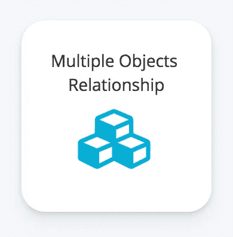
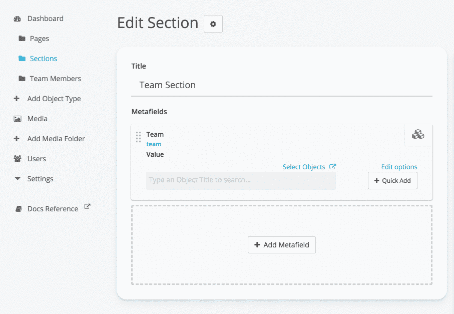
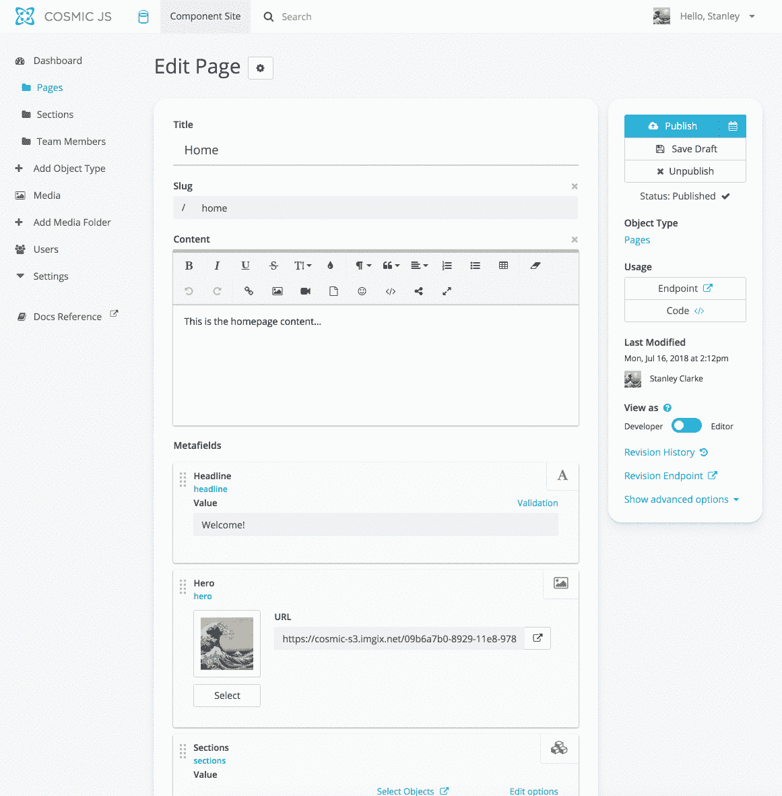

# 用 React 和 Cosmic JS CMS 开发基于组件的网站

> 原文：<https://medium.com/hackernoon/component-based-website-development-with-react-and-the-cosmic-js-cms-828213d48656>


网站开发的一种常见方法是构建可以跨不同网页重用的组件。这种方法的好处是，通过管理组件，而不是管理不同页面上的重复内容，您可以减少重复工作。像 React、Vue 和 Angular 这样的流行 JavaScript 框架在应用程序代码层利用了这一概念，取得了很大的成功。我们如何在内容管理层面从这种方法中获益？

在本教程中，我将向你展示如何使用 React 和 [Cosmic JS CMS](https://cosmicjs.com) 构建一个基于组件的网站。目标是节省开发人员和内容管理者的时间，并提供可伸缩的内容模型。

# 构建内容模型

*先决条件:本文假设您已经理解了 Cosmic JS 概念:对象类型、对象和元字段。如果你需要复习这些概念，去[入门指南](https://cosmicjs.com/getting-started)。

使用 Cosmic JS 对象类型和元字段，我们可以创建可跨网站页面使用的可组合组件。对于我们的示例，我们将创建三种对象类型:

1.第 2 页
。章节(页面中使用的组件)
3。团队成员(用于团队部分)

让我们看看每种对象类型:

## 页

所有页面将包括以下内容:
1。【正文】标题(T8)2。内容(HTML Textarea)
3。节(多对象关系元字段)

多对象关系元字段将用于管理页面部分。



## 团队成员

元字段:
1。名称(文本元字段)
2。图像(文件元字段)
3。引用(纯文本区域元字段)

## 部分

Sections 对象类型将更加动态，并允许不同的元字段。

**团队部分** 元字段:
1。头条
2。多对象关系元字段(团队)
-名称
-图像
-引用

添加您的团队成员:



**报名部分** 元字段:
1。标题(文本元字段)
2。图像(文件元字段)
3。内容(HTML 元字段)
4。文本元字段

**将节添加到页面**
现在我们已经设置了节，可以将它们添加到页面了:



# 编码吧

现在我们已经保存了我们的内容，让我们做一些编码。下载[反应启动器](https://github.com/cosmicjs/react-starter):

```
git clone [https://github.com/cosmicjs/react-starter](https://github.com/cosmicjs/react-starter)
```

现在进入页面组件，编辑它，如下所示:

如您所见，我们已经在页面对象上添加了部分列表。我们的节列表和节组件如下所示:

截面组件的输出由通过`section` prop 传递的数据决定。

# 最后

Cosmic JS CMS 是构建基于组件的网站的一个很好的解决方案。在我们的示例中，我们创建了一个 Page 对象，它带有一个连接到 Sections 对象类型的多对象元字段，以添加我们的 Section 组件。这种方法的好处是，我们现在可以在一个地方管理部分内容，并跨页面重用它，而不必进入每个页面编辑重复的数据。

我希望你觉得这很有用。如果您有任何进一步的问题，请[加入我们在 Slack 上的社区](https://cosmicjs.com/community)并在 Twitter 上联系我们。

[兰斯·安德森](https://unsplash.com/photos/ZHVy20iPb7E?utm_source=unsplash&utm_medium=referral&utm_content=creditCopyText)在 [Unsplash](https://unsplash.com/collections/1063303/bg?utm_source=unsplash&utm_medium=referral&utm_content=creditCopyText) 上拍照