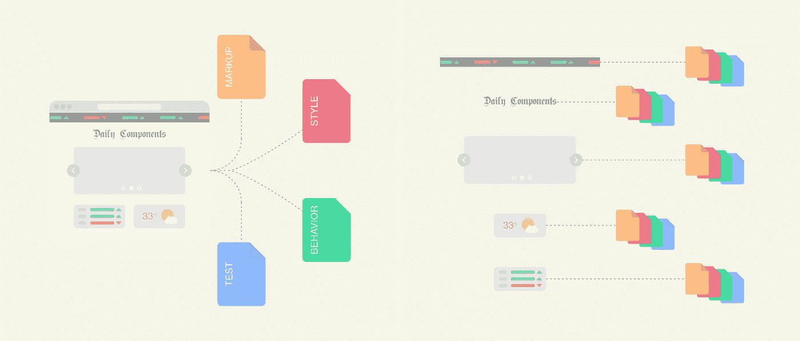
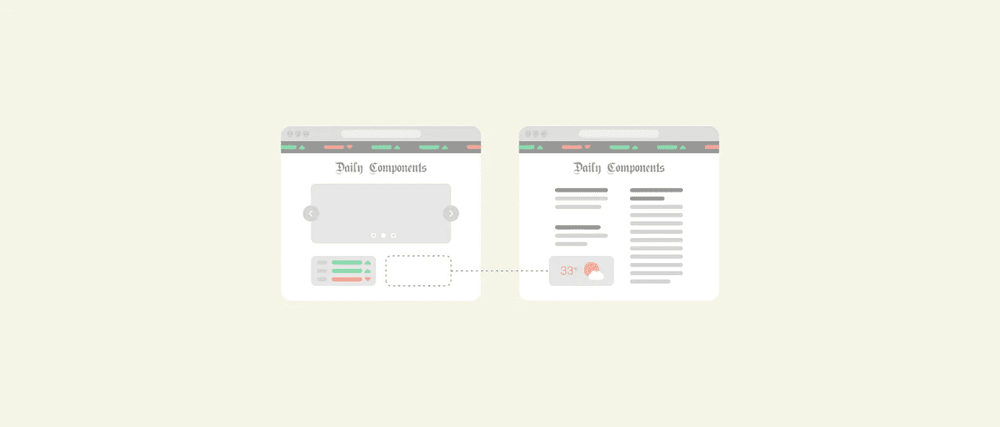
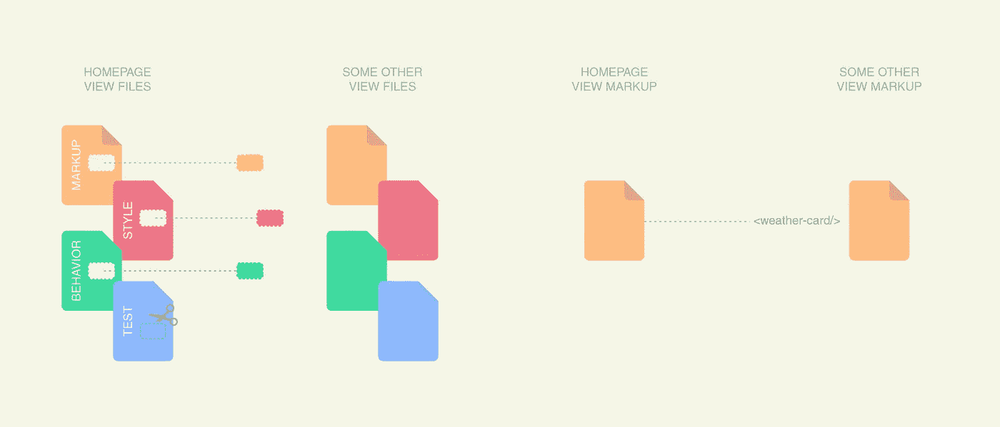

# 无法重复使用的组件

> 原文：<https://medium.com/hackernoon/components-beyond-reuse-6cef6848a748>

在我们生活的时代，模型/视图/控制器的概念越来越过时，使得基于组件的方法成为开发 web 应用程序的新标准。

然而，尽管基于组件已经成为一个如此流行的概念，我仍然看到许多开发人员以一种令人惊讶的怪异方式理解组件。

哪种怪异？(你可能会想)

a)在第一种情况下，我看到开发人员将视图视为一个组件。因此,“组件”实际上是一段巨大的代码，与其上下文极其相关，提供了零灵活性和重用性。

b)第二个，我看到开发者没有把没有行为的组件当做组件来考虑。他们认为标记封装不值得。结果是标记代码复制，因此，当您需要对应该只在一个地方的内容进行更改时，会很痛苦。

首先，我想分享一个我认为是组件的概念。以下是吴镇男·贝利在他的[博客](https://derickbailey.com/2015/08/26/building-a-component-based-web-ui-with-modern-javascript-frameworks/)中写的一些睿智的话:

> *[……]web 应用程序 UI 中的一个组件可以是用来显示员工信息的显示面板，比如他们的姓名、电子邮件地址、员工 id 等等。该组件可以包括用于编辑雇员的按钮或用于执行其他功能的其他控件。*
> 
> 最终，使这个例子成为一个组件的不仅仅是控制它的代码和在屏幕上显示它的 UI。相反，它是将这种行为、UI 以及相关的代码和配置封装到一个更大的系统中。

也就是说，我将向您展示除了重用之外的另外两个好处，大多数人可能第一眼看不到:

# 小责任

当您将一个视图的一小部分封装到一个独立的组件中时，您就从控制整个视图的一大段代码中移除了职责。想象一下，一个网站在其主页上显示一些天气预报。在同一个主页上，你可以看到一个显示当前股票价格的栏，一个徽标，一个包含一些突发新闻的转盘，以及一个显示实时汇率的卡片。

The less you concentrate responsibilities, more you make it flexible.

为什么整个主页只能由一段代码控制？这说不通。你越专注于责任，就越享受不到灵活性的力量。

# 灵活性

现在，假设产品团队已经决定将天气卡移动到另一个视图。你手中的工作是将它从一个视角转移到另一个视角。很简单，对吧？

How easy would be moving a component from one view to another?

也许吧。这取决于你如何组织分布在主页上的代码。如果主页仅仅由一段代码控制，你可能需要在这上面做一个精细的手术。你必须从那些巨大的主页文件中删除与天气预报卡相关的那部分代码。然后，您需要将这一完全相同的代码部分放入另一个视图的文件中。

就这么定了，好吗？还没有。

主页测试将不再通过。你刚刚改变了它。一旦你改变了它，同样的事情也会发生在其他的视图测试上。在基于组件的方法中，天气卡是一个组件。它封装了所有的标记、风格、行为和测试。因此，您所要做的就是将一个简单的 HTML 标签从一个视图移动到另一个视图。

Small responsibilities avoid delicate surgeries.

正如您所看到的，重用实际上是上述两个好处的结果。当您将任何视图分解成几小段代码(小的职责)时，您可以很容易地将它们从一个上下文移动到另一个上下文(灵活性)，或者因此在任何其他视图中重用它们。

你在纠结配置和使用 StorybookJS 吗？你还有一个选择。是[皮茨比](https://pitsby.com/)。没有规则。没有装载机。没有正则表达式。用几个超级简单的声明来运送你的文档。