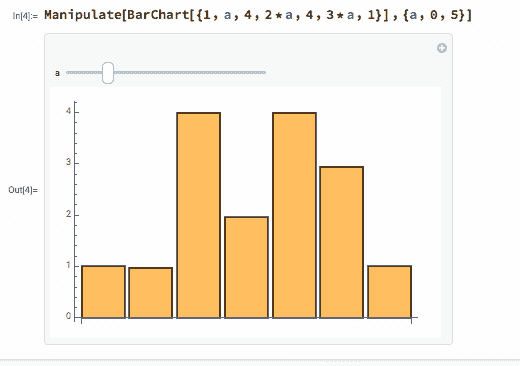

# 史蒂夫·沃尔夫勒姆的计算知识

> 原文：<https://medium.com/hackernoon/computational-knowledge-with-stephen-wolfram-c97673242de3>

你可能听说过 Wolfram 和他们臭名昭著的创始人[史蒂夫·沃尔夫勒姆](http://www.stephenwolfram.com/)，但不知道他们到底提供什么。我猜，许多人与公司的互动是通过 [WolframAlpha](http://www.wolframalpha.com/) ，可能是通过 Siri，但他们的技术走得更远、更深。

我最近在碰撞会议上采访了 Stephen，并认为这是深入了解他们的工具套件的好时机。

# 沃尔夫拉姆语

所有产品的核心是 Wolfram 语言，最终的入门指南是 Stephen 自己写的[书和附带的交互教程](https://www.wolfram.com/language/elementary-introduction/2nd-ed/)。

这种语言声称拥有独特的地位，称自己是“基于知识的”，因为这种语言始于大量数据集和知识，你不必教育它去学习。这意味着这种语言是为关注问题和这些问题的答案的应用程序而优化的，答案采用字母数字字符串的形式，但也包括图像、媒体和图表。

你与 Wolfram 语言的许多交互可以在一个“[笔记本](https://www.wolfram.com/technologies/nb/)中进行，在概念和功能上类似于 [Jupyter](https://ipython.org/notebook.html) 和 [Apache Zeppelin](https://zeppelin.apache.org/) ，但是 Wolfram 技术早于这两者，正如 Stephen 在上面的采访中有点痛苦地陈述的那样。

这种语言允许您使用任何东西，从数学语法到其他编程语言中的熟悉语法，以及数量惊人的英语式语法，尽管有时很难计算出什么样的单词组合才能获得您想要的答案。

您不局限于问题和答案结构，使用`Manipulate`功能，您可以添加交互式元素，帮助您查看对输出的影响。

除此之外，还包括字符串、图像和声音操作，下面的截图也很好地展示了您可以将输出从一个地方拖到另一个地方。

或者，这是我最喜欢的一个从外部输入生成单词云的例子。

至此，我读到了一本 300 多页的书的第 70 页，Wolfram 语言是彻底而深刻的，要比这本书挖掘得更深，我推荐你看看 [Wolfram 文档中心](http://reference.wolfram.com/language/)。

接下来是 [Wolfram|One](http://www.wolfram.com/wolfram-one/) ，构建在该语言之上，是一个你可以使用该语言的在线和桌面 IDE。类似的还有[‘开发平台’，](http://www.wolfram.com/development-platform/)，我认为它是 Wolfram|One 的一部分，也包括部署工具、API 提供者和测试特性。最后，还有[编程实验室](http://www.wolfram.com/programming-lab/)，同样，我不确定它与 Wolfram|One 有什么不同，但它看起来像是上面提到的笔记本的产品名称。

Mathematica 是第一个 Wolfram 工具，可能是所有仍在生产的工具中寿命最长的，有 30 年的历史。它是在线和桌面可用语言的打包子集，为教育工作者、学生和数学家解决他们的问题而优化。[金融平台](http://www.wolfram.com/finance-platform/)看起来像是一个不同的工具，针对从事定价和风险分析等工作的金融专业人士。没有公开审判，所以我无法获得更多的细节。 [SystemModeler](http://www.wolfram.com/system-modeler/) 再次采用该语言，并添加了可扩展的建模库，用于模拟现实世界的物理对象。最后是即将到来的[数据科学平台](http://www.wolfram.com/data-science-platform/)，虽然它的到来有点晚，但它可能是一个不断增长的领域中的一个有价值的工具，由一家在可视化数据方面有着悠久历史的公司构建。

# WolframAlpha

拥有自己的产品类别， [WolframAlpha](http://www.wolframalpha.com/) 是一个在线工具，你可以通过在熟悉的搜索框中输入查询来使用 Wolfram 语言。使用 [Pro](http://www.wolframalpha.com/pro/) ，你可以上传你的数据，并为你的重要信息创建一个复杂的、可视化的知识库。对于所有阅读这篇文章的开发者来说， [Alpha 有 API](http://products.wolframalpha.com/api/)可以将计算知识融入到你的应用中。Alpha 提供了[移动应用](http://products.wolframalpha.com/mobile/)，奇怪的是，还有一个[问题生成器](http://www.wolframalpha.com/problem-generator/)，对教育工作者和智力酒吧测验的创建者很有用。

# 都在一个名字里

虽然我不确定我个人是否会需要 Wolfram 套件的任何产品，但对它们进行实验和采访 Stephen 是对具有悠久、精心设计的历史的工具以及看待设计和用户体验的独特方式的迷人洞察。你们中有人使用过 Wolfram 产品或工具吗？你用它做什么，有什么体验？

*原载于*[*dzone.com*](https://dzone.com/articles/computational-knowledge-with-stephen-wolfram)*。*