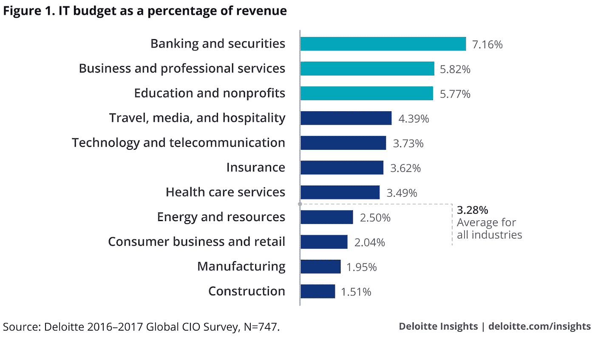

# 计算成本模式发生了巨大变化，您的管理技术也发生了变化吗？

> 原文：<https://medium.com/hackernoon/computing-cost-paradigms-have-shifted-dramatically-have-your-management-techniques-cdc2d849fc97>

# 你需要重新思考你的公司如何处理计算成本

计算成本发生了根本性的、由技术驱动的转变，从固定成本和阶梯成本转变为边际成本。这一趋势在过去的五年中加速发展，迫使许多企业改变决策和管理计算成本的方式。它最终将影响从定价策略到成本管理、公司报告结构、证券分析和财务报告的方方面面。所以，基本上一切。不幸的是，大多数公司正在使用过时的范例、工具集和组织结构来管理计算成本，并在此过程中错过了大量的底线利润。

**快速…一两个定义:**

为了这篇文章的目的，让我们假设在计算的历史中，所有的企业基本上都消耗了五种元素来实现他们的经济目标:(1)处理能力或 CPU，(2)内存，包括永久和易失性，(3)管道，包括将数据从一个地方移动到另一个地方的所有形式和方法，(4)人力资源和(5)知识产权。让我们把所有这些作为一个组合，为了方便起见，称之为“**计算**或“**商业计算**或“**计算资源**”。

现在，快速，三个基本的成本概念。**固定成本**是指在一个公司预期产出的合理范围内保持不变的成本。“**阶梯成本**是会变化的成本，但在预期产出范围内以离散增量或块的形式变化，而“**边际成本**或“**可变成本**是直接随产出单位变化的成本。

# 为什么固定成本和阶梯成本变成了纯粹的可变成本

*   微服务框架的出现和发展意味着计算不再是难以分配的整体。相反，它被分解成“领域”,这些领域有特定的劳动力、资源和与之相关的控制结构。
*   以 SaaS 为基地的服务的扩散倾向于增加收费——有时与产出相关(直接),有时与产出不直接相关，但可变(间接)。
*   云的出现和发展，其价格往往基于利用率指标，这些指标通常与业务流程相关，而业务流程最终又与产出相关。
*   无服务器技术的出现和发展意味着计算并不总是开启的，而是为特定的、可识别的任务而启动的。

# 这种范式转变如何悄悄降临到许多公司身上的历史

记录组织中计算成本的处理历史很有启发性。在计算的早期，公司倾向于创建独立的计算部门。这些成本中心几乎总是根据对应该提供的服务的某种期望，按年度或季度进行预算。公司有时会采用复杂的会计和转移定价方案，根据大型机系统生成的指标将运营这些部门的成本分配给运营单位。

个人电脑的出现导致运营和员工单位的计算预算激增。这些项目通常按人头进行预算，并作为间接费用处理。旧的模型计算部门仍然存在，用于与公司核心业务运营相关的大部分计算。近年来，部门预算已经扩大到包括平板电脑、笔记本电脑、电话和一系列执行业务功能的 SaaS 服务。但是服务器的部署通常仍然在计算单元中进行预算。

随着虚拟机和云的出现，一些公司开始设立“成本审查和优化”部门。在某些情况下，这些部门与运营单位合作，解释客户满意度目标对费用的影响。但是，预算基本上仍作为成本中心进行管理，并且出于财务报表的目的，预算位于线下(即:不包括在毛利润计算中),也不包括在任何边际贡献计算中。对于大多数公司来说，成本信息与业务的运营或收入方面的集成仍然很弱，这部分是因为工具集的限制，还因为大多数公司尚未掌握成本性质的变化在多大程度上也必须改变底层结构和思维方式。

# 公司继续认为计算是相对固定的会错过什么？

## 三样东西:盈利能力、边际贡献、经营杠杆

有许多方法可以提高盈利能力，这些方法都与对成本的透彻了解密切相关。不仅是关于如何通过降低成本来提高利润的显而易见的决策，而且你的定价决策也依赖于对你的成本的了解。去/不去决策和产品或客户配对决策最终会影响底线。借助合适的工具，您第一次可以将计算与产品、客户、品牌等直接联系起来:

*   不管有没有优惠券，处理一个订单要花多少钱？
*   当客户要求提供特殊的 CPU 密集型报告时，您应该收取多少费用？
*   如果您的开发人员编写了一段极其低效的代码，使得运行一个进程的成本比它应该花费的成本高出十倍，您知道吗？这对决策有影响吗？

在这个世界上，公司保留越来越多的数据，从单个事件中创建越来越多的事件流(就像一个订单现在触发 CRM、库存、物流、大数据)，任何事情真正的成本是什么？在这个新的边缘环境中，现在是*可知的。*

为了知道自己的边际贡献，公司需要准确地识别可变成本。现在，大量的成本要么被任意分配，要么根本没有分配。然而，随着一些当前的工具进入市场，您现在可以对方法调用进行精确的成本核算:

*   处理一项索赔、处理一项客户投诉或提交一份复杂的报告，实际上要花费多少计算资源？
*   缩短处理时间对您的 SLA 或客户质量保证有什么成本影响？
*   你能在服务水平和成本之间找到你的效率边界吗？

现在可以开始在这个框架中考虑计算了。您的分析师需要知道从哪里以及如何获得这些数据。

对你的经营杠杆有一个很好的理解是至关重要的，以便知道你什么时候可以“踩油门”，或者你是否能在低迷时期生存下来。不断变化的成本模式改变了您的经营杠杆。您可以回答这样的问题:“您真的需要 50 台固定成本的服务器吗，或者您可以在您最喜欢的云提供商上勉强运行吗？”

有史以来第一次，你可以看到计算出来的经营杠杆，并高度肯定它将在一个非常大的范围内保持不变。计算和预测与计算资源相关的成本是可能的。

# 这很重要，因为…

随着时间的推移，拥有良好的成本控制、真正了解如何定价、知道如何准确确定边际成本的公司，在竞争中的地位会好得多。**这关系到公司能否达到要求的回报率(或奖金)。**

以上是按行业划分技术支出图表。Arguendo，让我们假设持续的 EBITDA 在总收入的 10%到 25%之间([来源](http://pages.stern.nyu.edu/~adamodar/New_Home_Page/datafile/margin.html))。这意味着，即使是最低的技术领域，建筑，也可能有超过 10%的利润被捆绑在技术支出上，而这仅仅是 10%的改善，就意味着额外的 1.5%的利润将下降到底线。这是一个值得让*可知*的差异。

【Kesselman 先生是 taloflow.ai 的首席技术官兼董事会主席，talo flow . ai 是一个可观察性和可行动性平台，致力于降低总体云部署成本，将运营收入与计算成本联系起来，以更好地进行决策和成本核算，并允许公司根据其平台上实际发生的与计算费用和业务指标相关的事情来触发事件。