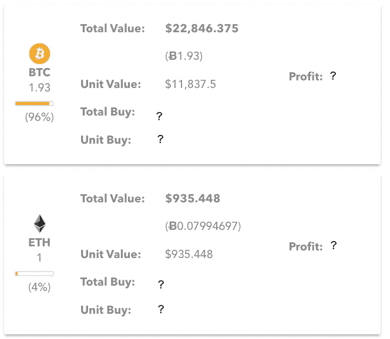

# 计算加密货币交易中的真实损益

> 原文：<https://medium.com/hackernoon/computing-gain-loss-in-cryptocurrency-a211ecc3428>

**总结**:我描述了一个简单的方法来精确计算你的美元(或任何其他法定货币)投资组合中每枚硬币的盈亏。我为计算提供了一个电子表格文档。

此外，我还会向你展示如何使用免费的应用程序[bitcoincrazynes](http://BitcoinCrazyness.com/onelink.html)来自动为你做这件事。

**声明**:我是 [BitcoinCrazyness 应用](http://www.bitcoincrazyness.com/onelink.html)的开发者。

让我从一个简单的例子开始。

# 示例:

1.  你花 8000 美元买了一辆 BTC
2.  几天后，你花 6000 美元买了一辆 BTC
3.  那么你用 0.07 BTC 买 1 ETH

假设今天，价格是:

*   瑞士法郎/美元:935.448
*   BTC 联邦理工学院:0.0799
*   BTC/美元:11，837.5

以美元计算，你在 ETH 的收益/损失是多少？

为简单起见，假设没有交易费。

**天真的计算:**

你在 BTC 的收获是:

> 0.0799 - 0.07= 0.0099 BTC

为了将您的收益兑换成美元，我们将 BTC 的收益乘以今天 BTC 的美元价值:

> 0.0099 x 11，837.5 = 117.19 美元

然而，这并不是你收益的真实价值，因为 BTC 的价值从你买入的那天起已经改变了好几次。

上述计算完全忽略且独立于 BTC 成本。

**更精确的计算:**

每台 BTC 的平均成本是**7000 美元**，因为你以 8000 美元买了一台，又以 6000 美元买了一台。

当你以 0.07 BTC 的价格购买 1 ETH 时，你实际上是在支付:

> 0.07 × $7000 = $490

由于 ETH/USD 现在是$935.45，您的收益是:

> $935.45 - $490 = **$445.45**

所以，你的收益实际上是 445.45 美元，而不是 117.19 美元。

下图显示了每枚硬币的准确值:

**说明:**

*   你只剩下 1.93 BTC，这是你以 7000 美元的平均单价买的。所以它的总成本是 13，510 美元
*   你的总 BTC 现在值 22，846.375，所以你在 BTC 的利润是 9.336 美元。
*   你的 ETH 现在值 935.448 美元，你花了 490 美元。因此，你的真实收益是 445.45 美元。

你可以使用免费的 [BitcoinCrazyness 应用](http://BitcoinCrazyness.com/onelink.html)或者使用这个[电子表格](https://docs.google.com/spreadsheets/d/1n1OPVowNfiRgKdfmTBkF00RbyGjbO5goCv98adJHLLY/edit?usp=sharing)进行类似的计算。

# 一个更复杂的例子

现在假设你用上一个例子中的 ETH 买了更多的硬币。特别是，假设以下是您的交易摘要:

1.  你花 8000 美元买了一辆 BTC
2.  你花 6000 美元买了一辆 BTC
3.  你用 0.07 BTC 买了 1 个 ETH
4.  **你用 0.33 ETH 买 1 个 XMR**
5.  **你用 0.25 ETH 买 1 LTC**

XMR 和 LTC 的成本是多少？

**解决方案**:每个 ETH 花费你 490 美元。因此，XMR 和 LTC 的美元成本分别为 0.33×490 = 161.7 美元和 0.25×490 = 122.4 美元。

您可以在下图中看到每种货币的收益:

Gain Calculation for Each Coin in USD

简而言之，损益计算不要太复杂，但要把每笔交易每枚硬币的平均成本算进去。此外，它应该考虑交易费用。

# BitcoinCrazyness 应用

[BitcoinCrazyness app](http://www.bitcoincrazyness.com/onelink.html) 就是基于上述简单的想法而诞生的。这是一个免费的应用程序，可以计算每个硬币的平均成本，从而计算美元和其他几种法定货币的真实损益。

为了快速输入交易，它接受 CSV 文件。CSV 代表逗号分隔值，它是一个可以从 excel 表生成的文本文件。

Screenshots for [BitcoinCrazyness App](http://www.bitcoincrazyness.com/onelink.html)

本文末尾给出了上述示例的 CSV 文件。

**CSV 文件格式:**

每个交易在 CSV 文件的一行中指定，该文件包含以下各列:

*从，到，类型，单位购买价格，数量，使用持有，费用成本，费用货币*

*   **"from"** 和 **"to"** 是交易的货币，例如 BTC/美元，from 是 BTC，to 应该是美元
*   **“类型”**为交易类型。它可以是买入、卖出、存入或提取，这说明我们是否在买入/卖出交易对的“自”方。
*   **【数量】**是我们正在购买/销售的“来源”的数量。
*   **“use holding”**指定应用程序是否应该扣除您之前持有的股票的交易成本
*   **“fee cost”**为交易成本，可以为 0 或更高。
*   **"feeCurrency"** 指定费用使用哪种货币。

下图显示了一个包含交易费用的更复杂示例的应用程序输出:

> 从，到，类型，单位购买价格，数量，使用持有，费用成本，费用货币
> 
> 美元，美元，买入，1，100，000，false，0，NA
> 
> BTC，美元，买入，14000，2，真，500，美元
> 
> BTC，美元，买入，10000，2，真，500，美元
> 
> BTC，BTC，买，10000，2，假，0，那
> 
> 请求，BTC，购买，0.00001，20000，真，20，请求
> 
> BTC 联邦理工学院，购买，0.01，20，真实，0.02，联邦理工学院
> 
> TRX，BTC，买，0.00001，45000，真，0.2，TRX
> 
> BTC，BTC，卖出，10000，0.1，真，0，不适用
> 
> BTC，BTC，卖出，10000，0.2，真，0，不适用

The Gain/Loss Calculation with Transaction Fees using the [BitcoinCrazyness app](http://www.bitcoincrazyness.com/onelink.html)

# 结论

损益计算应考虑每笔交易中每枚硬币的平均成本。交易应该按时间顺序输入。

如果你喜欢这篇文章，请分享、评论并点击几下拍手图标。我很想知道你是如何计算你的得失的，如果你对 [**比特币疯狂应用**](http://www.bitcoincrazyness.com/onelink.html) **有任何反馈。**

除了损益计算之外， [BitcoinCrazyness 应用](http://www.bitcoincrazyness.com/onelink.html)还提供高级尾随 delta 价格警报、数千枚硬币的最新价格以及高级硬币查询。

# 附录

**第一个例子的 CSV 文件:**

> 从，到，类型，单位购买价格，数量，使用持有，费用成本，费用货币
> 
> BTC，美元，买入，8000，1，假，0，美元
> 
> BTC，美元，买入，6000，1，假，0，美元
> 
> ETH，BTC，购买，0.07，1，真，0，ETH

**第二个例子的 CSV 文件:**

> 从，到，类型，单位购买价格，数量，使用持有，费用成本，费用货币
> 
> BTC，美元，买入，8000，1，假，0，美元
> 
> BTC，美元，买入，6000，1，假，0，美元
> 
> ETH，BTC，购买，0.07，1，真，0，不适用
> 
> XMR，ETH，buy，0.33，1，true，0，NA
> 
> LTC，ETH，buy，0.25，1，true，0，NA