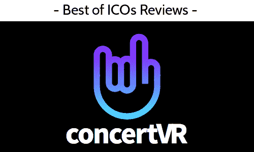
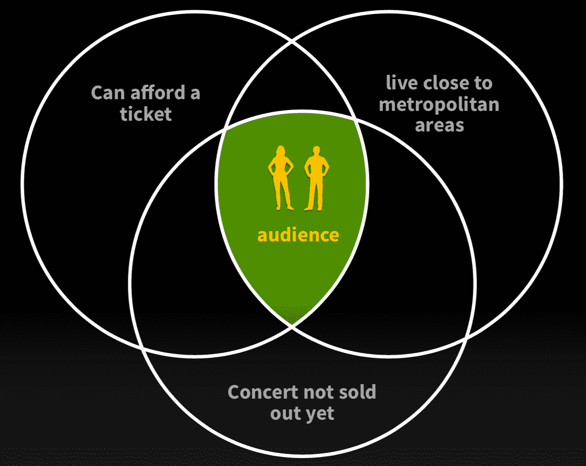
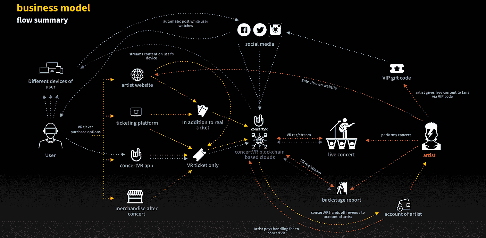

# ConcertVR ICO 审查

> 原文：<https://medium.com/hackernoon/concertvr-ico-review-e16ec9ad4d78>

Before reading this article, please read our disclaimer found at the bottom of the article or [here.](https://thebestoficos.com/disclaimer.html) This Paid Story is brought to you by [Goodstuff-Media](http://www.goodstuff-media.com/).

## 音乐会虚拟现实令牌——回顾与采访

ConcertVR 由柏林的 [Goodstuff-Media](http://www.goodstuff-media.com/) 公司所有。他们通过虚拟现实技术将音乐会的体验直接带给用户。该公司希望通过出售自己的 CVT 令牌筹集约 3000 万美元，每张 0.00015ETH，总计 60，000 ETH。该令牌使用户能够购买音乐会门票、点播活动、歌曲等。

他们的预售在不到 4 天内售罄，并通过 1,200 ETH 筹集了约 110 万€。最初，该公司计划在 2018 年 4 月 2 日推出他们的 ICO。但是由于[谷歌关于 ICOs](https://hackernoon.com/the-end-for-icos-6a53e420a517) 的消息，他们将这个决定推迟了两周。他们的主要 ICO 将于 2018 年 4 月 15 日至 5 月 15 日开放。该公司已经获得了多个奖项，目前正在增加艺术家和合作伙伴的名单，每周都有新的艺术家和合作伙伴。

# 介绍

## 这个想法

ConcertVR 的想法很简单。他们想把音乐会和节日带到虚拟现实中。他们试图让这个市场成为现实，包括利用他们的加密货币让艺术家、供应商和票务平台在一个生态系统中相互交流和交易。其目的是让音乐行业的多个参与者获得更好的视觉和经济体验。

Video from [concertVR’s](https://www.concertvr.io) website

这家公司的特别之处在于，所有团队成员都在娱乐行业工作了 15 年以上，我们采访了他们的首席执行官塞巴斯蒂安·戴勒，以找出他们与众不同的地方，以及公司在未来几个月的计划。

> “想象一下，你足不出户就能实时欣赏全球各地的音乐会？”concertVR 首席执行官塞巴斯蒂安·戴勒

他们的关键技术优势之一是他们在任何特定音乐会上记录的摄像机角度。使用户能够选择他们在活动期间想要去的地方。该公司声称通过他们的眼球追踪技术实现了这一点。

最后，该公司对区块链技术的利用是解决管理人员、售票员、商品、艺术家等之间节日生态系统复杂性的直接结果。他们有效地使艺术家销售无限量的数字门票，因为任何人都可以在家体验音乐会。远比现在的 DVD 和网飞解决方案有趣。

从他们的角度来看，购买实体门票实际上有一系列的准入门槛:

According to concertVR, this is what you need if you want to experience a concert: Image from concertVR White Paper v1.3 page 8

此外，该公司希望带来的不仅仅是音乐会的真实现场镜头。该公司还雄心勃勃地计划建立一个在线商店，使用户能够购买个人歌曲、音乐会活动以及特殊内容和访问，否则你将无法在典型的体验中找到。

娱乐公司标记内容也能够提供反馈和动态，创造更个性化的体验。其中一种体验就是投票的能力。他们想创建一个社交网络，用户可以在这里投票选出他们最喜欢的歌曲和艺术家，这已经成为一种越来越常用的商业模式。

# 历史

> “两年前，我和我的合作伙伴 Andreas Knuffmann 正在研究旅游和虚拟现实行业。主要是创建酒店旅游，你可以去不同的房间。体验还不错，但是情感呢？我们绝不会买这个。
> 
> 所以我们决定聚在一起，开始头脑风暴。由于我们都在电影和娱乐行业工作了超过 15 年，我们自然认为最好的体验是音乐会。如果我们能找到一种使用虚拟现实技术的方法，让人们在自己家里体验虚拟现实时间的音乐会，那将是我们愿意花钱购买的东西。"
> 
> 但是为什么没有其他人这样做呢？我们打了几个电话，发现很多艺术家对这个想法很感兴趣，我们认为这里有一些东西。"
> 
> concertVR 首席执行官 Sebastian Deyle

# 令牌

ConcertVR 利用标准的 ERC20 令牌，该公司在整个白皮书中巧妙地指出，他们将*最初*使用以太坊，这可能意味着该公司准备利用其他平台来补充或替代仅使用以太坊智能合约。这可能指出了一些关于以太坊网络在未来几年的可扩展性的担忧。

该公司计划通过以太坊虚拟机以分散的方式托管大部分数据。该公司正计划使用类似 filecoin 的策略，利用以太坊分散用户信息。concertVR 将**而不是**自己持有用户信息。

# 技术

该公司已经建立了一个原型，使移动用户能够使用 360 度相机和谷歌 Cardboard 等技术观看音乐会。该公司提到，该软件的当前版本也可以使用虚拟现实耳机，如 Occulus Rift，HTC Vibe 等。

ConcertVR 还提到，他们开发了一种眼球追踪技术，使用户能够“在音乐厅的任何地方”。该公司目前提供三种观点:

*   **舞台:**用户将会感受到作为一个摇滚明星的感觉，从本质上看观众，看到艺术家所看到的
*   **观众:**用户将能够以普通观众的角度来体验这场音乐会
*   **背面:**这一部分是从整体上观看这场音乐会并体验其规模的一般方式

# 商业模式

该公司在音乐和活动的销售和分销方面有多种收入来源。他们的想法是让用户能够单独购买音乐会和歌曲，也让用户能够购买每月订阅。

该公司对每种产品的定价如下:

*   订阅费(每月):8.99€
*   现场音乐会:24.99€
*   录制音乐会:14.99€
*   单曲:2.49€

歌曲的价格比你在数字商店里看到的价格略高，价格高的原因是，购买的歌曲在技术上是一个事件或节日的完整 360 度视频部分，所以你得到的不仅仅是一首歌。

该公司预计，在运营的头三个月，€的销量将超过 25 万辆，第二年将超过€800 万辆(收入增长 3，200%)，第三年将超过€2，300 万辆(增长 300%)。这个目标是雄心勃勃的，但该公司认为，基于他们已经获得的牵引力，这是保守的。

平台符号化的目的是创建一个类似于 kik 的 kin 和其他社交网络平台的微观经济，使多个玩家能够支付和销售他们的内容创作。在 concertVR 的情况下，他们将使艺术家能够通过平台，通过门票，订阅，甚至允许销售商品和其他许可产品，直接向公众出售他们的音乐。

ConcertVR Business Model, Image from their White Paper v1.3 p.21

# ICO

该公司的 Pre-ICO 非常棒，仅在 4 天内就销售一空。筹集了 1,200 ETH(约 60 万美元)。该公司现在希望通过他们的 ICO 筹集 60，000 ETH(约 3，000 万美元)。

该公司希望在 2018 年 4 月 2 日推出他们的 ICO。由于最近来自谷歌、脸书和推特的消息，禁止所有与加密货币相关的公司提供广告，该公司决定将他们的 ICO 推迟到 4 月 15 日。

# 令牌分发

根据他们的白皮书，他们的令牌分布如下:

*   55%在代币销售期间售出
*   18%用于开发平台和维护
*   12%将给予顾问
*   本公司持有 10%
*   5%将留给与艺术家和其他人的合作

该公司将面临的最大挑战是说服用户，他们将继续以他们需要的速度增长，并且他们以超过 5000 万美元的预营收估值任意融资的事实，可能会给公司的融资能力带来相当大的困难。

# 市场

2016 年，虚拟现实市场价值 52 亿美元，预计到 2022 年将增长至 1620 亿美元。在过去几年中，一些最有趣的技术投资是围绕着虚拟现实硬件的创造，因此预计在未来 4 年内，拥有这种硬件的人数将增加 40 倍。

节日也是非常难以组织、准备和执行的活动。更别说验证了。几乎就在一年前，比利·麦克法兰被认为要创造一个世界上最独特、最有趣的节日。Fyre 节。该活动本应于 2017 年 4 月中旬至 5 月初的周末在巴哈马举行。一旦人们真的登上了这个岛，他们惊恐地发现这个活动并没有像承诺的那样存在，结果组织者目前面临超过 [8 起诉讼，估计价值超过 1 亿美元的损失](https://en.wikipedia.org/wiki/Fyre_Festival)。

# 牵引力

该公司自 2016 年以来一直致力于该项目，并声称拥有一个功能齐全的原型。他们的演示可以在下面的 YouTube 视频中找到:

concertVR AppDemo from their YouTube channel

视频显示，原型需要一个 facebook 帐户，并将其连接到 concertVR 服务器。在现实中，该公司将允许用户使用电子邮件、钱包、facebook 和其他认证系统登录。该公司计划在 2018 年 10 月推出该项目的测试版。

# 组

ConcertVR 目前是柏林 Goodstuff-Media 的产品。他们的首席执行官 Sebastian Deyle 是一位经验丰富的制片人，在德国主持过多个电视节目。他还在娱乐行业工作了超过 15 年，也从事虚拟现实技术的工作，但是他从来没有对当前提供的解决方案感到满意。

他们的首席合规官 Andreas Knuffman 是一位获奖的执行制片人和自由导演，在该行业工作了 25 年以上。最重要的是，Andreas 和 Sebastian 在过去曾合作开发其他技术，并在娱乐业工作。

最后，他们的开发主管 Frank Zahn 是 Exozet 的首席执行官，exo zet 是另一家总部位于柏林的公司，拥有 150 多名员工，专门从事他们所谓的通过使用数字营销实现公司“数字化转型”。

该公司在音乐和数字营销行业也有许多其他人才，包括 Stefan Schulz，他是娱乐业的资深人士，曾在环球音乐集团工作，并担任多家其他娱乐公司的董事会成员。

# 批评

该公司目前分散了用户的信息，但是仍然很难准确预测如何做到这一点，有多种方法可以做错，很少有方法可以做对。

“所有数据都将存储在一个分散的基于云的数据库中，该数据库将由节点保存在网络上。”——concert VR 白皮书 1.3 版第 16 页

该公司提到，没有用户数据将被存储在 concertVR 服务器上，这是否意味着我们的数据将被存储在节点上，因此任何人都可以公开使用？在不同的国家，这是如何违反隐私法的？我们还不太确定。

当然，有多家不同的公司试图为虚拟现实中的音乐会提供类似的解决方案，如 [NextVR](https://www.citiprivatepass.com/vr) (专注于体育)。因此，该公司将不得不迅速面对并击败许多即将到来的竞争。如果他们的 ICO 成功获得资金，这个问题可以通过一个强大的营销活动来部分解决。ConcertVR 还有一个优势，就是他们专注于 VR，也专攻欧洲市场。

也就是说，concertVR 拥有一个在该领域非常有经验的团队，并能够与艺术家和球员建立非常牢固的关系，其中许多将在 ICO 销售开始后的几周内披露。此外，创作者已经展示了他们达成交易、合作伙伴关系的能力，并专注于制作虚拟现实内容，而不是任何类型的音乐会内容。

最后，该公司正试图相对快速地扩大规模。他们期望他们的产品销售额每年增加两倍。虽然这个目标对于一个拥有经验丰富团队的创业公司来说是保守的，但它仍然是有风险的，就像任何其他创业公司一样。

# 结论

ConcertVR 的提出了一个我们大多数人都会同意的论点，即 AR/VR 技术在未来十年人类体验数字化中的作用将是巨大的。我们可以在任何有意义的市场分析中看到这一趋势的证据，包括:

*   对 AR/VR 的投资
*   支持该技术的新硬件
*   更好的 AR/VR 软件
*   更多的公司正在开发解决方案
*   数字化和个性化生活方式的趋势。

concertVR 面临的最大问题将是证明他们将在行业中发挥重要作用，并且随着更多玩家进入市场，他们也能够实现长期目标。目前还不清楚他们将如何回答这个问题，但如果他们这样做了，他们将进入一个巨大而非常有利可图的市场。

事实上，他们能够迅速卖出他们的预 ICO 已经是一个很好的指标，表明这家公司将在他们的 ICO 上取得成功，但我们很好奇他们一旦推出他们的平台，他们的表现能力，最重要的是，他们让大牌艺术家签名并使用它的能力。

想帮忙吗？

在 Bountey 上支持我们！https://www.bountey.com/bestoficos

想在 ICOs 中保持最新？

在[https://thebestoficos.com](https://thebestoficos.com/)拜访我们

有一个有趣的故事？

给我们在 info@bestoficos.com 写信

# 放弃

本网站及其包含的信息无意成为投资、金融、技术、税务或法律建议的来源。本网站不能代替专业建议和独立的事实验证。在没有首先评估你自己的个人财务状况，也没有咨询财务专家的情况下，千万不要使用这个网站上的想法和策略。本网站的所有内容仅供参考，按“原样”提供，不保证完整性、准确性、及时性或使用本网站所获得的结果。这只是一个存根，您对本网站的访问和使用取决于您对全部免责声明的接受和遵守。免责声明适用于所有希望访问或使用本网站的访问者、用户和其他人。