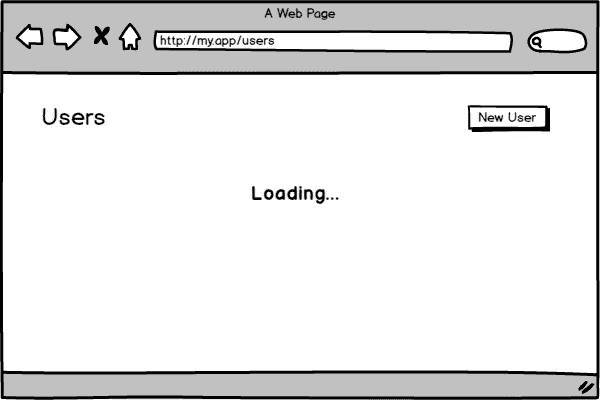
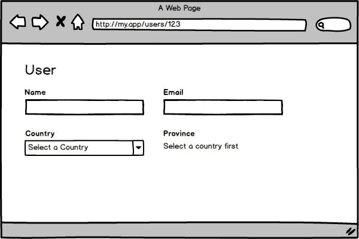

# 反应条件渲染

> 原文：<https://medium.com/hackernoon/conditional-rendering-on-react-57a864c2d04d>


当我们开发一个 React 应用程序时，我们经常需要在给定的条件下显示或隐藏一个元素。无论是用户交互，还是来自请求的数据，甚至是权限级别。这被称为条件渲染，我们将看看处理这些情况的不同方法。

# 如果

IF 是所有方法中最基本的，也可能是你最常看到的，但是它仅限于组件的总块。在条件中使用 IF，并返回要呈现的元素。观察下面的例子:

上面我们有一个用户列表，他们接收`isLoading`道具和`results`。如果`isLoading`为真，我们返回一条消息说明它正在加载，否则，我们呈现用户列表。

> 注意我们**不使用**ELSE**因为没有必要，因为我们在第一个 **IF** 内使用 **return** 。不要害怕在每个函数中使用不止一个 **return** ，这种做法将有助于降低代码的复杂性。**

上面的例子没有错，恰恰相反，代码简单易读。然而，正如我提到的，这种方法仅限于渲染整个块，在许多情况下，我们不能使用它。

假设我们的用户列表更加复杂，它有一个标题和一个创建新用户的按钮。在这种情况下，页面应该总是显示标题和按钮。加载消息只会出现在列表中的位置，如下所示:



考虑到上面的图片，我们不能使用 **IF** ，因为我们需要重复整个代码块来改变列表的内容。

对于这些情况，我们可以在我们的 *JSX* 中使用`&&`逻辑运算符来编写一个表达式，如下例所示:

如上例所示，我们可以使用大括号(`{}`)在 *JSX* 中插入一个 *JS* 表达式。React 将获得每个表达式的结果，并将呈现在屏幕上。当一个表达式返回一个`Boolean`、`undefined`或`null`、*反应*只是忽略，不渲染任何东西！

> 反应本机将**而不是**忽略`undefined`并且你以一个运行时错误结束。如果您在 web 环境之外使用 React，那么应该将值转换为布尔值。

## 理解表达

当我们使用逻辑运算符`&&`时，JS 将解释表达式的每个值，直到它到达最后一个值，或者某些求值以一个 [*假值*](https://developer.mozilla.org/en-US/docs/Glossary/Falsy) 结束。在任何情况下，最后解释的值将是表达式的结果。示例:

如上例所示，从第 7 行开始，解释第一个元素`user`。由于是一个 [*真值*](https://developer.mozilla.org/en-US/docs/Glossary/Truthy) ，光标传递到第二个元素，也就是`user.name`。由于这是最后一个被解释的元素，表达式的结果将是第二个元素的值:`'John'`。

在`address`的情况下，第一个元素`user`被解释并标识为*真值*，然后光标转到第二个元素`user.address`，在这种情况下，第二个元素的值为`null`。因为我们没有更多的元素，并且最后解释的值是`null`，所以这成为表达式的结果。

最后，在`zipCode`的情况下，发生与`address`相同的过程。它解释第一个，然后传递给第二个。然而，由于第二个元素是 *falsy* ，光标完成了表达式的执行，并一如既往地采用最后解释的值，在本例中为:`null`。

理解表达式是如何工作的很重要，因为有时你可能期望结果是`false`，然后你得到`null`或`0`。

## 可读性

因为我们在 *JSX* 中包含了逻辑，所以我们必须小心维护代码的可读性。因此，对于包含两个以上项的表达式，创建一个变量来抽象验证项是很有趣的。一个例子:

```
{!isLoading && !results.length && (
  <span>**NO RESULTS FOUND**</span>
)}// VSconst shouldDisplayNotFound = !isLoading && !results.length;{shouldDisplayNotFound && (
  <span>**NO RESULTS FOUND**</span>
)}
```

上面的例子只是为了理解这个概念，我知道我们没有清楚地看到一种方法对另一种方法的优势。这是因为我们面前有一小块代码。但是在下面，我们将以一种更实际的方式看到同样的应用概念。

假设对于我们的用户列表，当没有找到记录时，我们需要显示一条消息。但是，我们只能在结果加载后显示此消息。这样我们就可以通过`results.length`查看结果的数量。下面，我们将看到不使用变量时这个逻辑是什么样子。

在上面我们看到，在 *JSX* 中间，逻辑开始变得有点复杂，但我们仍然可以理解它。基本上，在所有检查中，我们需要考虑`isLoading`，以确保列表被加载，然后基于`results.length`来判断是否有结果。

> 注意，为了显示列表，我们检查了长度是否大于`0`。还记得表达式的值是如何解释的，以及表达式的结果是如何获得的吗？如果我们只是检查长度是否真实，写下`results.length &&`，如果是`0`，这将是表达式的结果，然后 React 将在屏幕上打印`0`。

考虑到前面的例子，现在想象一下，除了处理没有结果的状态，如果请求中有错误，您还需要显示不同的消息。注意代码看起来像什么:

请注意，复杂性开始变得越来越大，理解发生了什么变得越来越困难。让我们探索简化代码的方法吧！

# 将验证转换为变量

如上所述，可以从引用验证的每个表达式中提取一部分，并将其提取到具有声明性名称的变量中。这样，我们的逻辑会变得更清晰一点。请注意下面的代码:

我们可以看到，从 *JSX* 的中间提取逻辑，有可能更容易理解它，此外变量名已经明确了表达式所代表的内容。任何将来维护代码的人都可以毫无顾虑地更改验证。

# 块的提取

请注意，在我们的示例中，大多数验证都集中在单个块上。因此，我们可以将正在讨论的块提取到一个函数中，或者将其转换为另一个组件，如下例所示:

观察我们所有的逻辑是如何通过将块提取到另一个组件而变得更简单的。还可以看到，我们在返回时再次使用了**if**的方法。这种方法也称为提前返回。当我们使用*早期返回*时，我们的逻辑往往更简单，因为下一个验证不必担心上一个。例如:检查它是否正在加载，我不必担心是否发生了错误，因为这种情况已经在之前的 **IF** 中处理过了。

# 三元组的使用

在给定一定条件下两个块交替的情况下，Ternaries 也是受欢迎的。请注意用户创建表单下面的模型:



如上图所示，我们有字段:姓名、电子邮件、国家和一个为省字段保留的位置。“省”字段要求您首先选择一个国家。一旦选择了国家，根据下面的代码，状态字段将出现在屏幕上:

> 让我们不要进入`onChange`或者进入保存状态的逻辑，只是假设`values`将总是具有表单字段的更新值。

基于值，我们编写一个三元组来显示`ProvinceSelector`，如果`country`值存在，否则，我们将显示消息。三元很有用，但并不是在哪里都适用。我会避免使用它来呈现大块的代码，在某些情况下会使它难以阅读。

# 使用处理程序

处理程序也用于特定的情况。当您需要将不同的内容呈现给同一个块时，它们都基于给定的值。

假设您正在开发一个用于呈现数据的通用组件。每个数据都有一种类型，可以是`date`、`number`、`currency`等。对于每种类型，您需要指定不同的格式/样式。对于这种情况，我们可以使用处理程序。

处理程序只不过是一个键值对象，其中**键**是上下文中每个处理程序的唯一标识符，而**值**是一个负责呈现特定块的函数。

在上面的例子中，每个处理程序接收`value`参数，但是您可以根据需要接收任意多的参数，因为处理程序的执行逻辑是由您实现的。

注意，在`displayData`函数中，我们得到一个`type`和一个`value`作为参数。在第 10 行，我们根据`type`将其中一个处理程序分配给`const`处理程序，或者使用[短路](https://developer.mozilla.org/pt-BR/docs/Web/JavaScript/Reference/Operators/Operadores_Logicos#Short-Circuit_Evaluation)评估来分配默认处理程序。

> 短路评估往往比开关情况执行得更好，因为它只评估值的存在。

在第 11 行，我们执行传递值的处理程序，并返回结果。

最后，我们在我们的`DataDisplay`组件中执行`displayData`函数，传递`type`和`value`。

使用其他方法来解决这类问题，您的代码可能会变得混乱。相比之下，您可能会注意到，使用处理程序，上面的示例将很容易扩展，如果需要，可以根据类型呈现 10、20 甚至 30 种不同的数据类型。

# 结论

以上所有的方法在正确的情况下都是有效的，这取决于我们在适当的情况下使用被称为“良好感觉”的超能力。

你呢，你有什么特别的方法想和我们分享吗？

你喜欢邮报吗？通过在社交网络上点赞和分享来帮助我们传播信息，让更多的人可以访问！❤️ ️

别忘了关注我，我会通知你未来的帖子！✌