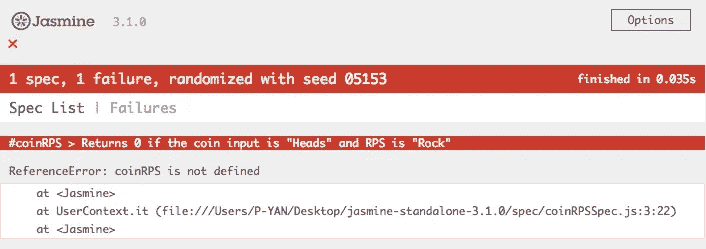

# 有条件的硬币投掷与石头剪刀布

> 原文：<https://medium.com/hackernoon/conditionally-flipping-a-coin-and-rock-paper-scissors-1174c0e4ff95>

在最近闷热的世界热浪中，前几天我被安排了一次技术测试。在里面，我需要写一个函数，根据它的 6 种组合输出 0 到 5。在这个例子中，我会说我们想把抛硬币**和**玩石头、布、[剪刀](https://hackernoon.com/tagged/scissors)的结果转换成一个从 0 到 5 的数字。


In Perth I remember seeing a Heads or Tails game in their casino!

看似简单？也许对某些人来说是这样，但对其他人来说就不是这样了。我尽量避免称事情为“容易”或“简单”,因为这有点武断。事情对一些人来说很简单，对另一些人来说就不那么简单了。真正做的只是让那些觉得困难的人泄气，并给那些不困难的人一点自我激励。这无助于创造一种没有威胁、不问问题是愚蠢的文化，这将有助于让更多的人进入[编码](https://hackernoon.com/tagged/coding)。#磨我的齿轮。

# 写一个失败的测试

让我们首先为它编写一个测试。在编写代码之前先编写测试是一种普遍认同的良好实践(也称为 TDD，测试驱动开发)。这可能看起来很奇怪，但是这允许开发人员在编写代码之前有一个很好的思考过程。

一个经过良好测试的程序也会给代码一个质量和可靠性的保证，因为当事情被添加或改变时，测试会给出问题在哪里的可见性。

让我们设置[茉莉](https://jasmine.github.io/)。出于某种奇怪的原因，他们的文档漏掉了最简单的安装版本，那就是下载一个[压缩安装程序](https://github.com/jasmine/jasmine/releases)并将其添加到你的文件夹中。完成后，在你最喜欢的文本编辑器中打开它。


Folder structure of Jasmine standalone. By default there are example files there.

文件夹是存放 Jasmine 的地方，所以不用担心。我们关心的是`spec`和`src`文件夹。`spec`文件夹是威尔编写测试的地方，而`src`文件夹是我们的代码所在的地方。然后我们将两个文件都放在`SpecRunner.html`中，这样它就可以通过加载来在浏览器中运行测试。


Opening up SpecRunner shows their default tests

好了，让我们为测试和代码创建自己的空白文件，并将它们放入`SpecRunner.html`


Follow the comments in the SpecRunner.html on where to put your files

让我们编写测试！

```
describe('#coinRPS', () => {
    it('Returns 0 if the coin input is "Heads" and RPS is "Rock"',    () => {
        let result = coinRPS('Heads', 'Rock');
        expect(result).toEqual(0);
    });
});
```

测试是这样写的。`describe`块是一个函数，第一个参数是描述测试的字符串。我通常只写#[function]来显示它在讨论哪个函数。第二个参数是另一个函数`it`，它和 describe 做同样的事情，但是这次我们写了一个更详细的描述。

`it`函数的第二个参数是另一个函数，它包含我们的代码和创建我们想要的结果的步骤。

所以对于我们的函数`coinRPS`，我们知道我们想要接受两个参数，一个是硬币，一个是字符串形式的 RPS。我们也知道我们希望结果返回一个从 0 到 5 的数字。

我们的函数`coinRPS`被调用并分配给`result`。然后我们比较`result`的值，看它是否为零。

这绝对是一个超级混乱的结构，函数中有函数，但是如果你坚持使用它，你会习惯它，希望它会有帮助！

让我们在浏览器中检查我们的测试。转到 SpecRunner 并点击刷新。



Test fails because coinRPS function doesn’t exist yet!

好酷。让我们写一些代码进去。

```
function coinRPS(coin, RPS) {
    return 0;
}
```

这都会过去的。


First passing test!

编写一个失败的测试，然后让它通过的过程就是为 TDD 所做的。下一步是为返回 1 编写一个。你朝着最终目标迈出的每一小步。但是为了节省时间，我将为所有的结果编写一个测试。

```
describe('#coinRPS', () => {
    it('Returns 0 if the coin input is "Heads" and RPS is "Rock"', () => {
        let result = coinRPS('Heads', 'Rock');
        expect(result).toEqual(0);
    });
    it('Returns 1 if the coin input is "Heads" and RPS is "Paper"', () => {
        let result = coinRPS('Heads', 'Paper');
        expect(result).toEqual(1);
    });
    it('Returns 2 if the coin input is "Heads" and RPS is "Scissors"', () => {
        let result = coinRPS('Heads', 'Scissors');
        expect(result).toEqual(2);
    });
    it('Returns 3 if the coin input is "Tails" and RPS is "Rock"', () => {
        let result = coinRPS('Tails', 'Rock');
        expect(result).toEqual(3);
    });
    it('Returns 4 if the coin input is "Tails" and RPS is "Paper"', () => {
        let result = coinRPS('Tails', 'Paper');
        expect(result).toEqual(4);
    });
    it('Returns 5 if the coin input is "Tails" and RPS is "Scissors"', () => {
        let result = coinRPS('Tails', 'Scissors');
        expect(result).toEqual(5);
    });
});
```

如你所见，这里有相当多的重复。在编程中，保持代码“干燥”(不要重复)是一个好习惯。但是对于测试来说，这是可以的，因为我们的目标是首先编写质量测试。

让我们看看做这件事的一些不同的方法；

# 六种解决方案，好的，坏的和难看的！

可能最常见的方法是直接上 6`if statements`；

```
function coinRPS(coin, RPS) {
    if (coin === 'Heads' && RPS === 'Rock') {
        return 0;
    }
    if (coin === 'Heads' && RPS === 'Paper') {
        return 1;
    }
    if (coin === 'Heads' && RPS === 'Scissors') {
        return 2;
    }
    if (coin === 'Tails' && RPS === 'Rock') {
        return 3;
    }
    if (coin === 'Tails' && RPS === 'Paper') {
        return 4;
    }
    if (coin === 'Tails' && RPS === 'Scissors') {
        return 5;
    }
}
```

它过去了，通过在你的`SpecRunner`上看到这个屏幕来享受多巴胺带来的快感吧！


它看起来有点像 switch 语句，让我们试试。

```
function coinRPS(coin, RPS) {
    switch (true) {
        case coin === 'Heads' && RPS === 'Rock':
            return 0;
        case coin === 'Heads' && RPS === 'Paper':
            return 1;
        case coin === 'Heads' && RPS === 'Scissors':
            return 2;
        case coin === 'Tails' && RPS === 'Rock':
            return 3;
        case coin === 'Tails' && RPS === 'Paper':
            return 4;
        case coin === 'Tails' && RPS === 'Scissors':
            return 5;
        default:
    }
}
```

嗯，这实际上看起来一点也没有节省空间。事实上，在每次返回之后，它可能需要一个`break`，这看起来像是更多的代码。

嗯，这是一个很大的重复，如何使用一种树的格式呢？

```
function coinRPS(coin, RPS) {
    if (coin === 'Heads') {
        if (RPS === 'Rock') {
            return 0;
        }
        if (RPS === 'Paper') {
            return 1;
        }
        if (RPS === 'Scissors') {
            return 2;
        }
    }
    if (coin === 'Tails') {
        if (RPS === 'Rock') {
            return 3;
        }
        if (RPS === 'Paper') {
            return 4;
        }
        if (RPS === 'Scissors') {
            return 5;
        }
    }
}
```

这有点失去* **一些** *重复？但是我们在重复中失去的，在花括号中似乎增加了:/

好吧，我听说三元运算符擅长丢失括号，让我们试试？Ternaries 具有以下格式

`[conditional statement] ? [result if true] : [result if false]`

我怀疑这必须使用嵌套的 ternaries，就像

`[conditional statement] ? [result if true] : [another conditional statement if false] ? [result if false then true] : [result if false then false]`

头疼吗？看起来一点也不困惑…

```
function coinRPS(coin, RPS) {
    return coin === 'Heads'
        ? RPS === 'Rock'
            ? 0
            : RPS === 'Paper'
                ? 1
                : 2
        : RPS === 'Rock'
            ? 3
            : RPS === 'Paper'
                ? 4
                : 5;
}
```

但从好的方面来看，括号肯定少了，所以这一点很重要！然而，为了可读性，我不得不说它的级别很低，感谢上帝我写了这个测试来帮助我！

好吧，也许换个方式。为什么不把结果写出来，然后进行匹配呢？#ThinkingOutsideTheBox

```
function coinRPS(coin, RPS) {
    let outcomes = {
        0: 'Heads Rock',
        1: 'Heads Paper',
        2: 'Heads Scissors',
        3: 'Tails Rock',
        4: 'Tails Paper',
        5: 'Tails Scissors',
    };

    let input = coin + ' ' + RPS;
    let result;

    Object.values(outcomes).forEach((value, index) => {
        if (value === input) {
            result = index;
        }
    });
    return result;
}
```

好了，这里我们得到了一个哈希表`outcomes`。`input`从 coin 和 RPS 中获取字符串，并在它们之间添加一个空格，就像哈希值中的字符串一样。

`Object.values(outcomes)`循环遍历我们的哈希表`outcomes`的值，如果它与`input`匹配，它将把索引号分配给结果，也就是我们的编号！

我们可以用一些 ES6 模板字符串做一点重构，然后把它三进制化！

```
function coinRPS(coin, RPS) {
    let outcomes = {
        0: 'Heads Rock',
        1: 'Heads Paper',
        2: 'Heads Scissors',
        3: 'Tails Rock',
        4: 'Tails Paper',
        5: 'Tails Scissors',
    };
    let result; Object.values(outcomes).forEach((value, index) => {
        value === `${coin} ${RPS}` ? (result = index) : null;
    });
    return result;
}
```

Template strings 使用反斜线` `并在其中使用${}作为变量，在这种情况下，我们可以使用传入的参数 coin 和 RPS。

但是等等！你猜怎么着为什么不用数组来节省更多宝贵的屏幕空间呢！

```
function coinRPS(coin, RPS) {
    const outcomes = [
        'Heads Rock',
        'Heads Paper',
        'Heads Scissors',
        'Tails Rock',
        'Tails Paper',
        'Tails Scissors',
    ]; return outcomes.indexOf(`${coin} ${RPS}`);
}
```

`indexOf`是一个循环遍历数组的方法，如果找到一个匹配，就返回它的索引位置。非常适合我们在这里想做的事情！

我认为编写代码最困难的事情之一是在可读性和灵活性之间找到最佳平衡。你希望它是能够被大多数开发人员理解的代码，因为几乎所有的编码人员都在一个团队中工作。

人们来来去去，或者你可能会回到一年前自己写的代码。我认为嵌套三进制解决方案是一个很好的例子，是一个聪明的解决方案，但是确实缺乏可读性，除非你经常使用三进制，而大多数开发人员可能都不是这样。

然而，很难找到正确的平衡，不同的人对他们认为这条线应该在哪里有不同的看法。

不管怎样，我要去花几个小时的时间玩掷硬币和玩石头、剪子、布(又名[炉石](https://playhearthstone.com/en-us/))，直到下一次快乐的编码！