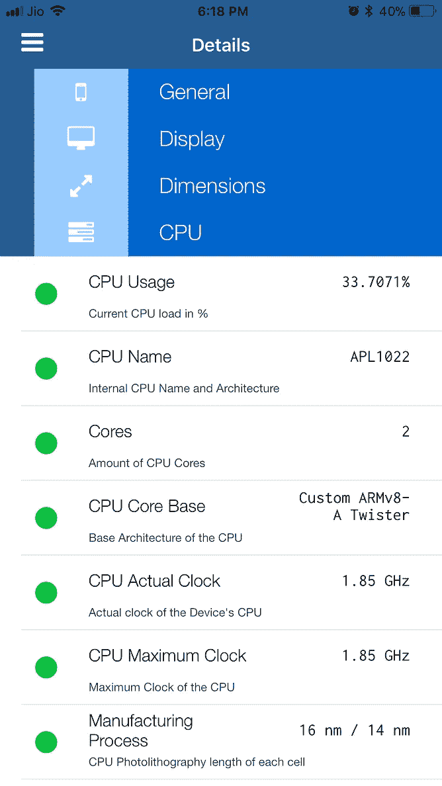

# 一名电池滥用者的自白

> 原文：<https://medium.com/hackernoon/confessions-of-a-battery-abuser-7a895c3c1b67>

Photo by [rawpixel.com](https://unsplash.com/photos/yqIY6phL3lk?utm_source=unsplash&utm_medium=referral&utm_content=creditCopyText) on [Unsplash](https://unsplash.com/?utm_source=unsplash&utm_medium=referral&utm_content=creditCopyText)

[*(点击此处*](/hackernoon/confessions-of-a-battery-abuser-7a895c3c1b67?source=friends_link&sk=671541a0b24c2b8b05072e0aa9b1cbed) *如果你被收费墙挡住了就看这个故事)*

苹果公司最近对抑制 iPhone 性能的道歉将焦点放在了 iPhone 电池上。我一直试图了解更多关于这个手机组件，我从来没有真正重视。这篇文章是我试图理解我从不同来源所了解到的东西。

反正我一直很疑惑手机充电的正确方式。我记得我虔诚地每月一次完全耗尽我的电池，因为我读到过，否则电池会“忘记”它的容量。当我的一位技术朋友解释说锂电池不会忘记它们的容量，耗尽它们实际上会缩短它们的寿命时，我停下了。过了一段时间，我才知道通宵给电池充电对手机不好。我不明白为什么，但停止了这种做法，以防索赔是真的。

在这一点上，我被不同的技术专家关于如何给你的电池充电的相互矛盾的建议弄糊涂了。我问自己，如果我的充电实践出错，最糟糕的情况是什么？答案是我必须更换电池。

很有可能我的充电习惯是错误的，所以我想我还是接受自己迟早要更换电池的现实吧。如果我想充分利用我的电池，我应该利用它 100%的容量。就像如果我要去户外，充满电的电池会持续更长时间。

那个决定简化了我的生活。每当我在充电点附近时，我都会给手机充到 100%的电。根据我过去的经验，我避免通宵充电，并给自己买了一个电池组，以防止我的手机完全耗尽。

这就是我的 iPhone 6S Plus 在过去两年中经历的电池状况。最初，这似乎是一个不错的策略。晚上睡觉时，我会让手机充满电并断开电源，早上醒来时会发现电池仍然充满电。但是两年后，手机电量消耗的速度开始加快。现在是下午 5.30，现在是 50%，尽管我并没有怎么使用它。我把它归因于老化的电池。

在这两年中，电池技术开始得到更多的关注，因为世界对化石燃料的幻灭，以及对像特斯拉这样的电动汽车的关注。

电动汽车开发人员发现，将电池充满电和放电至零都会缩短电池寿命。为了最大限度地延长电池寿命，电动汽车电池被设置为在电池电量达到 25%左右时提醒用户需要充电，而充电器会在电量达到 85%时自动切断充电。我猜这意味着电动汽车将显示 25%为“空”，85%为“满”

如果电动汽车如此偏执于过度充电和充电不足，为什么手机不呢？嗯，电动车电池不同于手机电池，因为更长的正常运行时间没有延长电动车电池寿命重要，原因很简单，电池是电动车中更昂贵的组件。

在四处寻找了一下之后，我发现了一个名为[电池大学](http://batteryuniversity.com/learn/article/how_to_prolong_lithium_based_batteries)的网站，该网站似乎一直在对电池进行一些认真的研究。用图表和数字有点难，但让我总结一下我能理解的。

基本上，由于两个因素，电池受到压力并失去其功率容量。首先是热度。如果你把电池放在炎热的环境中，它会更快地老化。第二个因素是保持电池充满电。

哎哟！

我又一次错了我的手机电池策略。我并不感到惊讶，因为墨菲定律一直适用于我。

书呆子警报！

抱歉，我要进入“书呆子模式”了，因为我的好奇心被激发了。

Predictive modeling of battery life by extrapolation. Credit: [Battery University](http://batteryuniversity.com/learn/article/how_to_prolong_lithium_based_batteries)

我的充电周期是什么-放电到 100%。根据电池大学的说法，那会导致我的电池一段时间后容量下降到 48%(准确的说是 14000 次充电循环)。如果我坚持 25%-75%的充电周期，我的电池容量在同一时期只会减少到 74%。将充电周期增加到 25%-85%会导致容量在同一时间段内下降到 64%。

简而言之，如果我想让我的电池更持久，我就不应该充电到 75%以上，也不应该让它放电到 25%以下。当然，折衷的办法是，我将不得不学会忍受比 100%充满电的电池容量(正常运行时间)更少的情况。

我不确定我能否接受这种妥协。我的意思是，如果电池不能持续一整天，那么拥有手机又有什么意义呢？另一种方法是将电池充电到 100%,当电池老化时就更换它。

重要的事情，首先。我的电话被节流了吗？

谷歌拯救了我。发现节流问题的网站 Geekbench 有一个名为 Geekbench 4 的 0.99 美元的应用程序。我下载了它并对它进行了基准测试，然后将其与我的手机型号的实际基准进行了比较。据我所知，Plus 型号没有受到节流的影响。Geekbench 测试证实了我的手机没有被节流。我的手机得到了 2368 分，而型号基准为 2400 分。

Geekbench 的所有 99 美分的应用下载量肯定会增加，但我想 Geekbench 应该得到它。不过，你也可以通过一个名为 [Lirum Device Info Lite](https://itunes.apple.com/us/app/lirum-device-info-lite/id591660734?mt=8) 的免费应用程序来检查节流情况。你必须点击“这个设备”,然后点击 CPU。正如你在下面看到的，我的手机上的 CPU 实际时钟和 CPU 最大时钟是相同的，这意味着它没有被节流。

Checking for throttling and battery wear via the GeekBench 4 and Lirum Device Info Lite apps

Lirum 也提供了一些关于我的电池的信息。电池磨损水平为 90%,因为充满电仅达到 2500 毫安时，而不是原来的 2750 毫安时。

为了仔细检查，我下载了一个名为[电池寿命](https://itunes.apple.com/us/app/battery-life-check-devices-runtimes/id1080930585?mt=8)的免费应用程序(注意:底部有广告)。它证实了我的手机电池的容量下降了 8%，在使用两年后，这还不算太糟糕。这意味着在充满电的情况下，我的电池可以提供 92%的 2725 毫安时的电量。事情是这样的，过了一会儿，应用程序显示磨损是 12%，这是平均水平。看起来确实是系统需求导致我的旧电池表现不一致。见下文。

电池寿命应用程序没有告诉我我的手机进行了多少次充电的细节。谷歌带我找到了一款名为 [CoconutBattery](http://www.coconut-flavour.com/coconutbattery/) 的 Mac 应用，它可以从我的 Mac 电脑上检查我的手机。以下是我用了两年的 iPhone 6S Plus、五年的 iPhone 4 和六年的 iPad 3 的测试结果。

我的 iPhone 6S Plus 目前的充满电容量为 90% (2467mAh)，并与电池寿命 app 匹配。它说我的手机已经完成了 405 次充电。这只是猜测，但我认为我不断给电池充电的习惯可能意味着我的手机已经完成了更少的完全充电周期。这并没有给手机带来任何好处。持续的 100%充电似乎给我的电池带来了压力，这可能是其容量在短短两年内降至 90%的部分原因。相比之下，5 年的 iPhone 4 仍有 85%的容量，而 6 年的 iPad 3 只有 83%的容量。

Windows 用户可以使用名为 [iBackupBot](http://www.icopybot.com/download.htm) 的应用程序的试用版。它不像椰子电池那样光滑，但似乎很管用。你可以在 Mac 上安装这个应用程序(PC 应用程序也在同一个页面上)，点击“设备”下的手机，然后点击右栏中的“更多信息”。请参见左侧的红色箭头。

2 year old iPhone 6S Plus

出于好奇，我在我妻子不到六个月的 iPhone SE 上运行了一些测试。她把它充到 100%，经常忘记给它充电，直到它关机。Geekbench 表示，这款手机没有被节流，实际上运行速度为 2559 比 2410 更快。Coconutbattery 表示，这款手机已经进行了 52 次充电，电池电量为 95.6%，而 Lirum 的电池电量为 98%。有意思。

Test results on a 6-month old iPhone SE

结论
我的 iPhone 目前没有被节流。我确实注意到，当手机发热时，我的电池容量会减少。您可以看到，随着温度从 31.6 摄氏度时的 1552 毫安时下降到 30 摄氏度时的 1554 毫安时，然后再次下降到 29.7 摄氏度时的 1555 毫安时，电池容量实际上在增加。见下文。

保持手机凉爽似乎可以延长电池寿命，当充电到 100%时，手机确实会变热。

明白了。

我手机电池的磨损程度在 8%到 12%之间。这似乎并不多。但这种不一致令人担忧，因为它表明电池可能会因系统需求而突然耗尽，手机可能会突然关机。这正是苹果用旧电池抑制 iPhones 的原因。看起来我的手机电池是苹果 29 美元更换计划的主要候选。

印度没有苹果商店，所以我打电话给当地的苹果经销商。他说我的手机要检查，看每个硬件部件是否处于工作状态。如果一切顺利，他们将以₹2250(36 美元)的价格更换电池。整个过程需要 4-5 天。我可能会接受这个提议。

最后一件事。

我一直在重新考虑 75%-25%的充电周期。我开始认为我不能妥协使用我的电池的全部容量。后来我突然意识到，我可以随时使用充电站或电池组，很少使用 100%容量的电池。

我想我会停止给我的电池充电到 100%来延长它的寿命。

更新:我路过我的苹果经销商(写完上面的帖子几周后)，顺便让他们检查我的手机。服务台的女士将我的手机连接到苹果在线，并进行了免费检查，之后她宣布，它的电池只运行了 410 次充电循环，所以它是好的。我的 CoconutBattery 应用程序两周前说 405 次循环，所以苹果没有告诉我任何我不知道的事情。我询问了折扣电池更换计划，她告诉我，我的手机有资格参加该计划。然而，由于该计划全年有效，她建议我在 11 月份更换电池。苹果似乎建议你只在 1000 次循环后更换电池，到 11 月份，我仍将只超过 600 次循环，但最大限度地利用我现在的电池。她说成本是₹2000 或 32 美元(可能加上 10-12%的税)。如果这款手机能撑到 11 月，我可能会照她说的做，因为这会让我的手机重获新生。我说“可能”,是因为科技正以闪电般的速度发展，所以提前做那么远的计划是没有意义的。