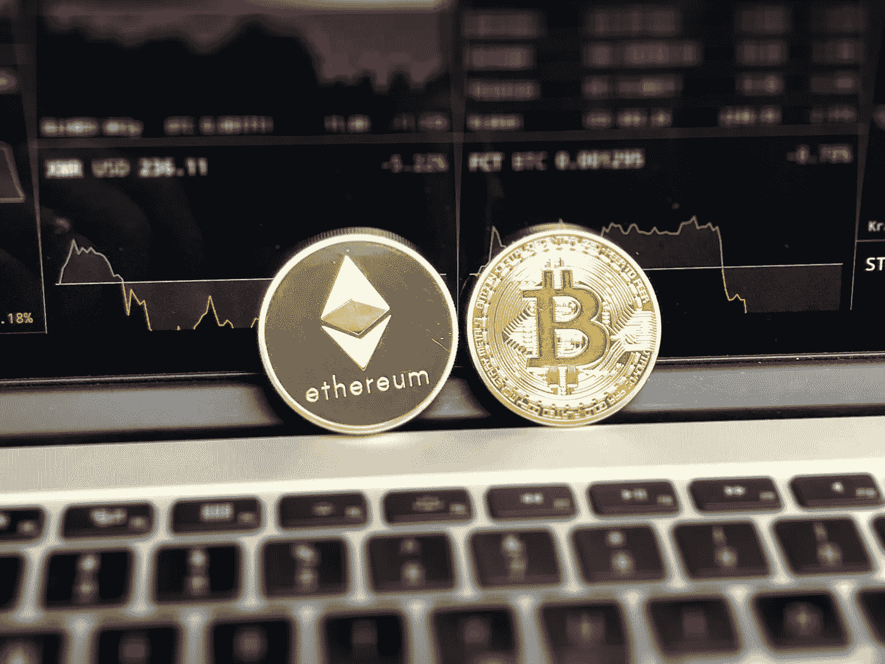

# 中国密码业内人士的自白

> 原文：<https://medium.com/hackernoon/confessions-of-chinese-crypto-insiders-71c8be58948e>

## A liberal translation of 深访币圈：享受过一夜暴富，你再也忘不掉捷径 by 甲子光年(Jazzyear)，edited by 甲小姐，采访 and written by 火柴 Q (Manqi Cheng)

*(所有内容归功于以上作者；你可以对我华丽而自由的翻译给我一点小小的赞扬😎 *)**

T 这是我将着手的一系列新翻译的一部分，以帮助阐明区块链和中国加密货币的思想和趋势。我注意到，在中国公众意识和世界其他地方对它的了解之间，存在着巨大的差距。正如一位朋友曾经说过的，

> 据我所知，这就像存在两个媒体世界，一个在中国，一个在西方。

之所以选择这件作品，是因为我最近帮助 [CryptoKitties](https://medium.com/u/c8b1419b5d28?source=post_page-----71c8be58948e--------------------------------) 在中国上市；作为发布的一部分，他们与中国加密货币钱包 [Cobo](https://medium.com/u/d5b522b2f9f7?source=post_page-----71c8be58948e--------------------------------) 合作，该钱包吸引了中国加密界的 6 位贵宾人物，与 CryptoKitties 一起在中国发布他们的应用程序。许多人问我这些人是谁(用英语)，我偶然看到了这篇报道他们故事的文章。

我在我认为有用的地方写下了引用的评论。总的来说，我已经把每一个单词、每一行和每一个表达都变成了可以用英语表达的东西，并且在写作风格中加入了许多戏剧性的变化，让你们觉得有趣。尽情享受吧！

在中国，有一句至理名言:

> 生死有命，富贵在天，天堂地狱，一念之间。
> 
> 生死是命运的问题，
> 
> 破衣烂衫和财富，纯粹是意外之喜。
> 
> 天地之间的空间，
> 
> 只存在于知觉差异中。

在一个月的旋风中，我们在中国和美国追逐加密投资者和信徒:最有见识的内部人士；赚了几十亿的投资者；世界上最大的莱特币矿池的拥有者；一个投资 20 万只赚回 4 万的四线城市公职人员…

> ***备注*** :货币均为人民币，除非注明为美元

T 他疯狂的加密货币趋势为人类最原始的情感创造了一个舞台，不断上演，*充满喧嚣和愤怒，毫无意义*:贪婪、恐惧、痛苦和对失去“秘密宗教”的绝望。密码的力量大于角色本身，演员在潮流面前束手无策。即使你很早就加入了，精通技术，人脉也很广，这仍然不能保证你会 100%完好无损地离开现场。

一些阵营相信“你不应该投资于你不了解的东西”，就像沃伦·巴菲特一样，而明显更多的人相信“没有风险，就没有回报”。中国人现在日复一日地被这个问题逼得精疲力尽:**你已经错过了互联网繁荣和房地产繁荣，这次你真的敢错过比特币吗？**

对于那些*已经*赚了钱的更幸运的人来说，一旦你赚了一次大钱，享受了一夜之间的成功以及随之而来的巨大的自我提升，你就再也无法习惯“赚更少钱”的压抑状态；你不能再放弃这样的想法:一定有更容易、更快捷的方式来赚更多的钱。

在一个财富与你擦肩而过的世界里，你可能会失望无数次。

# 十亿美元聚会

如果你能在地图上叠加个人财富总量，会怎么样？如果你知道，那么在 2017 年的一个冬夜，你会发现 FFC 大厦附近的一家咖啡馆突然亮起了天文数字的灯光。

10 亿美元对今年来说还不够。正如一位秘密影响者所说，“这个行业的财富是外行人甚至无法想象的。”

那天晚上是一个私人聚会，展示了区块链的各种投资。在这个不到 300 平方米的地方，左右各站着 70 个座位区；外环容纳了 100 多人，人们从二楼通过楼梯涌向一楼。

在混乱之中，隐藏着一种有序的表象——毕竟，区块链是一种去中心化的技术，而这种聚会是一种去中心化的聚会:

你可以看出谁是先驱，谁最早进入这个行业；他们不急着找座位，也没有注意舞台上发生的事情。他们似乎很自然地聚集在楼梯旁边的场地边上。在那里，他们忙着问候只在网上认识的朋友，建立合作关系，扫描二维码，一行行地说“很高兴见到你”和“很高兴见到你本人”。

与会者被明确划分为“组内”和“组外”，这反映了区块链和社区中加密货币玩家的现状。当我们说“社区”时，它由该国最早采用加密货币的人创建的讨论论坛、聊天小组、博客和社交网络组成。

在这次活动中，“圈内人”聚集在后排。他们要么是技术性的，被天才的[比特币](https://hackernoon.com/tagged/bitcoin)和潜在的技术前景所迷惑；或者他们是顽固的投资者，他们不关心技术，但当技术出现在他们面前时，他们可以嗅到机会。

坐在前排和舞台上的人是“异类”:他们随着主流的潮流而来，随后个人和组织也加入进来。

虽然他们的名字在圈内人士之外意义重大，比如 IDG、红杉和真格基金，但在这里……在这里，后排的人对他们报以宽容和略带屈尊俯就的微笑，低声说出他们对他们的真实看法:“看，一条鱼。”

> **Comment**: Called 韭菜 in Chinese, which is an amaranth (a type of vegetable), or fish in English context, is someone who entered the market late, bought high and sold low. So by all counts, a noob investor.

当天真格基金的合伙人郁森戴出场时，也加入了后排。最近有传言说他最近在市场上损失了 50 万美元，但另一个传言是他以前赚了更多。

半个月后，真格基金的创始人 Bob Xu 在一大群社会观众面前跳上舞台:伴随着他的信息(当然，它立即被转发了很多次，像病毒一样传播)的一个指示，他大声疾呼:“亲爱的 CEO 们，[革命来了。这是一场技术革命，跟随的人繁荣，反叛的人死亡。”](https://hackernoon.com/tagged/blockchain)

第二天，区块链角度的公开股票价值爆炸性地增长了 5.47%。阴谋论很快出现，指向鲍勃徐通过他的“信息泄漏”故意操纵情绪。

在任何情况下，即使 Bob Xu 真的出现了，他也很难击败资本的创始人周硕基，或者他们所说的加密社区的“部落首领”。这家风投公司在社区中有着不可否认的地位——当族长来到后排时，人们成群结队地围着他；双手向四面八方伸出，一大堆 iPhone X 伸出手来扫描他的微信二维码，发送好友请求。

他穿着标准的程序员套装，穿着格子衬衫，戴着一副老师般的金边眼镜，微笑着站在那里。尽管他总体上看起来有点尴尬，但这只是为了强调事情的真相——如果你真的是一个严肃的人，你不需要担心仅仅是客套话。

当被问及区块链和 crypto 时，他简单地回答说:“我不会在中国媒体上发出声音。”与热衷于在 500 人的群体中大喊大叫的鲍勃·徐不同，这位族长天生喜欢低调。

那天晚上没有提供饮料，但后排的谈话比酒精更令人陶醉和兴奋。有人说拿到了牌照，准备在中东开交易所；另一个人提到他们下个月将开启 IFO 回合；还有一次是在现场对新的 ICO 分配得出结论。

当然，咖啡馆里还有另一个形象，代表了街上大多数人的形象:完全的新手，也就是“没有创造者”。如果他们不小心，他们会变成鱼。

“Do you know what 梭哈 *(loosely translated: stud poker)* is?” a young man, born in 1996 asked, after he was hounded about his views on blockchain for more than 30 minutes.

"是的，那是一种扑克牌游戏."

四周，五六个人开始爆发出笑声。

“你怎么会不知道？意思是把钱往 ICOs 里塞。”

那天晚上，他喝下了最烈的一杯酒:“你知道吗？今天，有人投入了 2 万英镑，通过把它塞进一个 ICO，他已经赚了 2 亿英镑！”

这些“梭哈”们。

J une 2017:李笑来 PressOne 项目进行了一次 ICO 在他们发布白皮书之前，他们已经筹集了 8200 万美元的代币。JavaScript 创始人 Brendan Eich 的 BAT ICO 非常受欢迎，以至于他们的 token 站点崩溃了；他们想通过以太网筹集 1500 万美元，但是仅仅 24 秒钟，ICO 已经筹集了 3500 万美元。

这次聚会感觉像是“梭哈”浪潮的例证；随着市场的咆哮和下跌，那些处于边缘的人抬起头来展示他们的力量——而那些原本在最佳位置的人失去了他们的优势。当风投想进入 ico 时，他们基本上被挤出了市场，因为所有的配额都被后排的人抢购一空。

后排的人，他们最清楚这一点。有人说:“只有当一个项目被社区鄙视时，风险投资才有机会染指它。”

"如果你想来玩我的游戏，你就得按我的规则来玩。"

虽然，平心而论，在这个自由、新鲜、不受监管的世界里，T2 没有规则这回事。

# 我参加这场比赛是为了赚钱，但它成了我的信仰

仅仅看过去几年，你很难找到人们如何通过加密赚钱的概括。一些人通过采矿致富，一些人开始开采矿藏，一些人在市场上交易，一些人发行代币，一些人在他们的“梭哈”游戏中将钱投入 ico。

很难说每个人有多少密码。在新闻中，李笑来之前透露他有价值六位数的比特币；南瓜张，他的矿业公司最近申请私下交易，曾拥有 6 万个比特币；文克莱沃斯双胞胎持有 10 万个比特币；而绰号“比特币耶稣”的罗杰·弗(Roger Ver)拥有 3 万枚比特币。

这不是一个全面的数字，但目前在主要交易所，有超过 1600 种硬币，总流通市值(不包括锁定硬币)超过 5 万亿元人民币，日交易量为 5 亿元人民币，日交易量可与上海和深圳的总和相当。

评论人 YanChunFangNiuLang(一个复杂的中文昵称，翻译为“在一个烟雾弥漫的村庄里放飞牧羊人”)曾写道:“在与许多从股票投资跳到加密投资的投资者互动后，2017 年，10x 回报只是一个开始，30x 回报几乎没有意义，只有 100x 回报才值得称赞。”

俗话说，“在密码世界里的一天就是在现实世界里的一年”。随着加密技术的剧烈波动，它与整个历史上的任何其他资产类别相比都是无与伦比的——因此，它也创造了许多不为人知的损失故事。

大空翼 (translated as “Large wings”, romanized “Dakongyi”) is a legend in the community. You can’t even see him at the back row of the meetup, since he simply doesn’t show up in person to events.

据传闻，出生于 90 年代的大空一已经在密码市场赚了数十亿。

“几十亿？”大孔一声大笑。“中国肯定有人赚了这么多。”

他很快接着说，“虽然我有一半认识已经认识的人。”

他说他最初投资的总规模只有 2 万元。2013 年，大学二年级期间，他从英国回国。他在淘宝上仔细搜寻零件，最终组装成了一个采矿钻机；修理钻机的总费用是 2 万英镑。当时，GPU 的计算能力不足以挖掘比特币，因此他挖掘了各种随机替代币，如 WDC 和 FeatherCoin。当他的暑假结束时，他已经开采了足够的矿石来交换 80 BTC。那时，BTC 的价值是 4K 元，大空一就是这样在 10K 的加密技术上赚了第一笔钱。

“起初，我加入这个市场是因为我想赚钱，”大孔一说，但随着时间的推移，他意识到他的态度开始改变。“我成了真正的信徒。”

他最初的信念来自于社区中杰出人士的钦佩。大空一认为，世界上最顶尖的人才和思想家都在中国的密码界。这些人才正在努力推动去中心化的概念，不知疲倦地致力于底层协议，但总是与社区分享他们工作的成果。根据他的理解，市场迅速崛起的原因是对他们努力的认可，以及对技术的认可。

T 中国社区的早期文化让人想起 20 世纪 70 年代湾区的“嬉皮士运动”。其成员拥护无政府主义和自由主义，拒绝公开监督和限制。

问题在于，人类历史上从未出现过无政府主义乌托邦。过去，在互联网的早期，同样的承诺是以匿名和去中心化的名义做出的。然而，经过几十年的发展，互联网的乐土现在已经演变成我们今天认识到的现实:垄断、集中化和监管。因此，从阴影中，区块链已经冲向前，作为这些原因的革命旗手的位置；它在这里为互联网的原始信徒服务，互联网的现状让他们失望，让他们心碎。

不幸的是，太阳底下没有什么是真正新的；比特币曾预示着去中心化理想的复兴，如今却变得越来越中心化。根据瑞士瑞信银行对交易地址的分析，全球 97%的比特币由 4%的参与者拥有。一小部分人已经控制了大部分计算能力和比特币的分配。

虽然赚钱是一件好事，但对于宗教人士来说，价值的提升代表着对社区的认可，代表着信仰的实现。

而真正让大空一发迹的，是后来的一个传奇版本:IOTA。

IOTA 是一个典型的中国表达方式:“十年苦读无人注意，一旦获得荣誉，他的名声就传遍了大地。"

> **Comment**:十年寒窗无人问，一举成名天下知 can be more literally translated as, “After spending 10 years in front of a cold window, a sudden rise to fame and the whole world knows you.”

作为一种非区块链加密货币，IOTA 是在一种新形式的分布式账本上开发的——建立在 Tangle 之上。它的独特之处在于零交易费、快速转账以及可用于网上小额购物的潜力。

大空一说，IOTA 在 2015 年底提高他们的 ICO 时，中国在那一轮只有七八个参与者，其中只有两个还有点剩余:他和 Jimmy，IOTA 的中国社区经理。IOTA 当时募集了 1300 多个比特币，价值 300 多万元；—而每一个 IOTA 代币只有 0.001 元。

2015 年底到 2017 年 6 月，IOTA 真的很便宜。IOTA 的中文 QQ 群在 2017 年 5 月之前只有不到 300 名成员。当 2017 年 6 月 ICO 疯狂开始时，IOTA 的价值突然飙升，2017 年 12 月每个 IOTA 的价格为 36 元——比最初的 ICO 价格上涨了 350 万倍。大空一因此成为“世界传奇”，吉米报告说 IOTA 的 QQ 群发展到 4500 名成员。

Little Youth (as translated from his Chinese moniker 小青年, romanized “XiaoQingNian”) was one of the members of the IOTA community group. His alter-ego works as a fourth-tier city public official in a province in the South of China. Since he started investing in bitcoin in March 2017, Little Youth has been constantly distressed that although he entered into a bull market, he didn’t actually make much money.

事实上，当他开始加入这些高调的鲸鱼 QQ 群时，小青年恳求他拥有各种类型的硬币和代币，价值约 6 万美元——通过他赞美和奉承他人的诀窍。可悲的是，2017 年 9 月后，他在短期投机交易中失去了所有这些代币。在 Bitfinex 上，他利用 3.3 倍的保证金交易做空多种货币，最终损失了 20 万元。他挥霍了一切，包括他最初的投资和在 IOTA 社区做兼职的奖金。

他后来计算并意识到，如果他当时持有他赚的代币，他在顶峰时将拥有 500 万元的价值。

在这投机交易的年头里，小青年每天都生活在不确定和焦虑的阴影中。他会强制性地至少每小时查看一次市场数据。他认为自己在 4 月份卖得太早了；即使他从那次交易中赚了 20 万元，他仍然非常不开心。他看着市场不断攀升，变得沮丧。

他目睹了 QQ 群中的社区成员炫耀他们的账户，他们在那里投入了 2 万元资金，一年内赚了 800 万元。另一端，他在那里，投入 20 万元资金，只赚了 4 万元。在同一个地方巡回了一年，没有赔钱，也没有赚多少钱，小青年在内心深处觉得自己是个失败者。“我从未听说过有人损失惨重，所以我是最糟糕的一个。我进入这个市场，连一百万都没赚到。我是个彻头彻尾的失败者。”

尽管他患有抑郁症，但他仍然体验了其他人如何创造财富——因此，他继续无条件地相信加密的未来。他的结论是要看长远，而 HODL 要看临终。

他付费加入了一个团体，计划在 2018 年加入鲸鱼的“价值投资”。这些群组的订阅费为 388 元的青铜会员、2 个 ETH 的白银会员和 1 个 BTC 的黄金会员。群主在这个群里推广各种 ico 和新代币类型，小青年买了一个新代币叫 Hshare (HSR)。

> ***评论*** :有趣的是，Hshare 因其首字母(罗马化“红烧肉”)在中国被称为“红烧肉”而获得了发展势头。
> 
> ***Comment****:*In China, there was a service called 小密圈, translated “Little Secret Group” enabling influencers to monetize their access to firsthand information, or their qualified opinions, by posting to groups. People pay money or crypto to join these groups for privileged information, and the influencers make money from these subscriptions. It was taken down for hosting too many unregulated groups, but is now back in business, rebranded as 知识星球, or “Knowledge Planet”, following the same paid model.

HSR 已经被抽光了，所以当小青年买它的时候，它是 190 元，但在采访的时候，它已经滑落到 140 元。

“但我不会再改变主意了，”小青年深信不疑地说，“他们说这是一个抽水和倾倒，MLM(多层次营销)硬币，但我不会改变。我经历过，我不会动我的立场，我坚信它一定会再次崛起。”

# “不要只看着小偷享受他的掠夺，看着他遭受殴打”

> ***Comment***: Another expressive Chinese proverb, 别看贼吃肉，要看贼挨揍 basically means that you shouldn’t only admire people’s success, but also understand the difficulties they endured for them to get there.

我们再一次回到开头的那首诗:

> 生死是命运的问题，
> 
> 破衣烂衫和财富，纯粹是意外之喜。
> 
> 天地之间的空间，
> 
> 只存在于知觉差异中。

毫不夸张地说，这句警句完美地概括了加密世界的兴衰。

The world’s largest mining pool for Litecoin is f2pool. Its founder, 七彩神仙鱼, alternately called “Bitfish”, “Godfish”, more literally “Magical Discus Fish”, or romanized “Shenyu” says: “Recently within the community, people have taken to taking pictures with their index fingers pointing upwards, signifying ‘It will keep going up.’”

> ***评论*** :或者用我们相当的流行语来说，“向右上方！”

2017 年底出现了小规模的市场崩盘，比特币从 18000 美元跌至 11000 美元。

“在那几个小时里，通常喧闹的社区完全安静下来，没有人说一句话，”Bitfish 站在北京一栋大楼的电梯旁回忆起这件事时评论道。那是一个周末，但是 Bitfish 和他的团队经常在周末加班加点。“最后，有人打破了电台的沉默，他们的第一个问题是:‘我刚刚在底部买了一吨，还有人这样做吗？’"

就在他回忆那次做空事件的时候，他的手机响起了新的更新——这是他的团队开发的一款应用程序，它抓取并监控整个网络的实时新闻，以获取与加密市场和矿业的重要动向相关的信息。

Bitfish 拥有通信工程背景，在采矿芯片、采矿钻机和采矿池方面建立了业务，现在又多元化经营加密量子基金和钱包应用程序，是人们认为的加密社区中的“技术部落”。他从 2010 年开始在这个社区，经历了从 CPU 到 GPU 到 FPGAs 再到 ASICs 的计算能力爆炸。

但是即使技术熟练也不能保证你稳定。自 2013 年以来，该市场的许多长期参与者经常说，“霍德林就像寡妇一样”，“不要只看着小偷享受他的扒窃，要看他遭受殴打的时候”。

“W这里的‘烤猫’不见了”是中国密码界十大谜团之一。

烤猫, translated to “Grilled Cat”, was a top student at the Chinese Academy of Sciences. In 2012, he crowdfunded within the community to build “Butterfly mining rigs” (蝴蝶矿机) — this was the earliest forms of ICOs in China.

2015 年春节期间，麻烦的迹象出现了，该项目迟迟没有发放奖金——同年 1 月，“烤猫”变得无法联系。他的许多股东将他提升到了“神话巨人”的高度，他们眼睁睁地看着自己的信念崩溃。

一位社区内部人士透露，烤猫的失踪具有高度复杂性和多面性:首先，2015 年初，比特币的价值拼命下跌；其次，烤猫的采矿场与当地的水电局发生了冲突，尽管他的操作并没有违反法律——在这种狗咬狗的情况下，烤猫的采矿钻机全部被扣押；与此同时，他的家人正在经历一场紧急事件。

“所以，他跑了，也许出国了。没有人知道他今天是生是死。”

也许其他同样遭受挫折的人比烤猫幸运，尽管过去的经历在他们心中留下了一个洞。

The current operating owner of the blockhain media platform, 区块链铅笔 or “Blockchain Pencil”, is 暴走恭亲王 or (badly-translated) “Rampaging Prince Gong” or romanized “BaoZouGongQingWang”, which we shall going forward call “Baozou” (because the English translation makes no sense). He once collaborated with Bitfish on the “Silver Fish” (银鱼) mining rig project. They designed an ASIC chip that would be used specifically for Litecoin mining, and started mass production with Taiwan Semiconductor Manufacturing Company.

> ***Comment***: His name is absolutely hard to translate. 暴走 (baozou) is often used in the gaming context as “rampage” i.e. 4 consecutive kills in League of Legends, which is what I guess is the origin of the word. Another interpretation is a blander Chinese translation of the act of hiking, which I don’t think was the inspiration.
> 
> 原来的恭亲王是清朝一位有影响力的王子，通常被认为是中国现代外交的先驱，在与英国、法国和俄罗斯谈判后签署了《北京公约》。他在位期间也主持了许多改革。

最终，在 2014 年，莱特币从 380 元跌至 5 元，并稳定在 10 元左右。因此，Bitfish 为“银鱼”项目制定的宏伟目标毁于一旦。

正如宝走所说，“我所知道的所有鲸鱼都已经膨胀了，不会再膨胀了。”

2013 年是第一个“通货膨胀期”，社区里的人去了北京，开始探索买哪个*整栋楼*。然而，当比特币在 2014 年从 8000 元暴跌至 2000 元时，许多人咬紧牙关退出，甚至失去了可以利用的资本。

当采矿钻机项目在 2014 年陷入停顿时，Bitfish 回到他的家乡煨了半年。他把自己的血、汗和泪都倾注到了那个采矿钻机项目中，他真的很享受看到每个粒子形成一个芯片的过程和满足感；但最后市场无论如何都是在他的预期面前无情的冷淡。

同年，大空一把赚来的百万元吹得只剩 10 万左右。即使他仍然比最初的 2 万元投资翻了几番，他仍然感到情绪低落。

“人们就是不知道如何知足。我每天都拍着自己的大腿，心想如果我早点卖出去该有多好。”大空一在那两年里是如此专注于密码，以至于他没有精力投入到这项研究中。

在知乎(中国的 Quora)上，有一个问题被浏览了 200 多万次:“比特币的故事是否证明了你的人生是注定的？”

Blockchain lover, 神马疯了 (translated “Magical horses have gone crazy” or romanized “ShenMaFengLe”) gave a highly-rated answer:

“你只看到了比特币一帆风顺的 2017 年，它增长了 20 倍，突然突破了 10 万元。但你没有见证 2016 年，全球最大的交易所 Bitfinex 被抢走 12 万个比特币——有多少人因为杠杆而自杀？你不在 2015 年，当比特币大规模跌至 200 美元的时候，有多少比特币爱好者在孤独的夜里坐在家里，吃着泡面？你没感受到 2014 年，一些社团负责人是如何顶着巨大的压力把自己的房子卖了 48 万元去交易，挣扎了 5 个月，然后又被残忍地以 18 万元强制离场？你没有经历过 2013 年的悲剧，在 12 月比特币一路高歌猛进的同时，一条禁令是如何让中国的比特币大幅下跌 40%的？如果你在 2013 年进入比特币市场，有 99.99%的可能性你会*而不是*持有它到 2017 年，并且已经用你正在经历的所有痛苦和折磨折磨自己到失眠。所以事实是，你在快乐地玩游戏、吃披萨和购买 Snapchat 的同时避免了所有这些风险——有什么不喜欢的呢？”

中国密码社区的许多人都有这种心态的共同经历，正如开头提到的:

当你第一次赚了大笔钱，享受那种一夜成名带给你的快乐和自信时，之后就很难习惯“赚的钱少”这种赤裸裸的现实了。你会变得沮丧，你会发现很难接受这样一个事实:你再也找不到另一条通往同样财富和成功的捷径了。

# 谁会像一只被弓弦的响声吓了一跳的鸟:个人、公司还是国家？

C rypto 是一款多面、多人游戏；不仅个人的命运被不可磨灭地改写了，公司也是如此。

就在鲍勃·徐的聊天记录在网上疯传的同一天，拥有 129 年历史的百岁老人柯达公司宣布，他们将发行 KODAKCoin。他们的股价在同一天内暴涨了 120%。

甚至在此之前，2017 年 8 月，深圳迅雷网络技术有限公司(纳斯达克股票代码:XNET)宣布了他们的智能硬件“OneThing Cloud”及其相关令牌“WankeCoin”或“OneCoin”，现更名为“联科”或“链接币”，准备在区块链世界掀起风暴。他们今年的市值飙升了 400%。

中国时间 2018 年 1 月 9 日晚(GMT +8)，迅雷集团 CEO 雷震还在拉斯维加斯参加 CES，在这里他大受追捧地谈了他对联科的视角和策略。就在几十个小时后，1 月 12 日，迅雷被监管机构点名批评变相经营 ICO，至此被禁止。迅雷随后发布声明称，他们愿意接受指导和监督。当天，XNET 下跌了 27%。随后的公告证实，1 月 31 日，联科将完全停止转会。

另一方面，比特大陆开始成为一家矿业公司。它已经发展成为一个成熟的人工智能领导者和全能的 rockstar 公司，通过积极的企业转型和扩张为自己铺平了光明的未来。

比特大陆的聪明之处在于，它并没有把自己的命运和密码社区紧密地联系在一起。也许作为一家公司，他们很早就深刻理解了，在这个阐述匿名和去中心化的财富潮流中，自由的另一面是一个公司和个人，他们在一个不受保护和监管的世界中经常处于危险之中。

今天，许多持有大量密码的鲸鱼越来越担心，不仅担心他们的财产安全，也担心他们的人身安全。毕竟，数字资产只是字符串。他们会被绑架吗？

事实上，在最近一段时间，愿意接受媒体采访的加密社区的人数已经减少。一个担心是他们的财富暴露太多，另一个担心是新的规定正慢慢向他们袭来。

监管机构正在努力应对加密货币监管领域前所未有的挑战。

2017 年 9 月 4 日，七部委发布联合声明，禁止 ico。几天后，PressOne 和其他 ICO 逐步发布了 ICO 参与者的代币返还计划。即使中国政府强行禁止 ico，有事业心的中国团队还是踏上了“大迁徙时代”的征程，定居在日本、韩国、新加坡和中东，并在那里继续繁荣。

由于加密货币的分散性，严格的控制需要所有相关管理机构的一致努力和共识，这对大多数国家来说是不可能的。事实上，一些国家已经组建了“国家队”进入市场:朝鲜被发现拥有活跃的采矿节点；委内瑞拉发行了一种名为“Petro”的代币，与石油、钻石和黄金挂钩；在日本，加密货币被广泛接受为一种支付方式，甚至在实体店也是如此。

个人怕坐失良机，国家也是。

一些国家在追求数字货币和区块链方面走得更远，将民族自豪感和生存置于危险之中，认为:如果你现在不抓住机会，那么你作为一个国家的优势可能会在未来几轮激烈的国际竞争中被颠覆。

加密社区对事态的这种转变嗤之以鼻——区块链技术和加密货币，在中本聪设计的最初阶段，被无政府主义和反监管的基础所着色。多么讽刺的是，它现在被认为是“一种新的国家竞争手段。”

关于是否应该制定规章制度，以及这些规章制度应该是什么样的，这个话题暴露了这个群体内部的巨大分歧，在这个群体中存在着大量的意见分歧。

一种思路是，菲亚特和 crypto 无疑将一决雌雄。这两种不同形式的金融从根本上建立在完全不同的社会规范和组织之上，而这场战斗才刚刚开始。社区里有人坚决表示“比特币要么归零，要么升天，没有中间状态。”他选择站在加密货币一边，声称他没有兑现他的任何资产，而是留下它来支持社区。

另一位不愿透露姓名的长期社区成员遵循另一种思路，认为应该有适当的监管。他的反向观点是，与流行的说法不同，中国无论如何都不构成比特币最大的交易量，也从未对比特币拥有定价权。

他和几个好朋友发起了一项倡议，建立了一个数据库来分析比特币的全球交易量，并积极与各种政府官员和银行沟通。他希望“让他们知道真相和现实情况”，为合理的监管和完善的监管框架铺平道路。

对于社区中活跃的霍德尔来说，最糟糕的情况是，甚至*只是*持有有一天也会被视为非法。尽管加密具有匿名的特点，但不能完全保证没有留下任何物理或审计线索。在一些圈子里，最近有传言称，黑龙江、湖南和其他地区场外交易市场的银行账户被银行查封和关闭。

当被问及 crypto 和菲亚特之间的关系时，上面那个承受了几轮监管改革和强制执行压力的家伙温和地回应道:“如果国家说我可以持有，那我就持有。如果他们说我撑不住，那我就不撑了。唉，我已经像谚语中的那只鸟一样，被吓得筋疲力尽了。”

# “你是不是觉得 10 万元要价过高？”

我们问过很多人这个问题。

不管泡沫警告多么耸人听闻，许多人还是想投身于这股潮流。最初只是一个小圈子的狂热爱好者，现在却激起了这个城市每个白领的集体焦虑。

人们之所以感到痛苦和失落，是因为历史给了他们足够多的“教训”:

在过去的 20 年里，两辆火车呼啸而过——只有当你坐上其中一辆时，你的生活才会改变。第一个是房价，第二个是互联网繁荣。

> ***评论*** :我们倾向于说“误了船”，中国人倾向于说“误了火车”或者“在火车上”。

然而，在过去，大多数中国人只有“排队”的经历，而没有真正“上车”的认知。在这 20 年陷入生活现实的“训练”之后，大多数勤劳的人都恍然大悟:

仅仅依靠一份薪水是不可能爬上社会阶梯的。现有的收入和保障无法对抗人生曲折道路上的潜在风险。你一生中*必须*上一次火车；如果你不这样做，你会被遗弃在荒野。

现在，加密货币和区块链的“一等列车”正大声鸣笛，甚至那些住在岩石下的人都听到了。*要不要上火车？这就是问题所在。*

在 1 月 14 日的第八届硅谷智能系统峰会上，清华硅谷资本在最后一刻决定设立区块链项目路演和投资者研讨会。除了研讨会的常规参与者之外，它最终吸引了大量来自国内的客人。

台上的每一位风险投资人都大声疾呼这是一个泡沫，但每一个人都肯定加密货币和区块链从长期来看是有价值的。在六场背靠背的演讲后，一个小组开始探讨 2018 年的投资前景和要采用的投资技术。随着时间的推移，与会者继续大喊:“让每个人再讲 10 分钟吧！”

我们内心深处的一个迫切问题:“你认为比特币现在很贵吗？”

一家互联网金融公司的创始人，目前没有持有密码，他认为现在比特币的价格太高了。如果价格稍微降一点，他会买的。

相反，IOTA 的社区经理 Jimmy 不相信地说:“你认为现在每个 100K 很贵吗？几年后会涨到一百万。”

Bitfish 基于简单的逻辑认为比特币价格会保持上涨:法定货币(法币)可以不间断发行，但全球只有 2100 万个比特币；所以相对于菲亚特，比特币会一直涨。

迅雷 CEO 雷震没有正面回答这个问题。相反，他回避了这一点，称这取决于掌握比特币多数权力的少数人——他们有多么宽宏大量和开明。

因为她的房客在 2017 年向她介绍了比特币，有人以 240 万元的价格卖掉了她的房子，并将其全部投入 BTC。虽然加密社区充满了霍德勒，但她坚持认为她不会做同样的事情。她曾经以 17000 元的价格卖了 100 多辆 BTC:“没事，让我以 100K 的价格全部买回来吧，我真的承受不了感情压力。”

仅仅是买入比特币就已经大大启发了她的世界。她表达了对生活在这个时代的感激:“机会总是有的，只是看你是否抓住了公牛的角。如果你把你用来阅读心灵鸡汤或抱怨社会阶层现实的时间花在发现新机会和做一些有意义的事情上，这个世界将会变得美好。”

还有其他一些人觉得这个世界已经被大大玷污了。

新进入市场的鱼会发现陷阱和诡计无处不在。比如弹出来的“投资方案”，自称是寻找 ICO 项目投资的辛迪加。这些计划背后的策划者甚至懒得花时间来获得 ICO 分配。他们只是把他们聚集在一起的钱投入到他们自己的投资中，一旦他们的资本有了回报，他们就会以他们无法在项目中获得拨款为借口，把钱退还给容易受骗的鱼。

一个更直接的“收获”鱼的方法是吸引更多的鱼，然后在价格高的时候离开市场。一般的零售买家根本不知道足够的信息，也不知道“经销商”什么时候会跑路。他极有可能被套牢在高价位。

F 或者所有这些个人，即使不亏资本，从几亿到几千万，也足以造成精神崩溃。最糟糕的不是财富的损失，而是自信心的丧失和信念的崩溃。上面列出的骗局已经造成了许多悲剧，并产生了更阴险的影响:对于那些真正相信区块链的人来说，这种骗局正在玷污区块链科技的名字，使其臭名昭著，而其潜在的前提是值得称赞的。

一家公司的 CEO 半开玩笑半同情地说:“商业模式从 B2B 到 B2C，再到后来的 B2G(政府)、B2VC，再到现在的 B2F(鱼)。”

如果比特币的创造者中本聪正在目睹所有这些事件的发生，他会作何感想？

是否持有 crypto 早已深深影响了人们对世界的认知:你所处的时代被认为精彩还是荒诞，完全取决于你是否持有 crypto。

在统计学中，有一个概念叫做“生存偏差”。由于我们可以谈论的大部分结果来自幸存者——历史是由胜利者书写的——所以我们的统计数据经常歪曲事实，因为“死人不会说话”。

总会有大多数失败者被遗忘。正如另一句非常精辟的中国谚语所说，“一个胜利的将军留下一万具骷髅”——在这些进步的时代，情节发展可以追溯到古老的经典故事。

> ***Comment***: 一将功成万骨枯 is refers to how, in the Chinese societies of yonder, in order for those of high social status to succeed, they often sacrificed those of inferior social classes to achieve their goals; and in the context of war, for a general to declare victory, thousands of soldiers would have died for his glory.

历史可能不会重演，但它可能会提供强有力的提示。每个人都应该享受这个时代的消息，但不要忘记这个深刻的警告:如果你想在引擎盖上滚动，你必须付出代价。

# 收场白

秘密圈体现了脆弱和命运。采访中，我们也遇到了很多意想不到的故事。

在去年的 ICO 热潮中，一名俄罗斯翻译通过将白皮书翻译成中文，帮助了许多俄罗斯项目。社区相信“贡献激励”，因此，他从他资助的每个项目中收集了大量的代币。他从中获得了巨额利润，现在身价百万。

T 比特鱼和他的妻子甚至 *more* 的故事完美地结合了人性中非理性的两个方面:比特币和爱情。

2012 年，Bitfish 在一个比特币 QQ 群里认识了他未来的妻子。

两年后的 5 月 8 日，在他们登记结婚后，Bitfish 正和他的妻子共进庆祝午餐。吃饭的时候，他正忙着安排挖掘比特币块，决定将 1 块，即 25 BTC，作为结婚礼物献给妻子。

午餐进行到一半时，block 成功确认，Bitfish 将其存储到一个精心计算的帐户地址中，以“1LoveU”开头。没想到，不到一分钟，他居然又开采了一个高度连通的区块。

“这是*方式*太幸运了，因为采矿有很强的运气成分在里面。有时候，你甚至无法在整个网络中获得一个新块，相隔一个小时。”

在这两个街区的交易记录中，Bitfish 写道:“手牵手，我们一起变老。衔鱼到东东。”

他是一个直发、嘴唇干裂、皮肤黝黑、工作过度的怪人。他的形象让人很难将他与浪漫的概念联系起来。

Bitfish 说:“比特币和爱情是一样的，都是宗教。”

## (￣^￣)ゞ ☆ END。*:ʕ•ᴥ•ʔ:*.

## 感谢阅读！

我希望你设法获得了一个洞察中国秘密社区的想法和恐惧的窗口。(我可能和你一样觉得他们的昵称很搞笑。)

如果你喜欢它的内容和写作风格，请关注我，期待即将到来的新作品和翻译！还有更多好东西在路上…