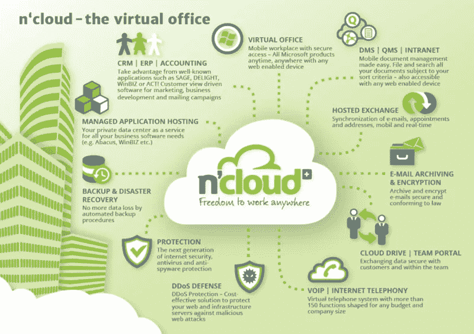
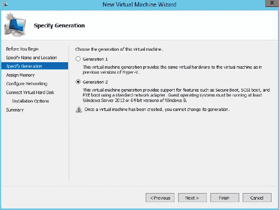

# 主级域配置、AD 设置和 IP 寻址的 AGUDLP 原则

> 原文：<https://medium.com/hackernoon/configuring-a-main-level-domain-ad-active-directory-set-up-and-ip-addressing-with-the-agudlp-d826ac46e5d5>

## 以 n'cloud 虚拟办公室为例，在迈向全面运行系统之前必须完成的初步技术任务

Image: [www.cloudaction.com](http://cloudaction.com/old_backup/)

建立一个远程桌面终端服务器需要完成一些初步的技术任务，然后才能进入一个完全可操作的系统。[后者的特点是在安全性、可靠性和故障安全方面的高质量标准](/nworld-publications/strategic-and-financial-cleverness-behind-an-outsourced-cloud-based-it-infrastructure-the-example-6c1ee76569c8)。这篇技术性文章的目的是向读者概述如何配置一个主级域，如何建立一个活动目录，以及 IP 地址。我这里指的是 [n'cloud 虚拟办公室](https://www.ncloud.swiss)。

n’cloud Virtual Office

**创建服务器**

我们从安装主域服务器开始。我们将其命名为 DOM002AD01，并配置域 DOM002.local，这是整个结构的最高域。服务器将获得一个特定的地址“123.456.78.910”。该服务器也是主 DNS，并被配置为转发 DNS。我们得到以下非常基本的配置:

> **主级别域服务器:DOM002.local**
> 
> **域控制器主域:DOM002AD01。DOM002.local**
> 
> **IP 地址:123.456.78.910**

在开始安装和配置服务器之前，我们需要在集群节点(DOMCLN201)上的 Hyper-V 中创建虚拟服务器。为此，我们需要一个映像，我们认为这个映像是在 SYSPREP 的准备工作中预先准备好的。我们将集群上的这个映像复制到一个专门为虚拟服务器创建的文件夹中，并以新服务器命名。现在，让我们为 Hyper-V 中的虚拟服务器创建新文件夹，以便能够安装虚拟服务器。为此，我们必须在操作之前选择存储服务器的具体存储位置。在创建服务器时，RAM 值和硬盘存储器的动态功能被设置。

**确定服务器的世代**

***第 1 代:***

第 1 代为虚拟服务器提供了与以前版本的 Hyper-V 相同的虚拟硬件。

***第二代:***

第 2 代在虚拟机上提供了以下新功能:

> 使用标准网卡的 PXE 启动
> 
> 从虚拟 SCSI 磁盘引导
> 
> 从虚拟 SCSI DVD 开始
> 
> 安全启动(默认启用)
> 
> UEFI 固件支持

由于虚拟硬盘是在第 2 代上设计和创建的，因此选择了第 2 代选项。

*Generations Selection of virtual servers*

创建服务器时，有一个选项需要您选择网络适配器。因为已经在给定的集群上创建了网络适配器，所以我们只需在“配置网络”部分选择适配器。这允许在网络和因特网上通信。

然后，我们选择虚拟硬盘，它存储在集群的文件夹中。服务器的创建就已经完成了。现在可以启动、安装和配置虚拟服务器了。

**主域服务器命名& IP 寻址**

我们启动服务器，从配置开始。首先，将计算机名更改为适当的预定义名称“DOM002AD01”。然后，服务器重新启动。然后，输入带有网关和 DNS 的 IP 地址，以便可以在提供虚拟服务器的公司的网络中使用该服务器。

**主域上的角色安装**

需要为域和整个 AD 结构安装 Active Directory 域服务角色。安装后，服务器可以提升为域控制器。因此，可以配置第一个域“主域(DOM002.local)”。该角色还带来了其他功能，如活动目录用户和计算机管理。在这里，用户创建 NTFS 组，稍后需要这些组来嵌套子域中的组，从而允许 RDP 用户进行远程和数据访问。

“DNS 服务器”角色自动安装在所有 Active Directory 服务器上，整个结构中的主域服务器充当同一域和其他域的服务器的转发 DNS。

**活动目录管理& NTFS 组，AGUDLP 原则**

第一步，创建一个新的域管理员，命名为“domain min @ DOM 002 . local”。我们现在将“Administrator”复制到 Active Directory 中，并将其重命名为“DOMAdmin”。为此，我们创建了一个新的组织单位(OU)，称为“NTFS 组”。在其中，我们可以创建以后通过 web 访问和分配网络驱动器所需的所有组。回想起来，我们还应该将子域中的组嵌套到主域中的这些 NTFS 组中，以便 web 访问最终能够正常工作。组必须在组区域设置为“通用”，否则您将无法嵌套子域的组。

**agu DLP 原理**

在 n'cloud.swiss，我们根据 AGUDLP 原则构建整个用户和群组结构。AGUDLP 是一个简化用户和组的顺序和结构的原则。AGUDLP 简单地代表**帐户>全局组>通用组>域本地>权限**。

用户帐户被添加到其子域的全局组中。然后，这些全局组嵌套在主域的通用组中。在主域上，它们被再次嵌套到特殊的“域本地”组中，并从那里被分配到它们的访问授权寄存器中的特定程序。

我们环境中的几乎一切都是一样的，除了我们没有最后的“域本地”嵌套。这实际上只有在混乱和更多用户和组的情况下才是必要的。因为除了新管理员之外，主域上没有用户，所以我们不需要这一步。

**域名服务器**

DNS 的主要任务是回答域名解析请求。DNS 的工作方式很像目录查询。用户知道姓名，但不知道地址或电话号码。如果我们在网络中查询服务器名称，例如使用命令“nslookup ”, DNS 会返回 IPv4 或 IPv6 地址，而不是电话号码。

我们现在创建两个 DNS 记录。其中之一是可以解析特定的网址，确保通过网络进行访问。另一个 DNS 正在转发到提供商的 DNS。这样，网络中的其他服务器也可以访问互联网。目前，我们创建一个“反向查找区域”,以便在这些“正向查找区域”中创建新条目时，可以在其中创建指针条目。完成后，我们可以创建一个名为 netkom.ch 的新区域。重要的是将区域数据复制到整个结构中，以便子域中的服务器也能被重定向。现在我们整合已经定义的两个条目。我们使用条目 WWW，因为这确保我们可以到达网站 [www.netkom.ch](http://www.netkom.ch) 。

**子域配置(子域活动目录结构)**

现在我们来看看子域的配置。我们从域控制器“USER1AD01”开始，在第二个 AD“user 2 AD 01”上稍作延迟。为此，与主域的 DOM002AD01 一样，安装了“Active Directory 域服务”角色，然后将这两个角色提升为“域控制器”。

在安装角色之前，首先在 NIC 选项卡中输入 IP、DNS 和网关地址，然后重新启动服务器。由于我们已经设置了到 DOM002AD01 的转发，现在输入了 DOM002AD01 的 DNS 地址。重新启动后，服务器现在可以安装角色并将其提升为域控制器。

Image: [n’world publications](https://medium.com/nworld-publications)