# 使用 Docker 在 AWS EC2 上配置 GitLab CI

> 原文：<https://medium.com/hackernoon/configuring-gitlab-ci-on-aws-ec2-using-docker-7c359d513a46>

[GitLab CI](https://hackernoon.com/tagged/gitlab-ci) 学起来可能很隐晦，即使维护者说[很容易](https://docs.gitlab.com/ee/ci/quick_start/#examples)。原因是你需要经历诸如配置一个“Runner”之类的麻烦，然后创建一个你几乎不知道要放什么进去的文件。

在这篇文章中，我继续从零开始在 AWS EC2 上安装 GitLab，GitLab CI，并向您展示如何使用 Docker runner 和 GitLab。

帖子:

1.  [【教程—指南】从零开始在 AWS EC2 上安装 GitLab，GitLab CI。](/@josjaviasilis/tutorial-guide-installing-gitlab-gitlab-ci-on-aws-ec2-from-zero-751927e5ae5)
2.  使用 Docker 在 AWS EC2 上配置 GitLab CI(本文)
3.  [正在配置。gitlab-ci.yml](/@josjaviasilis/configuring-gitlab-ci-yml-150a98e9765d)
4.  [git lab 和 GitLab CI 故障排除](/@josjaviasilis/troubleshooting-gitlab-and-gitlab-ci-79d3b71ad79f)

我将逐一介绍这些步骤。[如有需要澄清的地方，欢迎反馈](https://hackernoon.com/tagged/feedback)。如果你是来找`.gitlab-ci.yml`文件以及如何使用它的，请点击[这里](/@josjaviasilis/configuring-gitlab-ci-yml-150a98e9765d)。

从第一部分:你学习了如何在 AWS EC2 实例上设置 git lab…但是 GitLab CI 呢？嗯，这也是一个漫长的过程。但是如果你已经走了这么远，拍拍你自己的后背，让我们继续！

我将假设你:

*   已经设置了 GitLab。
*   您已经创建或导入了一个项目(请在您为 GitLab 实例分配了一个弹性 IP 之后**执行此操作)。**

# **#1-简介**

自从 GitLab 10.3 以来，事情发生了变化。GitLab 引入了一个 Kubernetes 集群，允许您在其中运行 CI。Kubernetes 是一个开源的容器管理平台(您可以在其中部署 Docker 映像)。这个教程**不会涵盖这个**。这将包括运行一个**单独的 Docker 实例**来运行 CI。我会做一个未来的教程，如何设置它与谷歌云平台。

为了让 GitLab 使用 CI，它需要来自它所谓的 [GitLab runner](https://docs.gitlab.com/runner/) 的帮助。它基本上是一个执行 CI 作业的 scipt。是的，它们通常**驻留在与你的 GitLab 安装不同的服务器上**(是的，另一个额外的服务器)。它们也可以安装在您当前的机器上，并在那里进行处理。还没调查过。无论如何我都不会推荐它，因为 GitLab 本身就是资源密集型的。

好消息是它们运行起来很便宜。您可以在微米、纳米甚至点实例中运行它们！如果你不熟悉后者，亚马逊有他们所谓的[现货实例](https://aws.amazon.com/ec2/spot/)。基本上，由于 runner 不会总是运行(它只在有人将 CI 配置文件推送到服务器时运行)，您不需要 100%活动的服务器。你只需在有限的时间内租用它(现场实例)，你就可以开始了。

# #2-创建实例。

非常欢迎您创建一个专用实例，并在不需要时关闭它。您不需要为 spot 实例或者 GitLab runner 正在使用的专用实例分配一个弹性 IP。**是跑步者与 GitLab** 交流，而不是相反。

让我们转到 EC2 仪表板

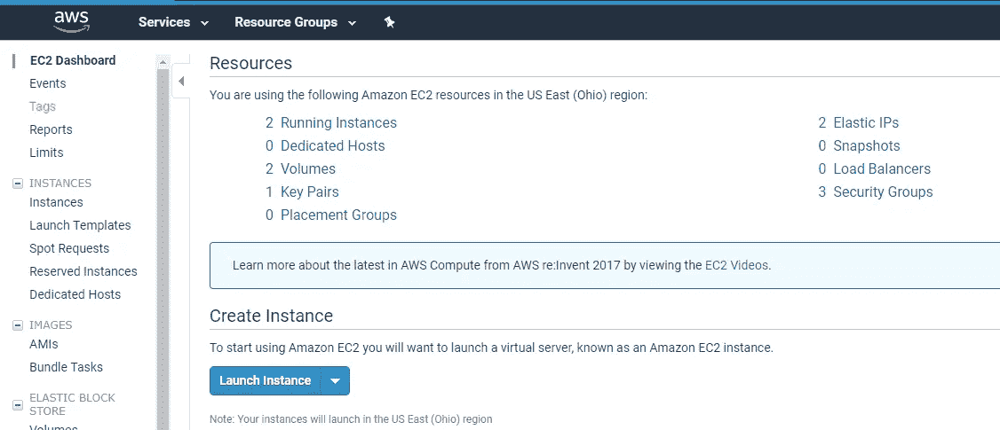

You can arrive here, by clicking “Services” on the top and then clicking “EC2”

单击显示“启动实例”的位置

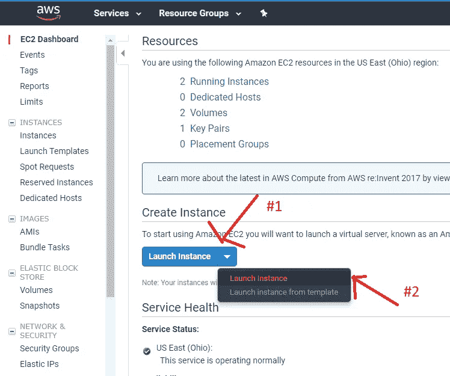

在下一个屏幕上，选择 Ubuntu Server 64 位，它有一个免费层(如果您适用)。你选择的 Linux 版本并不重要。Ubuntu 只是用起来更方便。

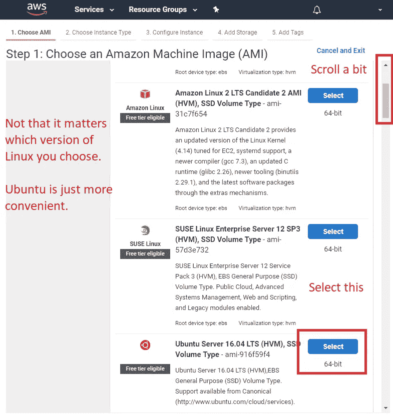

您希望选择 t2.micro，因为它可能会为您提供一个免费层。不需要很大的力量(这只是刚开始。如果你需要更多的能力和速度，那就启用更好的实例。偶尔犯一次(每天 1-2 次)你不会死)

然后，选择“下一步:配置实例详细信息”

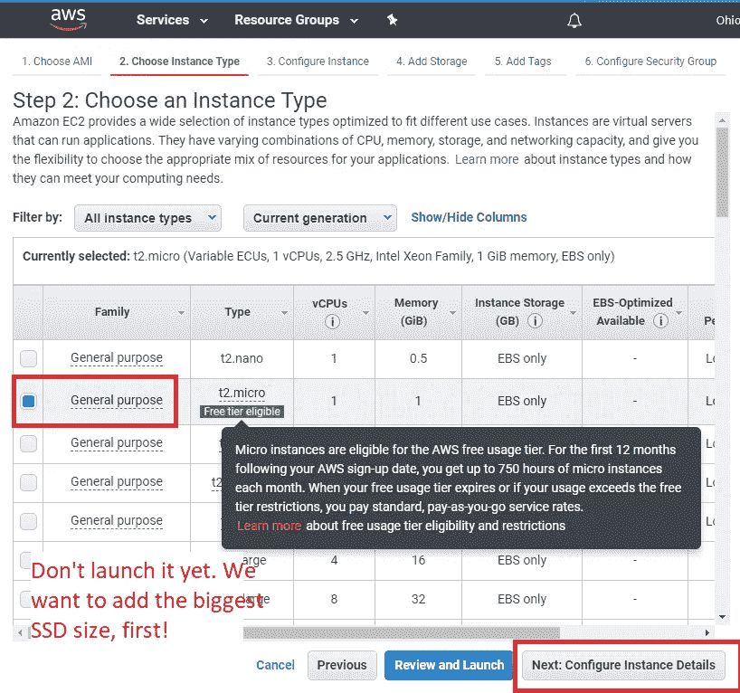

在这里，您可以选择[“请求 Spot 实例”](https://aws.amazon.com/ec2/spot/)。我建议你做这件事，因为它能为你省钱。你可以在这里阅读更多关于 EC2 Spot 实例的内容。

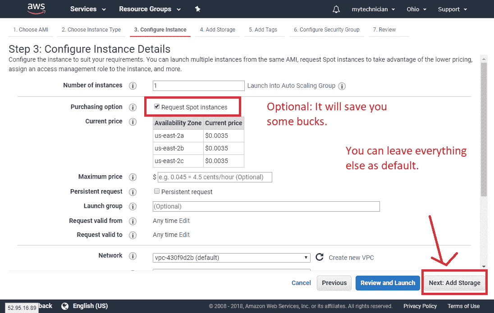

不要低估下一步。尽可能多地添加空闲层提供的 SSD。GitLab CI 可以使用 Docker(这将是我们将要使用的方法。你不必为了使用它而学习 Docker)，而且它将很快填满空间(你将不得不随着时间的推移进行维护，并删除图像，稍后会详细介绍)。

之后，点击“下一步:添加标签”

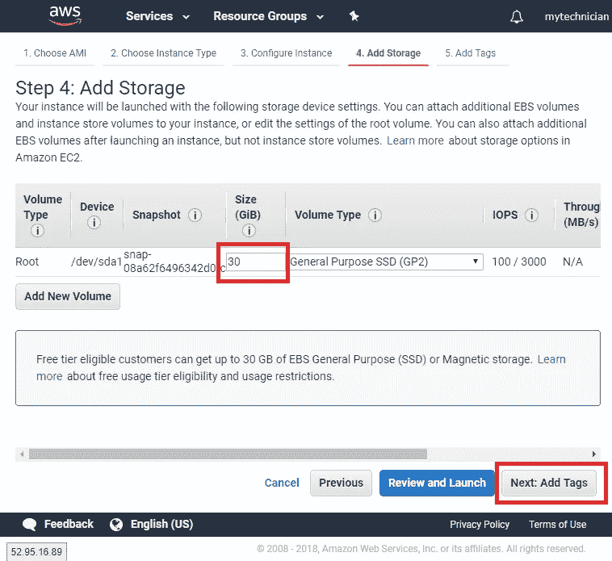

标签不是强制性的，您可以安全地跳过这一步。

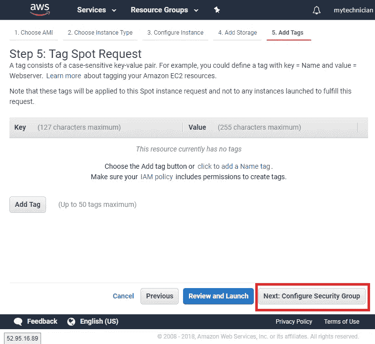

我总是推荐下面的步骤，因为它保护了它，并增加了一层安全来防止不必要的访问。只允许访问您的 IP。请理解，每当您的 IP 改变并且您想要连接到机器时，您都必须执行这个过程(如果 IP 保持不变，那么您不需要做任何事情)。

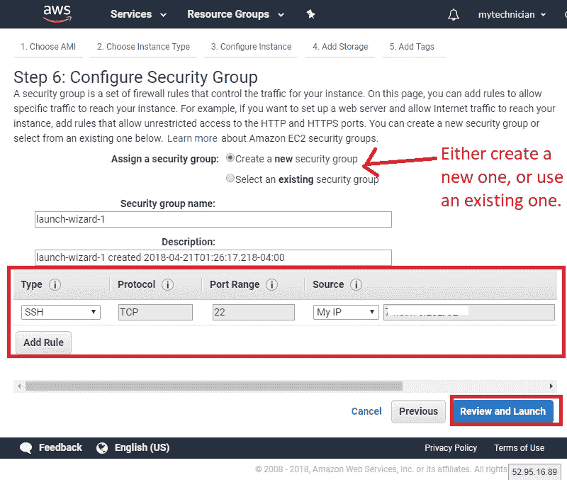

检查一切正常，然后发射！

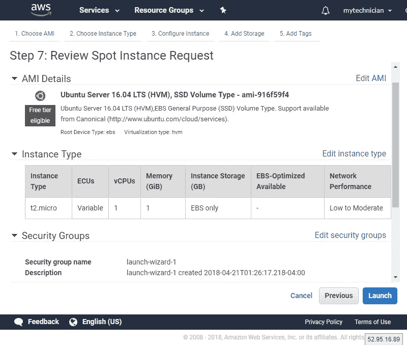

下面的屏幕将询问您是要使用现有的还是新的。如果您想获得最高的安全性，请使用专门针对 GitLab Runner 的新密钥。

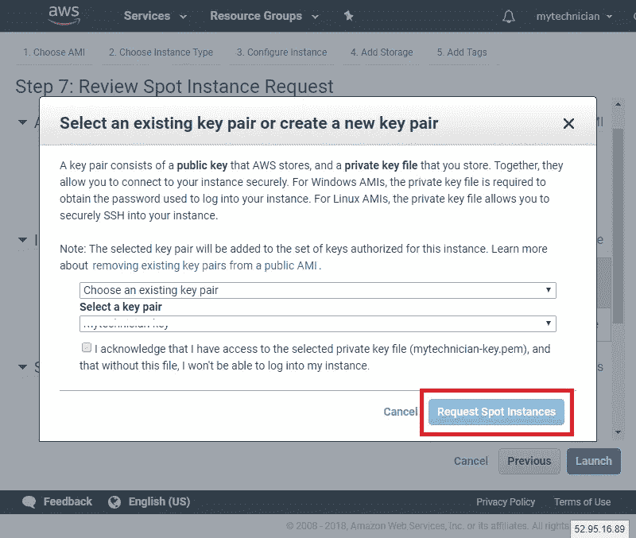

# #3 安装 GitLab 转轮

一旦实例启动并运行，通过 PuTTY 连接到它。这与上一篇文章中的过程相同。将 IPv4 地址放入 PuTTY

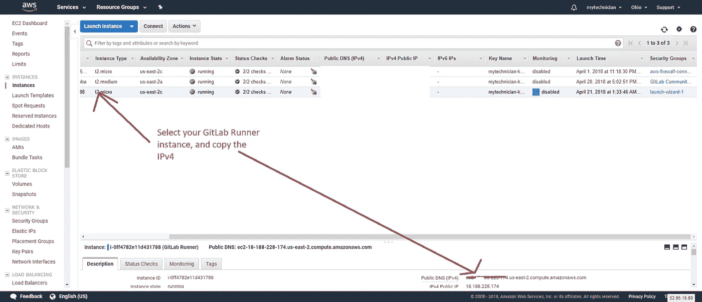

把它放进油灰里(记住。ppk 文件也是！)

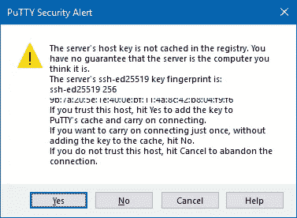

Click on Yes.

登录后:

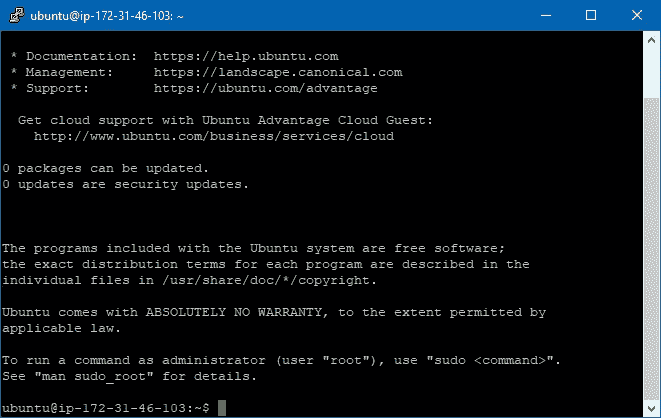

在命令中运行:

```
sudo apt-get updatecurl -L [https://packages.gitlab.com/install/repositories/runner/gitlab-runner/script.deb.sh](https://packages.gitlab.com/install/repositories/runner/gitlab-runner/script.deb.sh) | sudo bashsudo apt-get install gitlab-runner
```

如果您想更新跑步者，只需:

```
sudo apt-get update
 sudo apt-get install gitlab-runner
```

现在您必须注册跑步者:

```
sudo gitlab-runner register
```

您将得到以下提示

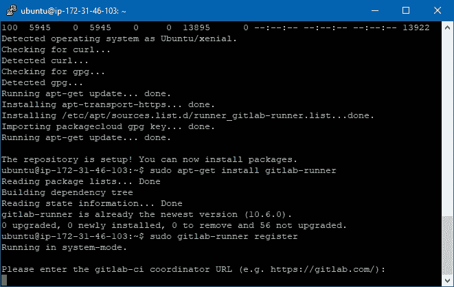

对于 URL，键入 IPv4 地址，并以斜杠结尾(末尾为斜杠)。例如:

```
[http://ec2–28-251–133-100.us-east-2.compute.amazonaws.com/](http://ec2-18-217-233-100.us-east-2.compute.amazonaws.com/)
```

然后，我们需要去 GitLab。转到您想要设置 CI 的项目，并转到主 repo 页面。然后，在左边栏，会有一个“设置”链接。点击那里。它会在底部显示 CI/CD。一旦你在那里，寻找“跑步者设置”，并点击“折叠”。

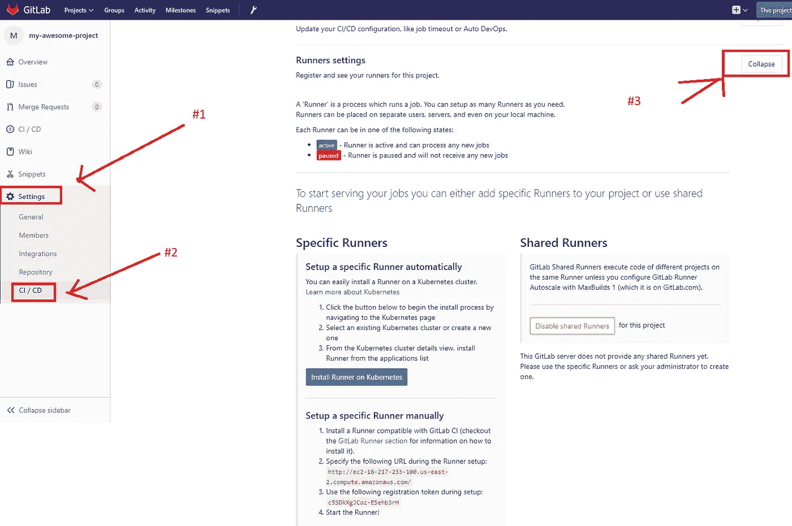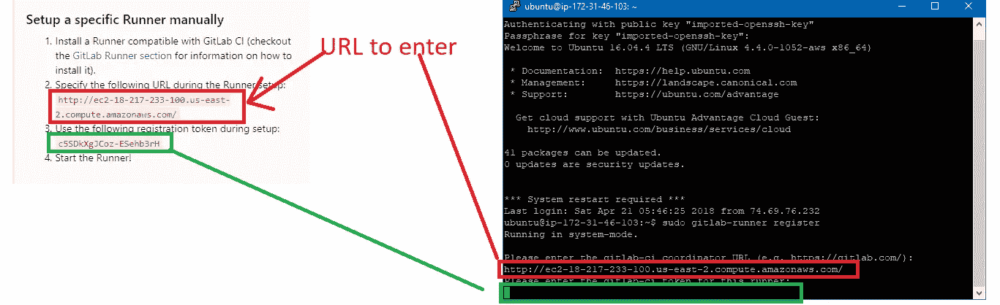

然后它会问你一个描述，你可以输入“Docker Runner”

# **#3.1 关于标签的快速说明。**

在 GitLab CI(持续集成)环境中使用标签来分类和控制对运行者的访问(从 GitLab 中的项目)。它们在以下两者中进行了配置:。gitlab-ci.yml(稍后将详细介绍)，以及跑步者本身。为了简单起见，我们将把它留空。非常欢迎您为跑步者添加标签。

当它询问您是否将跑步者锁定到当前项目[对/错]时，我将由您决定。如果您想要使用同一个实例来处理多个项目:

选择错误…

(错误)这会帮你省钱。这意味着许多项目(也称为存储库)将使用同一个运行器来处理集成管道。如果你有一个小团队，并且你在不同的时间表和一天中的少数几个时间投入，这是完美的。真实)

选择真…

这意味着你必须为每个项目注册一个新的跑步者。是的，您可以在同一个实例中注册多个运行者，尽管您必须记住每个运行者在运行时都会消耗 CPU(没有双关语)。因此，我建议，无论何时你有一个中等规模的团队(或者你每天多次集成多个项目)，都要有单独的跑步者。对你来说，添加单独的流道，是相同的程序，比我们现在做的。

为了简单起见，我们将选择 false，我们将防止跑步者被锁定到当前项目。

一旦你这样做了，它会问你:

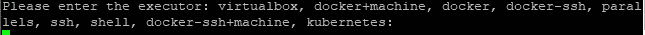

您将键入 **shell** 。*不要*式的码头工人。原因是，如果我们指定 Docker，我们将从 Docker hub 指定我们称为[的 Docker 映像](https://docs.docker.com/get-started/)，并且我们将在稍后创建的配置文件中指定我们的映像。

我们开始吧:

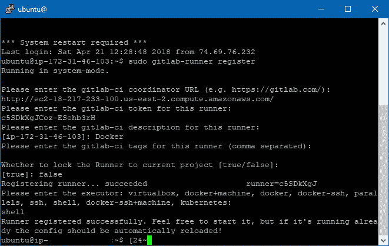

# #3.2-移除未使用的滑道

运行多次 gitlab-runner register 会创建多个 runner，它不会为你删除它们。如果您想删除未使用的跑步者，那么您可以跑步:

```
sudo gitlab-runner verify — delete
```

要验证跑步者是否在工作:

```
sudo gitlab-runner start 
```

导航到您之前所在的页面(Project Settings => CI/CD)，并验证 runner 是否已注册并正在运行。


# #3.3 在 GitLab 转轮上安装 Docker

这遵循了 Docker 在 Ubuntu 服务器中的正常安装。检查[此链接](https://docs.docker.com/install/linux/docker-ce/ubuntu/#install-using-the-repository)了解正式的安装方法。我将在这里介绍这些步骤:

1.  更新 apt 包索引:

```
sudo apt-get update
```

2.安装软件包以允许 apt 通过 HTTPS 使用存储库:

```
sudo apt-get install \
    apt-transport-https \
    ca-certificates \
    curl \
    software-properties-common
```

3.添加 Docker 官方 GPG 键:

```
curl -fsSL https://download.docker.com/linux/ubuntu/gpg | sudo apt-key add -
```

4.设置存储库:

```
sudo add-apt-repository \
   "deb [arch=amd64] https://download.docker.com/linux/ubuntu \
   $(lsb_release -cs) \
   stable"
```

5.更新包

```
sudo apt-get update
```

6.安装 Docker cE 的最新版本:

```
sudo apt-get install docker-ce
```

这将带来一个是/否问题:选择是安装。

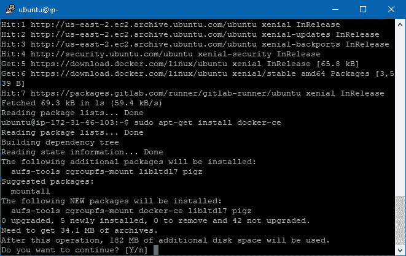

7.通过运行以下命令，验证 Docker 安装是否正确:

```
sudo docker run hello-world
```


This is it! Finally, the runner has been configured 🎉🎉

有了这些，跑步者应该已经被成功配置了。

# #4 在 GitLab 中配置 CI 管道

就是这一刻了，各位！最终配置 CI 管道的时刻到了！

😱:“坚持住乔！你是在告诉我我们还没有做***吗？”

🔥:“没错！我们只是在准备做菜的原料。现在我们正在准备。”

到目前为止，我们所做的一切都是为 CI 的工作设置环境。所有的持续集成(CI)将通过 ***你*** 需要在项目中创建的一个`.gitlab-ci.yml`文件来工作。

这个文件的美妙之处在于，CI 管道只耦合(依赖)于该文件，您可以做任何您想做的事情。

文件的完整规范可在[这里](https://docs.gitlab.com/ee/ci/yaml/#before_script-and-after_script)找到:

 [## 使用配置您的作业。gitlab-ci.yml | GitLab

### GitLab 社区版、GitLab 企业版、Omnibus GitLab 和 GitLab Runner 的文档。

docs.gitlab.com](https://docs.gitlab.com/ee/ci/yaml/#before_script-and-after_script) 

不幸的是，这篇文章变得太长了，我不得不把它分成一篇次要的。

让我们继续下面的一个:

[正在配置。gitlab-ci.yml，带 AWS EC2，用于持续集成(ci)或持续部署(CD)](/@josjaviasilis/configuring-gitlab-ci-yml-150a98e9765d)