# 正在配置。gitlab-ci.yml，带 AWS EC2，用于持续集成(ci)或持续部署(CD)

> 原文：<https://medium.com/hackernoon/configuring-gitlab-ci-yml-150a98e9765d>

这原本是一个完整的帖子，但是它变得太大了，以至于我不得不把它分成 2 篇！上接文章#2，[使用 Docker 在 AWS EC2 上配置 GitLab CI。](/@josjaviasilis/configuring-gitlab-ci-on-aws-ec2-using-docker-7c359d513a46)

**帖子:**

1.  [【教程—指南】从零开始在 AWS EC2 上安装 GitLab，GitLab CI。](/@josjaviasilis/tutorial-guide-installing-gitlab-gitlab-ci-on-aws-ec2-from-zero-751927e5ae5)
2.  [使用 Docker](/@josjaviasilis/configuring-gitlab-ci-on-aws-ec2-using-docker-7c359d513a46) 在 AWS EC2 上配置 GitLab CI
3.  [正在配置。gitlab-ci.yml](/@josjaviasilis/configuring-gitlab-ci-yml-150a98e9765d) (本帖)
4.  [git lab 和 GitLab CI 故障排除](/@josjaviasilis/troubleshooting-gitlab-and-gitlab-ci-79d3b71ad79f)

# #1-了解。gitlab-ci.yml 文件

`.gitlab-ci.yml`文件是一个 [YAML](https://en.wikipedia.org/wiki/YAML) 文件，它是**在**项目的根目录下创建的**。**每当您向服务器推送提交时，该文件会自动运行**。这将向您在#3 中指定的运行者触发一个通知，然后它处理您指定的一系列任务。所以如果你推它 3 次，它就会跑 3 次！这就是为什么如果你推多个，你要么想要一个更快的转轮，或每台机器一个单独的转轮。**

注意，由于我们使用的是 [Docker](https://hackernoon.com/tagged/docker) ，任务总是在一个干净的映像状态下开始。这意味着您在。gitlab-ci.yml，将在您每次向服务器推送提交时恢复。您可以通过指定缓存来避免这种情况。

文件的内容由你可以在他的页面中找到的关键字组成。你不需要遵循什么顺序，但是要非常小心压痕。这可能会决定你项目的成败。你可以在推之前用在线 YAML 棉绒器检查一下它是否工作。

我将开发一个示例 [NodeJS](https://hackernoon.com/tagged/nodejs) 应用程序。以卡玛为试跑者。我已经在 [**这个 GitHub Gist**](https://gist.github.com/superjose/709989dd58aa90bfeda75767668482b2) **里贴了一个我过去一个项目里用过的. gitlab-ci.yml。**(请看！)

[本页](https://www.exclamationlabs.com/blog/continuous-deployment-to-npm-using-gitlab-ci/)可以给你另一个视角。

分解一下:

```
image: node:9.4.0
```

图像键从 [Docker Hub，](http://hub.docker.com)获取图像，并将其用作基础图像。GitLab 将根据这张图片进行所有的测试。如果你在用 Ruby、Java、Go、PHP 等语言做一个项目。从 Docker 中心指定正确的图像。

```
cache:
  paths:
    - node_modules/
    - .yarn
```

这将创建一个临时缓存文件夹，防止在每次 CI 运行时(每次提交时)重新创建`node_modules`和`.yarn` 。

```
before_script:
   - apt-get update -qq && apt-get install
   - another-command that will run after the one above
   - you can keep adding lines and lines.
```

`before_script`告诉 GitLab 先运行你指定的任何东西。您可以将此视为准备脚本。

# #1.1 理解阶段

阶段是代码为了到达最终目的地(生产)而经历的一系列步骤。GitLab 允许你用任何名字定义任何数量的阶段。你可以通过在 stage 键下指定它来实现，i **n 你希望它们运行的顺序**。

然后，GitLab 将一步一步地运行它们。如果其中一个失败，它会阻止后面的运行。

```
stages:
  - build
  - test
  - staging
  - openMr
  - production
```

在上面的部分中，它将首先运行`build` 阶段，一直到`production`。

# #1.2 在中定义阶段的行动。gitlab-ci.yml 文件

通过首先指定阶段名父键，可以定义阶段将要运行的内容。这个键**可以随意命名，可以包含空格**。

例如:

```
Build My App:
  stage: build
  tags:
   #- you_would_put_your_tag_in_here
   #- node
  before_script:
   - yarn config set cache-folder .yarn
   - yarn install
  script:
    - npm run build
```

阶段名称是`Build My App`，它指定了一个名为`stage` 的键，该键引用您之前在阶段列表中创建的阶段。

before_script 与我们之前指定的脚本运行相同，只是在`build`阶段的上下文中:在这些脚本执行之前，什么都不会运行。

在这种情况下，我们使用 [yarn](https://yarnpkg.com/en/) insead of [npm](https://www.npmjs.com/) ，它创建一个包含所有 yarn 配置的缓存文件夹，不会在每个项目运行时重新创建(每次推送至 repo)

# #1.3 标签

如果你遵循了我写的关于“标签”的前一篇文章([第 3.1 点，来自第 2 篇文章](https://hackernoon.com/configuring-gitlab-ci-on-aws-ec2-using-docker-7c359d513a46#5d25))，这是我们指定它们的地方！如果标签与我们在 runner 中指定的标签相匹配，那么一旦完成就会触发 runner。您可以在自己的行中指定每个标记。如果你参考上面的例子，如果你删除了`node`前的`#`，这意味着，那个特定的阶段将只在带有节点标签的流道上工作。如果您没有指定标签(省略`tags`键)，您可以连接到运行器(只要它没有锁定到当前项目)。

**注:5.4–5.6 是文件各部分的略述。我将更详细地解释#7 中的内容为什么、如何以及是什么。**

# #1.4 测试环境

再说一次，你如何命名你的舞台并不重要。在这种情况下，我只是称之为“测试”来测试。

```
Test:
  stage: test
  before_script:
    - yarn config set cache-folder .yarn
    - yarn install
  script:
  # Installs Chrome
    - wget -q -O — [https://dl-ssl.google.com/linux/linux_signing_key.pub](https://dl-ssl.google.com/linux/linux_signing_key.pub) | apt-key add - 
    - echo ‘deb [arch=amd64] [http://dl.google.com/linux/chrome/deb/](http://dl.google.com/linux/chrome/deb/) stable main’ | tee /etc/apt/sources.list.d/google-chrome.list
    - apt-get update
    - apt-get install google-chrome-stable -y
    # Runs the tests.
    - npm run test:karma-headless
```

那里有很多东西。持续集成方法依赖于您在本地机器上运行的测试。这些测试伴随着在您将要部署的实际机器上运行它们。

由于这是特定于 Node 和 JavaScript 的(我的项目是由什么组成的)，所以我需要准备字段，以便它们可以完美地运行。在这种情况下，我使用 karma 作为测试运行程序来运行我所有的本地测试。它需要一个本地网络浏览器，在这种情况下，谷歌浏览器。

因此，我需要发出一个 Google Chrome 的安装命令(记住每次我们推送时，一切都是从干净的状态开始)，并运行测试。

如果所有测试成功，GitLab 将自动进行到下一部分。

# #1.5 打开合并请求

```
# Remember to have the PRIVATE_TOKEN generated. This is only needed to be done once per project and not per user.
# Once you add it (Needs Master privileges) as a Secret Variable, it should work.Open Merge Request:
# Got it from here: [https://gitlab.com/tmaier/gitlab-auto-merge-request/blob/develop/.gitlab-ci.yml](https://gitlab.com/tmaier/gitlab-auto-merge-request/blob/develop/.gitlab-ci.yml)
  image: tmaier/gitlab-auto-merge-request
  stage: openMr
  script:
    - bash ./gitlab-deploy/auto-merge-request.sh # The name of the script
```

在我们的测试环境成功之后，我们希望 GitLab 自动打开一个合并请求，如果它通过，我们可以成功地合并到 master。

# # 1.6 试运行和生产环境

```
Deploy to Staging:
  stage: staging
  before_script:
   # Generates to connect to the AWS unit the SSH key.
   - mkdir -p ~/.ssh
   - echo -e “$SSH_PRIVATE_KEY” > ~/.ssh/id_rsa
   # Sets the permission to 600 to prevent a problem with AWS
   # that it’s too unprotected.
   - chmod 600 ~/.ssh/id_rsa
   - ‘[[ -f /.dockerenv ]] && echo -e “Host *\n\tStrictHostKeyChecking no\n\n” > ~/.ssh/config’script:
     - bash ./gitlab-deploy/.gitlab-deploy.staging.sh
  environment:
    name: staging
  # Exposes a button that when clicked take you to the defined URL:
    url: [http://ec2-11-44-514-91.us-east-2.compute.amazonaws.com:3001](http://ec2-13-59-173-91.us-east-2.compute.amazonaws.com:3001)Deploy to Production:
  stage: production
  before_script:
  # Generates to connect to the AWS unit the SSH key.
    - mkdir -p ~/.ssh
    - echo -e "$SSH_PRIVATE_KEY" > ~/.ssh/id_rsa
  # Sets the permission to 600 to prevent a problem with AWS
  # that it's too unprotected
    - chmod 600  ~/.ssh/id_rsa
    - '[[ -f /.dockerenv ]] && echo -e "Host *\n\tStrictHostKeyChecking no\n\n" > ~/.ssh/config'
   script:
    - bash ./gitlab-deploy/.gitlab-deploy.prod.sh
   environment:
     name: production
     # Exposes a button that when clicked take you to the defined URL:
     url: [http://ec2-13-59-173-91.us-east-2.compute.amazonaws.com:81](http://ec2-13-59-173-91.us-east-2.compute.amazonaws.com:81)when: manual
```

这方面的内容我会在下面讲。

# #2 管道

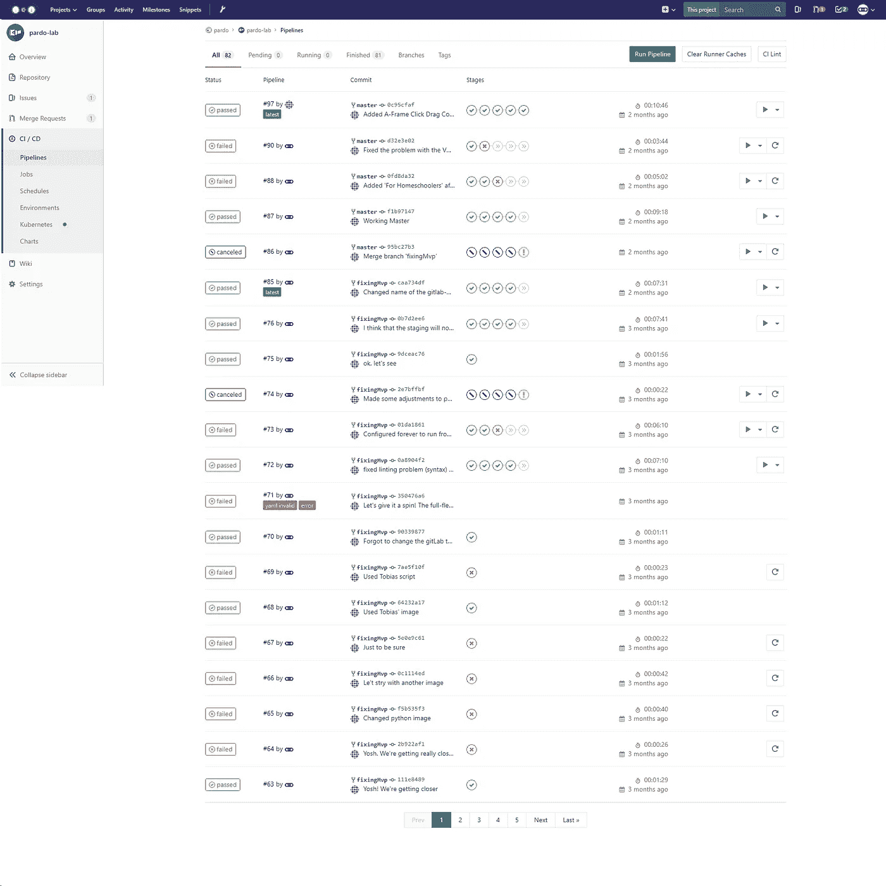

当您将带有`.gitlab-ci.yml`文件的 git repo 推送到 GitLab 时，它将自动触发管道。管道是您在`.gitlab-ci.yml.`中定义的阶段。在我们的例子中，我们有构建、测试、试运行、openMr 和生产。你在上面截图中看到的每一个标记都代表了每一个阶段。一个红叉将代表一个失败的阶段。绿色勾号表示测试成功通过。斜线表示测试已被取消。

你可以看到一个命令行界面，它向你展示了开发的每一个阶段，点击图标，然后点击弹出:

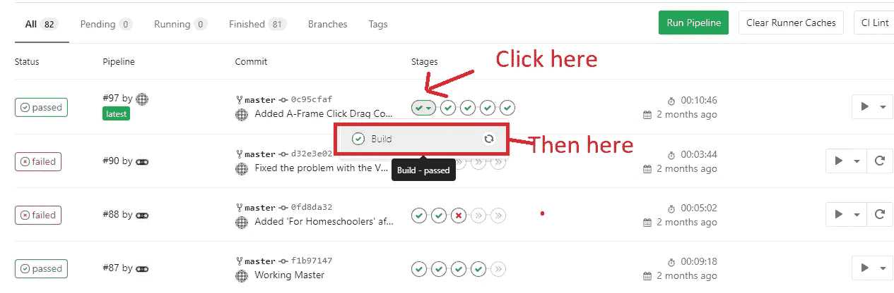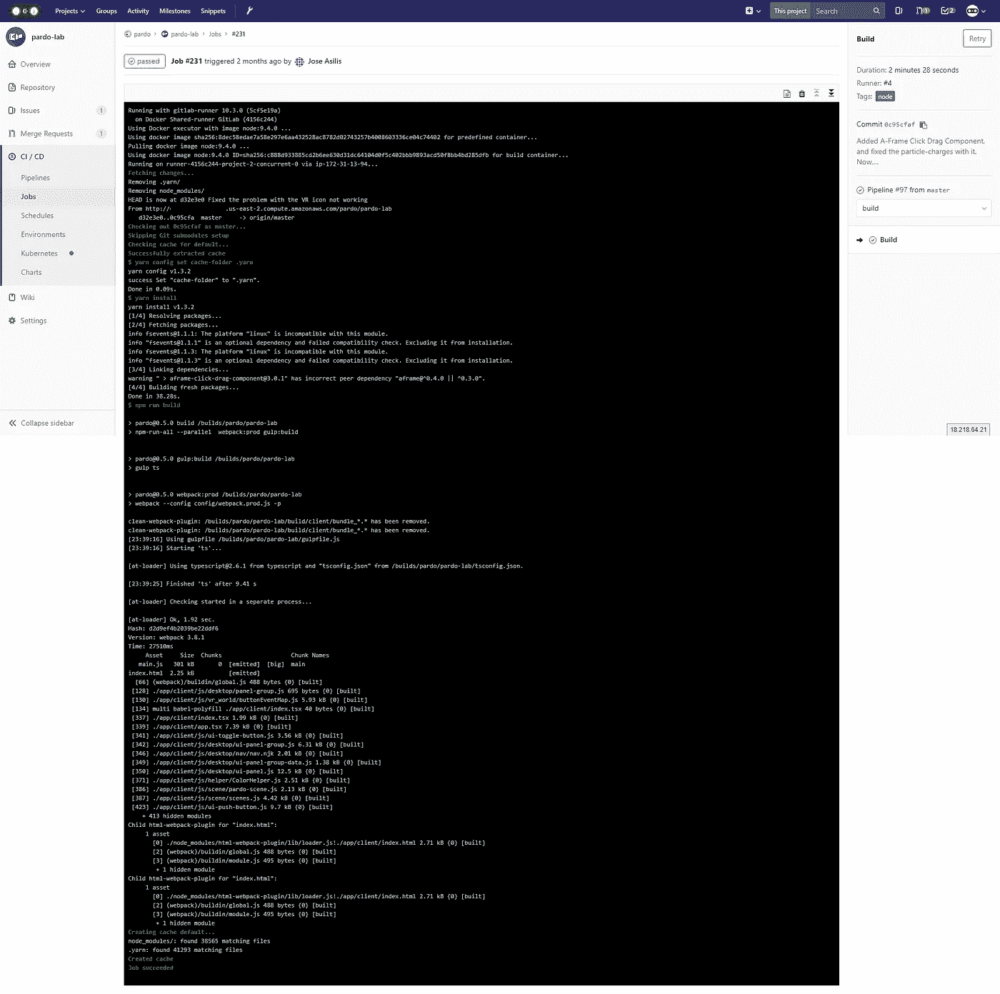

This is the screen that it shows you after the build stage has been successfully completed.

# **#3-整合到 AWS。如何用您的项目将 GitLab 实例连接到 EC2 实例**

最大的挑战之一是将 CI 渠道与您的项目集成。**据我所知***，GitLab 并没有提供一种本地方式来做到这一点。您可以将您的代码推送到 [AWS 代码部署](https://aws.amazon.com/codedeploy/)，然后通过那里进行迁移。*

*stackoverflow 的 autronix 提供了一个奇妙的[逐步指南](https://stackoverflow.com/a/38672045/1057052)来指导您完成这个过程:*

*[](https://stackoverflow.com/a/38672045/1057052) [## 如何使用 AWS CodeDeploy/CodePipeline/S3 将 Gitlab-Ci 部署到 EC2

### 我已经创建了一组示例文件来配合下面提供的指南。

stackoverflow.com](https://stackoverflow.com/a/38672045/1057052) 

**我推荐上面的方法，而不是我将要向您展示的方法**。如果 autronix 的方法不起作用，请执行以下操作。* 

*这种集成传达了利用 git(我们从 GitLab 中提取合并的存储库)并在 EC2 实例中就地升级它，我们从 npm 中执行重新加载脚本(我们假设在这个项目中使用 Node)并发布更改。到目前为止，您可能会看到，这看起来更像是一个黑客，而不是一个实际的解决方案。这个**在高度分布式的环境中可能不起作用**，在这种环境中，您需要跨多个 EC2 实例复制代码库。但同样，这是关于有选择，对不对？*

# *#4 —准备托管已部署代码的 EC2 机器。*

*这种方法是受[这篇文章](/@lucabecchetti/autodeploy-from-gitlab-to-multiple-aws-ec2-instances-a43448727c5a)的启发。*

*我们将 EC2 机器(生产中托管代码的机器)视为 GitLab 客户端。我们创建一个连接到 GitLab 的 SSH 密钥，并从那里提取代码。*

*如果你记得，从第一个教程:*

```
*ssh-keygen -t rsa -C “your_name@your_email.com”
ssh-add ~/.ssh/id_rsa*
```

*如果您在添加密钥时遇到了问题，请尝试首先执行以下命令( [Source](https://stackoverflow.com/questions/17846529/could-not-open-a-connection-to-your-authentication-agent) ):*

```
*eval `ssh-agent -s`
ssh-add ~/.ssh/id_rsa*
```

*关于这种方法的一个问题是，我还没有找到一种方法使它与密码一起工作，所以当它问你这个问题时，**让它空白**！*

*创建密钥时，它位于以下位置:*

```
*~/.ssh/id_rsa.pub*
```

*请注意，这一次您将无法复制到剪贴板的内容，除非您安装“剪辑”*

*注意:这将占用 300 多 MB 的磁盘空间。除非不受磁盘空间的限制，否则不要这样做。*

```
*sudo apt-get install clipcat ~/.ssh/id_rsa.pub | clip*
```

*另一种选择是执行 cat，并复制命令的输出。*

```
*cat ~/.ssh/id_rsa.pub*
```

*为了控制潜在的安全风险，我建议您在 GitLab 中创建一个单独的用户，该用户只处理回购的拉取，不处理其他任何事情。您将公钥附加到该帐户。*

*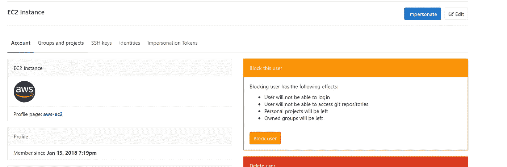*

*I created a ghost user in GitLab that handles the pull from GitLab.*

*请访问 GitLab 地址上的/admin。(您也可以单击导航栏上的工具图标)*

*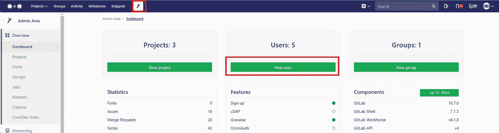*

*创建新用户:*

*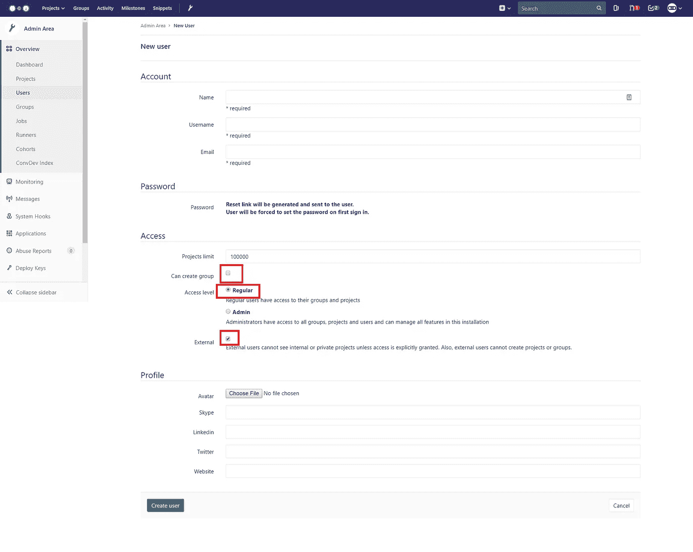*

*取消选中“可以创建组”。访问级别“常规”，外部“已检查”。*

*转到您有回购的项目:*

*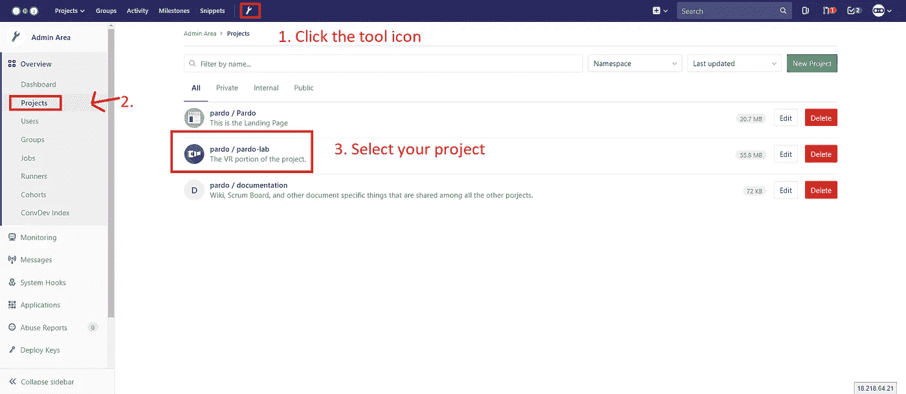**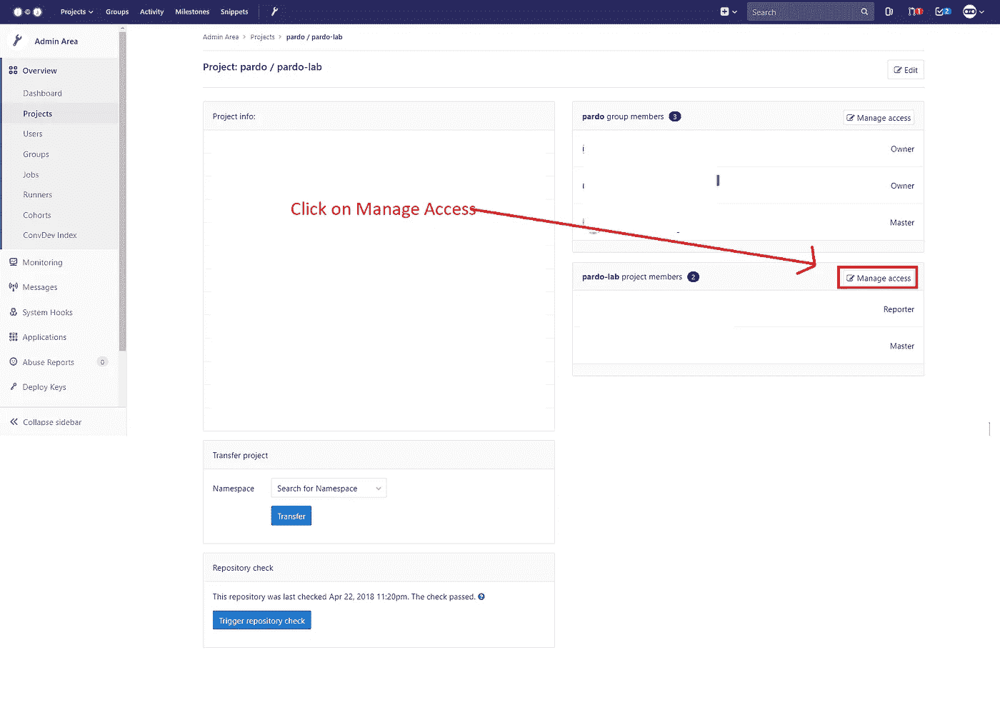**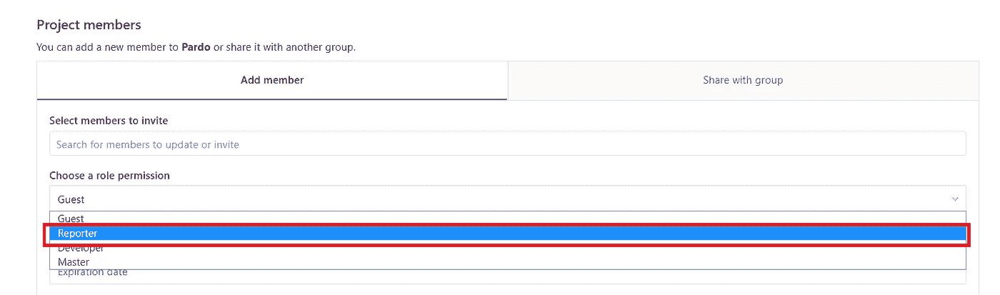*

*Search the new member you created and set it as a Reporter.*

*导航到管理区域中的用户选项卡，并单击最近创建的用户的名称:*

*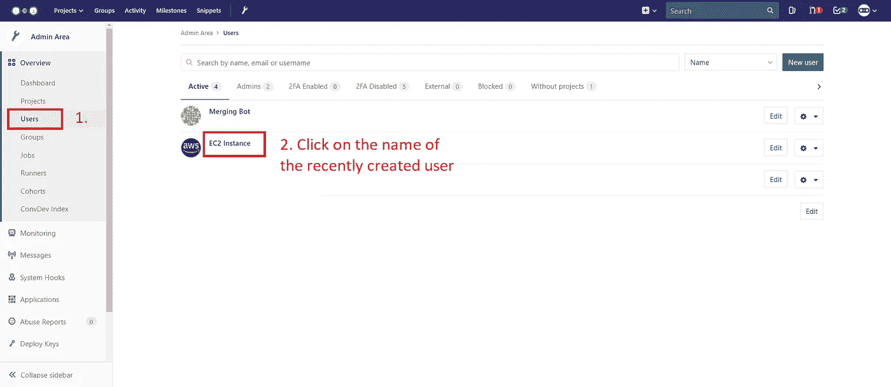*

*单击“模拟”，并转到 ssh 密钥页面。*

*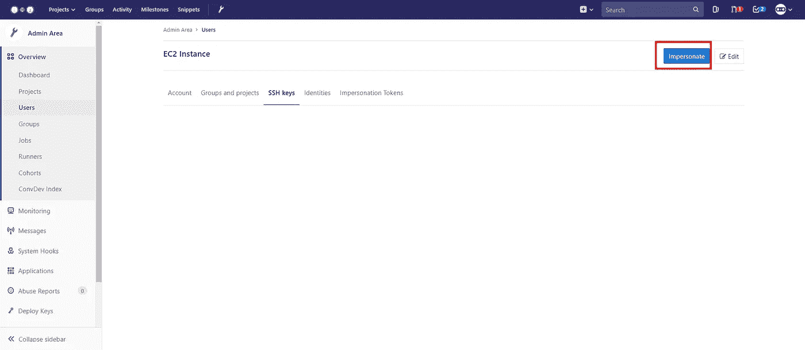**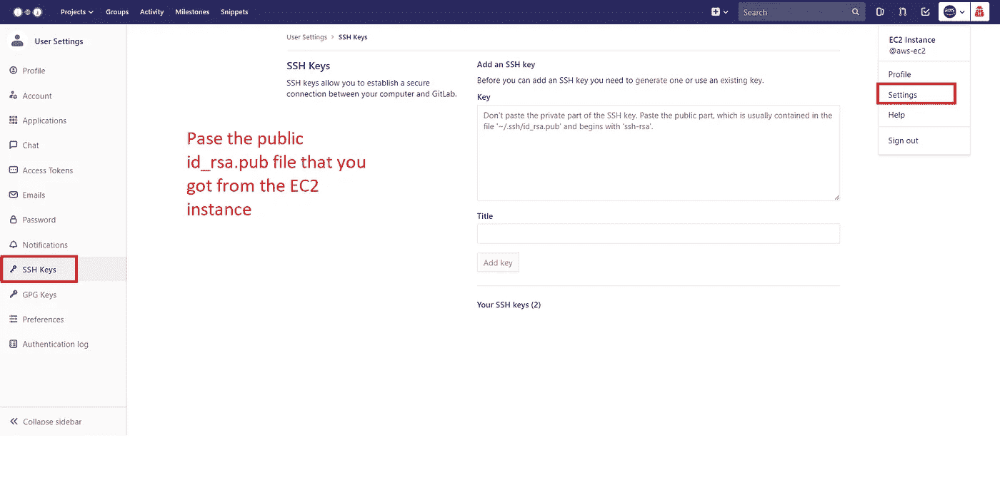*

# *#5-暂存环境，配置:*

*这是我开始解释我在上面写的到底是什么的地方。*

```
*Deploy to Staging:
  stage: staging
  before_script:
    # Generates to connect to the AWS unit the SSH key.
    - mkdir -p ~/.ssh
    - echo -e “$SSH_PRIVATE_KEY” > ~/.ssh/id_rsa
    # Sets the permission to 600 to prevent a problem with AWS
    # that it’s too unprotected.
    - chmod 600 ~/.ssh/id_rsa
    - ‘[[ -f /.dockerenv ]] && echo -e “Host *\n\tStrictHostKeyChecking no\n\n” > ~/.ssh/config’ script:
    - bash ./gitlab-deploy/.gitlab-deploy.staging.sh environment:
    name: staging
    # Exposes a button that when clicked take you to the defined URL:
     url: [http://ec2-13-14-444-91.us-east-2.compute.amazonaws.com:3001](http://ec2-13-59-173-91.us-east-2.compute.amazonaws.com:3001)*
```

# *#5.1-与 EC2 实例通信。*

*我们需要一种与自动气象站沟通的方式。我们这样做的方法是抓住**私有**密钥(小心！敏感信息)并将其与预定义的 shell 脚本一起发送(稍后我将详细介绍)。*

*before_script 中的代码所做的是生成一个名为 id_rsa 的空白文件(它符合私钥的约定)。每次项目运行时，我们用一个定制变量(现在将详细介绍)填充它。*

*GitLab CI 允许您在项目的设置中存储变量:*

*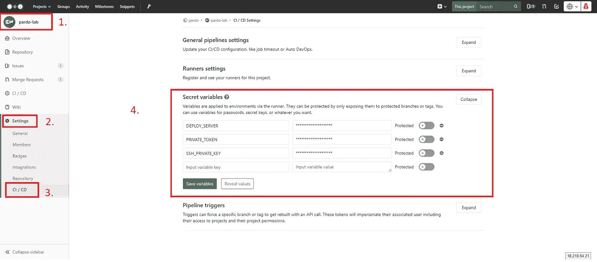*

*Go to Your Project -> Settings -> CI/CD -> Secret Variables*

*我们要做的是从 id_rsa(私钥，没有的那个)中抓取内容。pub ),我们将复制并粘贴它的内容。*

*我们执行与公共文件相同的过程(注意这是无扩展名的 id_rsa):*

```
*cat ~/.ssh/id_rsa | clip*
```

*或者，如果您没有安装 clip，请从控制台复制并粘贴它:*

```
*cat ~/.ssh/id_rsa*
```

*我们将把这个值复制粘贴到“秘密变量”表单中，并给它一个“SSH_PRIVATE_KEY”(这与`.gitlab-ci.yml`中的值相匹配，你可以在上图中看到)*

*一旦你有了它，点击“保存变量”。*

# *#5.2-为暂存环境创建一个 Shell 脚本*

*我们仍然需要指示 GitLab 在我们的 EC2 环境中执行 pull 请求。*

*为了分离关注点和可维护性，我们可以指定一个外部 shell 文件，它将从主分支执行 pull。我们把这个文件叫做`.gitlab-deploy.staging.sh` 你可以把这个文件叫做你想要的任何东西。只要记得在`.gitlab-ci.yml`文件中指定就行了。*

*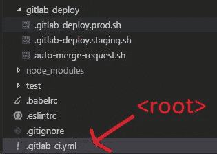*

*This is how I have my project structured.*

*`.gitlab-ci.yml` 是在根。而 shell 文件在一个名为`gitlab-deploy`的文件夹下。因此我们称他们为`./gitlab-deploy/.gitlab-deploy.staging.sh`。*

*该文件的内容如下:*

```
*# !/bin/bash# Get servers list:
set — f# Variables from GitLab server:
# Note: They can’t have spaces!!
string=$DEPLOY_SERVER
array=(${string//,/ })
# Iterate servers for deploy and pull last commit
# Careful with the ; [https://stackoverflow.com/a/20666248/1057052](https://stackoverflow.com/a/20666248/1057052)
for i in “${!array[@]}”; do
  echo “Deploy project on server ${array[i]}”
ssh ubuntu@${array[i]} “cd ./Staging/vr && git stash && git checkout $CI_BUILD_REF_NAME && git stash && git pull && sudo yarn install && sudo npm run staging”done*
```

*如您所见，我们在这里所做的是执行 git 拉取，并在暂存服务器中安装软件包。*

*我很便宜，我在同一个服务器上运行生产和测试(我暴露了不同的端口)。我建议你为此使用不同的机器。*

*`$DEPLOY_SERVER`变量是我们在 secrets 变量页面中用 EC2 实例的 IPv4 地址创建的另一个定制变量:*

**

*Go to Your Project -> Settings -> CI/CD -> Secret Variables*

*指定名称和 url 的环境关键字“只是为了显示”。这将在控制台的 stage 中显示一个按钮，该按钮将指向您在那里指定的 URL。这是可选的，可以省略。*

# *#6 自动打开合并请求*

*GitLab 不会自动打开合并请求。这就是为什么我们必须自己做一些工作来让它工作。*

*这是通过 GitHub 的 tmaier 的 [Docker 图像完成的](https://github.com/tmaier/gitlab-auto-merge-request)*

```
*# Remember to have the PRIVATE_TOKEN generated. This is only needed to be done once per project and not per user.
# Once you add it (Needs Master privileges) as a Secret Variable, it should work.Open Merge Request:
# Got it from here: [https://gitlab.com/tmaier/gitlab-auto-merge-request/blob/develop/.gitlab-ci.yml](https://gitlab.com/tmaier/gitlab-auto-merge-request/blob/develop/.gitlab-ci.yml)
  image: tmaier/gitlab-auto-merge-request
  stage: openMr
  script:
    - bash ./gitlab-deploy/auto-merge-request.sh # The name of the script*
```

*这是`auto-merge-request.sh`文件*

```
*#!/usr/bin/env bash
set -e# Gotten from:
# [https://about.gitlab.com/2017/09/05/how-to-automatically-create-a-new-mr-on-gitlab-with-gitlab-ci/](https://about.gitlab.com/2017/09/05/how-to-automatically-create-a-new-mr-on-gitlab-with-gitlab-ci/)
# This shall automatically create a merge request right after the build has been pushed.
# Added some touches from: [https://gitlab.com/tmaier/gitlab-auto-merge-request/blob/develop/merge-request.sh](https://gitlab.com/tmaier/gitlab-auto-merge-request/blob/develop/merge-request.sh)if [ -z “$PRIVATE_TOKEN” ]; then
 echo “PRIVATE_TOKEN not set”
 echo “Please set the GitLab Private Token as PRIVATE_TOKEN”
 exit 1
fi# Extract the host where the server is running, and add the URL to the APIs
[[ $CI_PROJECT_URL =~ ^https?://[^/]+ ]] && HOST=”${BASH_REMATCH[0]}/api/v4/projects/”# Look which is the default branch
TARGET_BRANCH=`curl — silent “${HOST}${CI_PROJECT_ID}” — header “PRIVATE-TOKEN:${PRIVATE_TOKEN}” | jq — raw-output ‘.default_branch’`;# The description of our new MR, we want to remove the branch after the MR has
# been closed
BODY=”{
 \”id\”: ${CI_PROJECT_ID},
 \”source_branch\”: \”${CI_COMMIT_REF_NAME}\”,
 \”target_branch\”: \”${TARGET_BRANCH}\”,
 \”remove_source_branch\”: true,
 \”title\”: \”WIP: ${CI_COMMIT_REF_NAME}\”,
 \”assignee_id\”:\”${GITLAB_USER_ID}\”
}”;# Require a list of all the merge request and take a look if there is already
# one with the same source branch
LISTMR=`curl — silent “${HOST}${CI_PROJECT_ID}/merge_requests?state=opened” — header “PRIVATE-TOKEN:${PRIVATE_TOKEN}”`;
COUNTBRANCHES=`echo ${LISTMR} | grep -o “\”source_branch\”:\”${CI_COMMIT_REF_NAME}\”” | wc -l`;# No MR found, let’s create a new one
if [ ${COUNTBRANCHES} -eq “0” ]; then
 curl -X POST “${HOST}${CI_PROJECT_ID}/merge_requests” \
 — header “PRIVATE-TOKEN:${PRIVATE_TOKEN}” \
 — header “Content-Type: application/json” \
 — data “${BODY}”;echo “Opened a new merge request: WIP: ${CI_COMMIT_REF_NAME} and assigned to you”;
 exit;
fiecho “No new merge request opened”;*
```

*为此，我们需要生成一个`PRIVATE_TOKEN` ，这只是一个我们可以生成的随机令牌。为了有一个强大和安全的令牌，我们可以使用一个[密码生成器](https://lastpass.com/generatepassword.php)或任何其他东西(你的选择！).*

*把“秘密变量”里面的内容作为`PRIVATE_TOKEN`*

**

*Go to Your Project -> Settings -> CI/CD -> Secret Variables*

# *#7 部署到生产环境*

*这与准备过程非常相似，但这里有一个不同之处。CI(持续集成)和持续部署(CD)方法之间的主要区别在于，后者，即您对代码所做的任何更改，都会自动推送到生产中。*

*在 GitLab 中，我们可以通过指定“when”键来指定是否手动将其部署到生产环境中。*

```
*Deploy to Production:
  stage: production
  before_script:
  # Generates to connect to the AWS unit the SSH key.
    - mkdir -p ~/.ssh
    - echo -e "$SSH_PRIVATE_KEY" > ~/.ssh/id_rsa
  # Sets the permission to 600 to prevent a problem with AWS
  # that it's too unprotected
    - chmod 600  ~/.ssh/id_rsa
    - '[[ -f /.dockerenv ]] && echo -e "Host *\n\tStrictHostKeyChecking no\n\n" > ~/.ssh/config'
   script:
    - bash ./gitlab-deploy/.gitlab-deploy.prod.sh
   environment:
     name: production
     # Exposes a button that when clicked take you to the defined URL:
     url: [http://ec2-13-59-173-91.us-east-2.compute.amazonaws.com:81](http://ec2-13-59-173-91.us-east-2.compute.amazonaws.com:81)when: manual*
```

*正如你所看到的，通过指定键`when:manual`，我们告诉 GitLab **不要将代码自动推向生产，等待我们的命令。***

*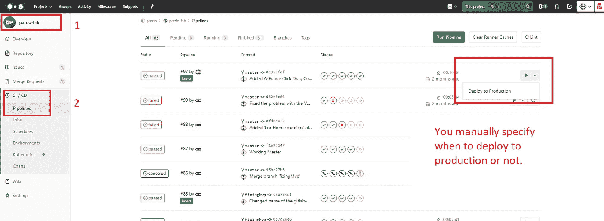*

*On the pipelines page, you click a Playback button to “Deploy to Production”, which is the name you specified in the .gitlab-ci.yml*

*最后，但同样重要的是，检查。gitlab-deploy.prod.sh*

```
*# !/bin/bash# Get servers list:
set — f# Variables from GitLab server:
# Note: They can’t have spaces!!
string=$DEPLOY_SERVER
array=(${string//,/ })# Iterate servers for deploy and pull last commit
# Careful with the ; [https://stackoverflow.com/a/20666248/1057052](https://stackoverflow.com/a/20666248/1057052)
for i in “${!array[@]}”; do
  echo “Deploy project on server ${array[i]}”
  ssh ubuntu@${array[i]} “cd ./Pardo/vr && git stash && git checkout $CI_BUILD_REF_NAME && git stash && git pull origin master && sudo yarn install && sudo npm run production”done*
```

*如果你注意的话，你会发现它与临时版本很相似(甚至完全相同)。除了我将它指向 EC2 实例中生产代码所在的不同位置。您也可以随意修改这个文件。*

# *# 8 CI/CD 管道已配置完毕！该用力了！*

*是啊！！终于到那个时候了！*

*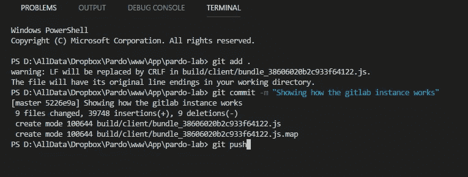*

*Commit your file and push to your GitLab instance!*

*看看你的改变是如何开始发生的！*

*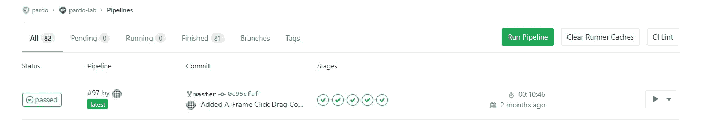*

*就是这样！*

*WOAH！谢谢你载我一程。*