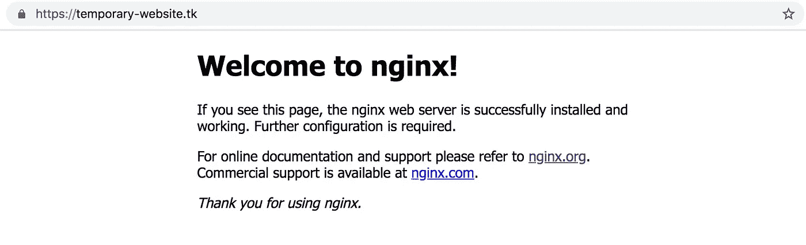

# 使用 Let's Encrypt 和 Nginx 配置服务器以提供 HTTPS

> 原文：<https://medium.com/hackernoon/configuring-your-server-to-provide-https-using-lets-encrypt-and-nginx-e46a5ae93e41>

本教程将教你如何安装 Nginx，并让它管理**免费的**让我们加密 TLS/SSL 证书。如果你现在开始并且想要一个安全的服务器安装，我建议你阅读[这篇文章](https://medium.freecodecamp.org/how-to-create-your-first-safe-server-ready-for-production-f1cc60eec69a)。


Photo by [Markus Spiske](https://unsplash.com/photos/OXIv6mxmFPA?utm_source=unsplash&utm_medium=referral&utm_content=creditCopyText) on [Unsplash](https://unsplash.com/search/photos/safe?utm_source=unsplash&utm_medium=referral&utm_content=creditCopyText)

好的，让我们从一些定义开始，然后我们从神奇的步骤开始:

*   Let's encrypt:是一个证书颁发机构(CA ),它提供免费的数字证书以允许网站上的 HTTPS。
*   [Nginx](https://hackernoon.com/tagged/nginx) :是一个 web 服务器，也可以用作负载均衡器、反向代理、邮件代理和 [HTTP](https://hackernoon.com/tagged/http) 缓存。
*   HTTPS:(安全超文本传输协议)是 HTTP 协议在使用 SSL/TLS 协议的附加安全层上的实现。
*   SSL/TLS 协议:传输层安全性(TLS)及其前身安全套接字层(SSL)(现在已被否决)是在计算机网络上提供通信安全性的应用程序协议。
*   Certbot:是一个在服务器上运行的客户端(工具),用于获取和部署 SSL 证书。

为什么我应该有一个 HTTPS 网站？您应该使用 HTTPS 的主要原因是，您可以保证与服务器的连接是安全的。

好了，你只有一个没有任何动态内容的 HTML 页面。所以，其他原因是:1)谷歌开始使用 HTTPS 作为排名因素，所以如果你想让你的网站在谷歌的搜索中有一个好的位置，你应该考虑使用这个。2) Chrome 开始对非 HTTPS 的页面显示“不安全”警告，所以如果你不想吓到你的用户，这是一个拥有它的理由。

假设您已经安装并运行了一个 Ubuntu web 服务器，并且有一个域名指向它(在本教程中域名是 temporary-website.tk)，我们将在其中安装 Nginx。

# 安装 Nginx 和 Certbot

连接到您的服务器。键入以下命令安装 Nginx:

```
$ sudo apt-get install nginx
```

安装后，您可以访问您的域，并检查一些已经可用(没有 HTTPS):


Insecure website

我们将使用 Certbot 存储库来获取软件包的最新版本。我们来补充一下:

```
$ sudo add-apt-repository ppa:certbot/certbot
```

更新包列表以包含最新项目:

```
$ sudo apt-get update
```

安装 Certbot 的 Nginx 包:

```
$ sudo apt-get install python-certbot-nginx
```

# 生成证书并配置 Nginx

最后，让 Certbot 获得一个证书，并自动为我们配置它:

```
$ sudo certbot --nginx -d **temporary-website.tk**
```

对于这一步，您需要添加您的电子邮件(如果证书即将过期，您将收到来自 Let's Encrypt 的通知)。您将有两个选择:是否将请求从 HTTP 重定向到 HTTPS。我选择了重定向。

如果您以前设置了防火墙，请阅读下面的“允许防火墙”一节，如果没有，就是这样，您将拥有使用 HTTPS 的网站。🎉



Safer website

该网站现在在 HTTPS 名下运作。现在让我们再做一些改进。

# 允许防火墙

如果您遵循了本文中的步骤，现在您需要允许 HTTPS 连接:

```
$ sudo ufw allow https
```

# 更新 Diffie-Hellman 参数

如果你遵循前面的步骤，你可以**忽略这个**部分。但是，如果您只是一个好奇的读者，并且已经在您的服务器上实现了这些步骤，一个技巧是检查 Diffie-Hellman 参数的大小。一些旧的安装有 1024 位参数，一些研究和 NIST 的建议是将 Diffie-Hellman 参数的大小增加到 2048 位。


This is how 1024-bit parameters seem like


This is how 2048-bit parameters seem like

要创建更长的 2048 位参数，请运行下面的代码。我建议您在文件夹`etc/letsencrypt/`上运行这个命令，因为它是存储默认密钥(`ssl-dhparams.pem`)的地方

```
$ openssl dhparam -out ssl-dhparams-2048.pem 2048
```

生成这些参数后，我们需要更改 Nginx 的配置。转到文件夹`/etc/nginx/sites-enabled/`，编辑文件`default`，如下所示:

```
server {
    ...
    ssl_dhparam /etc/letsencrypt/ssl-dhparams-2048.pem;
    ...
}
```

现在重启 Nginx:

```
$ sudo service nginx restart
```

# 更新 SSL 证书

让我们加密每 90 天到期的证书。所以需要经常更新证书。安装的 Certbot 包附带一个 cron 作业，该作业会在证书过期之前自动更新证书。

运行此命令测试更新过程(参数`--dry-run`测试时不将任何证书保存到磁盘):

```
sudo certbot renew --dry-run
```

如果成功了，你就可以放松并享受生活了😂。Certbot 将负责为您定期更新证书。

[*关注我*](/@flaviohfreitas) *如果你想看更多我的文章*😘如果你喜欢这篇文章，一定要喜欢它，给我很多掌声——它对作者来说意味着整个世界。

Flávio H. de Freitas 是一名企业家、工程师、技术爱好者、梦想家和旅行家。先后在**巴西**、**硅谷和欧洲**担任 **CTO** 。