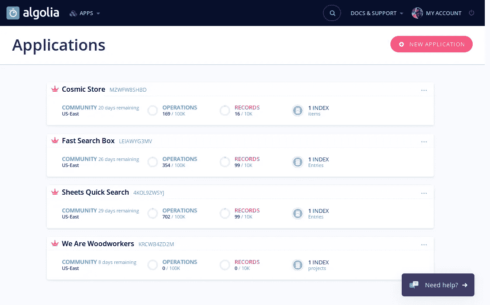
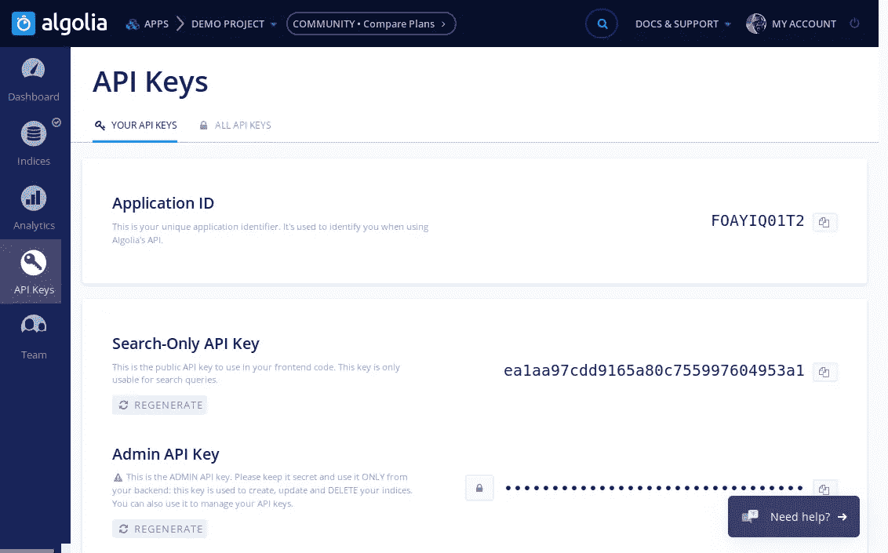

# 将 Algolia 连接到 Cosmic JS 以获得强大的搜索功能！

> 原文：<https://medium.com/hackernoon/connecting-algolia-to-cosmic-js-for-awesome-search-functionality-ca435b1f8326>

使用 Cosmic JS 的 Webhooks，我们可以将 [Algolia](https://www.algolia.com/) 与 [Cosmic JS](https://cosmicjs.com/) 同步，为我们的项目提供快速而强大的搜索功能。

# TL；速度三角形定位法(dead reckoning)

[演示](https://cosmicjs.com/apps/cosmic-store-with-algolia-search)
[源代码](https://github.com/cosmicjs/cosmic-algolia-store)

# 介绍

如果你曾经尝试过自己实现搜索，那么你会知道这是很困难的。谢天谢地，Algolia 发明了一种产品，让这一切变得简单。在这篇文章中，我们将介绍如何将 Algolia 连接到你的 Cosmic JS 后端，并将其添加到你的应用程序中。演示应用程序是用 React.js 和 Express.js 服务器构建的。如果您使用不同的东西，您仍然可以遵循这个模式。只需针对您的用例进行修改。

有四个主要步骤:

1.  创建 Algolia 应用程序
2.  创建宇宙 JS Webhooks
3.  创建 API 端点来接收 Cosmic JS Webhook POST 请求
4.  向我们的应用程序添加搜索小工具

# 第 1 部分—创建 Algolia 应用程序

导航至[https://www.algolia.com](https://www.algolia.com/)登录或注册一个(免费)帐户。

登录后，导航至控制面板。

在仪表板中，单击“新建应用程序”。

为您的应用程序命名，然后单击“创建”。

下一页将要求您选择一个地区。挑一个最近的。然后点击“继续”。

现在，您应该可以看到新创建的应用程序的仪表板。点击屏幕左侧的“API Keys”。这是您在后面的步骤中需要的 API 键的列表。

# 第 2 部分—创建 Cosmic JS Webhooks

登录你的宇宙 JS 账号，进入你的桶。

在仪表板菜单中选择“设置”，然后选择“Webhooks”。

你应该连接三个不同的网络钩子。将端点替换为您希望的项目端点

1.  事件:对象已创建并发布；端点—https://<__your_domain__>/API/algolia/create
2.  编辑和发布的对象；端点—https://<__your_domain__>/API/algolia/edit
3.  对象已删除；端点—https://<__your_domain__>/API/algolia/delete

点击“保存网页挂钩”。现在，无论何时创建、编辑或删除对象，您的服务器都会收到 POST 请求。下一步是设置您的服务器来接收这些请求，并使用它们来保持 Algolia 同步。

# 第 3 部分—创建 API 端点来接收 Cosmic JS Webhook POST 请求

演示应用程序使用 Node.js Express 服务器。代码如下:

首先，创建一个 [algoliasearch](https://www.npmjs.com/package/algoliasearch) 客户端。它使用 Algolia 应用程序 ID 和管理 API 密钥(可在您的 Algolia 应用程序仪表板中找到)。

然后为我们希望从 Cosmic JS 接收的每个 Webhook 创建端点。Webhook POST 请求包括其主体的对象。自定义“convertDataToAlgoliaObject”实用函数用于将 Cosmic JS 对象转换为 Algolia 格式的对象。以下是“convertDataToAlgoliaObject”的代码:

这个功能对于每个项目都是不同的。你基本上只想提取“可搜索”的信息。

现在，Algolia 的 algoliaseasrch 库可以用来上传、编辑或删除 Algolia 中的相应条目。

后端设置完成！但是，您应该注意，在您部署应用程序之前，不会进行同步。您创建的自定义 API 端点尚不存在，因此 Algolia Webhook POST 请求不会被拦截。

# 第 4 部分—向我们的应用程序添加搜索小部件

Algolia 不仅提供了强大的搜索功能，还提供了许多可以用来显示数据的库。我在演示项目中使用了他们的 [React 即时搜索库](https://community.algolia.com/react-instantsearch/Getting_started.html)。它提供了本质上即插即用的 React 组件。您可以用自己的 CSS 自定义它们的样式。[文档](https://community.algolia.com/react-instantsearch/Getting_started.html)写得很好，这里就不需要赘述了。

# 结论

希望这篇文章对你有所帮助。如果有不清楚的地方，查看一下[宇宙 JS](https://cosmicjs.com/docs) 或 [Algolia](https://www.algolia.com/doc/) 文档。他们都很棒！

> 这篇文章最初出现在宇宙 JS 网站上。