# 将 Modbus RTU 智能电能表和西门子 Simatic IoT2040 连接到 NETPIE

> 原文：<https://medium.com/hackernoon/connecting-modbus-rtu-smart-energy-meter-and-siemens-simatic-iot2040-to-netpie-7d38aafb7c04>

本文介绍如何使用工业网关西门子 Simatic IoT2040 从三菱 Modbus 电能表读取数据。Simatic IoT2040 是各行业在工业物联网(IIoT)领域实现生产数据可视化的最佳选择。

**要求:**

1.  Modbus 能量计(三菱 SX1-A31E)
2.  西门子 Simatic IoT2040
3.  24V DC 电源
4.  带 Yocto Linux 的 SD 卡
5.  以太网电缆
6.  红色节点
7.  [网派](https://netpie.io/)账号

**Simatic IoT2040 规格:**

1.  英特尔 Quark X1020 处理器
2.  1 GB 内存
3.  2 个以太网接口
4.  2 个 RS232/422/485 接口
5.  电池缓冲实时时钟

**三菱 Modbus 电能表规格:**

1.  RS485 双线半双工
2.  RTU 模式
3.  波特率 1200bps
4.  距离 1200 米
5.  响应时间 80 毫秒~ 200 毫秒(可编程)

**准备 Simatic IoT2040:**

第一步是将镜像引导到 Simatic 上，因为至少需要 8GB 的 SD 卡。Yocto Linux 镜像可以从西门子网站下载。将 SD 卡插入 Linux 计算机的 SD 卡插槽，并按照以下说明操作

a)在 Linux 上，打开终端(ctrl+alt+t)并转到 zip 文件的下载位置。

b)使用下面的命令解压缩文件夹

c)通过运行以下命令验证 SD 卡的位置

d)卸载 SD 卡

e)将图像文件刻录到 SD 卡上

**注意:**用计算机检测到的下载图像版本和 SD 卡位置替换图像名称。

映像安装到 SD 卡上后，将 SD 卡放入 Simatic 的 SD 卡插槽，如下所示。

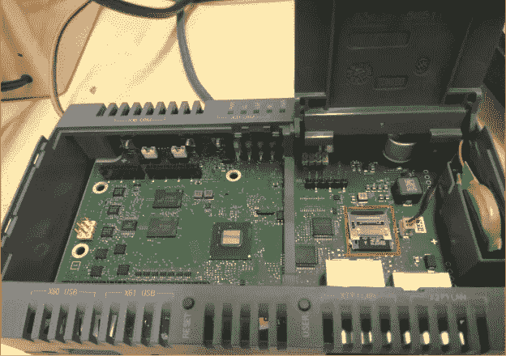

SD-card installation on Simatic

**与 Simatic 通信:**

通过安全套接字外壳(SSH)，可以与 Simatic 进行对话。Simatic 在以太网端口 X1P1LAN 上带有默认的 DHCP 地址 192.168.200.1。将以太网电缆的一端连接到启用了 WiFi 的 Linux 计算机，将以太网电缆的另一端连接到 Simatic 的 X1P1LAN 端口，并接通 Simatic 的电源(需要 24V DC)。当您打开 Simatic 时，三个 LED 将开始闪烁，一旦“SD”LED 停止闪烁，这意味着 Simatic 现在准备好进行通信。

Simatic Initialization

设备初始化后，请遵循以下说明

a)在启用了 wifi 的 linux 计算机上，转到编辑连接，添加以太网连接类型，并为连接命名。在 IPv4 设置中，将方法更改为“共享给其他计算机”并保存。

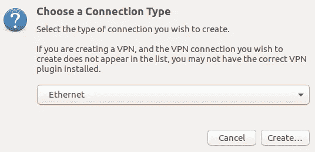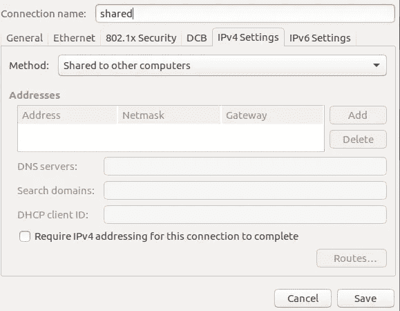

Sharing computer WiFi with Simatic through Ethernet

b)打开终端并执行以下命令，使您的计算机与 Simatic 位于同一子网。

c)使用 SSH 登录 Simatic

d)首次登录时，键入“是”继续

e)指定一个密码

成功登录后，它将显示为:

f)为互联网连接添加网关

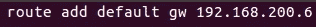

g)使用 ping 检查互联网连接

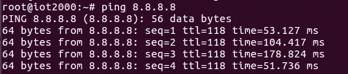

h)按照以下格式设置 Simatic 的时间和日期(月:日:时:分:年)

**在 Simatic 上设置节点-红色:**

需要设置一些配置，以便在 Simatic 上启动 Node-Red

a)转到 opkg 目录

b)在 opkg.conf 中添加以下行

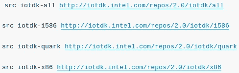

c)在 arch.conf 中添加以下行

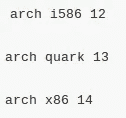

d)使用以下工具更新配置

将更新 Node-Red 的所有配置。要使 Node-Red 在 Simatic 通电时自动启动，请键入 iot2000setup。

将出现一个 GUI，选择软件-管理自动启动选项-自动启动节点-红色，然后按“完成”。

接下来，转到外设-配置外部 COM 端口-选择-X30 COM-RS485，然后按“是”。

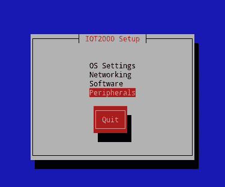

要为 X30 COM 端口分配波特率，请在终端中键入以下命令。这一步很重要，因为默认情况下，Simatic 以 9600 波特率运行，但三菱电能表以 1200 波特率运行，因此，通过将 Simatic 波特率更改为 1200，可以在 Simatic 和电能表之间建立 RS485 通信。

更改所有设置后，重新启动 Simatic。

**在 Simatic 上安装 Modbus 和 netpie 节点:**

**注意:**在 Simatic 上安装节点之前，确保您的 Simatic 通过 ping 测试连接到互联网。

安装 Modbus 节点

安装网络节点

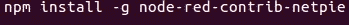

**将 Modbus 电能表连接到 Simatic:**

**注意:**在将 Simatic 与电能表连接之前，请将其断电。

Modbus 能量计由两条电线+ve 和-ve 组成。这两条线需要连接到 Simatic 的 X30 COM 端口的 2 和 1 引脚，如下表所述。

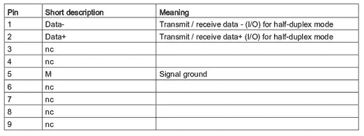

Pins description of X30 COM Port configured as RS485 output

X30 COM 端口的引脚图:

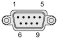

X30 COM Port pin diagram

最终连接:

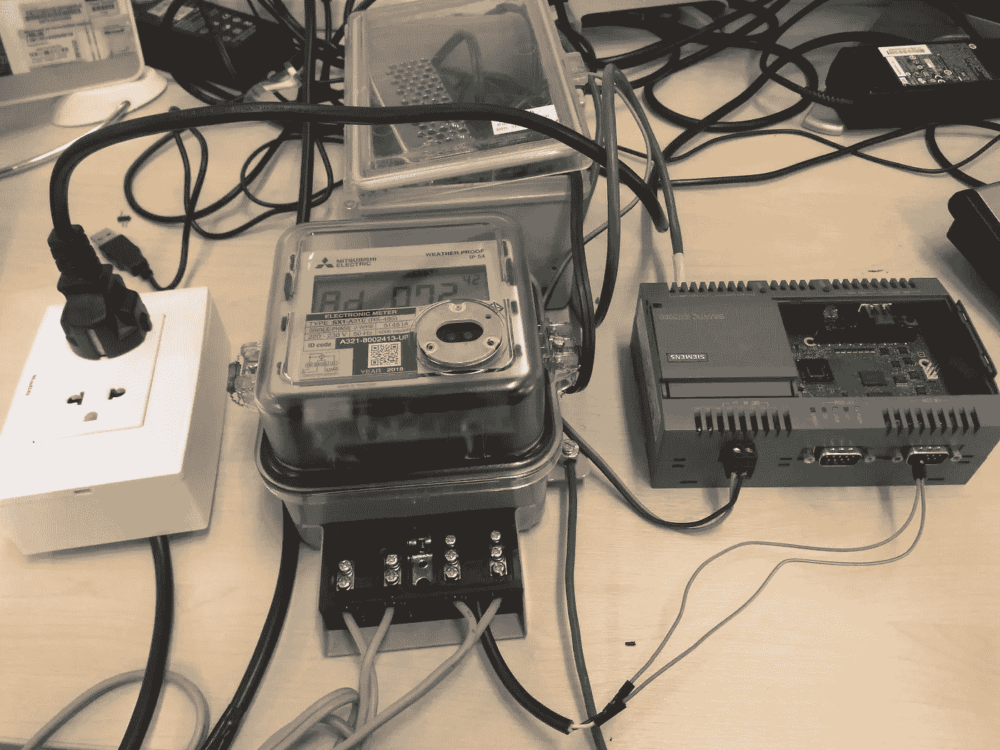

RS485 connections between Energy Meter and Simatic

**节点-红色流程:**

打开浏览器并键入 192.168.200.1:1880，将显示节点红色 GUI。

a)打开 Modbus 读取节点，从电能表读取数据，打开 Modbus 响应节点，查看数据。

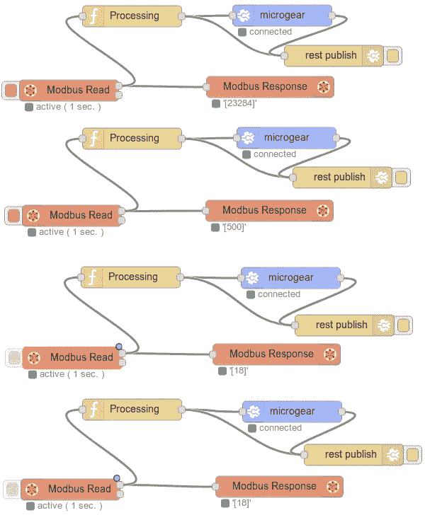

Node-Red Flow

Modbus 读取节点的配置设置为

单元 Id — 72

FC —读取保持寄存器

地址— 0x0066(电压)

寄存器数量— 1

投票率— 1s

方法— RTU

模式—串行专家

波特率— 1200(三菱默认波特率)

数据位— 8，停止位— 1，奇偶校验—偶数

c)配置 Microgear 和发布节点向 NETPIE 发送数据，需要的参数有

APPID

键

秘密

别名

主题

**注:**以上参数的配置指南可在[这里](https://netpie.io/tutorials)找到。

d)在 NETPIE 中，添加小部件来可视化数据。

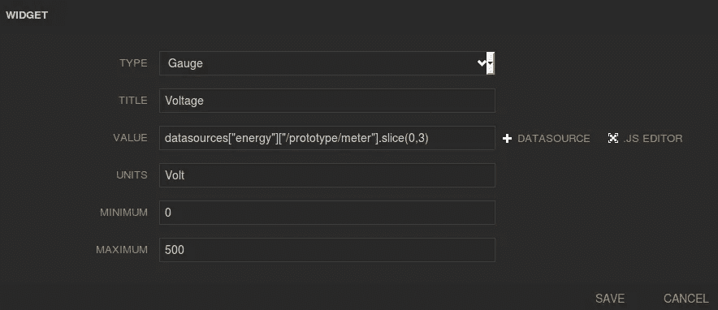

Configuring widget to display Energy Meter data

**结果:**

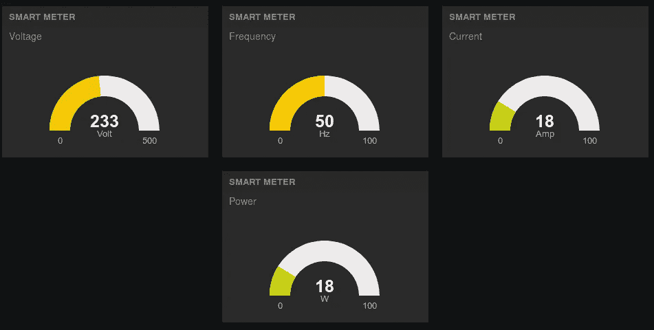

Visualizing Modbus Energy Meter data on NETPIE

**结论:**

本文是使用西门子 Simatic IoT2040 作为处理工业生产数据的工业网关的概念验证(PoC)。本文讨论了 Modbus 电能表与 Simatic 的集成。类似地，其他工业传感器也可以与 Simatic 集成，这为 IIoT 开辟了道路。

卡尔蒂克·穆希尼尼

电信/信息和通信技术硕士