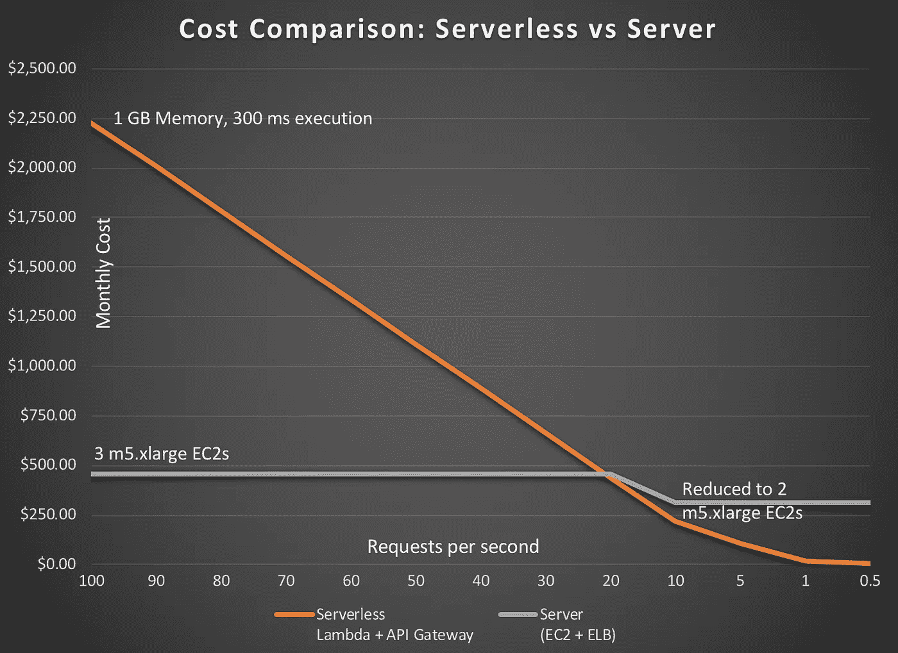
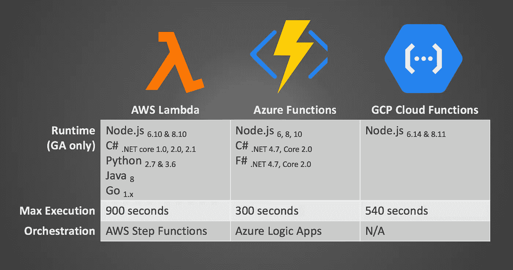

# 无服务器架构的缺点

> 原文：<https://medium.com/hackernoon/cons-of-serverless-architectures-7b8b570c19da>

## 批判性地审视无服务器架构的一些潜在缺点，这些缺点在大肆宣传中经常被忽视。

Not really but you get the point

围绕“[无服务器](https://hackernoon.com/tagged/serverless)”这个业界最受欢迎的词汇之一的兴奋和狂热还在继续增长。许多文章、书籍和会议都围绕无服务器展开了大肆宣传，主要谈论无服务器带来的好处和创新用例。

Source: Google Trends for Serverless 2016-2018

但是无服务器的缺点呢？当前有哪些限制需要复杂的解决方案，有时甚至超过了好处？在所有的兴奋和进入门槛降低的情况下，许多人很快就采取了冒险行动，而没有理解潜在的缺点，这些缺点需要仔细考虑才能获得全部潜力。

我构建无服务器解决方案已经超过 3 年，这是我试图捕捉无服务器[架构](https://hackernoon.com/tagged/architectures)的一些最常见的缺点:

# **1。好贵啊！**

这可能违背了你所听到的关于无服务器的一切，所以在干草叉出来之前，让我来证实一下这种轻率的断言。根据工作负载，无服务器*可能*很快变得昂贵。这里有一个例子:

让我们假设您正在运行一个简单的无服务器应用程序，它具有 1 个 Lambda 函数和 1 个 API 网关，需要 24x7 支持每秒 100 个 API 请求。这给了我们:

*   API 网关:**$ 917/月**
    [$ 3.50/百万 API 调用* 2.62 亿 API 请求/月= $917]
*   Lambda: **$1，300/月** [$ 0.00001667 GB-秒*(2.62 亿次请求*每次执行 0.3 秒* 1 GB 内存- 400K 空闲层秒)= $1，308]
*   **总计:2，217 美元/月**

## 2217 美元太多了！

考虑一下通过运行基于云的应用服务器，您可以获得什么:

*   3 台高可用性 EC2 服务器: **$416**
    【通用超大型 m5.xlarge: 16.0 GiB RAM，4 个 vCPUs @ $ 0.19 每小时 x 每月 730 小时 x 3 个负载平衡实例以实现高可用性】
*   应用负载平衡器: **$39**
*   总计:455 美元/月
*   或者 308 美元/月，如果您得到的是预订的实例类型

## 这比无服务器便宜 80%!

现在，无服务器架构可以在运营和维护底层基础设施方面抽象出大量昂贵的开销，这是吸引力的一大部分。但是一旦你在云上，有几个 PaaS 产品(例如 AWS 的 [AWS Elastic Beanstalk](https://aws.amazon.com/elasticbeanstalk/) 等等)可以为你管理大量的基础设施开销，包括安全补丁、健康检查、自动伸缩、监控等等。这有助于缩小无服务器与基于服务器的托管产品之间的差距。

Cost Comparison: Serverless vs Server based application. This example compares AWS Lambda with a highly available AWS Elastic Beanstalk application

# 2.仅在一个云环境中工作的独角兽解决方案，也称为供应商锁定

## 集成降低了便携性

无服务器产品正以前所未有的速度发展，单一用途的服务可以作为构建块自然地粘合在一起，以创建一个整体解决方案。例如，AWS Lambda 可以与用于数据流触发器的 AWS Kinesis、用于通知的 AWS SNS 以及用于微服务编排的 AWS Step 函数集成，以创建端到端的无服务器解决方案。尽管基本的 FaaS 功能可以跨云使用，但是一旦与其他本机服务集成，您就失去了可移植性。

## 特定云提供商独有的专有服务

许多无服务器产品都是专有的，具有无法移植的独特功能。例如，AWS DynamoDB 和 Azure CosmosDB 都是无服务器的 NoSQL 数据库。但是它们的索引结构、嵌套和限制是如此的不同，以至于你几乎被供应商锁定了。

## FaaS 缺乏跨云提供商运行时的一致性和灵活性

即使在跨云的 FaaS 产品中，平台选择仍然不一致。如果你是一家使用 AWS Lambda 的 Java 商店，你不能在不重写整个应用程序的情况下将你的 FaaS 迁移到 Azure 或 Google，因为 Java 还没有做好生产准备。节点。JS 是跨云的最常见的 FaaS 运行时，但是运行时的选择仍然有限，并且经常落后于最新版本。相比之下，基于服务器的应用程序允许语言、操作系统和运行时版本的灵活性。

AWS Lambda vs Azure Functions vs Google Functions — as of November, 2018

# 3.产生多种变通办法的局限性

一旦您开始重构一个本地应用程序，使其作为无服务器运行，您可能会发现它的多重局限性。其中一些是好的，因为它们导致了更好的设计，但是它们仍然有局限性——特别是如果这意味着更多的重构。局限性可以单独成为一篇文章，所以为了简明扼要，我将列出一些最常见的局限性:

*   对执行时间的硬性限制(从 5 到 15 分钟)
*   不支持有状态应用程序
*   没有本地存储
*   对调用有效负载大小的硬限制(例如，AWS Lambda 为 128 KB)
*   由于在扩展过程中实例化新容器，冷启动可能会导致延迟
*   缺少本地测试选项
*   部署、管理和开发的工具限制
*   自动协调大规模无服务器应用程序的部署
*   并发性和帐户范围的平台限制
*   安全性仅限于平台特定的不可移植的安全特性，而不是操作系统级别的控制

# 4.故障排除是痛苦的

随着无服务器应用程序的增长，由于 FaaS 应用程序的设计工作方式，故障排除的复杂性急剧增加。

## 分布式监控

无服务器允许将应用程序分解成更小的模块。但是这可能导致分布式监控的新问题。由于一堆无服务器组件链接在一起，端到端跟踪请求/响应的能力变得至关重要，但在使用传统监控工具时往往非常麻烦。

## 排除故障

分布式应用程序意味着您需要更多地依赖日志跟踪来对问题的根本原因进行反向工程。允许自省和逐行单步执行的经典运行时调试器对于无服务器应用程序是不可能的。

## 本地和远程测试

本地测试需要在本地复制所有无服务器限制。这个领域有很大的发展，使得在本地测试变得相对容易。但是进展主要是在组件级别(例如，一个单独的功能)，而不是在无服务器应用程序级别。在一些情况下，并行无服务器堆栈需要在单独的帐户上启动，以确保测试不会超过帐户范围的平台限制。

# 5.需要重大的思维转变

最滞后的一个领域可能是仍以虚拟机配置模式运行的 ITOps 的思维转变。我经历过一些组织，在这些组织中，创建单个 AWS Lambda 功能会启动过时的审批流程，包括不相关的基础架构信息和等待 1-2 周的审批。没有升级到在新的无服务器世界中工作的 ITOps 可能是一个严重的瓶颈。

使用过时的流程和资源，用无服务器架构启动一个新项目，从一开始就注定失败。有培训选项可用，但这需要投入时间、金钱和思想开放的参与者，他们可以忘却和学习新的方法。

# 摘要

了解无服务器架构的一些潜在缺点可以帮助您做出明智的决策。与所有新技术一样，在采用无服务器产品之前，请仔细评估您的应用需求和利弊。

## **不要盲目跟风无服务器的炒作！**

话虽如此，我坚信未来将会是无服务器的，有一个成熟的工具集和框架来解决上面提到的许多限制。随着更广泛的无服务器社区获得使用这些新技术的经验，它只会进一步改善无服务器生态系统。

***尾注***