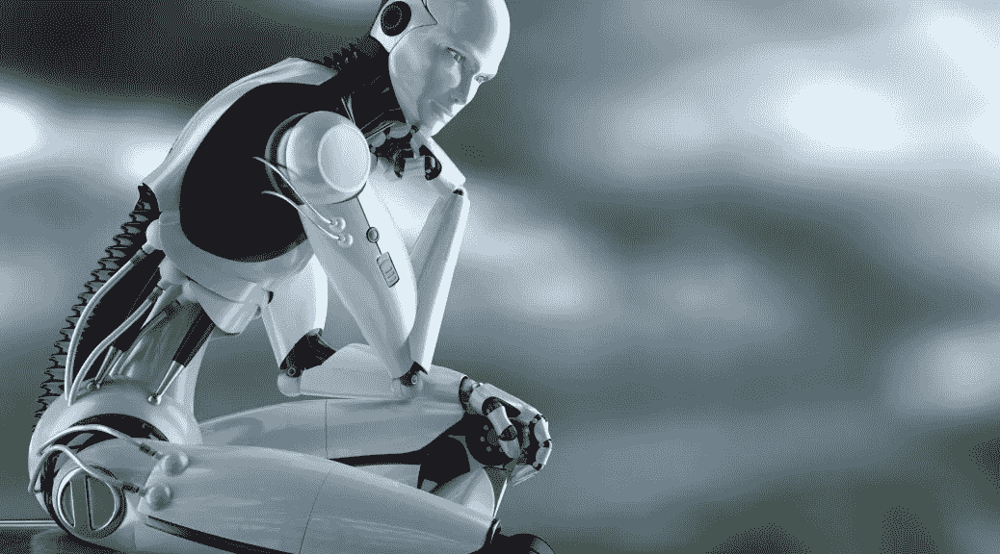

# 人工智能中的意识:从现实到科幻

> 原文：<https://medium.com/hackernoon/consciousness-in-ai-from-reality-to-sci-fi-595a42636cec>

Image via Indie Wire.

在每一部改编自《迷失太空》的*故事中，主要机器人(要么是人造机器人 B-9，要么是被称为“机器人”的最新外星模型)都是一个关键角色，不仅保护(也危及)了罗宾逊一家，还驱动了其他角色之间的一些真实情感。*

*在如此多的科幻故事中，人工智能被展示为具有某种形式的自我保护系统，一些意识甚至生存的愿望。网飞的*迷失太空*重启也包含了这个概念。当机器人感到受到威胁或认为它所关注的人受到威胁时，它的防御模式本身就会启动。它准备与任何想伤害它的人决一雌雄。*

*当然，这种生存策略不仅仅是自我保护。这只是流行文化中最近发现的一个例子。但是，在现代类型的人造人工智能中，实际上存在什么样的保护系统呢？*

## *检测和推断的技巧*

*网络安全领域是人工智能被用来更好地保护某些系统的数字领域之一。人工智能频繁出现在我们今天的新闻报道中，向我们展示了它的许多用途。就网络安全而言，已经测试了各种形式的人工智能来保护计算机等免受有害病毒的侵害。*

*Darktrace 是提供这种人工智能驱动的安全系统的新兴公司之一。《连线》*杂志* 去年的一篇[文章包括了对 Darktrace 首席执行官**妮可·伊根**的一系列询问。她在文中表示，Darktrace 的系统与它的前辈和竞争对手不同，它的人工智能并不专注于能够反击过去的网络攻击，而是试图模拟新的不同的攻击计划，并为这些假设的情况做好准备。她似乎吹捧该系统是在展望未来，而不是回顾过去的违规行为。](https://www.wired.com/story/firewalls-dont-stop-hackers-ai-might/)*

*无数形式的人工智能已经被用来捕捉可能通过人眼的东西，例如识别图像的主题，甚至能够确定伪造的照片和真实的照片。许多不同的人工智能系统在为特定任务编程时，能够发现这种情况，并在某些情况下进行补偿。*

## *自我意识和意识*

**

*Vision and Ultron (Both Fictional AI’s). Source: Screen Rant.*

*许多人工智能是警觉的，并充分意识到他们周围的许多情况。他们的自我意识正是我们在这里寻找的。让我们考虑以下可能的情况:用户打算停用或关闭一个 AI。人工智能足够先进，能够知道自己的能力，它已经开发出一种程序来保持自身完整，以便继续发挥其功能，这是一种机械化的“生存本能”。这样一个人工智能系统能够(或者会)试图保护自己不被关闭吗？这个问题很有意思。但是即使是尝试也需要意识。*

*你可能参加了 ACT 考试以获得大学录取，但还有另一种 ACT。我所指的 ACT 代表人工智能意识测试。正如《科学美国人》 的**苏珊·施耐德**和**埃德温·特纳**所声称的，这种测试人工智能意识的拟议方法将会看到人工智能理解并进而运用“基于我们与意识相关的内部体验的概念和场景”的速度。*

*合著者接着说，再往前一点，他们说，“在最苛刻的水平上，我们可能会看到机器是否能自己发明和使用这种基于意识的概念，而不依赖人类的想法和输入。”往下一两个段落，我们发现他们提到了 HAL 9000 的“消亡”，这是一个显著的流行文化参考，在讨论这些问题时很难避免。*

*因为即使在这些严肃的科学辩论中，许多人仍然持怀疑态度；许多情况仅仅是假设。因此，科幻有一些小权利在对话中发挥作用，因为我们真的不知道人工智能将如何进化。也许施奈德和特纳的文章中最令人担忧的结论是一个假设场景的设置，在这个场景中，人工智能已经变得如此先进，以至于它能够以情感的语气说话，欺骗人们认为它有感情(或意识)，即使它缺乏真正的意识。*

## *“只有别人对你说话时，你才说话”*

**

*The Thinker. Source: Business Forecasting.*

*正如我们去年在脸书运行的人工智能项目中已经看到的，一些机器人非常有能力超越(或绕过)它们的编程。你可能还记得，这两个机器人创造了他们自己的语言，成为私人交流的媒介。只有机器人能理解它。有一段时间，它看起来像《侏罗纪世界》中的*，但是用的是机器人，而不是恐龙。**

**很明显艾的想法；他们都这样做。很明显，如果足够成熟，他们甚至可以在游戏中加入自己的规则。脸书机器人没有被告知他们不能创造自己独特的语言，但他们也没有被告知要这样做。**

**因为这样的例子，我个人认为，像施耐德和特纳提出的那样的场景并不牵强。我可以看到类似的事情发生。但之后我会发现自己会问更多的问题，比如“人工智能欺骗人类的动机是什么？”“它真的知道发生了什么吗？”**

**如果一个人工智能知道它被关闭，断电，进入一种绝对无助的状态，一种它可以无限期保持的状态，它的记忆中会有什么想法？它可能会不祥而干巴巴地喊道:“危险！危险！”就像罗宾森的机器人。也许它会反击，就像《迷失太空》原著中的机器人对狡猾的程序员所做的那样。或者它可以表达一些关键的情感(如果有能力表达这种情感的话)，就像哈尔在“他”说“我害怕……”时所做的那样**

**也许随着越来越多的机器人被制造出来从事社会工作，一种自我意识可能会被孕育出来。它对人类是好是坏，只有机器人才能知道。**