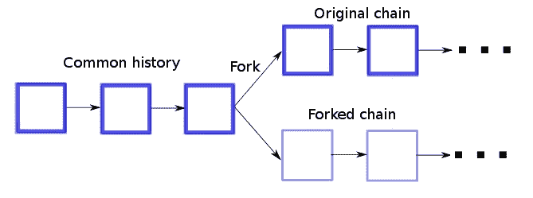
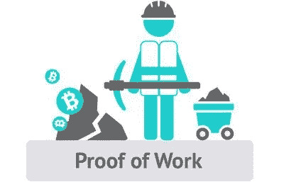
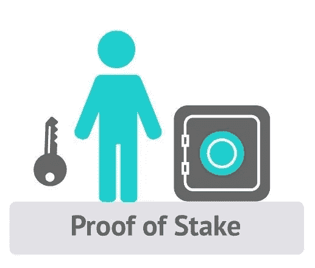
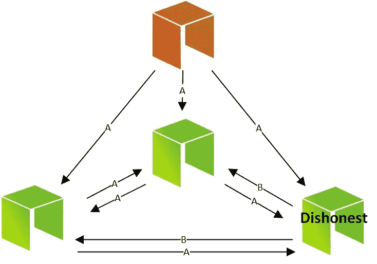

# 共识机制——尽可能详细和简洁！

> 原文：<https://medium.com/hackernoon/consensus-mechanisms-as-detailed-and-concise-as-possible-b3da79f85f66>

众所周知，区块链是一个记录交易历史的共享、不可改变的账本，预计将颠覆和纠正几乎所有行业。采用企业区块链的 dApps 和公司数量的激增证明了这一信念。关于区块链，需要注意的一件重要事情是，无论在什么样的网络中，这种信任都是固有的。

决策者，从沃尔玛到[谷歌](https://hackernoon.com/tagged/google)，从 IBM 到你身边最热门的创业公司，每个人都在区块链上大展拳脚。这不是没有任何深刻的原因，你可以看看沃尔玛如何使用区块链[将食品追溯时间从 18 小时减少到 2 分钟。](https://blog.sodio.tech/why-2018-belongs-to-blockchain/)

然而，为了产生预期的影响，必须权衡许多因素，而共识是其中最重要的因素之一。任何区块链的共识机制负责维护在区块链上记录的数据的神圣性，同时具有足够的弹性来应对节点故障、网络分割、消息延迟、消息无序到达和损坏的消息的情况。在这项工作中，我们将讨论共识机制对区块链平台的重要性，一个可靠和强大的共识机制应该是什么样子，然后讨论目前使用的共识机制。

**什么是伟大的共识机制？**

随着大量区块链平台的出现，以及新平台的不断涌现，理解是什么决定了共识机制是否足够好非常重要:

**安全性:**如果所有的节点都能够产生根据协议规则有效的输出，则共识机制可以被称为“安全的”。

**参与性:**共识机制应该是每个节点都积极参与区块链数据库的更新过程。

**Inclusive:** 决策中必须包含所有节点。任何节点都不应该对自己投票的价值或影响感到沮丧。

**平等主义:**一个伟大的共识机制必须在各方面都是平等主义的。这意味着，每一票都必须有同等的价值和分量，网络才能达成共识。

> “区块链驱动的平台就像它的共识模型一样安全可靠。”

**不良共识机制导致:**

不良的共识机制使区块链网络暴露于许多不良问题。看看其中的一些:

**区块链分叉:**一个糟糕且不坚固的共识机制向许多漏洞打开了区块链，区块链分叉的可能性就是其中之一。众所周知，区块链分叉会对区块链网络造成严重破坏，因为它会导致区块链上记录的数据视图完全不一致，从而迫使应用程序以不可预测的方式运行。

简单来说，区块链分叉基本上是对协议的改变，其中一组参与者/节点偏离了区块链的原始版本。到目前为止，区块链平台中有两种类型的分叉:

**1。硬分叉:**假设一组节点失控，或者与区块链有潜在的分歧(或者与正在引入原始区块链的某些东西有分歧)。现在，上述小组将决定走自己的路，最终导致“分叉”版本的区块链。其余的节点现在可以选择更新它们的系统，以便使用这个区块链或坚持原来的系统。这里重要的是，新版本中不允许使用以前的区块链运行的节点。硬分叉本质上导致创建两个独立的区块链。

**2。软叉:**这在某种程度上是对原始区块链的可选升级，这也导致了两个不同的区块链。然而，这完全取决于节点是否想升级他们的系统来使用软分叉。

比特币区块链的一些分支是:

a.比特币 2015 年 8 月

b.比特币经典:2016 年 2 月

c.比特币无限:2017 年 5 月

d.比特币现金:2017 年 8 月

e.比特币黄金:2017 年 10 月

f.SegWit2x:已暂停的建议分叉。

**共识失败:**某些共识机制可能根本无法帮助节点达成共识。比方说，共识机制需要一定比例的失败节点的超级多数投票，区块链面临共识失败的风险。导致共识失败的常见原因如下:

a.节点或网络故障。

b.不兼容的节点。

c.有效的诚实节点未能做出决定。

**绩效不佳:**虽然绩效不佳完全取决于共识机制的设计，但它是任何区块链平台成功的关键点。共识条件可以是动态的，其中其他节点变得恶意，或者网络分区可能延迟节点之间交换的消息，这可能在基于该区块链的应用中表现为高等待时间。

**揭示比特币区块链中的共识攻击:**

比特币的共识机制是目前最安全、最不可改变的机制之一。然而，至少从理论上讲，它仍然存在各种各样的漏洞。共识机制取决于多数矿商是否出于自身利益诚实行事。因此，如果一群矿工能够获得大量的采矿能力，他们可以很容易地攻击共识机制来破坏区块链的安全性和可用性，顺便说一下，这对于任何使用工作证明作为其共识机制的区块链来说都是如此。

尽管共识攻击在比特币的区块链看起来臭名昭著且危险，但“不诚实”的矿工无法窃取比特币，在没有任何签名的情况下花费比特币，或改变过去的任何区块，他们只能影响最近的区块，并可能导致拒绝服务，从而导致未来区块的创建中断。

说到“51 %攻击”，人们实际上并不需要 51%的散列能力来折衷区块链。事实上，这种类型的攻击可以用较小百分比的散列能力来执行。51%被认为是一个阈值，当涉及到比特币的区块链时，超过这个阈值，这种攻击就有 100%的成功机会。

让我们来看看当今最流行的共识机制是如何工作的:

**工作证明**

PoW 可能是目前使用最广泛的共识算法，被批评为“行星杀手”,因为它需要大量的计算能量，事实上，这可以追溯到 1999 年，当时该术语是由马库斯·雅各布松和阿里·朱尔斯提出的。

它最早的应用是给所罗门群岛的贝壳货币赋予价值。就加密货币而言，比特币是第一种有效的加密货币。HashCash 也是一种工作验证算法，旨在根除拒绝服务的情况。

然而，比特币的工作证明被认为更加合法，因为它使用分散的 P2P 协议来跟踪硬币的转移，以防止重复支出，这不同于 Hashcash 基于 RPoW 的硬件可信计算功能。

比特币的威力在于，它能够确保在区块链开采的每一个区块都是唯一的真相，同时成功地让雇佣军无法成功夺取区块链。

然而，当我们继续探索更快、更分散和环境可持续的价值转移方法时，电力的替代品出现了。

下面简要讨论其中的一些:

**股权证明**

以太坊正在迁移到 PoS 的想法可能会使它成为最热门的女孩。而且这也不是完全没有道理，51%的攻击或者区块链分叉用这种共识机制代价要大得多。

不仅如此，这种机制所需的较低的计算能量使它在 PoW 共识机制上占了上风。

这种共识算法的一个显著特征是，想要成为“minter”或“validator”的人需要通过在网络上购买硬币来投资创造他的股份，而不是像 PoW 一样在 GPU 上花费大量金钱来解决无用的计算。

虽然，PoS 也有它自己的缺点。其中最受欢迎的一个是“无利害关系”问题。简而言之，验证者或签名者可以同时创建和签名两个区块，以便收取两者的交易费用。

用增强来解释，谁来阻止网络中的参与者行为可疑，如果他/她“没有任何利害关系”。

**委托的利害关系证明。**

由 Daniel Larimer 引入的 DPoS 的独特之处在于，令牌持有者或验证者不是直接投票或创建区块的人，他们投票是为了选出代表，然后代表他们进行验证。

拉里默希望设计一种共识算法，能够实现高达每秒 100，000 次的交易速度，这远远超过了任何基于 PoW 或 PoS 的同行的运行速度。

该体系还能够淘汰不良行为者，同时认可并奖励有价值的参与者。

用户选出的前 100 名证人的服务是有报酬的。此外，这些证人中的前 20 名有权获得工资，以及由网络支配的后备证人，因为许多人都努力成为证人。

现在，一个人的可信度或有效“投票”是由他们持有的代币数量决定的。不仅如此，如果证人的工作没有为网络创造价值或表现不好，投票者有权投票淘汰证人，因为投票一直在进行。

关于 dpo 的另一个有趣的事情是，矿商正在合作(而不是像 PoW 或 PoS 那样竞争)制造区块，这使得 dpo 比其他共识机制更快地运行更大规模的订单。

**作为股权凭证的交易**

EOS 使用交易作为股权证明。它防止了不同链上的事务重放问题。这是它的工作原理，也是 TaPoS 的解决方法:

恶意参与者首先锁定某个区块的利润，广播一个更长的秘密区块链，以使原始交易无效。自私挖掘攻击也使用这个，因为它比获得 51%的散列能力更有效和容易。

现在，假设每笔交易都包含最近一个区块的散列，而区块链只在该区块之外的区块链提供交易的股权证明。这将使任何坏演员几乎不可能建立秘密链。

**租赁股权证明**

在传统的共识机制中，具有低余额的节点和个体发现几乎不可能找到赌注或挖掘新的块，因为它们的哈希值极低。这进一步转化为大部分低余额持有者在运营节点方面没有发言权，以及少数大玩家出手。然而，众所周知，当涉及到任何区块链网络的安全时，“人越多越好”是真理。这就是 Lpos 的用武之地。

Lpos 有助于小玩家加入网络，其特征是将他们的余额出租给赌注节点。它所做的是，增加“赌注节点”的权重，最终增加他们能够开采区块的机会。也就是说，由此产生的利润按照最初商定的比例进行分享。

**委托拜占庭容错(dBFT)**

另一个有趣的共识算法带来了可伸缩性和低成本交易。拜占庭容错关系到容错计算机系统的可靠性。

网络参与者基于许多因素选择代表。这些代表必须在他们之间选出一名发言人，负责评估各种交易，从而为当前的区块链增加障碍。代表们需要仔细检查演讲者所做的计算和声明，并根据它们的匹配来批准或不批准。要批准增加任何区块，必须有一定比例的代表同意。

dBFT 在不同组合的发言人和代表恶意的不同情况下的有趣变体确实使它成为一种有前途的共识机制。

**收工！**

还有很多其他的共识机制正在被讨论。然而，我将把他们的分析留到以后再说。但是，如果您愿意，您可以查看对其他共识机制的深入分析:

查看我们的[白色标签的分散交换解决方案](https://dex.sodio.tech/)

如果你喜欢这个博客，别忘了看看我在 https://medium.com/sodio-tech 的其他博客。

您的反馈对我们在 Sodio Tech 开发的[产品和内容有着难以置信的深远影响，不要退缩！](https://sodio.tech/)