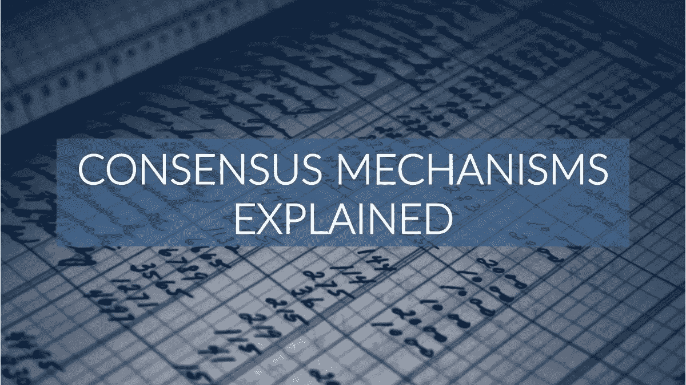
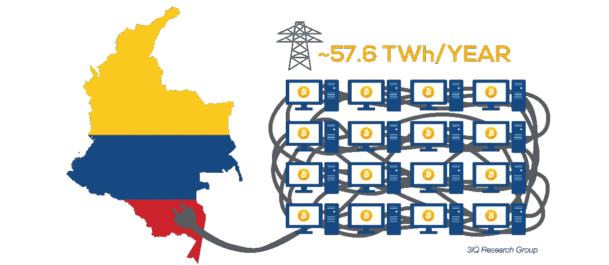
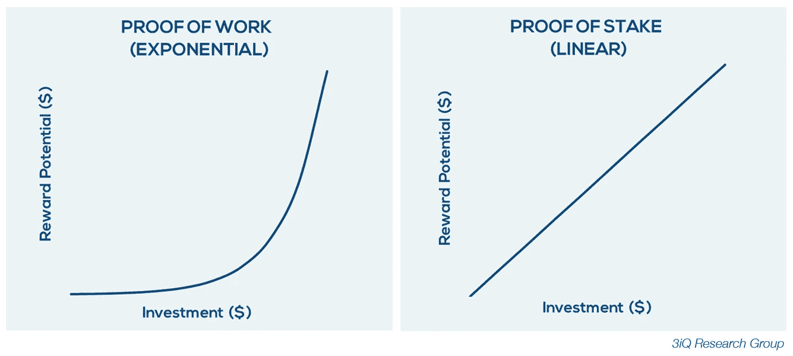

# 共识机制解释:PoW 与 PoS

> 原文：<https://medium.com/hackernoon/consensus-mechanisms-explained-pow-vs-pos-89951c66ae10>

区块链技术的一个核心方面是分布式分类账，它包含了所有以前交易的记录。它被称为*分布式*分类账，因为它不是存储在一个中心位置，而是存储在遍布世界各地的计算机网络中。分布式分类帐操作的关键是确保整个网络集体同意分类帐的内容；这是共识机制的工作。

很多加密资产的背后，都有一个共识机制。共识机制的目的是验证添加到分类帐的信息是有效的，即网络是一致的。这可确保添加的下一个块代表网络上的最新事务，防止重复开销和其他无效数据被附加到区块链。此外，共识机制通过不断的[分叉](https://3iq.ca/3iq-research-group/blockchain-forks/)来防止网络脱轨。

已经有许多不同的共识机制被设计出来，每一个都有自己的优点和缺点。如上所述，它们都服务于相同的核心目的，但是方法不同。不同共识机制之间的主要区别在于它们授权和奖励交易验证的方式。

最受欢迎的区块链共识机制是工作证明(PoW)和利益证明(PoS)系统。本文将重点描述和比较 PoW 与 PoS，但是，请注意，还存在许多其他系统，如委托利益证明(DPoS)和联邦拜占庭协议(FBA)。

**工作证明(PoW)**

工作证明的概念在加密资产之前就存在了。这个想法最初是由辛西娅·德沃克和莫尼·诺尔在 1993 年的一篇期刊文章中发表的，然而，直到 1999 年,“工作证明”这个术语才被马库斯·雅各布松创造出来。

在中本聪的[比特币白皮书](https://bitcoin.org/bitcoin.pdf)中，理论上认为，压制区块链网络的网络强度的唯一方法是通过 51%的攻击(在[区块链基础知识](https://3iq.ca/3iq-research-group/blockchain-basics-2/)中了解更多关于 51%攻击的信息)[比特币白皮书](https://bitcoin.org/bitcoin.pdf)提出使用工作证明系统来防止实体获得对网络的多数控制权。以这种方式应用工作证明可以说是比特币的核心理念，因为它允许不可信的分布式共识。

比特币挖矿的工作原理:

1.  一组事务被捆绑到一个内存池(mempool)中。
2.  矿工通过解决一个数学难题来验证 mempool 中的每个事务是合法的。
3.  第一个解决难题的矿工将获得新铸造的比特币(区块奖励)和网络交易费。
4.  经过验证的内存池(现在称为块)连接到区块链。

矿工必须解决的难题类型有几个定义工作证明系统的关键特征:

*   这些谜题是不对称的，这意味着矿工很难解答，但网络很容易验证正确答案。
*   这些谜题不需要技巧，它们需要蛮力。这确保了某些矿商不会获得相对于其他矿商的不公平优势。矿工提高解谜几率的唯一方法是获得额外的计算能力；一些能源和资本非常密集的东西。在[区块链安全](https://3iq.ca/3iq-research-group/blockchain-security/)中了解获得比特币区块链多数控制权所需的计算能力。
*   难题参数被周期性地更新，以便保持块时间一致。例如，比特币协议的块生成目标时间为 10 分钟。所以举例来说，如果超过两周的平均阻塞时间已经减少到 10 分钟以下，网络会自动增加难度。这反过来增加了计算的次数和解谜所需的平均时间。

**股权证明(PoS)**

利益证明系统具有验证交易和达成共识的相同目的，但是，该过程与工作证明系统中的过程有很大不同。有了利害关系的证明，就没有数学难题了，相反，新块的创建者是根据他们的利害关系以确定的方式选择的。赌注是一个人拥有多少硬币/代币。例如，如果一个人下注 10 个硬币，而另一个人下注 50 个硬币，下注 50 个硬币的人被选为下一个块验证者的可能性将是 5 倍。

Proof Stake 系统的一个关键优势是更高的能效。由于省去了能源密集型的采矿过程，与工作证明系统相比，利益证明系统可能是一个更加绿色的选择。此外，由利益证明系统提供的经济激励可能在促进网络健康方面做得更好。在工作证明制度下，一个矿工可能不拥有他们正在开采的硬币，只寻求最大化他们自己的利润。另一方面，在利害关系证明系统中，验证者必须拥有并支持他们正在验证的货币。这些优点以及更多将在下面详细讨论。

股权证明和工作证明之间的另一个关键区别是，在股权证明下，没有新的硬币创造(采矿)。相反，所有的硬币都是一开始就被创造出来的。这意味着验证者必须通过交易费用获得全额奖励，而不是新铸造的硬币。

# 比较工作证明和利害关系证明

**成本和能源**

利益证明系统有可能成为工作证明系统的更具成本效益和绿色的替代方案。运行工作证明系统所需的计算能力是非常耗能的。例如，比特币网络每年需要的能源消耗与哥伦比亚相当(每年 57.6 万亿瓦时)1。此外，采矿的竞争性质意味着越来越多的资金被投入到更强大的采矿计算机中，这反过来将需要越来越多的能源供应。

*1\. Data as at April 3rd, 2018\. Retrieved from* [*https://digiconomist.net/bitcoin-energy-consumption*](https://digiconomist.net/bitcoin-energy-consumption)

股权证明系统不需要采矿或随之而来的高能耗处理能力。因此，利益相关系统的运行只需要很少的能量。较低的能源成本也使得验证的角色更容易为社区中的任何人所接受，而采矿的角色越来越多地保留给大规模作业。

**安全**

crypto 中的 Proof Stake 系统相对来说比 Proof of Work 系统要新，而且还没有达到相同的采用水平。因此，它没有像工作系统证明那样经过严格的测试，并且已经发现了一些潜在的安全风险。

区块链的不断分叉对于网络来说是不健康的，并且会导致不稳定。在工作证明系统中，如果区块链分叉，矿工将不得不做出决定，继续支持原来的区块链或切换到更新的分叉区块链。为了支持分叉的两端，采矿者必须在两者之间分配计算资源。通过这种方式，工作系统的证明自然会通过经济激励阻止不断的分叉发生。

另一方面，股权证明制度本身并不阻止分叉。当一个区块链分叉时，验证者将收到他们在新分叉的区块链上的股份的副本。如果验证者在分叉的两边签字，他们可能会要求两倍的交易费作为奖励，并双倍花费他们的硬币；这就是所谓的“无关紧要”问题。参与者不需要增加他们的股份来验证区块链的多个副本上的交易，因此，不存在防止这种不良行为的经济激励。

解决“无利害关系”问题的一个潜在办法是征收一笔保证金，保证金将被锁定一段时间。以太坊计划在 2018 年的某个时候从工作证明系统切换到利益证明系统，并提出了一个名为 Casper 的共识协议。Casper 将采用存款解决方案，要求验证者提交最低存款额才能参与。如果协议确定参与者违反了一组规则，例如在多个分叉上签字，则押金将被没收。

**集中化**

对于使用工作证明系统的区块链网络，人们越来越担心集中化的风险。如前所述，采矿在工作证明系统中的作用越来越多地保留给大规模作业。区块链网络的控制权正从整个社区转移到越来越少的人手里，这与大多数加密资产的分散特质相反。

股权证明制度可能会提供一个更公平的解决方案。参与者在利益证明系统中可以获得的网络控制量与他们的投资成正比。如果一个参与者的投资是另一个参与者的十倍，他们将获得十倍的控制权。相反，在工作证明系统下，如果一个矿商在设备上的投资是另一个矿商的 10 倍，他们实际上将获得超过 10 倍的计算能力。这是大宗采购交易和高端设备效率提高的结果。因此，个人与大型采矿场竞争的利润越来越低，难度也越来越大。

减少验证交易控制中的实体的集中化是区块链网络的分布式体系结构的基础；这就是共识机制发挥如此重要作用的原因。为了保持任何区块链网络的不可信任、不可改变和分布式的本质，一个正常运行的共识机制是必要的。

**参考文献:**

Castor，A. (2017 年 5 月 17 日)。*区块链共识协议(简短)指南*。检索自:[https://www . coin desk . com/short-guide-区块链-consensus-protocols/](https://www.coindesk.com/short-guide-blockchain-consensus-protocols/)

Rosic，A. (2017)。*工作证明与利益证明:基本采矿指南*。检索自:[https://block geeks . com/guides/proof-of-work vs-proof-of-stage/](https://blockgeeks.com/guides/proof-of-work-vs-proof-of-stake/)

曼宁，J. (2016)。*解释了工作证明与利害关系证明*。检索自:[https://www . eth news . com/proof-of-work vs . proof-of-stage-explained](https://www.ethnews.com/proof-of-work-vs-proof-of-stake-explained)

赫蒂格，A. (2017 年 11 月 2 日)。卡斯帕在哪里？以太坊重塑区块链的竞赛。检索自:[https://www . coin desk . com/ether eum-Casper-proof-stake-rewrite-rules-区块链/](https://www.coindesk.com/ethereum-casper-proof-stake-rewrite-rules-blockchain/)

比特币:一个点对点的电子现金系统。检索自:[https://bitcoin.org/bitcoin.pdf](https://bitcoin.org/bitcoin.pdf)

数字经济学家。(2018).*比特币能耗指数*。2018 年 4 月 3 日检索自:[https://digiconomist.net/bitcoin-energy-consumption](https://digiconomist.net/bitcoin-energy-consumption)

哥伦比亚的能源消耗。2018 年 4 月 3 日检索自:[https://www . world data . info/America/Colombia/energy-consumption . PHP](https://www.worlddata.info/america/colombia/energy-consumption.php)