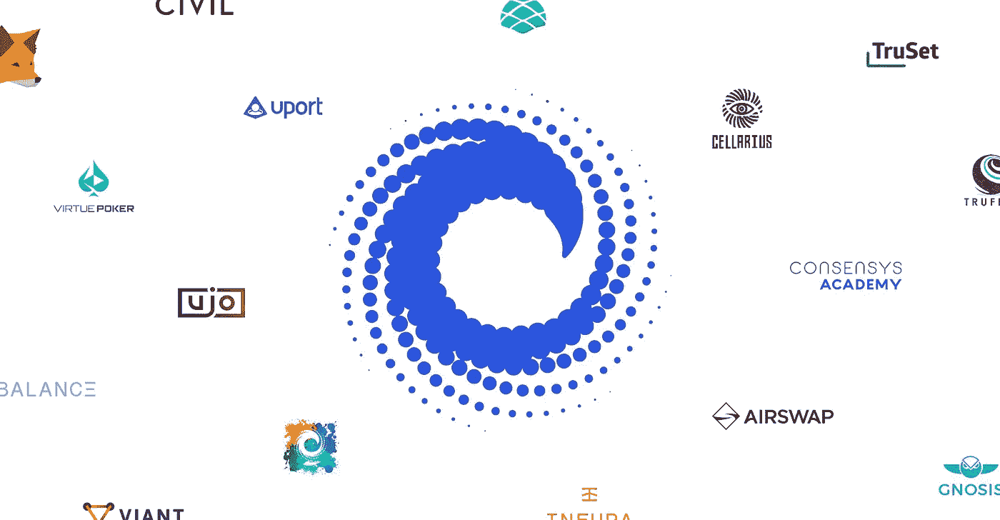

# 我为 ConsenSys 开发者计划(2018)提交的求职信

> 原文：<https://medium.com/hackernoon/consensys-developer-program-2018-2364a5538e33>

ConsenSys 学院专注于培养下一批以太坊开发者。

我正在考虑申请，尽管这门课程的价格标签是 1000 美元。但是我的意思是……能够在分布式系统中最大的开源项目——以太坊上进行开发是没有价格标签的🔥

> 你可以在 6 月 4 日之前申请:【https://consensys.net/academy/2018developer/ 

下面是我提交的求职信。我想我应该把它重新贴在这里，因为它揭示了一点关于我和我为什么在这个空间。

我是一名软件工程师，热衷于创造酷毙了的东西。我已经从手机游戏开发，到构建网络应用程序，现在和[科技](https://hackernoon.com/tagged/technology)一起工作。我还很年轻，所以我没有经历过互联网的早期。当苹果通过 App Store 向开发者开放 iPhone 时，我还不是一名开发者。我不知道 2009 年我在哪里，但我没有买比特币。尽管我没能抓住这些机会，但我认为成为一名 Solidity 开发人员是我的重大突破。

白天，我是纽约最酷的法国创业公司的软件工程师——[air call](http://aircall.io/)(顺便说一句，我们正在招聘，尽管开口！).该产品是一个商业语音平台，构建在一个相当复杂的 Ruby on Rails 堆栈上。到了晚上(好吧——当我不去泡吧、打台球或探索城市的时候)，我喜欢编写分散的应用程序，阅读其他项目的进展；最有趣的两个是 [Spankchain](https://spankchain.com/) 和 [0x 协议](https://0xproject.com/)。我更愿意认为，提前进入游戏(一个分散的互联网)只会对我的职业生涯有利。

每当我被要求描述自己时，我喜欢选择三个词。雄心勃勃。黑客。冷静点。我是一个有冲劲的人，我设定高目标只是为了粉碎它们，然后设定更高的目标。我通过健康平衡的生活方式来改变生活。但在一天结束时，我是一个悠闲的人，我喜欢在屋顶上喝酒，就像我喜欢呆在家里和痛饮《广告狂人》(第三次)一样。那么，我将如何从这个开发者计划中受益呢？我会磨砺这 8 周，成为一名更有知识的区块链工程师，并以此为轨迹设定更高的目标，制造更酷的东西。

给你。我想它本可以更正式一些，但是嘿——我不是你一般的开发人员😎

如果你在纽约，让我们去喝杯啤酒吧！总是喜欢一些区块链的谈话(但不是关于你的投资🙏).我在推特上。