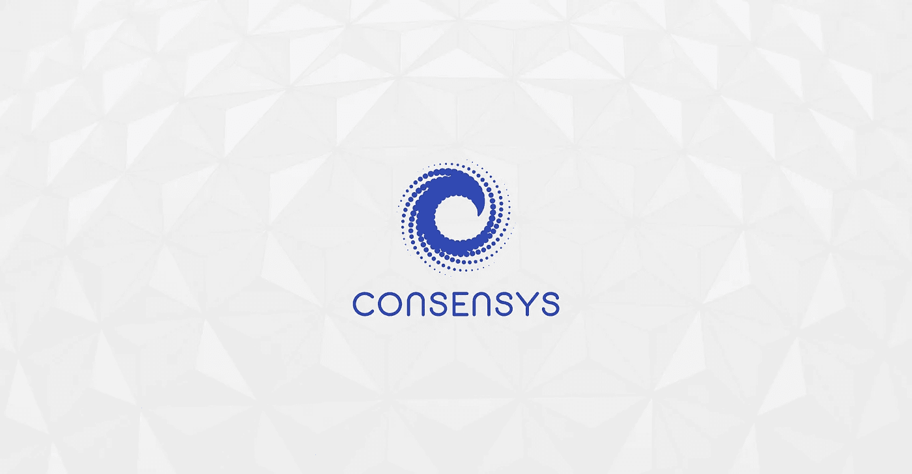
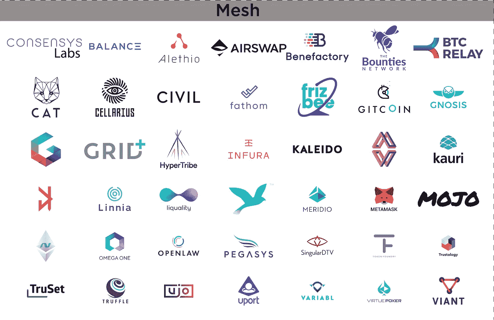

# ConsenSys:了解加密领域最重要的公司之一

> 原文：<https://medium.com/hackernoon/consensys-understanding-one-of-the-most-important-firms-in-crypto-7e1d66533d4a>

**可以关注我**[**@ flattoutcrypto**](https://twitter.com/flatoutcrypto)**在 Medium/**[**flatoutcrypto.com**](http://flatoutcrypto.com)上找到我的作品

ConsenSys 可能是一个看似难以理解的业务。block.one 的 EOS 专注于风险投资部门制造了大量噪音，但这与 ConsenSys 为构建以太坊网络而构建的网络相比微不足道。

众所周知，它已经孵化了 50 多个项目。不太引人注意的是，它已经建立了大量的企业关系，以及它现在可以运用的软实力，试图界定对更广泛的世界来说，去中心化是什么，不是什么。由于这一系列的活动，ConsenSys 基金，制定标准，并代表其项目和以太坊更广泛的游说。

# 什么是 ConsenSys？

大多数人都知道 ConsenSys 是以太坊项目的企业孵化器。该公司采用了一种“中枢辐射型”模式，目前有 50 多个项目以某种方式隶属于 ConsenSys。这个“网格”由 Airswap 和 Gnosis 等 DApps 以及 MetaMask 和 Infura 等专注于基础设施的项目组成。

这种模式对项目团队的好处是显而易见的，因为它让他们可以接触到其他开发人员，同时给予他们自主权。正如创始人 [Joseph Lubin 指出的](https://hackernoon.com/the-secrets-behind-the-success-of-ethereum-consensys-5c6997d95e76?gi=782597428ce0)，ConsenSys 正在“建立去中心化的生态系统……当你这样做的时候，你需要在不同的项目之间进行大量的沟通、协作和互动。”

项目不仅从积累的开发人员知识中受益，还会得到不同程度的资金支持。ConsenSys 最初是一家风险制作工作室，旨在围绕 MVP 孵化公司，然后将它们用于外部投资。这方面的一个早期例子是派生出的 BlockApps。此外，如果 Lubin 在状态变化第一集的评论仍然成立(该公司拒绝评论),那么 mesh 项目也将获得所有其他 ConsenSys 项目的股权，即使在他们自己的项目失败的情况下，也能给他们带来好处。

然而，网格虽然重要，但现在只是 ConsenSys 的一部分。其业务范围已经扩展到包括:

*   **学院**:“以太坊运动的教育核心”
*   **资本**:风险资本&代币出售咨询
*   **催化剂**:全方位服务营销和品牌代理
*   **设计**:产品设计师、设计思维促进者、设计研究者和战略家
*   **尽职调查**:智能合同审计和以太坊安全
*   **实验室**:孵化项目，并为其提供资本、指导和渠道(这是网状项目的所在地)
*   **社会** **影响**:具有社会影响的项目
*   **解决方案**:企业以太坊&区块链创新伙伴关系

综上所述，ConsenSys 做的很多。这反映在员工人数在不到两年的时间里从 80 人增加到 1，000 多人，这一增长趋势没有减弱的迹象。

这种增长使得人们很难理解公司的不同部门在哪里衰落，尤其是在公司频繁重组的时候。此外，甚至很难找到 ConsenSys 参与的所有事情；即使经过几个小时的研究，新的倡议和伙伴关系仍然不断出现。虽然许多企业网站旨在给浏览者留下正在进行的广泛活动的印象，但 ConsenSys 扩张如此之快，以至于其网站仅展示其业务的一小部分。

# 这(不仅仅)是钱的问题

这篇文章最初是受最近的 Civil ICO 的启发，许多人困惑为什么 ConsenSys 会如此深入地参与 Civil(在向最终失败的 ICO 捐款 110 万美元之前，为该项目提供了 500 万美元的种子资金)，除非有财富的承诺。然而，以 Lubin 为首的 ConsenSys 可能有比单纯的利润更大的野心。

虽然当然有财务动机，但该公司已经迅速发展成为整个生态系统中关系最好、可以说最有影响力的公司。正如资助 Civil 可以被解释为增加媒体影响力的一种手段一样，ConsenSys 也可以被视为塑造和影响区块链教本质和更广泛世界的去中心化的一种手段。

毫无疑问，它正在孵化几十个有趣的项目，其中一些对以太坊的成功至关重要，但它也有助于培养行业和政府对区块链的看法。这就是为什么那些只关注一开始勾勒出的网状结构的人忽略了 ConsenSys 的一些最重要的方面。

下面是一张概述了其中一些关系的地图。

ConsenSys has quickly built out a wide range of relationships

如上所述，ConsenSys 在行业机构和委员会中的代表性比任何其他公司都强。它的合作伙伴和合资企业不比任何人少。它与政府组织的关系既广泛又深入。这张地图远非详尽无遗；还有更多的连接可以被特别报道(而且几乎每天都有更多的连接被公布)。

这些联系可以分为两大类:

1.  与行业的联系
2.  软实力

# 行业联系

ConsenSys 通过其专注于企业的解决方案部门为许多领先的行业参与者工作。此外，它还是许多以行业为重点的委员会的成员(通常是董事会成员),并且是企业以太坊联盟(EEA)等更多以加密为重点的委员会的主要成员。自 EEA 成立以来，ConsenSys 人员一直在其中发挥着领导作用，包括共同创建和领导八个原始工作组中的两个。

Photo by [rawpixel](https://unsplash.com/photos/mcLpPD36-2k?utm_source=unsplash&utm_medium=referral&utm_content=creditCopyText) on [Unsplash](https://unsplash.com/search/photos/committee?utm_source=unsplash&utm_medium=referral&utm_content=creditCopyText)

通过其网格项目，该公司还与领先的金融服务和技术公司建立了许多合资企业。该公司还直接与一些公司建立了合资企业，包括 Komgo SA(与壳牌和许多领先银行建立的合资企业)和以太坊区块链即服务(与微软建立的合资企业)。

这些与科技和金融服务公司的联系不应让人感到意外。ConsenSys 的许多员工——包括许多最资深的员工——都有金融服务背景，其中以美银美林(Bank of America Merrill Lynch)为代表。这类员工在这些公司工作期间，会带来自己的人脉。卢宾本人来自金融服务背景。他参与以太坊的方式，加上他推广以太坊的行业友好方式，也可能对 ConsenSys 吸引大公司产生很大影响。

Wrong

ConsenSys 对以太坊的重要性远远超出了提供基础设施工具。将 ConsenSys 定位为分散化的行业友好面孔，使该公司在向组织定义它是什么以及它如何有用方面具有很大的影响力。这也增加了以太坊在企业中被采用的机会，因为竞争对手的协议缺乏一个类似的组织良好的啦啦队机构。正如卢宾在 EEA 发布会上所言，“企业代表思想份额，它们代表资源”。

*快速侧记；有些连接重叠是因为不明确，或者因为它们可以放在多个部分中。此外，一些连接比其他连接更强；例如，虽然我已将 ConsenSys 列入 MOBI 和可信物联网联盟，但应该注意的是，还有多个其他加密公司也是该联盟的成员。*

# 软实力

该公司对企业的影响反映在它与全球和国家非营利机构的密切联系上。这些可以分为三大类:

1.  政府和非政府组织
2.  加密协会
3.  教育

## 强大的政府关系

最明显的影响途径来自与政府机构的密切关系。ConsenSys 与许多政府机构合作，包括欧洲委员会、南非储备银行和美洲开发银行等。它与印度、美国和中东的机构合作过。它还有自己的社会影响和赠款计划，这使它能够与发展中国家的非政府组织合作，并资助密歇根大学等教育机构的影响项目。就像这家公司一样，它与世界各地都有联系。

这也变成了一个更正式的存在，1000 多名员工遍布六大洲。尽管都柏林办事处在 6 月份才开业，只有 12 名员工，但该公司已经在寻找新的办公场所，因为他们希望将员工人数增加到超过 110 人，大大高于最初 12 个月 60 人的目标。政府喜欢技术雇主，尤其是新领域的雇主；他们通常创造高薪职位，并促成技术集群的形成。仅此一点就提供了影响力。

## 密码领域的领军人物

Photo by [BRUNO CERVERA](https://unsplash.com/photos/dtqlaz4HyHw?utm_source=unsplash&utm_medium=referral&utm_content=creditCopyText) on [Unsplash](https://unsplash.com/?utm_source=unsplash&utm_medium=referral&utm_content=creditCopyText)

其次，毫不奇怪，ConsenSys 在贸易机构中非常活跃。它共同创建了企业以太坊联盟，运营着以太峰会和新推出的松露会议，并且是加密谷和全球数字金融的成员。此外，它直接(如与比特币基地、硬币中心和联合广场风险投资公司一起建立的监管框架)或通过其项目(如 token Foundry 设计的 Token 框架和 Brooklyn 项目的类似工作)站在该领域许多倡议的前列。最重要的是，由于 Lubin 的早期参与和随后 ConsenSys 发展网络的工作，它与以太坊紧密交织在一起。

## 新兴教育力量

这种对标准的输入延伸到构建文献，人们通过这些文献了解去中心化和以太坊。它与 Coursera 合作设计了一门关于区块链和去中心化的[课程](https://www.coursera.org/consensys),并且启动了它的学院分支来告诉人们什么是区块链。

The joint Coursera/ConsenSys course

鉴于政府和行业对区块链教缺乏理解，再加上以区块链为中心的教育不成熟，能够设定哪些去中心化元素是重要的标准，并根据以太坊能够实现的东西进行定制，将是一项强大的资产。当然，这是该公司目前在与行业和政府机构的更多个人/有限的互动中能够实现的。学院仅仅是这种形式的一种更正式的延伸。

为什么所有这些都很重要？因为它让 ConsenSys 能够教导监管机构、政府和更广泛的世界什么是加密——或者更确切地说，他们希望加密被视为什么。

> 我们很幸运被监管机构召集来分享我们对这项新技术的理解。我们帮助这些机构中不同的、非常聪明的人理解，区块链可能会带来一个全新的结构，也许可以使用现有的规则来评估它，但它可能需要一种新的方式来组织集体行动。— [乔鲁宾](https://hackernoon.com/new-protocols-for-old-asset-classes-4f1a8a18a0b7)

最后，由于这篇文章是受 Civil ICO 的启发，因此不提及该公司不断扩张的媒体业务是不可忽视的。这包括电影工作室 SingularDTV(最近发布了区块链纪录片《信任机器》)、UjoMusic 以及 [DecryptMedia](https://decryptmedia.com/about-us/) 和 Breaker magazine(其本身是 SingularDTV 旗下的[)的双新闻平台。尽管这些新闻平台在编辑上是独立的，但它为 ConsenSys 提供了另一个组件，他们可以在此基础上建立一个媒体平台。](https://breakermag.com/about-breaker/)

# ConsenSys:未来网络的模型？

有人评论说 ConsenSys 是以太坊。虽然这一步走得太远，但公司对网络的重要性是不可否认的，因为它同时充当游说团体、孵化器和技术驱动者。

然而，ConsenSys 不仅与以太坊相关，而且通过其建立的政府、监管和行业联系，对整个加密领域变得重要。这在未来几年可能只会增加，因为它扩大了其企业和风险投资产品，同时在连接加密和行业方面发挥了更大的作用。鉴于迄今为止的增长，很难打赌其重要性在未来几年不会增加。

本周晚些时候:ConsenSys 如何筹集资金？

**如果你喜欢这个，请跟我来**[**@ flatoucrypto**](https://twitter.com/flatoutcrypto)