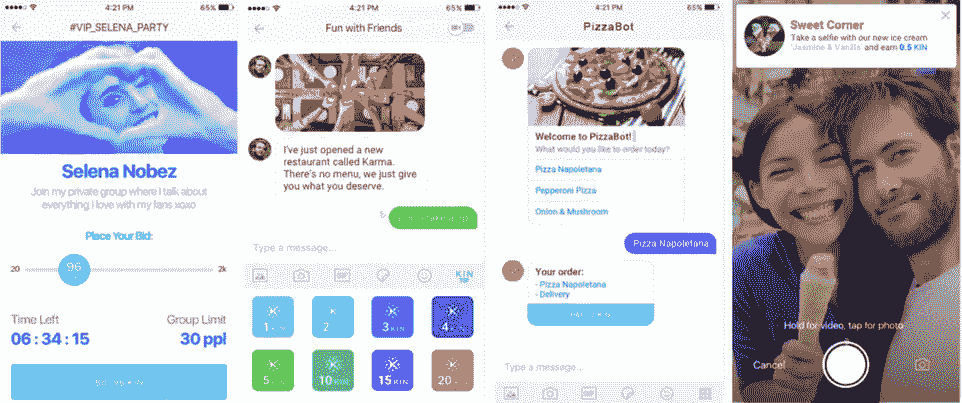

# 考虑到电报 ICO？小心行事

> 原文：<https://medium.com/hackernoon/considering-the-telegram-ico-proceed-with-caution-92c178e2a178>

*我们也通过 CRV 的媒体页发布了这个——在这里***！**

*作为跟踪加密领域的风险投资者，我们一直在关注电报代币的销售。简单回顾一下— [Telegram](https://telegram.org/) 是一种加密信息服务，可通过网络和应用程序使用。完全免费，没有广告。用户可以发送任何类型的媒体或文件，并可以编程消息在一定时间后自毁。该团队声称 Telegram 比任何其他信息服务“更快更安全”，尽管一些安全研究人员对此提出了质疑。*

*一个电报消息线程可以容纳多达 100，000 名用户，这意味着许多社区将它用作内部社交网络——例如，加密投资者用它来主持关于各种货币的群聊。Telegram 故意不收集用户住在哪里以及他们使用该平台做什么的数据，但它已经在 100 个国家的社交网络应用中排名第一。根据 AppAnnie 的排名，Telegram 在乌兹别克斯坦、乌克兰和俄罗斯等国家特别受欢迎，这些国家的互联网接入可能受到限制或受到政府的密切监控。*

**

*As of 3/8, App Annie data for Telegram’s top 10 countries by overall rank.*

*今年早些时候，该公司决定推出区块链平台和加密货币(名为 TON ),并在首次代币销售中筹集了 8 . 5 亿美元。据报道，Telegram 现在又筹集了 8 . 5 亿美元，并计划在今年晚些时候进行第三轮融资。许多顶级风险投资公司已经投资了(据报道 KPCB 和 Benchmark 也在其中)，尽管一些在加密领域最知名的风险投资者并不打算参与。*

*根据[泄露的文件](https://icodrops.com/telegram-ico-ton/)，Telegram 团队将创造 50 亿代币(称为“克”)— 44%将被出售，4%将分配给开发者，52%作为储备货币持有。这些代币将被用来做什么？用户可以相互交换代币，或使用代币支付 Telegram 或其他提供商提供的服务(如文件存储、查看内容等)。如果一切按计划进行，grams 将让人们快速安全地支付全球范围内的商品和服务，无需货币兑换。*

*加密领域的投资者和专家对电报代币销售发表了各种各样的意见——一些人声称[这是一个骗局](https://tokeneconomy.co/a-ton-of-crap-b1e264c36802)，而另一些人则认为这是一个早期投资通信和商业基础平台的绝佳机会。我们从风险投资者评估机会的角度，将这些观点总结为投资电报代币销售的五个优点和五个缺点。我们还对比了 Telegram 的 ICO 和其他两个已有 ICOed 的消息平台 Kik 和 YouNow。*

# ***优点***

*   ***大量采用。** Telegram 是最受欢迎的加密信息平台之一，拥有[200m mau](https://techcrunch.com/2018/03/23/telegram-chalks-up-200m-maus-for-its-messaging-app/)。这明显低于 WhatsApp 和 Facebook Messenger(均为约 13 亿 MAUs)，但对于 2013 年推出的独立消息平台来说，这是相当可观的。该平台对于加密领域的许多社区已经变得至关重要——根据 [ICO 白名单](http://icowhitelists.com/telegram-tracker-tokens-icos/)，99%的 ICO 使用 Telegram 与潜在投资者沟通。*
*   ***成为交易货币的能力。**比特币最初被设想为一种交换媒介。然而，鉴于价格波动、高费用和处理 BTC 的困难，它主要被用作价值储存手段。Telegram 团队认为，TON 将用于真实交易，允许全球用户(和企业)之间的小额支付。如果这真的发生了，这将是一笔巨大的生意。微信，一个提供支付服务的中文信息平台(用户可以买东西，支付乘车费用，给朋友小费等。据报道，2015 年[对](https://www.forbes.com/sites/ywang/2018/01/23/how-people-are-earning-millions-from-tencents-wechat-but-not-everyones-happy/#5ea2fbb45563)的估值为 835 亿美元。*
*   ***强队。**Telegram 的创始人 Pavel 和 Nikolai Durov 是经验丰富的企业家，他们兄弟俩之前共同创立了俄国最大的社交网络 VKontakte (VK)。VK 是通过邮件获得的。RU 在 2014 年的一笔交易中，对该公司的估值为 10 亿 3B 美元.很难找到一个在消费技术领域拥有构建和扩展另一个成功的消费平台的经验的团队，并且很好地证明了创始人克服障碍和利用机会的能力。*
*   ***流动性。**与资本锁定 5-10 年以上的典型风险投资不同，Telegram 投资者将在 2018 年 12 月收到代币。根据代币购买的轮次，投资者将受到 3 至 18 个月的锁定期限制。即使在这个区间的最高端，投资者也将有机会比正常的风险投资更早地清算他们的股份。一些投资者甚至利用这个机会提前抛售他们的 ICO 配置，锁定收益——一些[以 0.60 美元](https://qz.com/1194612/telegram-ico-allocations-are-being-flipped-for-millions-before-going-on-public-sale/)卖出他们在 0.30 美元左右买入的硬币。*
*   ***独特形式的秘密曝光。**我们从许多风险投资者那里听说，他们正在寻求进入加密货币领域，而不必亲自挑选特定的硬币。虽然 TON 本身是一枚硬币，但投资者也可以更广泛地接触到通用加密市场，因为 Telegram 是社区的主要通信形式之一。这种暴露是相当多样的，因为几乎每枚硬币都有一个电报通道——我们预计吨的价格与一个加密的市场指数有一定的相关性。*

**

*Via Telegram’s [leaked whitepaper](https://drive.google.com/file/d/1ucUeKg_NiR8RxNAonb8Q55jZha03WC0O/view) — as of October 2017, Telegram was by far the most popular official discussion platform for current and upcoming ICOs, with 75%+ of these projects utilizing it.*

# *骗局*

*   ***筹资规模。**据报道，Telegram 将通过代币销售筹集 26 亿美元，这是在极短时间内筹集的一大笔资金。正如《纽约时报》所提到的，与一些发展最快的消费品公司相比，这是令人难以置信的快——脸书和优步分别用了 7 年和 5 年的时间才筹集到 50 亿美元。即使在加密领域，Telegram 也让第二大和第三大 ico Filecoin(融资 2.57 亿美元)和 Tezos(融资 2.32 亿美元)相形见绌。批评家们质疑这次加薪的规模是否必要。*
*   ***前期收入&主要是前期产品。**鉴于该公司尚未产生收入，并且仍在开发产品，此次融资的规模尤其引人注目。虽然 Telegram 的核心信息功能有很大的吸引力，但支持微支付和其他分散应用的区块链平台仍在开发中。一些密码专家，包括[潘迪拉资本](https://tokeneconomy.co/a-ton-of-crap-b1e264c36802)的团队，质疑该平台是否会成功开发，并认为白皮书在解释底层技术方面含糊不清，令人不满意。虽然 Telegram [通过投资者文件向](https://www.mysanantonio.com/technology/businessinsider/article/Messaging-app-Telegram-says-it-ll-offer-investors-12711067.php)承诺，如果区块链平台在 2019 年底前未能完成，他们将退还资本，但他们后来澄清说，他们可能不会归还所有(或任何)这笔钱。*
*   ***严重烧伤。**据报道，Telegram 去年在服务器费用、用户验证、安全和员工工资上花费了 7000 万美元。随着团队和基础设施的扩展以适应新的区块链平台，这个数字预计还会增加。根据泄露的白皮书，Telegram 计划在未来四年花费 6 . 2 亿美元。如果 Telegram 不能开始产生收入，并且支出继续增加，该公司最终可能面临破产的风险，或者被迫以不利的条件筹集额外的资本。*

**

*Leaked Telegram data shows the company’s historical MAUs and budget (through 2017) as well as projections for 2018–2021.*

*   ***有限的加密经验。**正如我们之前提到的，Telegram 的创始人已经两次展示了构建和扩展社交/信息平台的惊人能力。然而，他们没有建立区块链平台的经验，也没有聘请任何知名的区块链开发商来牵头负责。就我们从 LinkedIn 上 Telegram 员工档案中了解到的情况来看，没有人有与区块链相关的经历。Telegram 可能需要引进新的人才。*

*几乎不言而喻，但另一个巨大的担忧是监管——最近几周，美国政府一直在 [*激烈辩论*](https://motherboard.vice.com/en_us/article/qveg3p/financial-services-congressional-hearing-ico-cryptocurrency-regulation) *对 ICO 和区块链相关初创公司的进一步监管，脸书和谷歌已经开始从他们的平台上删除 ICO 内容。因此，团队尤为重要，因为 Telegram 需要专业知识来穿越不确定性雷区。**

*   ***缺乏治理。象征性出售的结构与传统的风险投资有着根本的不同——投资者不会获得公司的股权，不会获得董事会席位，也不会拥有他们通常获得的控制权。因此，投资者必须对团队和愿景有足够的信心，放弃许多保护他们免受不良行为者和不明智决策影响的条款。***

*关于所有权，值得注意的是，拥有代币(相对于拥有股权)可能是积极的，也可能是消极的。可以想象一个场景，平台的公开或私人市场估值没有完全捕捉到对用户的价值。Twitter 经常被援引为这方面的一个例子——尽管它作为一个网络非常有价值，但该公司一直难以成功赚钱，其股票也因此受到了影响。在这种情况下，反映用户对平台价值的令牌可能比可比的股权更有价值。*

*然而，同样可以考虑这样一种情况，即股权比代币更有价值。例如，如果 TON 的使用速度明显变慢，代币的价值就会急剧下降。然而，如果基础技术仍然强大，或者企业拥有其他有价值的资产，外部投资者可能会更看重公司的股权。即使代币的价值降至零，股东也可以出售企业，收回部分投资。*

# *可比资产*

*去年，我们看到其他社交和信息平台宣布推出自己的加密硬币。这里是我们从更成熟的公司看到的两个 ico，以及它们与 Telegram 的比较:*

***Kik***

*即时通讯平台 Kik 成立于 2009 年，已筹集超过 2 亿美元的风险资金。2017 年秋季，该公司举行了一次 ICO，为一种名为 Kin 的新货币筹集 9800 万美元。这包括一轮 5000 万美元的机构预售，以及来自近 1 万名其他投资者的约 4800 万美元。与 TON 类似，Kin 可以用于应用内交易。根据 TechCrunch 的数据，在 ICO 发布时，Kik 的月用户数约为 1500 万，远低于 Telegram 的 1 亿多用户。*

*Kin 现在的市值为 1.67 亿美元，ICO 代币价格为 0.0001 美元，当前价格(截至 9 月 3 日)为 0.00022 美元。自 2017 年 9 月 25 日象征性出售结束以来，Kin 已升值约 120%。很难将这一点与整体加密市场的表现进行比较，因为自那以来已经产生了许多新的硬币，但目前排名前十的硬币(其中八个在 9 月 25 日也位于前十名)自 9 月 25 日以来的平均回报率为 595%(中位数为 320%)。*

*就实际的加密实现而言，后 ICO-Kin 仍然不能在 Kik 内部使用，尽管该公司的网站上说，它正在与一小批用户进行 Kin 的“非常早期、有限的集成”。[最初的白皮书](https://kinecosystem.org/static/files/Kin_Whitepaper_V1_English.pdf)称 Kik 将“随着时间的推移”整合 Kin，但没有给出具体的时间表。此外，该公司的创始人最近[宣布](https://www.coindesk.com/goodbye-ethereum-kik-plans-move-ico-tokens-stellar/)他们计划将 Kin 网络从以太坊转移到 Stellar 以实现可扩展性。*

**

*In their whitepaper, the Kik team suggested a variety of implementations for Kin — including joining VIP groups, tipping friends, placing orders via bot, and getting rewarded by brands for posting about their products.*

***YouNow (Rize)***

*直播应用 YouNow 去年秋天推出了自己的加密平台，其中有一款名为 Rize 的应用，用户可以通过名为 PROPS 的硬币为创建内容付费。YouNow 成立于 2011 年，在为新的道具平台 ICO 融资 2500 万美元之前，已经筹集了 2600 万美元的风险资金。在 ICO 发布的时候，Rize(第一款基于道具的应用程序)还处于预发布阶段，但是 YouNow 拥有4000 万注册用户，平均每天有 6 万次应用内购买，季度虚拟商品销售额超过 500 万美元。*

*虽然道具硬币的分发原定于 2018 年在 Q1 举行，但该公司[最近宣布](https://blog.propsproject.com/props-updates-rize-launch-props-platform-progress-token-distribution-516fc094d632)由于监管机构的评论，他们推迟了分发，以“为生态系统内的效用和价值的进一步增长留出足够的时间”——因此硬币尚未在任何交易所开始交易。然而，Rize 应用程序(前道具令牌)[在 2018 年 2 月的公测中推出了](https://blog.propsproject.com/props-updates-rize-launch-props-platform-progress-token-distribution-516fc094d632)，该公司还有其他三个在道具平台上运行的应用程序已经在开发中。与 YouNow 不同，在 you now 中，一个用户向观众直播，而在 Rize 的当前版本中，所有用户都可以在摄像头上直播，并可以加入由主持人领导的群聊。*

**

*In their whitepaper, the Rize team suggested a variety of implementations for PROPS — including live auctions, social games, singing contests, and viewing parties for big events.*

***对比电报***

*Kik、YouNow 和 Telegram 在很多方面都很相似——这三者都有以下特点:*

*   *已建立的全球可用的信息平台*
*   *在 ICO 之前，没有完全开发加密平台或建立加密团队*
*   *计划整合平台内交易的硬币*
*   *不需要加密硬币来推动交易——Kik 和 YouNow 都曾尝试过非加密数字硬币，这种硬币可以转换成硬币或用于品牌合作伙伴购买*

*在我们看来，Telegram 比 Kik 和 YouNow 作为 ICO 候选人有几个优势:*

*   *该平台的使用呈上升趋势，而不是下降趋势——尽管 Kik 和 YouNow 并没有消亡，但在过去几年中，这两个平台的使用量和 buzz 都有所下降(如下图所示)。*

**

*   *虽然 Kik 和 YouNow 的核心用户是青少年，但 Telegram 拥有大量的成年用户，尤其是加密爱好者，他们更可能习惯使用加密硬币。*
*   *在 YouNow 的例子中，有两个独立但相似的应用程序——YouNow 和 Rize——都专注于直播，并具有不同的应用程序内货币，这有点令人困惑。如果用户不能掌握 Rize 的加密框架，他们可能会默认使用可靠的 YouNow。*

# *结论*

*我们的结论？我们不相信 Telegram 会带来比 ICO 估值更大的收益。*

*如果该团队取得成功，Telegram 平台可以推动一项价值数十亿美元的业务，每天促进数百万次微交易。这对于早期风险投资来说很有吸引力，我们可以看到潜在 100 倍回报的路径。然而，鉴于 Telegram 正在筹集 2B 美元，围绕该平台的发展，我们有太多悬而未决的问题，无法相信这些代币会产生类似的回报。Telegram 还没有招募团队和建立推出 TON coin 所需的平台，正如我们与 Kik 和 YouNow 观察到的那样，这可能是一个数月(甚至数年)的过程。此外，团队还没有清楚地概述这些招聘和产品开发里程碑。*

*感谢 Saar Gur 对本文的帮助和反馈！*

*你考虑过投资电报代币销售吗？让我们知道你的想法！我们可以在 justine@crv.com 和 olivia@crv.com 通过电子邮件联系，或者在推特上联系 [@venturetwins](https://twitter.com/venturetwins) 。*