# 无服务器长期运行后台任务的一致建模

> 原文：<https://medium.com/hackernoon/consistent-modelling-of-serverless-long-running-background-tasks-2f686c872f8c>

# 预热

在上一篇文章中，我提出了一种新的方法来实现[无服务器](https://hackernoon.com/tagged/serverless)架构规范。在这篇文章中，我认为当前的建模实践使用了太有限的词汇，并且产生了没有一致语义的工件:

 [## 无服务器架构语言

### 我们能做得更好吗？

medium.com](/@asher.sterkin/documenting-serverless-architectures-69bf63fc67b0) 

作为运行样本，我选择了 MakirOto 应用程序，它由 IL [AWS](https://hackernoon.com/tagged/aws) 解决方案架构师团队在最近的 [AWS Tel Aviv Summit](https://youtu.be/OAo1qwXMqug?list=PLhr1KZpdzukcpd__tGf2QNsnjyachcXEI) 上展示:

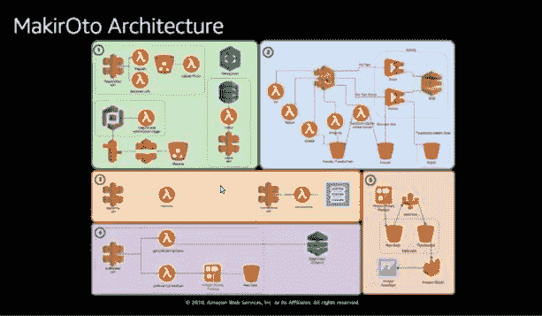

MakirOto Application

由于对 MakirOto 前端组件应用了新的建模方法，因此产生了以下高级流程模型:

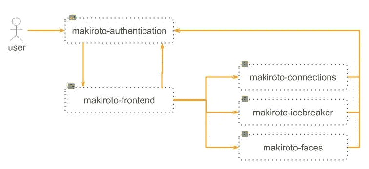

MakirOto Process Model so far

在此图中:

*   虚线矩形代表服务，实现为 [AWS](https://hackernoon.com/tagged/aws) 云形成栈
*   箭头表示不同堆栈的计算和资源之间的可见性和访问权限

第一篇文章是关于在线服务建模的。在这篇文章中，我将仔细研究长期运行的后台进程的一致性建模。

为此，我将使用另一个 MakirOto 组件——数据收集器。该组件负责抓取社交网络，以获取关于用户联系和兴趣的重要信息。

# MakirOto 数据收集器:起点

这是在[会议](https://youtu.be/E5Tc1uGzEEM?list=PLhr1KZpdzukcpd__tGf2QNsnjyachcXEI)期间展示的数据收集器架构:

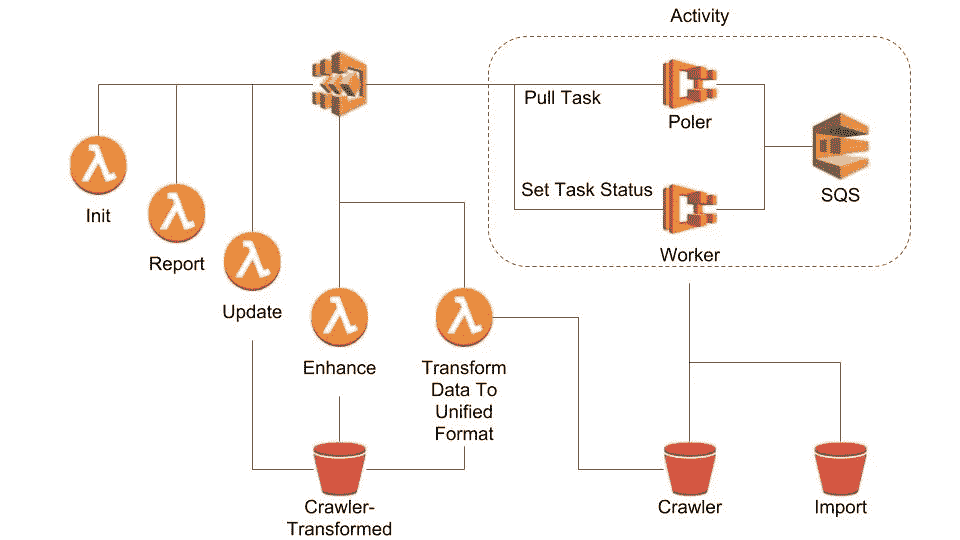

MakirOto Data Collector

在此图中，一些图标代表计算和资源:

，而其他仍然代表 AWS 服务:

连接线没有任何明确的语义。

让我们看看我们是否可以不花太多力气来改进它:

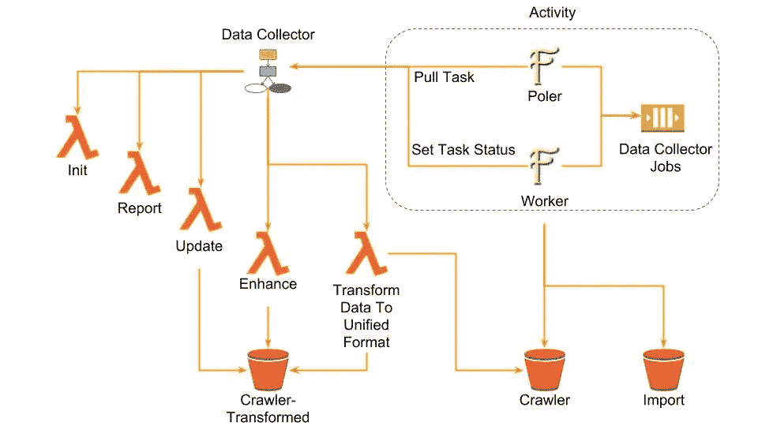

MakirOto Data Collector Process Model

这确实是一种进步。在这里，每个图标代表

*   计算过程实例:AWS Lambda、阶跃函数、Fargate 服务)
*   或者是完全管理的资源:S3 桶、SQS 队列

每个箭头表示可见性和访问权限(不是控制或数据流！).

尽管这个图现在在语义上是一致的，但是仍然很难推理。它有太多的盒子，太多的联系，太多不相关的概念组合在一页上。现在还很难说这个组件到底是做什么的，以及它与系统的其他部分有什么关系。

为了取得进展，我们需要将这个图分成更小的块。先说爬虫。

# 马基罗托履带车

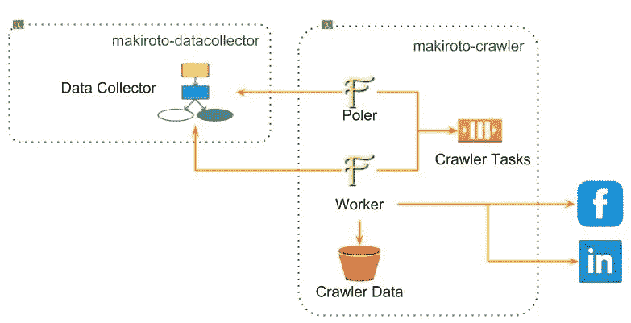

MakirOto Crawler Process Model

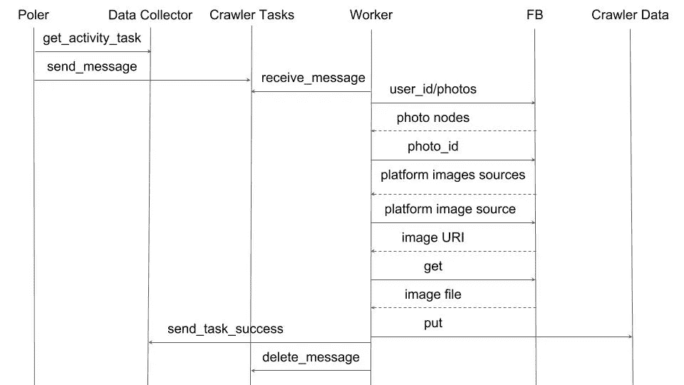

MakirOto Crawler Typical Event Sequence

有了这两张图，我们对正在发生的事情有了更好的理解，并可以开始评估替代方案。

为无服务器架构引入一致的建模语言的全部目的是支持对多个清晰表达的备选方案进行系统评估。

理想情况下，每个模型元素都必须经过仔细检查、论证，并与可能的替代方案进行比较。虽然由于时间的限制，这并不总是可能的，但是架构语言必须完全支持这样的过程。

让我们从工人 Fargate 服务开始。

# AWS Fargate —一等无服务器公民

虽然 AWS 还没有正式承认，但是 AWS [无服务器](https://hackernoon.com/tagged/swrverless)从业者越来越一致认为 AWS Fargate 服务是无服务器领域的一等公民。

AWS Lambda 和 AWS Fargate 构成了相同“成本与控制权衡”的两种备选解决方案。作为 AWS Lambda，AWS Fargate 模型没有打破不直接管理服务器的主要约束。

下表总结了两个选项之间的差异:

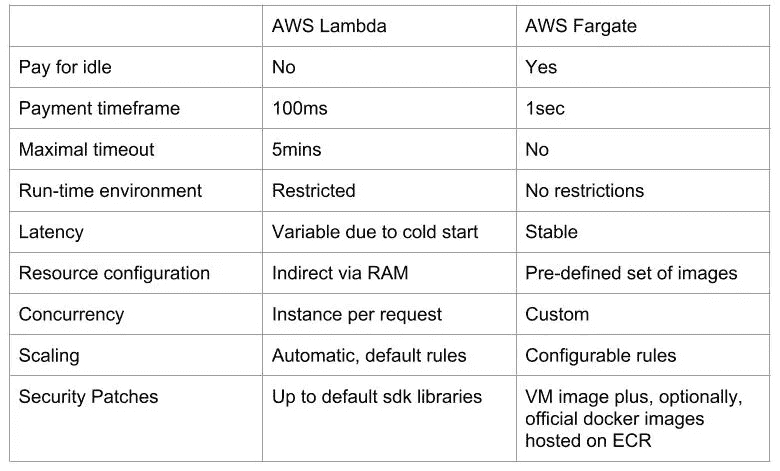

AWS Lambda vs AWS Fargate

您可能会在这里找到一些关于 AWS Lambda 性能的有趣分析:

 [## 比较使用 Node.js、Java、C#或 Python 时的 AWS Lambda 性能

### 当使用 AWS Lambda 支持的不同编程语言时，一个函数的执行有多大不同？

read.acloud.guru](https://read.acloud.guru/comparing-aws-lambda-performance-when-using-node-js-java-c-or-python-281bef2c740f) 

还有这里:

 [## Node.js、Python、Java、C#和 Go 的 AWS Lambda 性能比较

### AWS Lambda 支持的所有五种编程语言的最新运行时性能基准

read.acloud.guru](https://read.acloud.guru/comparing-aws-lambda-performance-of-node-js-python-java-c-and-go-29c1163c2581) 

您可能会在这里找到一份关于迁移到 AWS Fargate 的有趣体验报告:

 [## 在生产环境中迁移到 AWS ECS Fargate🚀

### 继我在 2018 年特拉维夫 AWS 峰会上的讲话之后，我将分享我们的端到端生产迁移之旅…

medium.com](/@shimont/migrating-to-aws-ecs-fargate-in-production-5bf9cb4c2b44) 

对于员工来说，选择 Fargate 而不是 Lambda 的主要原因是，从社交网络下载大量内容，尤其是照片，可能需要 5 分钟以上。此外，有时由于外部 API 的限制，这个过程不能中断。

然而，请注意，当用户群增长到一定规模以上时，爬行过程将一直工作——为现有用户刷新社交网络数据，同时为新用户进行初始下载。在稳定状态下，几乎不会有空闲来支付。

Crawler 任务队列也是合理的——例如，当注册了太多新用户时，爬行请求可能会突发。这个队列是平滑这些突发的好方法。

然而，第二个 Fargate 服务 Poller 提出了一些问题。它的唯一目的是定期检查 AWS 步骤功能是否有挂起的活动任务，并向 Crawler 任务队列发送相应的爬行任务规范。那不会一直发生，我们要为闲置买单。

什么，有别的选择吗？非常简单——用 Lambda 函数将爬行任务请求发送到队列:

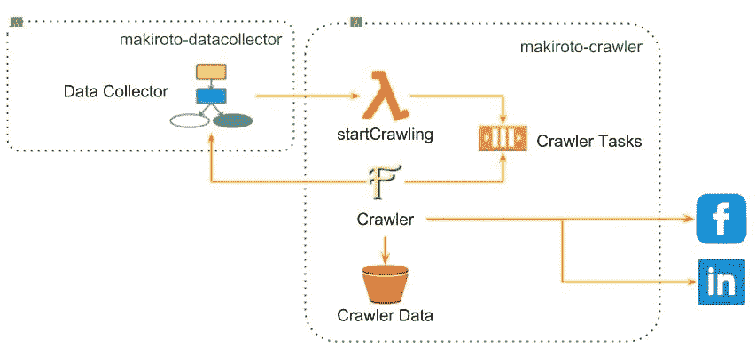

Invoking a Lambda Function to Submit a Crawler Task

请注意命名中一些微妙而重要的变化。就我个人而言，我总是更喜欢特定领域的具体名称，而不是通用但信息量较少的名称，如 Poler、Worker、Manager、Dispatcher、Init、Update 等等。

在每个爬行序列结束时，Crawler Fargate 服务直接更新数据收集器的挂起活动状态。真的有道理吗？为什么爬虫微服务需要知道是由一个 Step 函数编排的？这似乎是不必要的耦合。有什么替代方案吗？一种可能是使用 AWS SNS 主题来表示爬行任务已经结束:

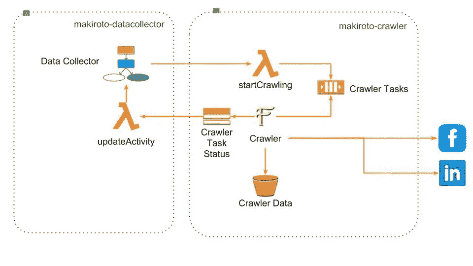

Introducing Crawler Task Status Notification

一个很好的副作用是，我们现在可以为其他目的跟踪爬行进度，比如监控。

AWS SNS 并不是唯一一种可能的通知机制。您将在此找到更详细的分析:

 [## 如何使用 AWS Lambda 为发布/订阅消息选择最佳事件源

### AWS 为实现消息传递模式提供了丰富的选项，如发布/订阅(通常简称为…

medium.freecodecamp.org](https://medium.freecodecamp.org/how-to-choose-the-best-event-source-for-pub-sub-messaging-with-aws-lambda-31ca4db9be69) 

目前的设计还有另一个微妙的问题。为了理解它是什么，我们需要看一下爬虫服务实现模型:

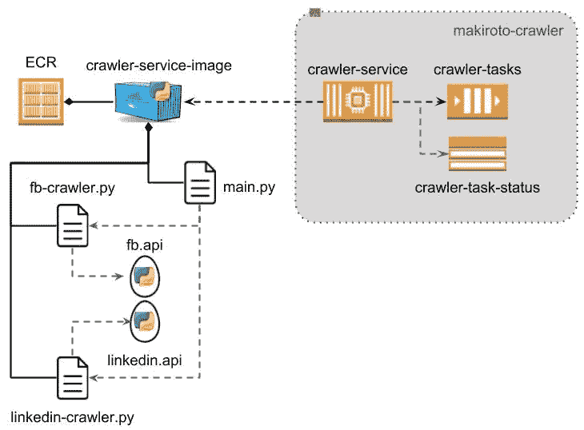

Crawler Service Implementation Model

这违反了[开-关原则](https://en.wikipedia.org/wiki/Open/closed_principle)，该原则规定系统应该**支持添加新功能而不修改现有功能**。

从上面的实现模型可以看出，每次我们决定:

*   支持新的社交网络
*   从现有数据中提取更多数据
*   升级到某个 API 的新版本

引入所有这些变化将危及整个服务的运行稳定性。

一种替代方法是将每个社交网络的爬行过程封装到一个单独的服务中:

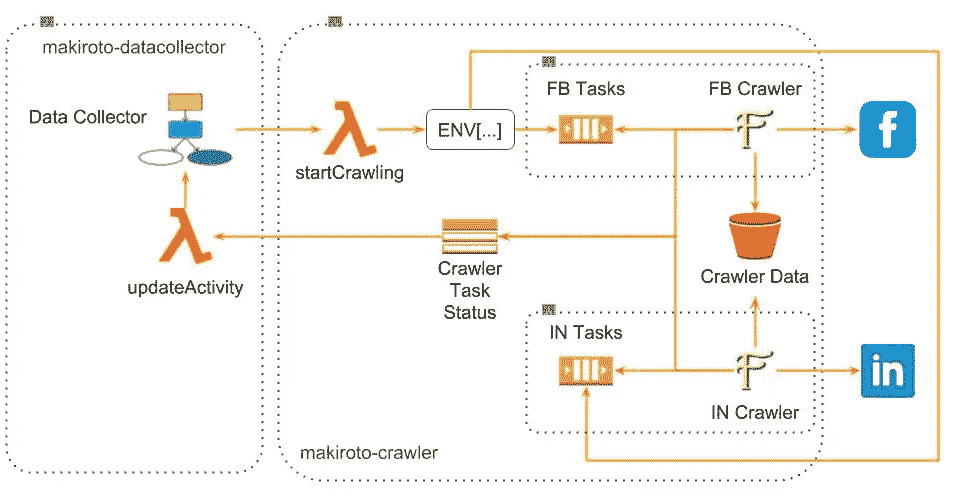

Individual Crawler Service per Social Network

这张图表看起来有点复杂。让我们将其压缩为一个高层次的概述:

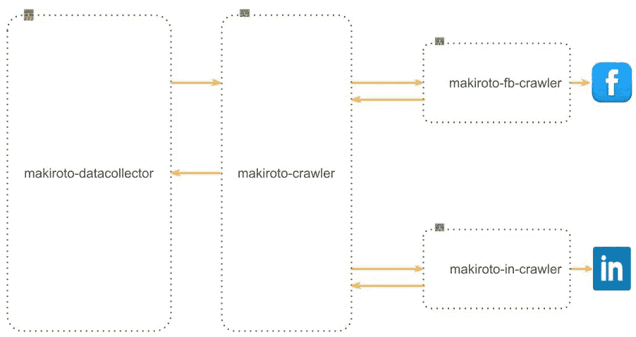

MakirOto Crawler High-Level Structure

现在，单独的社交网络爬虫可以被单独记录。例如:

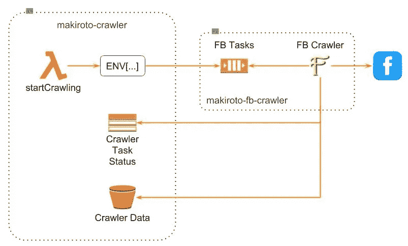

MakirOto Facebook Crawler

我们在指定一个在 AWS Fargate 服务之上实现的无服务器长期运行后台任务的架构方面取得了良好的进展。

为了完成这幅图，我们还需要查看长期运行的工作流流程，有时称为 Saga，使用 AWS Step 函数实现。在 MakirOto 应用程序的情况下，我们需要更仔细地了解数据收集器服务的内部细节。我将在下一篇文章中讨论这个话题。

# 结束语

架构过程主要是评估多种选择，并以清晰明确的方式交流决策。如果没有多种选择，我们就有从工程滑向意识形态的风险，这对企业不利。

为了能够评估多个备选方案并传达最终决策，我们需要精确地指定它们。为此，我们需要一种合适的语言。

我们目前使用的是基于非常有限的词汇和不一致的语义。出于这个原因，我开始在 P. Kruchten 的开创性工作的基础上寻找另一种选择:

通过编写语法书来发展一门新语言是一项无望的任务。语言是生物。要发展一种语言，你必须说它，写散文和诗歌。如果有必要的话，开些糟糕的玩笑。

在无服务器架构的情况下，这意味着分析案例研究并使用这种新语言复述他们的故事。越多越好。

这是我在 MakirOto 应用程序中开始做的事情。IL AWS 解决方案架构师团队非常出色地挑选了一个非常好的示例应用程序。这个应用程序将继续为另外两个帖子提供很好的素材。在那之后，我可能会开始寻找其他地方，包括分析贴有“无服务器”标签的中型帖子。

无服务器架构语言的当前版本(我该叫它 SAL 吗？)远非完美。它肯定需要经历多次修改。我个人认为只有通过社区的共同努力才能成功。过早的固定或，但愿不会，商业化将是一个致命的打击。

如果你有一个案例研究，你想尝试用这种新兴的语言复述，给我写信。否则，请继续关注下一篇文章。无论如何，我都想听听你的想法。