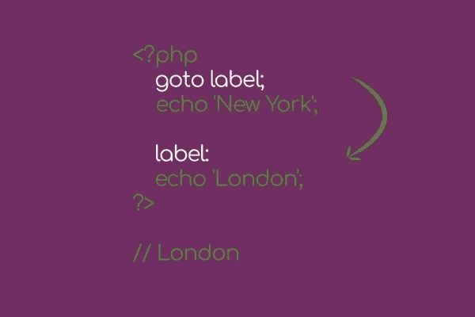

# PHP 7 的构造与注释

> 原文：<https://medium.com/hackernoon/construct-and-comments-of-php-7-7f3462499654>


当你打开你的第一本[编程](https://hackernoon.com/tagged/programming)书时，你已经读到了它们

你已经写了成千上万遍了，

你明天和五年后会用到它们，

它们是什么？

**PHP 构造！**

这些是知识的基础，语言的核心，

我知道你此刻在想什么:

*“拜托，我已经做了很长时间的开发人员，现在我来这里是为了阅读关于构造的知识？”*

通读这篇文章，

我向你保证，你会发现不是一个而是几个小细节，即使你编码了很长时间你也不知道。

# PHP 构造简介

PHP 的函数和构造有很大的不同，

第一个是**映射，然后被简化成一组 PHP** 结构进行解析，后者不能用作回调，但是它们可以被解析器直接理解。

构造在参数和括号方面也遵循不同的规则。

这里有一个例子:

```
echo “Hello World”; 
echo “Hello”, ”World”; 
echo(“Hello”,”World”);
```

我相信你以前已经看过 echo 了，以上是 echo 构造的几种变体。

请注意，最后一条语句将抛出语法错误。

PHP 提供了许多构造。

它们的功能在后台运行，在大多数情况下，比如当你处理数组时，它们比你自己创建的代码要快。

**下面你会发现 PHP 7 中最常用的构造的完整列表，**

你不需要把它们背下来，你会意识到过一会儿它们就会变成你的第二天性，

您可以将本系列的这一部分视为一个注释，在您有疑问或需要时可以随时查阅。

顺便说一下，这是系列文章“面向专业开发人员的 PHP 基础知识”的第二部分。

如果你还没有，

看看其他部分
[PHP 的复兴](http://anastasionico.uk/blog/php-basics-for-web-developer)
[如何使用变量(PHP 7)](http://anastasionico.uk/blog/php-variables)

目录:

*   [断言](http://anastasionico.uk/blog/php-construct-comments#assert)
*   [阵列](http://anastasionico.uk/blog/php-construct-comments#array)
*   [宣布](http://anastasionico.uk/blog/php-construct-comments#declare)
*   [滴答](http://anastasionico.uk/blog/php-construct-comments#Ticks)
*   [编码](http://anastasionico.uk/blog/php-construct-comments#Encoding)
*   [严格](http://anastasionico.uk/blog/php-construct-comments#Strict%20type)
*   [冲模&退出](http://anastasionico.uk/blog/php-construct-comments#die%20and%20exit)
*   [做，而](http://anastasionico.uk/blog/php-construct-comments#dowhileendwhile)
*   [回显&打印](http://anastasionico.uk/blog/php-construct-comments#echoprint)
*   [else & elseif & if &开关](http://anastasionico.uk/blog/php-construct-comments#else)
*   [清空](http://anastasionico.uk/blog/php-construct-comments#empty)
*   [for & foreach](http://anastasionico.uk/blog/php-construct-comments#endfor)
*   [评估](http://anastasionico.uk/blog/php-construct-comments#eval)
*   [前往](http://anastasionico.uk/blog/php-construct-comments#goto)
*   [包括&要求](http://anastasionico.uk/blog/php-construct-comments#include)
*   [的实例](http://anastasionico.uk/blog/php-construct-comments#instanceof)
*   [代替](http://anastasionico.uk/blog/php-construct-comments#insteadof)
*   [isset](http://anastasionico.uk/blog/php-construct-comments#isset)
*   [列表](http://anastasionico.uk/blog/php-construct-comments#list)
*   [返回](http://anastasionico.uk/blog/php-construct-comments#return)
*   [未设置](http://anastasionico.uk/blog/php-construct-comments#unset)
*   [评论](http://anastasionico.uk/blog/php-construct-comments#Comments)
*   [结论](http://anastasionico.uk/blog/php-construct-comments#Conclusion)

# 断言()

这个构造有两个参数，第一个是断言，第二个是断言为假时需要显示的消息。

您可以使用此控件来改变脚本的流程；

```
assert('2 < 1', 'Two is less than one');
```

# 数组()

非常容易理解，这种语言结构用于创建数组。

```
$capricciosa = array('tomato sauce', 'mozzarella', 'artichoke', 'mushrooms', 'anchovies');
```


[看看官方手册](http://php.net/manual/en/language.types.array.php)

# 声明

这种结构濒临灭绝，

你很少会在代码中遇到它，因为只有少数程序员知道它的存在，而知道如何正确使用它的人就更少了。

Declare 的语法类似于其他流控制构造。

**有一个关键字 declare，它是括号内的指令，括号内是要执行的代码。**

与 if 语句不同，if 语句在 declare 中的条件上给你自由，只有三个可能的选项 thicks、encoding 和 strict_type。

一会儿

在 PHP 脚本的执行过程中，会执行几个语句，

这个语句的大部分都会引起一个滴答，

使用 declare(ticks = number)和相关函数 register_tick_function()，**可以在这些 ticks 之间执行代码。**

Declare 设置应该传递多少条语句，而 register_tick_function()指定在出现 tick 时应该调用哪个函数。

这在循环或测试中可能很有用。

```
function hyphen(){ 
    echo "-"; 
} 
register_tick_function("hyphen"); 
$i = 0; 
declare(ticks = 4) { 
    while ($i < 17) 
    echo "n"; ++$i; 
} 
// the previous code echoes: nnnn-nnnn-nnnn-nnnn
```

如你所见，我刚刚创建了一个字符串，作为信用卡和借记卡的占位符。

非常容易。

编码

另一个条件，

此处，仅当编码符合定义的编码时，才执行代码

```
declare(encoding='ISO-8859-1');
// code goes here
```

严格类型

当可能时，PHP 将一个错误的类型转换成一个预期的标量类型。

例如:

```
x = "10" + 10;
// x = 20;
```

PHP 足够聪明，能够理解带“10”的字符串是一个整数，对这个数求和没有任何问题。

现在，

在某些情况下，您不希望丢失代码，并且需要以更严格的方式管理它。

在严格模式下，只接受精确类型的变量，在变量冲突的情况下，将抛出 TypeError。

这里是你如何定义你应该拥有的控制水平。

```
declare(strict_types=1);
```

请注意，上面的字符串需要是页面的第一条语句，就在 PHP 开始标记之后。否则，您将遇到以下错误//致命错误:strict_types 声明必须是脚本中的第一条语句。

# 死亡和退出

这两个构造是别名，**它们在向脚本**返回消息时终止程序。


好奇心:die 构造被用在一个著名的技术中，它测试变量并在一个精确的行中停止你的程序代码，这个技术被称为 dump and die。

如果你对 Laravel 这样的框架有任何经验，你可能会把它看作 dd()。

如果你不知道，这里是 2018 年及以后你可以在网上找到的 PHP 框架 的 [*最佳对比之一*](http://anastasionico.uk/blog/guide-to-php-frameworks-part-1)

这是正在后台执行的代码:

```
die(var_dump($variable_to_test));
```

# 做，当，当

它们是在条件被验证的情况下执行的循环，我将在下面的帖子中详细解释它们。

*订阅帖子发布时的通知。*

# 回显和打印

向 stdout 输出一个值(可以是默认监视器，也可以是另一个设备)。

我写这种教程的原因是帮助你成为一名更好的程序员，从而在你的职业生涯中得到提升。

**那么 echo 和 print 有什么区别呢？**

上面的问题是作为一个网站开发人员在面试中最常被问到的问题之一。

答案是 echo 构造不返回任何值，而 print 构造将返回一个甚至为 null 的值，

这意味着如果需要，可以在表达式中使用 print。

[w3 schools 中的 echo](https://www.w3schools.com/php/php_echo_print.asp)

# else，elseif，if，endif，switch，endswitch

他们都属于同一个家族，

它们被用来创造条件，

敬请期待！

我将在以后的帖子中详细描述它们

# 空()

这个构造根据参数使用的值返回一个布尔值。

请记住，空变量、值为“0”的空字符串、没有值的数组、值为 0 的数字变量以及 false 都被视为空

# endfor，endforeach，for，foreach

属于循环范畴的其他结构。

# eval()

这个构造允许执行以参数形式给出的 PHP 代码，这是非常危险的，因为它允许执行以参数形式给出的 PHP 代码。

不要！,

你不仅有似曾相识的感觉，

我写了两遍，因为我想让你明白这有多麻烦。

PHP 核心团队不鼓励使用它，但是如果您选择使用它，您必须非常注意不要传递任何用户数据，尤其是在处理它之前没有验证它。

```
$string = 'dog'; 
$name = 'Tommy'; 
$str = 'My pet is a $animal and its name is $name'; 
echo $str. "\n"; 
// the previous line echoes: My pet is a $animal and its name is $name'. eval("\$str = \"$str\";"); 
echo $str. "\n"; 
// the previous line echoes: My pet is a dog and its name is Tommy'
```

# 转到

不需要什么技巧就可以得到一个清晰的、写得很好的代码，然后把它完全弄乱。

幸运的是，

如果这是你的目标，(真的？)PHP 提供了完美的关键字来使用。

Goto 由两部分组成，第一部分是标签，第二部分是目标，



**该命令允许从标签跳转到另一个部分**，该部分将是目标，绕过中间的每个语句。

使用 goto 时，您需要记住几条规则。

标签和目标必须在相同的上下文中，这意味着不能将代码放在方法或函数中。

同时，您不能跳出调用范围之外的目标的函数

# 包含，包含一次，要求，要求一次

PHP 的这四个构造具有相同的功能，但方式略有不同。

**include，关键字表示包含文件并对其进行评估，**

include_once，这个命令类似于上一个命令，但是 PHP 将确保只包含文件一次，

**要求，看起来非常类似于包括，实际上也包括指明的文件，并以强制方式对其进行评估，**

require_once 和 include once 一样，

必填项和包含项之间有一个主要区别，

如果文件没有找到或无法读取，它将停留在抛出的错误上。

两个 include 只会抛出一个警告，而 required 会生成一个致命错误，您将无法继续。

所以，

作为一个通用规则，**如果文件要求是重要的，脚本不能继续没有我个人使用要求，否则你去包括。**

这些构造越来越少被使用，因为自动加载会自动加载脚本中显示的所有类。

这些是更高级的特性，我已经在关于 PHP 中面向对象编程的系列教程中解释过了

如果你使用一个 PHP 框架，所有的文件都是使用几种设计模式自动请求的，所以你不需要担心。

# 实例 of

当您使用面向对象的范例编码时，这种结构很有用。

这个构造函数的作用是返回一个布尔值，表明 PHP 变量是一个确定类的对象。

```
class Building { } 
class School extends Building { } 
$school = new School; 
var_dump($school instanceof School); 
// this will dump true 
var_dump($school instanceof Building); 
// this will also dump true because School is a child of Building
```

# 代替

特征是一种 OOP 特性，用于解决类的单一继承的局限性，

特性类似于类，通过使用特性，你可以实现新的行为，并添加其他方式无法添加的功能。

使用 trait 时可能会遇到的一个问题是可能会有名称冲突，您需要使用具有相同名称的不同 trait。

insteadof 操作可用于选择您喜欢的特征。

```
trait def { 
    public function pass() { 
        echo 'low'; 
    } 
    public function shot() { 
        echo 'high'; 
    } 
} 
trait att {
    public function pass() {
        echo 'low'; 
    } 
    public function shot() { 
        echo 'high'; 
    } 
}
```

# 伊塞特()

它检查一个变量是否已经被设置，如果是肯定的，则返回 true，如果值不存在，则返回 false。

```
if (isset($variable)) { 
    echo "$variable is set"; 
}
```

# 列表()

这个构造接受一个数组和一个变量列表，并将数组的值一次赋给多个变量。

```
$sentence = array('fish', 'raw', 'bitter'); 
// Listing all the variables 
list($dish, $temperature, $flavour) = $sentence; 
echo "The $dish is $temperature and taste $flavour
```

另外，请注意，您可以阅读 PHP 7.3 中关于 list()构造的一些真正有趣的[新特性](http://anastasionico.uk/blog/php-73)

# 返回

**return 构造用于停止当前脚本**，如果需要，提供您想要获取的变量。

您可以在函数内部和全局范围内使用 return。

如果你在函数或方法中使用它，它将返回一个变量并返回到调用范围，如果你在全局范围中使用它，它将终止程序。

因此，可以在包含文件或必需文件中使用它。

# 取消设置()

这个语言构造**将一个变量作为参数，并销毁它。**

情况并不总是这样，事实上，当你“取消”一个变量时，你需要计算你所在的范围。

事实上，如果你销毁了函数中的一个变量，这个值在全局范围内仍然是可用的。

您可以使用 isset()构造来检查变量是否存在，我已经在上面解释了几行

```
$variable = 'this is a string'; 
unset($variable); echo $variable; 
// the result of the echo will be NULL
```

# 评论

像大多数其他编程语言一样，即使在 PHP 中，注释也是语言的基本组成部分。

创建注释有三种不同的方法，它们起源于古老的语言。

*   **C 风格**它们是一行注释，用符号 **#** 表示
*   **Perl 风格**它们也是一行注释，比前一行注释更常见，它们由符号 **//** 表示
*   **多行注释**这些组注释不止一行。该块以/*开始，以相反的 ***/** 结束

还有一个主要用于 API 的外部标准，看起来像多行注释，但有所不同:
**/**这叫做 API 注释**

***/**

[对《共和国教程》的评论](https://www.tutorialrepublic.com/faq/how-to-write-comments-in-php.php)

# 结论

现在你对他们了如指掌，

对于一个专业的 web 开发人员和初学者来说，一个风险是非常擅长使用一些功能，而忘记了其他可能以稍微不同的方式做同样的事情，或者，做不同的事情，这些事情你很久以前就需要学习，但在不久前的某个时候是必要的，

**我希望你改变策略。**

当然，这里有一些你不经常使用结构，

我说的对吗？

好吧，现在你对他们了解更多了，

尝试一步一步地在你的代码中实现它们，你会发现它们很容易进入你的武器库，让你成为更好的程序员。

毕竟，这是我们所有人真正想要的。

看看其他部分
[PHP 的复兴](http://anastasionico.uk/blog/php-basics-for-web-developer)
[如何使用变量(PHP 7)](http://anastasionico.uk/blog/php-variables)

[](http://eepurl.com/dIZqjf)

有什么比开始实践你的新知识更好的呢？现在就开始做吧！

利用 Blue Host 的能力和速度，创建一个帐户，在那里你可以锻炼，并以每月不到一杯星巴克咖啡的价格在实时服务器上看到你的进步。