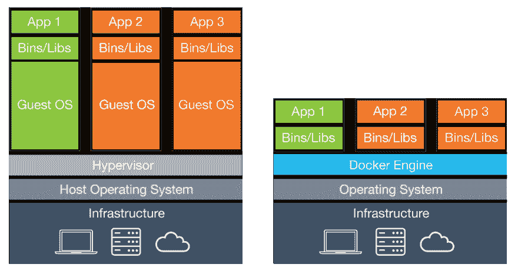
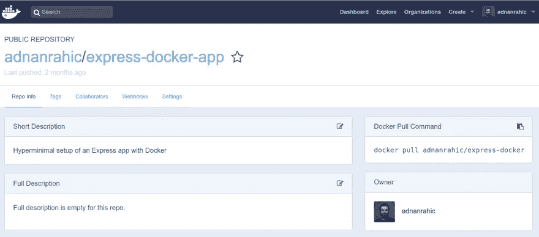

# 从 DevOps 的角度看容器与无服务器

> 原文：<https://medium.com/hackernoon/containers-vs-serverless-from-a-devops-standpoint-d8232bd0f39b>

两个流行语走进酒吧…不？是啊，我们不要去那里。如果你有这种感觉，那你就来对地方了。在过去的几年里，容器和无服务器都是很酷的新生事物，其受欢迎程度并没有下降。

在我继续之前，让我澄清一下。不，你不会因为没有服务器而丢掉 DevOps 的工作。好了，我说了。我们现在能继续吗？谢谢你。


# TL；速度三角形定位法(dead reckoning)

*   为什么这很重要？
*   什么是容器？
*   容器的利弊
*   容器用例
*   将容器化的 Node.js 应用程序部署到 AWS 上的 Kubernetes 集群
*   什么是无服务器？
*   无服务器的利弊
*   无服务器使用案例
*   将无服务器 Node.js 应用程序部署到 AWS

***注意*** *:代码样本已经在 GitHub 上，这里的*[](https://github.com/adnanrahic/express-docker-app)**和* [*这里的*](https://github.com/adnanrahic/express-sls-app) *，如果你想马上查看最终结果。**

# *为什么这很重要？*

*我想告诉您管理自己的容器与让无服务器为您管理容器的利弊。部落战争需要停止。让我们就几个事实达成一致。这两种技术都有很棒的用例以及有效的痛点。我只想告诉你什么时候用什么。*

*对此，有几个因素需要考虑。最主要的，也是最突出的，确实是创业公司的开发速度和上市时间。但是，一旦你深入了解，有几个重要的因素需要考虑，比如复杂的部署场景和部署应用程序所需的时间。供应商锁定是您需要考虑的另一个要点，尽管我认为这不是什么大问题。不过成本是。如果你负责支付月底的基础设施账单，你会关心你花了多少钱。*

*准备好学习新东西了吗？让我们开始吧。*

# *什么是容器？*

*让我们简短而甜蜜。容器是孤立的、无状态的环境。容器是一个轻量级的、独立的、可执行的软件包，其中包含运行它所需的一切，包括代码、运行时、系统工具、系统库、设置等。*

*通过将应用程序及其依赖项容器化，操作系统分布和底层基础设施的差异被抽象出来。*

*我喜欢说它像一个微小的虚拟机，但并不真的如此。大多数开发人员都理解虚拟机的概念。我们习惯于在虚拟机中运行应用。它们模拟真实的机器，拥有真实机器所拥有的一切。嗯，在容器中运行应用程序是一样的，除了一些重要的架构差异。主要是容器运行在相同的操作系统内核上。让我给你看看…*

**

*在这里你可以看到一个很好的概述。虚拟机使用一种叫做管理程序的东西。它管理主机上的每台虚拟机。如您所见，每个虚拟机都有自己的操作系统。而容器共享主机操作系统。使容器变得更小，创建和删除的速度也更快。*

# *容器的利弊*

*根据您的开发人员背景和个人资料，在比较容器和无服务器时，优势和缺点可能不一样。然而，我认为可以商定一个固定的数额，让双方都满意。*

*使用容器意味着默认情况下你不会有任何自动缩放。这是你需要自己设置的。幸运的是，像 AWS Auto Scaling 这样的特定于供应商的工具使这变得相当容易。这里的优势是您可以完全控制您的资源，并且您负责扩展，这意味着理论上您可以拥有无限的可扩展性。你的医疗服务提供者允许的范围内。*

*你所拥有的所有控制和权力确实显示出一个主要的缺点——**它引入的复杂性**。你需要了解这个生态系统和你可以使用的各种工具。对许多人来说，这是一个陡峭的学习曲线，因为最终您是部署和管理应用程序的人。在拥有更多的自由和控制时，你必须接受这个事实，那就是它将是复杂的，有着各种各样的运动部件。遗憾的是，这增加了成本。毕竟你每时每刻都在为资源付费，不管你有没有流量。*

*然而，并非一切都那么糟糕。令人惊叹的好处是您可以随意使用许多监控和调试工具。生态系统是如此的进化，以至于你在设置必要的工具时不会有任何问题。最后，有了容器，无论你的团队使用哪种操作系统，他们都将拥有相同的开发环境。这使得大型团队变得非常容易高效。*

# *容器用例*

*容器化应用程序的用例比无服务器应用程序要广泛得多。主要是因为您可以轻而易举地将现有的单一应用程序重构为基于容器的设置。但是，为了获得最大的好处，您应该将您的单片应用程序拆分成单独的微服务。它们将被部署为单独的容器，您可以配置这些容器来相互通信。*

*使用容器的常见应用包括 Web APIs、机器学习计算和长时间运行的流程。简而言之，无论您已经使用传统服务器做什么，都是放入容器的绝佳选择。当你已经为服务器付费了，不管负载如何，确保真正使用它们。*“踩到底”*将是一个合适的术语。*

# *将容器化的 Node.js 应用程序部署到 AWS 上的 Kubernetes 集群*

*我们需要关注几个步骤，首先创建一个容器映像并将其推送到存储库。之后，我们需要创建一个 Kubernetes 集群，并为我们的容器编写配置文件。最后一步是将所有东西部署到集群中，并确保它正常工作。*

*准备好了吗？深呼吸，这将是一个难题。*

****注意*** *:确保您的机器上安装了*[*Docker*](https://www.docker.com/)*以便能够运行下面的命令。**

# *1.创建容器图像*

*下面是一个简单的 Node.js/Express 应用程序的样子。*

*很熟悉，对吧？由此创建一个图像相当简单。首先，我们需要一个 **Dockerfile** 。*

*这将配置我们的映像的外观、要安装的依赖项、它将公开的端口以及创建容器后要运行的命令。*

*是时候建立形象了。*

```
*$ docker build . -t <docker_hub_username>/<image_name>*
```

*如果您以前没有构建过映像，此命令将需要一段时间。完成后，您可以将其推送到容器存储库。我给你看看 Docker Hub，不过你想用哪个就用哪个。*

```
*$ docker push <docker_hub_username>/<image_name>*
```

****注意*** *:在运行该命令之前，请务必进行身份验证。运行* `*$ docker login*` *命令。**

*推送图片后，您的 Docker Hub 个人资料将列出该图片。它看起来会像这样。*

**

*完成第一步后，您就可以将该映像拖到您选择的 Kubernetes 集群中了。创建集群的时间到了。*

# *2.创建 Kubernetes 集群*

*在 AWS 上快速使用 Kubernetes 最简单的方法是一个叫做 [KOPS](https://github.com/kubernetes/kops) 的工具。这是一个用于创建和管理基础架构资源的 CLI。*

*安装 KOPS 后，您将可以使用 CLI 命令与 Kubernetes 集群进行交互。这里有一组快速启动和运行集群的命令。*

*一旦集群运行，您就可以创建配置文件来部署您的容器映像。*

# *3.部署容器映像*

*现在我们开始讨论 Kubernetes 的具体内容。使用 **kubectl** 命令，您将创建您的 Kubernetes 资源。您将需要一个部署和一个服务来快速开始。为了方便起见，让我们创建两个 YAML 文件。一个用于部署，一个用于服务。*

*部署将创建 pod、副本集并确保它们正常工作，同时服务将部署暴露给外部流量。*

*现在您可以运行 **kubectl** 命令了。*

```
*$ kubectl apply -f node-deployment.yml 
$ kubectl apply -f node-service.yml*
```

*这将创建 pod、副本集、部署和服务。太棒了。您现在可以看到应用程序正在运行。理想情况下，一旦您将代码推送到代码库，整个过程将在 CI/CD 管道中自动化。但是，即使对于以前做过的人来说，这个过程也是痛苦而漫长的。*

*让我们看看无服务器的比较。*

****注*** *:* [*这里有一个 GitHub 回购*](https://github.com/adnanrahic/express-docker-app) *你可以在这里检验一下这个配置。如果你想让更多人看到它，就给它一颗星吧。**

# *什么是无服务器？*

*就定义而言，无服务器通常被认为是功能即服务(FaaS)。那不完全正确。无服务器是如此之多。它应该被看作是一个运行代码的基于事件的系统。也就是说，您使用各种服务来创建业务逻辑，而不关心任何服务器。你把基础设施完全抽象化了。完美的例子可以是在 S3 上托管静态网站，使用无服务器数据库，如 DynamoDB 或 Aurora Serverless，当然，运行代码而不用 Lambda 管理服务器。*

*如果你有突然的流量高峰，需要立即检测和处理，无服务器是伟大的。如果完全没有流量，应用程序甚至会完全关闭。您只需为您使用的资源付费。没有使用，没有成本。*

# *无服务器的利弊*

*当你提到无服务器时，首先想到的是你不需要管理任何基础设施。无需安装操作系统更新，无需安装安全补丁，无需担心，因为提供商会为您处理这些问题。这比管理您自己的基础架构和集群要简单得多。然而，魔法是有代价的。用 Kubernetes 给你的应用增加可观察性的简单性不适用于无服务器应用。只有少数可行的第三方解决方案，如 [Dashbird](https://dashbird.io/) 、IOPipe 或 Datadog。*

*对于我的许多开发伙伴来说，自动缩放带来了令人惊叹的效果。默认情况下是启用的。你不需要配置任何东西，它就能工作。因为如果没有流量，你的应用程序会完全关闭，所以它非常便宜。但并不是一切都那么好。您将不得不忍受处理能力和内存的限制，如果函数变得太大，您将不得不编写更高效的代码，因为会有函数过载的风险。这也会导致可怕的噩梦，叫做潜伏。😞*

*关于延迟，FaaS 解决方案遭受所谓的冷启动。一个函数的初始调用大约需要一两秒钟的时间让容器加速旋转。如果这是一个问题，你应该重新考虑使用 FaaS。*

*然而，部署的简单性使得无服务器变得不可思议。您将代码部署到您的提供者，它就工作了。没有 Dockerfiles 或 Kubernetes 配置。你的上市时间将是惊人的，这是创业公司最看重的东西。*

# *无服务器用例*

*我相信你已经可以通过阅读利弊得出你自己的关于用例的结论。无服务器对于微服务架构来说太棒了。这些可以是简单的 web APIs 或任务运行器。无服务器功能的短暂性使它们成为处理数据流或图像的理想选择。*

*您还可以将它们用作 Cron 作业，在这里您可以安排一个函数在每天的特定时间运行。对于偶尔运行一次的后台任务，不需要让服务器一直运行。请记住，FaaS 只适用于短期运行的流程。AWS Lambda 函数可以运行的最长时间是 5 分钟。如果您有一些繁重的计算任务，我建议您使用基于容器的设置。*

# *将无服务器 Node.js 应用程序部署到 AWS*

*将 Node.js 应用程序部署到无服务器环境的步骤明显减少，您会感到惊讶吗？我当然希望你不会。*

*有了[无服务器框架](https://serverless.com/framework/)，你可以大大简化无服务器应用的开发过程。您在一个名为 **serverless.yml** 的文件中配置所有资源。它将被转换成一个 CloudFormation 模板，部署到 AWS 并创建您指定的所有资源。代码本身被打包成一个. zip 文件并上传到 S3。从那里它将被部署到 Lambda。*

*无服务器框架的神奇之处在于创建资源和部署代码的自动化过程全部在一个步骤中完成。让我展示给你看。*

****注意*** *:我假设您已经安装并配置了所需的框架模块和 IAM 角色，这样才能工作。如果没有，查* [*本*](https://hackernoon.com/a-crash-course-on-serverless-with-node-js-632b37d58b44) *出入门。**

```
*# Framework 
$ npm i -g serverless 
# Express.js router proxy module 
$ npm i serverless-http*
```

# *1.配置无服务器资源*

*下面是同一个 Node.js/Express 经过小的编辑后与 AWS Lambda 一起工作的样子。*

*唯一的区别是您将它传递给了**无服务器 http** 模块。接下来，我想让您深入了解我们实际需要的资源，让我们来看看一个示例 **serverless.yml** 文件。*

*我们将部署一个`app`函数，函数处理程序指向 **app.js** 文件中的`server`方法。这个函数的事件触发器将是对任何路径的 HTTP 请求。实际的路由将在 Express 应用程序中处理，所以我们可以只添加`{proxy+}`设置。*

# *2.部署无服务器资源*

*您猜怎么着，将它全部部署到 AWS 只需要一个命令。*

```
*$ serverless deploy*
```

*为运行单个命令创建一个可行的 CI/CD 管道要比杂乱无章的容器命令简单得多。*

****注*** *:* [*这里有一个 GitHub 回购*](https://github.com/adnanrahic/express-sls-app) *在这里可以查看一下这个配置。如果你想让更多人看到它，就给它一颗星吧。**

# *包扎*

*这里有哪些要点？什么时候选择什么？当您需要灵活性和对系统的完全控制，或者当您需要迁移遗留服务时，我强烈建议您选择容器和容器编排器，如 [Kubernetes](https://kubernetes.io/) 。*

*当您需要更快的开发速度、自动伸缩和显著降低运行时成本时，选择无服务器是更好的选择。无服务器还作为支持服务绑定到遗留系统中，这些支持服务是在主代码库之外开发的，用于处理特定问题或业务逻辑。在这方面，[无服务器框架](https://serverless.com/framework/)对你有很大的帮助。*

*有了容器，监控和适当的警报已经足够成熟，有了像[Prometheus](https://prometheus.io/)这样的工具，而无服务器就落后了。目前市场上最成熟的工具是 Dashbird。*

*在无服务器社区中有一些令人惊奇的文章，你可以去看看。所有这些都解释了两种技术的好处以及为什么集装箱和无服务器部落之间的小争论毫无意义。我建议你去看看！*

*如果你想阅读我以前的一些无服务器思考，请前往[我的简介](/@adnanrahic)或[加入我的无服务器简讯！](https://upscri.be/b6f3d5/)*

*我写这篇文章的时候非常开心，希望你们能像我写这篇文章一样喜欢阅读。如果你喜欢，拍一拍，让更多的人在媒体上看到这篇文章。直到下次，保持好奇，玩得开心。*

****注*** *:我在做* [*一谈这个话题*](https://2018.webcampzg.org/talks/containers-vs-serverless-from-a-devops-standpoint/) *在* [*十月*](https://2018.webcampzg.org/) *。如果你在附近，请随意加入我。*😊*

**最初发布于*[*dev . to*](https://dev.to/adnanrahic/containers-vs-serverless-from-a-devops-standpoint-e4n)*。**