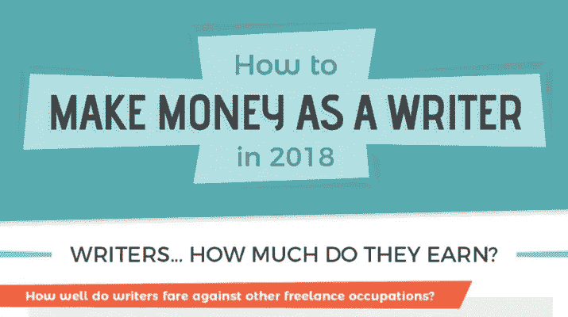

# 内容写手:如何为别人写稿赚钱？

> 原文：<https://medium.com/hackernoon/content-writer-how-to-make-money-writing-for-others-f0b72ffe28b0>

有偿在网上写作已经成为许多职业作家的收入来源。这是一项比我们想象的复杂得多的网络工作。内容写作是适应网络需求的独特内容的生产。这是一种与印刷媒体的经典编辑规则截然不同的编辑技巧。网站的内容必须精确、简洁、明确……并且经过优化，以便在谷歌等搜索引擎中更好地引用。这是一份需要作家、开明的思想和很强的分析能力的工作。如何成为一名网页编辑？网页编辑有哪些技巧？如何为别人写作挣钱？这些问题构成了本文的主要内容。

**推荐阅读:**

 [## 写作赚钱:如何增加你的自由职业收入

### 我们几乎都知道如何读和写，但写作也是一种折磨，如果不是真的想要，是不会完成的…

hackernoon.com](https://hackernoon.com/make-money-writing-how-to-increase-your-freelance-income-c91342b8c68f)  [## 如何成为一名全职作家，即使你害怕没钱

### 成为一名全职作家——就像开始创业一样——有点像从大跳水板上跳下来…

hackernoon.com](https://hackernoon.com/how-to-become-a-full-time-author-even-if-you-are-afraid-of-running-out-of-money-b7cf8a73b50) 

# 网络写作:如何成为一名网络编辑？

内容写作是一个在网络上全面发展的真正的职业。创建涵盖各种活动的网站使得内容制作成为一项要求。只有网络编辑可以做到这一点，以产生适应你的网站或博客的主题或域名的内容。要成为家庭或企业的网络编辑，你必须:

# 形式

成为一名网页编辑需要基础训练。如果你没有机会在大学里学习语言、新闻……或者交流，你也可以在网上接受培训。有内容写作的培训平台。

# 知道怎么写吗

内容写作是一门艺术。它不同于经典或行政写作。要成为一名网页编辑，你必须知道如何写作。为此，风格，拼写，词汇和语法是有序的。在内容写作中，文本的原创性是绝对必要的。如上所述，你可以参加免费的网络编辑培训。

# 设定目标

成为一名网络编辑也意味着要有清晰、准确和有针对性的目标。问问自己，为什么要成为一名网页内容编辑？这个问题的答案会让你设定自己的目标。

# 打造你的职业生涯

如果你想成为一名专业的网页编辑，你必须建立你的职业生涯。获得大合同需要经验。这份工作需要专业精神和对写作规则的尊重。此外，你必须遵循网络写作规则的演变，才能对网页提出新的要求。

# 热爱写作

为在线杂志、博客或在线销售网站写作意味着要写几篇文章或几页文件。如果你没有激情或渴望总是写文章，写作可能是一件苦差事。

# 内容写作:网络文案的不同类型

网页编辑的工作有几个分支，取决于写作的类型。为此，您将获得:

# 文案

文案是简单的编辑技术，使用某些关键字来推广或宣传个人、产品、公司等的形象。成为一名文案创作与产品、公司、活动相关的编辑内容，并面向目标受众。文案是一个设计师和编辑在同一时间，你必须有一个网络营销概况。

# 搜索引擎优化编辑器

SEO 内容的写作是一个网站或博客的重点之一。SEO 编辑的专长是使用关键字创建网页内容，以在不同搜索引擎的搜索结果中获得更好的排名。

# 校正器

它是关于一个语言专家建议重读课文并改正它们。网络文章的校对需要修正技巧。

# 翻译者

译者是处理网页翻译的多语言编辑。他有能力将网页内容翻译成客户需要的另一种语言。

# 转录员

文本中的音频转录是转录者的专长。它是关于代表公司创作视频内容的写作，换句话说，你在一个文字处理文档上写下这个视频的音频内容，这很简单但非常耗时。

# 电子书

他是一名编辑，专门从事电子书 kindle 的写作，并在网络上发布。你可以在你感兴趣的领域写一本电子书，并在网站上在线出版。

# 网络写作:成为网络编辑需要什么样的能力？

作者应该找点乐子。几乎所有的学生，大学在完成复杂的任务时都面临着一段艰难的时间，尤其是在内容呼叫作业写作方面。我个人为一些大学和学生提供内容写作服务，帮助他们设计更好、更吸引人的作业。向学生或大学提供任务帮助会给你带来一些长期的现金。

你血汗钱不用再等了。扩大你的影响，与学生接触，并在此过程中赚钱。

自由网络编辑或内部编辑的职业要求编辑有很强的能力。为此，一个好的网页编辑必须:

# 享受编辑的舒适

编辑必须掌握写作的语言，便于理解某些文本或复杂的主题，使用表达方式或朗朗上口的词语，每次都要使用与主题相适应的文体…

# 知道如何制作标题

文章的标题必须能够鼓励读者阅读其内容。编辑必须能够给标题鼓励和相关的文字，并能够使人们想读给用户。

# 有专业领域

网络编辑必须具备一两个领域的技能。这是一个编辑必须具备的技能。成为一名网页文案并不需要你所有领域的技能。网络编辑是指在一个、两个或三个领域拥有技能的人，而不是在所有领域都拥有技能的人。

# 了解网络

作者必须在网络上的技能。他必须能够掌握网络营销，搜索引擎优化…和一些软件(Shopify …)或 CMS (WordPress，Prestashop …)。

# 掌握运用语言的艺术

法国散文家和哲学家布莱斯·帕林说，这些话就像上了膛的手枪。所以，网络编辑必须掌握运用文字处理委托给他的主题的技巧。

# 掌握用户体验

网页编辑必须能够掌握人和网站之间的互动。一旦掌握，创建的内容将更具吸引力，因此，客户和/或互联网用户的转换将轻而易举。

除了这些技能之外，网页内容编辑还必须具有好奇心、接受能力、注意力以及最重要的想象力。通常需要接受高等教育，以便将所有这些技能结合在一起。一般文化在内容写作生意中不是一句空话。编辑被要求处理各种话题，这些话题有时需要扎实的日常生活知识。例如，一个关于气候变化原因的话题需要全面的知识来解决。

# 成为一名网络编辑的身份:必须记住的事情！

在令人眼花缭乱的网站和/或博客创建之前，网络编辑是一个非常受欢迎的网络职业。网络编辑的身份是双重的，一方面他可以戴着工人的帽子，另一方面他可以是企业家。作为 web 编辑器的主要规约，您可以拥有:

# 自由网络编辑

作为一名自由网络编辑，并不复杂。这是独立工作的人。他可以在家里或其他任何地方工作，但不能在公司工作。这种状况在就业市场上越来越明显。这里的目标是制作 web 内容，而不是像在商业中那样全职工作。对于一些没有足够空间容纳员工的建筑，这种方法甚至更有优势。

此外，考虑到主题的复杂性和制作内容的质量，报酬是通过书面文章或文字来支付的。这一级别的网络编辑按项目或任务工作。每个任务都不一样，所以多付或少付都成为可能。他可以在网络写作平台上注册来获得他的任务。

# 受薪网络编辑

受薪网络编辑是在公司里有职位的人。他在那里全职工作。他不是按任务而是按月领工资的。领薪编辑并不独立工作，他受法人的法律管辖，法人保证他享有领薪工人的所有权利。可能会发生这样的情况，他通过晋升制度在公司内占据了某些负责的职位。

# 网络写作:以什么价格出售你的文章？

在网上靠写文章赚钱要有利得多。要知道一个物品的价格并不是标准的，这一点很重要。自由撰稿人的价格不一定是自由撰稿人的价格。然而，你可以根据一系列标准出售你的文章，包括文章的质量和原创性，主题的复杂性，文章的容量，有时还有写作的时间。为此，一篇文章的售价从 50 美元(一篇 250 字的文章)到 400 美元(一篇 2000 字的文章)不等。价格的巨大差异显示了这种贸易的苛刻的一面。

# 一个网页编辑能挣多少钱？

网络编辑的工作可以让他的人活下去。网络编辑的报酬通常取决于他的地位和所在地区。

对于一个自由职业的网络编辑来说，赢得的金额取决于每天要写的文章数量和计费类型。当一个作家写两篇 250 字左右的文章时，他每天可以赚 100 美元。说到按篇计费，他挣 60 到 120 美元。一篇文章有 25 行。

对于一个受薪的网络编辑，如果你有相当多的经验，每年的奖金是 50，000 美元。但是，如果你刚刚起步，你将一年挣 20，000 美元。统计数据可能会有所不同，取决于质量，利基和你作为一个作家的声誉。我从[在线作业写作](https://www.onlineassignmentwriting.com/)中赚取大约 500-1000 美元。

# 为网络写作:写内容需要多长时间？

内容写作是一项需要集中注意力和大量关注细节的练习。写的时间很难确定。网络文章的写作考虑几个因素，即:主题的复杂性，编辑的速度，字数…和工作量。比如你可以在 8 小时不到的时间里写一篇 2000 字的文章。总而言之，时间取决于所涉及的因素。

你现在可以开始写内容并赚钱了。为别人写文章是一项练习，它需要写作者多种多样的技能和相当持久的一般文化。