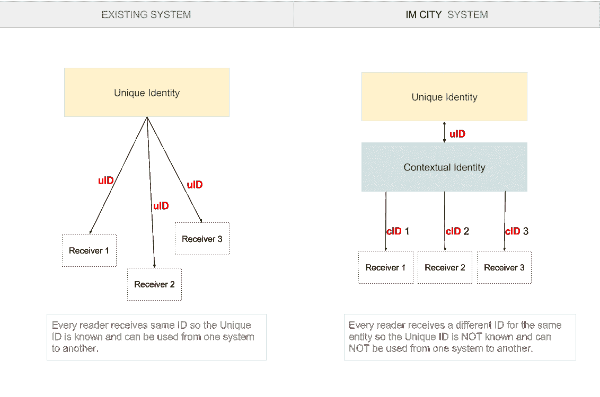

# 情境身份——保护隐私

> 原文：<https://medium.com/hackernoon/contextual-identity-fixing-the-privacy-a40ea7ce6b32>

## **独特身份与背景身份**

Photo by [Matúš Kovačovský](https://unsplash.com/photos/eIvLuyDjCQI?utm_source=unsplash&utm_medium=referral&utm_content=creditCopyText) on [Unsplash](https://unsplash.com/search/photos/multiple-identity?utm_source=unsplash&utm_medium=referral&utm_content=creditCopyText)

这个[身份](https://hackernoon.com/tagged/identity)是一个[人类](https://hackernoon.com/tagged/human)概念**是大转变**的时候了。

宇宙不在乎身份。宇宙中的互动是在没有身份的群体之间进行的。
然而，作为人类，我们需要一种身份认同，因为我们的生活是由与三种实体的互动构成的:

a)事物(对象)

b)人

c)技术

通常，我们需要身份来授权或跟踪某种交互。

# **过去——独特的身份**

a)在与**事物**互动时，那些对象并不在乎我们的身份。物理定律适用( [_](https://IM.CITY) )。

b)与**人**互动时情况不同。很多时候，需要鉴定。对于人们来说，“你是谁？”计数。

c)对于**技术**(例如计算机)，情况是混合的。它的“事物部分”将应用“事物授权法则”(无论你是谁，你都可以在电脑上按键)，但它的“智能部分”将应用“人类识别法则”，因为它的编程是由人类进行的。

这就是现在的情况。只要技术的“智能”部分得到人类设计和编程的支持，它就需要人类在身份上的方法(在与技术互动时，你需要识别自己)。人工智能将改变这一点，因为它将在上下文细节上设计和编程不同的方法。( [***_***](https://IM.CITY) )

所以人类发展了一套复杂而严格的鉴定系统。他们引入了“**唯一身份**”——一个人只能是那个人——并实现了可识别为身份的“唯一 id 元素”(姓名、照片 id、指纹)。所有这些 id 元素确保了一个人身份的唯一性。

但是，只要一个身份对一个人来说是唯一的，那就意味着它应该是可重用的。因此，我们在不同情况(上下文)下使用的身份将总是相同的，这意味着“id 元素”的接收者将能够在其他上下文中使用它们，有时是以欺诈的方式。

**隐私问题有两种解决方案**:

1.  每当**交互可能不需要识别**时，我们应该对所有交互使用该方法(例如，我们可以在市场上支付一个苹果，而不需要识别我们自己)。这是自然的互动方式，但并不是一直都在使用。企业和政府有一种趋势，要求比实际需要更多的身份证明。这种情况开始受到立法者的管制(例如 EU-GPDR)
2.  当没有标识就无法进行**交互时，那么标识应该使用**“上下文标识”而不是“唯一标识”****

# **未来——背景身份**

“上下文身份”包括基于上下文的“实体”(人、对象、虚拟值)的不同标识符，而不能完全识别“实体”，但仍允许接收者根据需要完成授权过程。

同一“实体”(例如，人)的上下文身份对于每个上下文是不同的。这样，唯一的 id 元素就不会被重用。

使用上下文身份的主要优点是不同上下文相互隔离，因此在一个上下文中获得 id 细节的接收者将不能在其他上下文中使用相同的 id 元素，从而确保隐私。

**为了更容易理解“背景身份”,请考虑信用卡。这就像，对于同一个银行账户，我们为每个商家使用不同的信用卡号码，所以如果有人“窃取”我们的信用卡号码，他们将无法使用它来窃取我们的钱。**

以一种原始的方式，当我们被办公室同事称为名**时，被非常亲密的朋友称为昵称**时，以及与官员一起使用姓**时，我们在生活中自然地使用“语境身份”。这些是不同的背景身份。******

“上下文身份”的现有使用的另一个例子是条形码标签的使用。当你购买一部戏剧的入场券时，会发给你一张入场券，你可以在入口处使用这张入场券。当票有一个识别号码(条形码)时，这个识别号码就像你在某个晚上去剧院看戏、去某个剧院和某场戏，甚至去大厅里某个地方的识别号码。该票证 id 是您的“上下文身份”。

政府使用一种背景身份(不同于背景身份)。许多国家颁发类似驾驶执照的"**上下文相关的身份证件**。一些国家没有集中的唯一 id 文件(尤其是英语国家)。甚至还有年轻人用来买酒的“年龄证明”文件。
归根结底，这些证件持有个人的“独特身份”，证件本身是该身份的一种授权证明，而不是特别颁发的“背景身份”。

**新技术的任务是在我们互动的基础上实现这一概念。**

新的区块链协议以及可能更合适的更新的 tangle 协议(例如 IOTA)应该被包括在内，用于概念身份概念的正确实现。