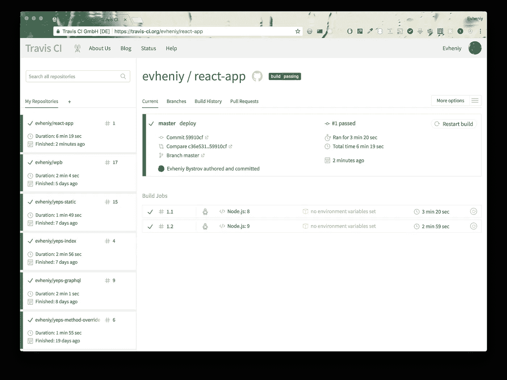
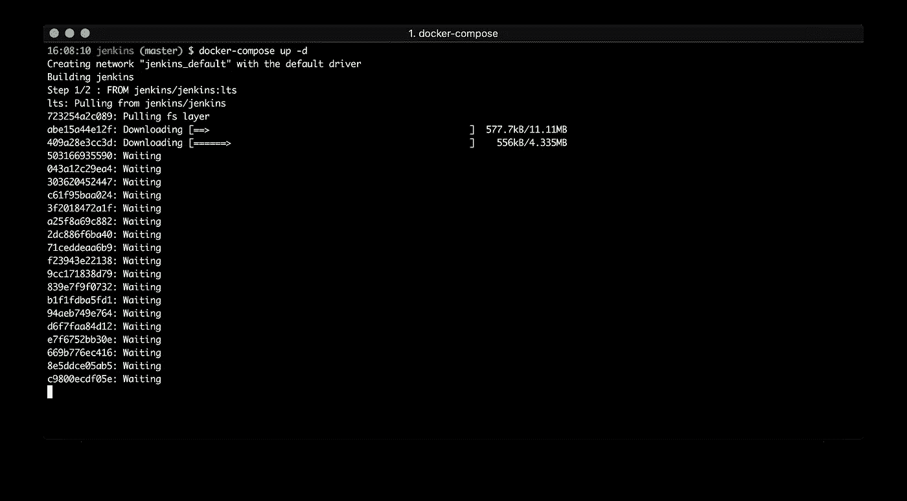

# 与 Jenkins 和 Docker 一起持续交付 react 应用

> 原文：<https://medium.com/hackernoon/continuous-delivery-of-react-app-with-jenkins-and-docker-8a1ae1511b86>

这是文章的第二部分——从头开始反应应用程序。我将向你展示如何创建一个 CD 过程，让你的应用从头开始变得更好。


在我们开始之前，我会把有用的链接。

文章第一部分:

[](/@evheniybystrov/react-app-from-scratch-d694300d1631) [## 从头开始反应应用程序

### 这是教程的第一部分，我将展示如何从头开始创建 react 应用程序。

medium.com](/@evheniybystrov/react-app-from-scratch-d694300d1631) 

其他我的文章—如何开始使用 Docker:

[](https://hackernoon.com/making-right-things-using-docker-7296cf0f6c6e) [## 使用 Docker 做正确的事情

### 在这篇文章中，我想展示如何使用 docker 进行开发和测试。为了表明现在是时候从…

hackernoon.com](https://hackernoon.com/making-right-things-using-docker-7296cf0f6c6e) 

如果你的项目是开源的，你可以使用 Travis CI。你只需要像这样创建 [.travis.yml](https://github.com/evheniy/react-app/blob/master/.travis.yml) :

```
language: node_js
node_js:  
  - "8"  
  - "9"
script:  
  - npm test
```

并查看结果:



但是我想向您展示如何从头开始创建 CI/CD 环境。

我们将使用 [**詹金斯**](https://jenkins.io/) 与 [**Docker**](https://www.docker.com/) **。**詹金斯在 [docker hub](https://hub.docker.com/r/jenkins/jenkins/) 上有官方图片。

你能在 github 上找到的所有配置:[https://github.com/evheniy/react-app/tree/master/jenkins](https://github.com/evheniy/react-app/tree/master/jenkins)

## 詹金斯

要使用 docker hub 的官方映像运行 Jenkins，我们需要运行下一个命令:

```
docker run --name jenkins -p 8080:8080 jenkins
```

但是，如果我们需要更新图像或重启容器，我们需要存储我们的数据。因此，我们需要将卷映射到主机:

```
docker run -p 8080:8080 -v $PWD/jenkins:/var/jenkins_home jenkins
```

我们将不仅使用 docker 来运行 Jenkins。使用 docker，我们可以运行 docker registry，并且可以为 react 应用程序测试和创建图像。

## 登记处

要使用 docker hub 上的 docker 映像运行 [docker 注册表](https://hub.docker.com/_/registry/),请运行:

```
docker run -d -p 5000:5000 --restart always --name registry registry
```

要将新映像推送到注册表，请使用以下命令:

```
docker pull ubuntu
docker tag ubuntu localhost:5000/ubuntu
docker push localhost:5000/ubuntu
```

## Docker 撰写

要用 Jenkins 运行注册表，我将使用 docker-compose。

但在我为詹金斯创建 Dockerfile 之前。我们需要它在 docker 内部运行 docker。

```
touch Dockerfile
```

并放上:

```
**FROM** jenkins**/**jenkins:lts

**USER** root
```

在这里，我使用詹金斯的最新图像，并运行它作为根。

现在我们准备使用 docker-compose。

让我们用一个命令创建[**docker-compose**](https://docs.docker.com/compose/)文件来运行 Jenkins 和 docker 库:

```
touch docker-compose.yml
```

还有一个。因为我们需要在 docker 中运行 docker，所以我们需要添加更多的卷。但是首先运行命令:

```
which docker
```


并输入下一个代码:

```
**version:** '3'

**services:

  jenkins:
    build:** .
    **container_name:** jenkins
    **privileged:** true
    **restart:** always
    **ports:** - 8080:8080
    **volumes:** - ./jenkins_home:/var/jenkins_home
      - /var/run/docker.sock:/var/run/docker.sock
      - ***/usr/local/bin/docker***:/usr/bin/docker

  **registry:
    image:** registry
    **container_name:** registry
    **restart:** always
    **ports:** - 5000:5000
```

要运行它，请使用

```
docker-compose up -d
```

并停止:

```
docker-compose stop
```

把所有东西都拿下来(用卷):

```
docker-compose down --volumes
```

或者，如果您想要删除 docker 图像:

```
docker-compose down --rmi all
```

因此，让我们运行它，并配置詹金斯使用管道。



打开 [http://localhost:8080/](http://localhost:8000/) :


要查看刚刚运行的密码(我们只需要一次):

```
docker exec jenkins **cat /var/jenkins_home/secrets/initialAdminPassword**
```


并在第页输入:


这是我们第一次运行，我们看到配置页面:


我选择第二点并检查下一个插件:


点击**安装**并等待:


如果你查一下目录，我们有很多詹金斯的文件:


需要创建新用户后:


仅此而已。詹金斯准备好了。


接下来，我们需要创建一个新的构建。您可以从起始页开始:


第一步，我们需要输入名称并选择构建配置的类型:


我使用多分支管道配置。

接下来我们需要配置我们的构建(名称，访问 github)


以及其他一些配置，如清理和扫描时间。


当我为 react-app 制作时，我使用了相同的 github repo(【https://github.com/evheniy/react-app】T4)


詹金斯扫描后


## 配置

下一步是创建 Jenkinsfile、Dockerfile、Dockerfile.test 并保存在 github 上:

```
node {
  try {
    stage('Checkout') {
      checkout scm
    }
    stage('Environment') {
      sh 'git --version'
      echo "Branch: ${env.BRANCH_NAME}"
      sh 'docker -v'
      sh 'printenv'
    }
    stage('Build Docker test'){
     sh 'docker build -t react-test -f Dockerfile.test --no-cache .'
    }
    stage('Docker test'){
      sh 'docker run --rm react-test'
    }
    stage('Clean Docker test'){
      sh 'docker rmi react-test'
    }
    stage('Deploy'){
      if(env.BRANCH_NAME == 'master'){
        sh 'docker build -t react-app --no-cache .'
        sh 'docker tag react-app localhost:5000/react-app'
        sh 'docker push localhost:5000/react-app'
        sh 'docker rmi -f react-app localhost:5000/react-app'
      }
    }
  }
  catch (err) {
    throw err
  }
}
```

**Dockerfile**

```
# Extending image
**FROM** node:carbon

**RUN** apt-get update
**RUN** apt-get upgrade **-**y
**RUN** apt-get **-**y install autoconf automake libtool nasm make pkg-config git apt-utils

# Create app directory
**RUN** mkdir **-**p **/**usr**/**src**/**app
**WORKDIR /**usr**/**src**/**app

# Versions
**RUN** npm **-**v
**RUN** node **-**v

# Install app dependencies
**COPY** package.json **/**usr**/**src**/**app**/
COPY** package-lock.json **/**usr**/**src**/**app**/

RUN** npm install

# Bundle app source
**COPY** . **/**usr**/**src**/**app

# Port to listener
**EXPOSE** 3000

# Environment variables
**ENV** *NODE_ENV* production
**ENV** *PORT* 3000
**ENV** *PUBLIC_PATH* "/"

**RUN** npm run start:build

# Main command
**CMD** [ "npm", "run", "start:server" ]
```

**Dockerfile.test**

```
# Extending image
**FROM** node:carbon

**RUN** apt-get update
**RUN** apt-get upgrade **-**y
**RUN** apt-get **-**y install autoconf automake libtool nasm make pkg-config git apt-utils

# Create app directory
**RUN** mkdir **-**p **/**usr**/**src**/**app
**WORKDIR /**usr**/**src**/**app

# Versions
**RUN** npm **-**v
**RUN** node **-**v

# Install app dependencies
**COPY** package.json **/**usr**/**src**/**app**/
COPY** package-lock.json **/**usr**/**src**/**app**/

RUN** npm install

# Bundle app source
**COPY** . **/**usr**/**src**/**app

# Environment variables
**ENV** *NODE_ENV* test

# Main command
**CMD** [ "npm", "test" ]
```

重新扫描后，詹金斯检查了一下:


和日志:


我们看到很多有趣的信息。


现在我们可以检查我们的图像存储在我们的注册表中。运行命令:

```
docker pull localhost:5000/react-app
```


现在，您可以在生产服务器上运行该映像。


在本文中，我为运行 Jenkins 和 Docker registry 创建了 docker compose 文件。我创建了 Jenkinsfile 和 Dockerfile 来测试和发布我们的应用程序。

在接下来的文章中，我将展示如何使用 SSR、模块化结构、webpack 优化、混沌猴、测试和代码覆盖…