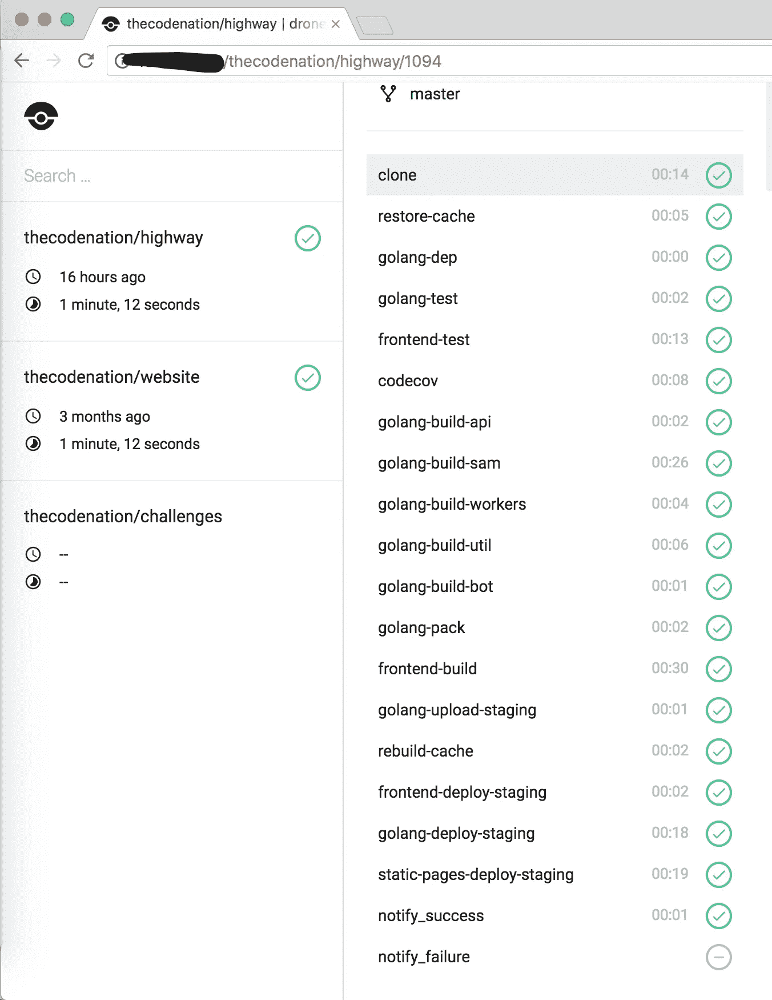
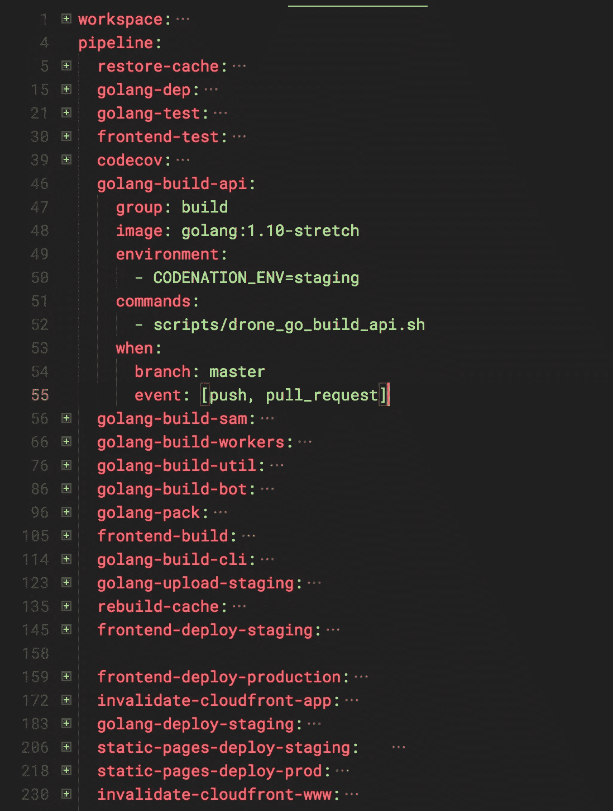

# 使用 monorepo 在项目中持续集成

> 原文：<https://medium.com/hackernoon/continuous-integration-in-projects-using-monorepo-9b828d7a8dfa>

在每个项目的开始，我们必须承诺一些重要的决定。在我们在 [Code:Nation](https://www.codenation.com.br) 做出的正确决策中，我可以举出 Go 语言的使用、 [Clean Architecture](/@eminetto/clean-architecture-using-golang-b63587aa5e3f) 和 [JAMStack](https://jamstack.org/) 的采用，以及我们将代码存储在 Github 的 *monorepo* 中的选择。在这篇文章中，我将讨论后者，以及我们如何解决 *monorepo* [架构](https://hackernoon.com/tagged/architecture)带来的一个常见挑战。

随着现代项目越来越复杂，微服务和独特的用户界面消耗资源，团队需要决定是将代码分成多个存储库还是使用 monorepo 方法。一些公司如谷歌和数字海洋采用了 *monorepo* ，我们可以在下面的帖子中看到:

*   [为什么谷歌在一个存储库中存储了数十亿行代码](https://cacm.acm.org/magazines/2016/7/204032-why-google-stores-billions-of-lines-of-code-in-a-single-repository/fulltext)
*   克苏鲁:在可伸缩的回购协议中组织 Go 代码

依我拙见，使用 *monorepo* 的主要原因是简单的存储库管理和跨团队的代码重用。

但是这个选择给项目带来的挑战之一是自动化构建和部署的潜在复杂性。考虑到一个复杂项目的所有代码都存储在同一个存储库中，单个文件中的更改可能会触发持续几分钟(或者几小时)的构建。这对团队来说是一种真正的痛苦，会降低日常工作效率。在我之前引用的 DigitalOcean 的帖子中，他们开发了一个内部解决方案，叫做 *gta* (Go Test Auto)，这不是开源的。为了解决这个问题，我们创建了一个类似的解决方案，但是使用了 Shell 脚本。

目前，这是我们项目的目录结构:

```
**api** = API and documentation 
**chatbots** = telegram, facebook and slack chatbots 
**cli** = codenation cli, used by developers to run the challenges 
**cmd** = utils and fixtures 
**core** = Go core packages, used by all the project 
**docs** = source code of internal docs (hosted at Github Pages) **frontend** = Vue.js project and templates used by Sam 
**infra** = configuration files used by staging and production servers **lambda** = lambda functions 
**research** = Python notebooks and other research assets 
**sam** = cli tool used by us to generate pages, include challenges and other admin tasks 
**scripts** = shell scrips used by CI/CD and other admin tasks 
**web** = ReactJS project (Signin, Signup, Forgot password) - IN PROCESS OF DEPRECATION 
**workers** = workers that consume SQS queues 
**.drone.yml** = CI/CD configuration file 
**.goreleaser.yml** = Goreleaser configuration file. Used to deploy the codenation-cli to Github, Homebrew 
**docker-compose.yml** = Docker configuration used by local and staging environments 
**Gopkg.*** = Go dependencies configuration files 
**Makefile** = build and admin tasks
```

我们使用 [Drone.io](http://drone.io) 作为我们的 CI/CD 解决方案，这是我们做出的另一个好选择。下图中可以看到我们的构建管道:



这是我们的 *.drone.yml* 配置文件的示例:



可以看到，步骤 *golang-build-api* 执行脚本 *drone_go_build_api.sh* ，即:

在变量 *watch* 中，我们存储了需要监控的目录列表，以便管道决定是否需要运行构建。这个决定是由脚本 *shouldIBuild.sh* 做出的:

在这个脚本中，首先测试的是变量 *DRONE_DEPLOY_TO* ，它定义了当前的执行是部署还是构建。如果是这样，该步骤应该运行。否则，脚本将检查“ *watch* ”变量中列出的目录之一是否已被该提交更改。如果是这样，该步骤应该运行。*detectchangedfolders . sh*的代码为:

Drone 使用的所有脚本中都存在相同的配置。这样，前端的变化不会触发 API 或聊天机器人部分代码的构建。使用这种方法，我们将构建时间从超过五分钟减少到几秒钟，这取决于在存储库中提交的变更。

我相信这种方法可以与其他不同于 Drone 的工具一起使用，我希望这可以帮助更多的团队满怀信心地坚持 monorepo 决策。